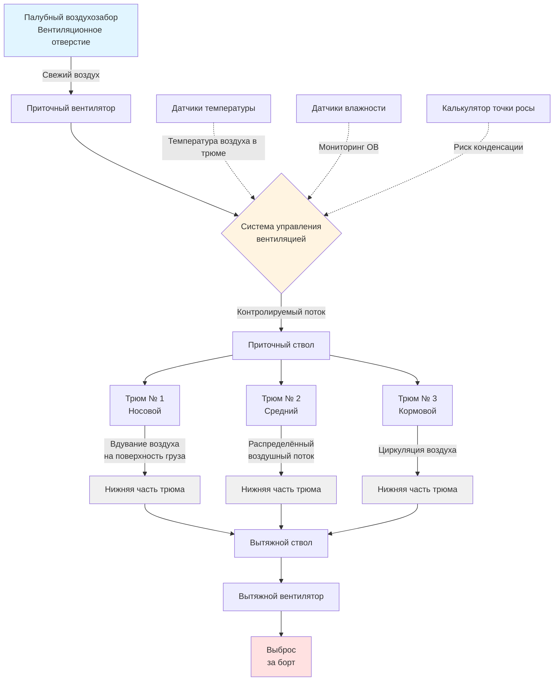

# Системы вентиляции грузовых трюмов

Вентиляция грузовых трюмов служит для сохранения целостности груза во время морской перевозки путём контроля температуры, влажности и предотвращения повреждений, вызванных конденсацией. Физика, определяющая работу этих систем, сосредоточена на психрометрических соотношениях, массопередаче водяного пара и термодинамических обменах между грузом, окружающим воздухом и поверхностями корпуса.

## Фундаментальные принципы работы

### Механизмы теплопередачи и влагопередачи

Грузовые трюмы испытывают постоянный обмен теплом и влагой через три основных пути:

**Теплопередача через конструкцию корпуса**

Стальной корпус судна проводит тепло на основе температуры наружной морской воды и температуры воздуха в трюме. Тепловой поток подчиняется закону Фурье:

$q = k \cdot A \cdot \frac{(T_{sea} - T_{hold})}{t}$

Где:
- $q$ = Интенсивность теплопередачи (Вт)
- $k$ = Теплопроводность стали (50 Вт/м·К)
- $A$ = Площадь поверхности корпуса (м²)
- $T_{sea}$ = Температура морской воды (°C)
- $T_{hold}$ = Температура воздуха в трюме (°C)
- $t$ = Толщина корпуса (м)

Во время тропических рейсов при температуре морской воды 28–30°C и температуре в трюме 15–20°C происходит значительный приток тепла. И наоборот, холодная морская вода (5–10°C) на северных маршрутах извлекает тепло из грузовых трюмов, создавая условия для потения груза.

**Миграция влаги**

Водяной пар движется из областей с более высоким парциальным давлением в области с более низким парциальным давлением. Грузы с повышенным содержанием влаги (зерно с влажностью 14–16%, уголь с влажностью 8–12%) выделяют водяной пар в воздух трюма. Движущей силой является разность парциальных давлений водяного пара:

$\dot{m}_{vapor} = h_{m} \cdot A \cdot (P_{v,cargo} - P_{v,air})$

Где:
- $\dot{m}_{vapor}$ = Скорость передачи влаги (кг/с)
- $h_{m}$ = Коэффициент массопередачи (м/с)
- $A$ = Площадь поверхности груза (м²)
- $P_{v,cargo}$ = Парциальное давление водяного пара на поверхности груза (Па)
- $P_{v,air}$ = Парциальное давление водяного пара в воздухе трюма (Па)

**Риск конденсации**

Когда теплый, влажный воздух контактирует с холодными поверхностями (обшивка корпуса, палубные балки, крышки люков), водяной пар конденсируется, если температура поверхности падает ниже точки росы воздуха. Конденсированная вода капает на груз, вызывая повреждение зерновых грузов, окисление железной руды или самопроизвольное возгорание угля. Скорость конденсации определяется следующим образом:

$\dot{m}_{cond} = h_{c} \cdot A \cdot (T_{air} - T_{surface})$ при $T_{surface} < T_{dewpoint}$

## Цели проектирования системы вентиляции

### Режимы управления влажностью

Вентиляция грузовых трюмов работает в трёх отдельных режимах в зависимости от условий рейса:

| Режим вентиляции | Применение | Направление потока воздуха | Цель |
|------------------|------------|---------------------------|------|
| **Приточная вентиляция** | Гигроскопические грузы, требующие высушивания | Свежий воздух в трюм | Удаление влаги из груза |
| **Без вентиляции** | Стабильный груз, неблагоприятные внешние условия | Система закрыта | Предотвращение поступления влаги |
| **Контролируемый обмен** | Выравнивание температуры | Ограниченный свежий воздух | Предотвращение конденсации на корпусе |

### Расчёты требуемого воздухообмена

Требуемая скорость вентиляции зависит от влагоиспускаемости груза и объёма трюма. IMO рекомендует минимальные показатели, но физические расчёты определяют фактические потребности:

$N = \frac{Q}{V}$

Где:
- $N$ = Кратность воздухообмена в час (ACH)
- $Q$ = Объёмный расход воздуха (м³/ч)
- $V$ = Объём трюма (м³)

Для удаления влаги из груза:

$Q = \frac{\dot{m}_{vapor} \cdot 3600}{\rho_{air} \cdot (W_{inlet} - W_{outlet})}$

Где:
- $\dot{m}_{vapor}$ = Скорость влагоиспускания груза (кг/ч)
- $\rho_{air}$ = Плотность воздуха (1,2 кг/м³)
- $W_{inlet}$ = Влагосодержание приточного воздуха (кг воды/кг сухого воздуха)
- $W_{outlet}$ = Влагосодержание вытяжного воздуха (кг воды/кг сухого воздуха)

Типовые расчётные значения:
- Зерновой груз: 2–6 ACH при благоприятных условиях
- Угольный груз: 10–15 ACH для предотвращения пожара
- Трюмы общего назначения: 4–8 ACH прерывистой работы
- Пустые трюмы: 1–2 ACH для предотвращения коррозии

## Требования к вентиляции для конкретных грузов

### Управление гигроскопическими грузами

Зерно, соя и сельскохозяйственная продукция поглощают или выделяют влагу для уравновешивания с относительной влажностью окружающего воздуха. Вентиляция предотвращает превышение безопасных пределов влажности груза:

| Тип груза | Безопасное содержание влаги | Критический порог повреждения | Рекомендуемые ACH |
|-----------|-------|-----------|----------|
| Пшеница, кукуруза | 13–14% | 15% (плесень) | 3–5 ACH |
| Соя | 12–13% | 14% (нагревание) | 4–6 ACH |
| Рис | 13–14% | 15% (обесцвечивание) | 2–4 ACH |
| Копра | 6–7% | 8% (самопроизвольное возгорание) | 6–10 ACH |

Вентилировать только при условии, что наружный воздух имеет более низкую абсолютную влажность, чем воздух в трюме, для удаления влаги из груза.

### Насыпные минеральные грузы

Железная руда, уголь и минеральные концентраты представляют особые проблемы вентиляции:

**Угольные грузы**

Уголь медленно окисляется при окружающей температуре, выделяя тепло и потребляя кислород. Вентиляция предотвращает истощение кислорода и удаляет тепло окисления:

Минимальная скорость вентиляции: $Q_{coal} = 10 \text{ м}^3\text{/ч на тонну угля}$

Для груза углеводорода грузоподъёмностью 50 000 т:
$Q_{coal} = 50,000 \times 10 = 500,000 \text{ м}^3\text{/ч} = 139 \text{ м}^3\text{/с}$

Эта экстремальная скорость объясняет, почему углевозы используют обширные системы естественной вентиляции с большими грибными вентиляторами.

**Железная руда**

Железная руда требует минимальной вентиляции, если содержание влаги не повышено. Влажная железорудная мелочь может разжижаться во время рейса, создавая опасность смещения груза. Вентиляция удаляет свободную поверхностную влагу, но не может решить проблему капиллярной воды, требующей обработки на берегу.

### Контейнеризированные и сборные грузы

Контейнеровозы с палубной укладкой контейнеров не требуют вентиляции грузовых трюмов для контейнеров. Однако трюмы под палубой, перевозящие сборные грузы или автомобили, требуют:

- 4–6 ACH для автомобильных палуб (газовыделение батареи)
- 2–4 ACH для сборных грузов (предотвращение конденсации)
- 8–12 ACH для опасных грузов (контроль испаренияся горючих веществ согласно Кодексу МИДЖ)

## Конфигурация системы и пути воздушных потоков

### Конфигурации приточных и вытяжных систем

**Приточные системы**

Приточные вентиляторы нагнетают свежий воздух через воздуховоды в грузовые трюмы. Распределение воздуха требует:

- Скорость входа: 6–10 м/с на выходах из ствола
- Дальность полёта струи: Достаточная для достижения поверхности груза без чрезмерной турбулентности
- Несколько входных отверстий: Предотвращение мёртвых зон в больших трюмах (30 000+ м³)

Приточные воздуховоды обычно проходят вертикально вдоль границ трюма с горизонтальными отводами, направляющими воздух через поверхность груза.

**Вытяжные системы**

Вытяжные вентиляторы извлекают воздух из грузовых трюмов, создавая лёгкое отрицательное давление (10–20 Па) относительно смежных помещений. Это предотвращает проникновение влажного воздуха из трюма в жилые помещения или машинные отделения.

Производительность вытяжки превышает производительность приточки на 5–10% для обеспечения поддержания отрицательного давления:

$Q_{exhaust} = 1.05 \cdot Q_{supply}$

### Системы естественной вентиляции

Балкеры и некоторые грузовые судна используют естественную вентиляцию, используя давление ветра и тепловую плавучесть. Грибные вентиляторы (ветровые зонты) захватывают давление набегающего потока, а кольцевые вентиляторы создают зоны отрицательного давления, способствующие вытяжке.

Эффективность естественной вентиляции варьируется в зависимости от скорости судна и направления ветра:

$Q_{natural} = C_{d} \cdot A_{vent} \cdot \sqrt{2 \cdot \Delta P / \rho}$

Где:
- $C_{d}$ = Коэффициент расхода (0,6–0,8)
- $A_{vent}$ = Площадь вентиляционного отверстия (м²)
- $\Delta P$ = Разность давлений (Па)
- $\rho$ = Плотность воздуха (кг/м³)

Скорость судна создаёт динамическое давление:
$\Delta P = 0.5 \cdot \rho \cdot v^2$

При 15 узлах (7,7 м/с): $\Delta P = 0.5 \times 1.2 \times 7.7^2 = 35.6 \text{ Па}$

## Нормативные требования и стандарты

### Положения IMO и SOLAS

**SOLAS Глава VI (Перевозка грузов)**

Правило 3 требует надлежащей вентиляции грузовых помещений, перевозящих грузы, требующие контроля атмосферы. Конкретные требования включают:

- Зерновые грузы: Возможность непрерывной вентиляции во время рейса
- Угольные грузы: Минимальная 2 ACH непрерывной вентиляции
- Насыпные твёрдые грузы: Вентиляция в соответствии с требованиями Кодекса МНИС

**Международный кодекс перевозок опасных грузов наливом (МКПОГ)**

Кодекс МНИС классифицирует насыпные грузы на группы, требующие конкретных протоколов вентиляции:

- **Группа А:** Грузы, которые могут разжижаться (требуют контроля влаги, ограниченная вентиляция)
- **Группа Б:** Грузы с химическими опасностями (уголь, прямовосстановленное железо – требуют непрерывной вентиляции)
- **Группа В:** Грузы, которые не разжижаются и не представляют химических опасностей (вентиляция по мере необходимости для сохранения)

### Правила классификационных обществ

Крупные классификационные общества (ABS, DNV, Lloyd's Register, Bureau Veritas) устанавливают минимальные производительности вентиляции:

- Грузовые трюмы: 6 ACH механической вентиляции
- Системы управления вентиляцией доступны с палубы без входа в трюм
- Раздельные системы для групп трюмов в носовой и кормовой частях
- Возможность аварийного отключения при пожаре

Требования к документации включают:
- Расчёты производительности вентиляции, демонстрирующие соответствие нормативам
- Кривые производительности вентилятора в расчётной точке работы
- Схемы системы управления и процедуры эксплуатации
- Руководство по вентиляции для конкретных грузов в судовом руководстве по загрузке

## Оперативное принятие решений

### Психрометрический анализ

Эффективная вентиляция требует постоянного мониторинга трёх психрометрических условий:

1. **Наружный воздух** (потенциальный источник приточки)
2. **Воздух в трюме** (текущее состояние)
3. **Температура груза** (определяет точку росы поверхности)

Вентилировать только если точка росы наружного воздуха ниже температуры поверхности груза и абсолютная влажность наружного воздуха ниже абсолютной влажности воздуха в трюме.

Критерии решения:
$T_{dew,exterior} < T_{cargo} - 2°C$ (запас прочности)

И: $W_{exterior} < W_{hold}$

### Мониторинг температуры

Современные грузовые суда используют распределённое датчиковое оснащение для измерения температуры:
- Датчики сопротивления через каждые 10–15 метров по длине трюма
- Зонды для измерения температуры поверхности груза
- Мониторинг температуры внутренней поверхности корпуса
- Логирование данных с интервалом в 1 час

Автоматизированные системы сравнивают условия и предоставляют рекомендации по вентиляции, но капитан сохраняет оперативный контроль согласно требованиям SOLAS.

## Техническое обслуживание и устранение неполадок

Надёжность системы вентиляции грузовых трюмов критична для предотвращения претензий по грузу. Типичные режимы отказа включают:

- **Отказ подшипника электродвигателя вентилятора:** Мониторинг вибрации и плановая смазка предотвращают преждевременный износ
- **Заклинивание заслонки:** Накопление соли в тяговых механизмах заслонки требует регулярной проверки функционирования
- **Дрейф калибровки датчика:** Ежегодная психрометрическая калибровка датчиков обеспечивает точность оперативных решений
- **Коррозия воздуховода:** Внутренний осмотр воздуховода во время сухого дока выявляет деградацию конструкции

Деградация производительности вентилятора из-за эрозии лопастей (пыль от насыпного груза) или коррозии снижает расход воздуха на 15–25% за 5-летние интервалы. Периодическая проверка кривой вентилятора выявляет снижение производительности, требующее замены лопастей.

Вентиляция грузовых трюмов представляет специализированное применение, где принципы термодинамики напрямую влияют на сохранение стоимости груза. Надлежащее проектирование и эксплуатация системы требуют понимания психрометрики, теплопередачи и нормативной базы, специфичной для морской торговли.
