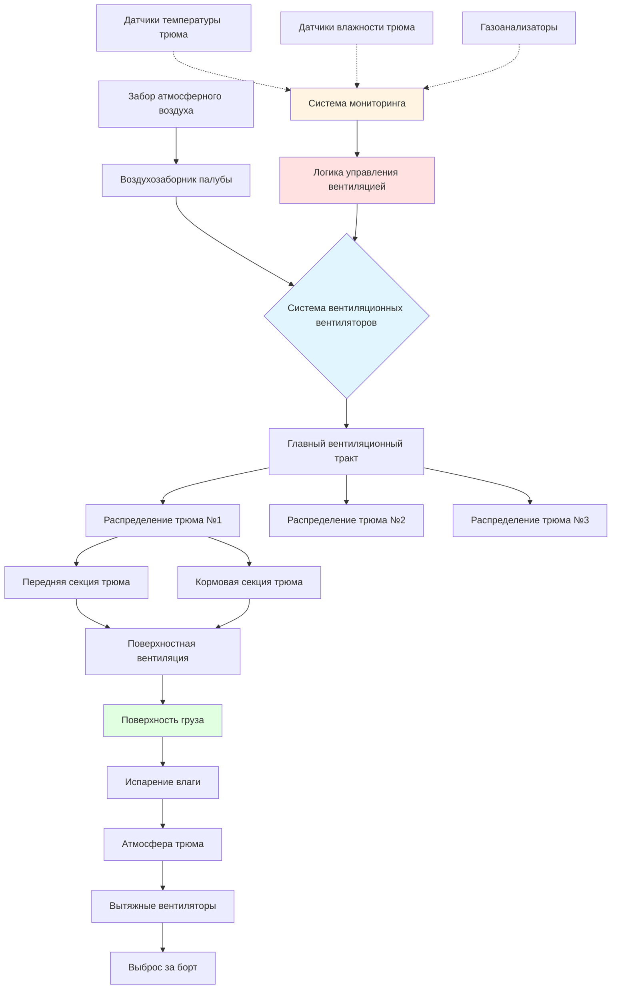

Вентиляция грузовых трюмов сухогрузных судов защищает насыпные грузы при морской перевозке путем контроля миграции влаги, предотвращения конденсационных повреждений и управления опасными атмосферами. Проектирование системы вентиляции должно учитывать гигроскопичность груза, температурные дифференциалы между грузом и окружающей средой, а также образование токсичных или кислородоистощающих газов.

## Требования к вентиляции по типам груза

Насыпные грузы имеют существенно различающиеся требования к вентиляции в зависимости от своих физических и химических свойств:

| Тип груза | Скорость вентиляции | Основная задача | Классификация IMSBC |
|------------|------------------|-----------------|----------------------|
| Зерно (пшеница, кукуруза, ячмень) | 2–4 воздухообмена/ч | Миграция влаги, потение груза | Группа C |
| Уголь | 0,5–1 воздухообмен/ч | Самонагревание, образование метана | Группа B (некоторые Группа A) |
| Железная руда | 0,25 воздухообмена/ч | Минимальная; подавление пыли | Группа A/C |
| Концентраты (минеральные) | Минимальная или герметичная система | Окисление, увеличение влажности | Группа A |
| Удобрения (мочевина, DAP) | 1–2 воздухообмена/ч | Слеживание, выделение токсичных газов | Группа B/C |
| Древесная щепа | 2–3 воздухообмена/ч | Самонагревание, истощение кислорода | Группа B |
| Сахар (насыпной) | 1–3 воздухообмена/ч | Поглощение влаги, слеживание | Группа C |
| Цемент | Герметичная система | Загрязнение влагой | Группа C |

## Вентиляция зерновых грузов

Зерновые грузы требуют наиболее сложного управления вентиляцией из-за их гигроскопичной природы и восприимчивости как к потению груза, так и к конденсации потения судна.

### Расчет скорости вентиляции

Требуемая скорость вентиляции для зерновых грузов зависит от влажностного дифференциала между грузом и окружающим воздухом:

$$Q = \frac{V \cdot N}{60}$$

Где:
- $Q$ = объемный расход воздуха (м³/мин)
- $V$ = объем грузового трюма (м³)
- $N$ = число воздухообменов в час (обычно 2–4)

Психрометрический движущий потенциал определяет, должна ли осуществляться вентиляция:

$$\Delta W = W_{amb} - W_{eq}$$

Где:
- $\Delta W$ = влажностный дифференциал (кг воды/кг сухого воздуха)
- $W_{amb}$ = коэффициент влажности окружающего воздуха
- $W_{eq}$ = равновесный коэффициент влажности для зерна при текущей температуре

**Правило вентиляции**: Вентилировать только когда $\Delta W < 0$ (окружающий воздух суше равновесных условий).

### Метод поверхностной вентиляции

Для зерновых грузов поверхностная вентиляция направляет поток воздуха через поверхность груза, удаляя влагу, которая мигрирует вверх из-за температурных градиентов:

$$q_{surf} = \frac{0,3 \cdot A_{surf}}{1000}$$

Где:
- $q_{surf}$ = скорость поверхностной вентиляции (м³/с)
- $A_{surf}$ = площадь поверхности груза (м²)
- Коэффициент 0,3 соответствует минимальной скорости поверхности 0,3 м/с

## Потение груза и потение судна

Два различных механизма конденсации угрожают насыпным грузам:

**Потение груза**: Происходит, когда теплый груз встречает более холодный воздух (обычно при переходе судна из теплых в холодные регионы). Влага мигрирует из теплой внутренней части груза на более холодную поверхность, где конденсируется. Это повреждает верхние слои зерна.

**Потение судна**: Происходит, когда холодный груз или холодные стальные трюмы встречают теплый влажный воздух (переход судна из холодных в теплые регионы). Конденсация образуется на стальных поверхностях и капает на груз.

### Стратегии предотвращения

| Условие | Температурный градиент | Стратегия вентиляции | Физический контроль |
|-----------|---------------------|----------------------|------------------|
| Риск потения груза | $T_{cargo} > T_{ambient} + 5°C$ | Закрыть вентиляторы; предотвратить поступление холодного воздуха | Изоляция люков |
| Риск потения судна | $T_{steel} < T_{dewpoint}$ | Вентилировать теплым воздухом, если возможно | Переносные нагреватели в трюмах |
| Безопасна вентиляция | $T_{ambient} < T_{cargo}$ и низкая относительная влажность | Максимальная скорость вентиляции | Открыть все вентиляторы |

## Токсичные и опасные атмосферы

Некоторые насыпные грузы генерируют опасные атмосферы, требующие специализированной вентиляции и мониторинга:

### Угольные грузы

Уголь генерирует метан (CH₄) и истощает кислород путем окисления. Минимальная непрерывная вентиляция предотвращает взрывоопасное накопление метана:

$$Q_{min} = k \cdot M \cdot C$$

Где:
- $Q_{min}$ = минимальная скорость вентиляции (м³/ч)
- $k$ = коэффициент безопасности (обычно 10–20)
- $M$ = масса груза (т)
- $C$ = скорость образования газа (м³/т·ч, обычно 0,001–0,01)

**Критические пороги**:
- Метан: <1% по объему (нижний концентрационный предел взрываемости 5%)
- Кислород: >20% по объему
- Монооксид углерода: <50 ppm

### Концентраты, содержащие сульфиды

Сульфидные минеральные концентраты окисляются в присутствии влаги и кислорода, генерируя диоксид серы (SO₂) и потенциально сероводород (H₂S):

- Герметичная система вентиляции требуется во время рейса
- Содержание влаги до отправления критично
- Мониторинг атмосферы обязателен перед входом в трюм
- Пропускная способность аварийной вентиляции: 6–10 воздухообменов/ч

## Проектирование системы вентиляции сухогруза

## Соответствие Кодексу IMSBC

Международный Кодекс безопасной перевозки насыпных грузов (Кодекс IMSBC) предусматривает специфические требования к вентиляции:

**Грузы Группы A** (могут разжижаться): Вентиляция может увеличить содержание влаги; обычно требуется герметичная или минимальная вентиляция.

**Грузы Группы B** (химическая опасность): Требуется непрерывная механическая вентиляция; естественная вентиляция недостаточна для разбавления опасных газов.

**Грузы Группы C** (ни Группа A, ни Группа B): Вентиляция по мере необходимости для защиты качества груза; усмотрение капитана на основе психрометрических условий.

### Пропускная способность вентиляции трюма

Минимальная пропускная способность вентиляции грузовых трюмов в соответствии с Кодексом IMSBC:

- Механическая вентиляция: минимум 2 воздухообмена в час на трюм
- Естественная вентиляция: адекватная площадь потока через вентиляторы (обычно 1/1000 объема трюма в м²)
- Аварийная вентиляция: 6 воздухообменов в час для реагирования на опасную атмосферу

## Системы мониторинга и управления

Современные сухогрузы используют автоматизированное управление вентиляцией на основе непрерывного мониторинга:

**Массив датчиков на трюм**:
- Датчики температуры: поверхность груза, середина глубины, нижние слои (минимум 3 точки)
- Датчики влажности: атмосфера трюма
- Газоанализаторы: O₂, CO, CH₄, H₂S (в зависимости от груза)

**Логика управления**:
1. Расчет равновесного содержания влаги из температуры груза
2. Сравнение с коэффициентом влажности окружающего воздуха
3. Оценка риска конденсации из температурных дифференциалов
4. Активация вентиляции при благоприятных условиях
5. Закрытие вентиляторов при наличии риска конденсации

## Передовая практика при эксплуатации

**Фаза загрузки**:
- Записать температуру груза и содержание влаги
- Проверить чистоту и сухость трюма
- Протестировать работу системы вентиляции
- Инструктировать экипаж по требованиям вентиляции для конкретного груза

**Управление рейсом**:
- Контролировать маршрутизацию погоды и переходы температурных зон
- Регистрировать часы работы вентиляции и условия атмосферы
- Проводить регулярный мониторинг газов для опасных грузов
- Корректировать стратегию вентиляции при переходе судна между климатическими зонами

**Подготовка к разгрузке**:
- Убедиться в безопасности атмосферы трюма для входа (O₂ >20%, токсичные газы ниже порога)
- Документировать состояние груза
- Механическая вентиляция перед входом персонала для всех грузов Группы B

Эффективность вентиляции грузовых трюмов сухогруза зависит от понимания термодинамических и массообменных процессов, управляющих миграцией влаги, в сочетании с дисциплинированными процедурами эксплуатации, основанными на непрерывном мониторинге состояния груза и атмосферных условий.
