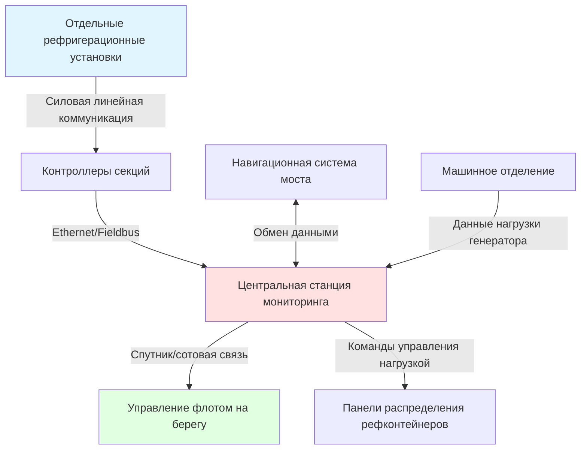

Контейнеровозы представляют уникальные проблемы для HVAC из-за комбинации нерефрижерированных (сухих) контейнеров, требующих вентиляции, и рефрижерированных (рефконтейнеров) контейнеров, требующих значительной электроэнергии для встроенных холодильных установок. Современные сверхкрупные контейнеровозы (ULCV) вмещают более 20 000 TEU (Двадцатифутовые единицы), с мощностью рефконтейнеров от 500 до 2000+ разъёмов, требующих скоординированного распределения электроэнергии и управления тепловыми потоками.

## Распределение электроэнергии рефконтейнеров

Рефрижерированные контейнеры работают от стандартизированных электрических подключений, обеспечивающих электроэнергию для встроенных холодильных установок, установленных на каждом контейнере. Инфраструктура электроснабжения представляет критическую систему, связанную с HVAC, требующую значительной генерирующей мощности и сложного управления нагрузкой.

### Электрические требования в соответствии с ISO 1496-2

Рефконтейнеры требуют трёхфазного электроснабжения при указанных стандартах напряжения и частоты:

| Стандарт электроснабжения | Напряжение | Частота | Ток на контейнер | Мощность на контейнер |
|----------------------------|-----------|---------|------------------|----------------------|
| Международный | 380–460 В | 50/60 Гц | 32 А при 460 В | 14,7 кВт |
| Международный | 380–460 В | 50/60 Гц | 25 А при 460 В | 11,5 кВт |
| Устаревший | 440 В | 60 Гц | 16 А при 440 В | 7,0 кВт |
| Европейский | 400 В | 50 Гц | 32 А при 400 В | 12,8 кВт |

Современные рефригерационные установки потребляют в среднем 10–12 кВт на контейнер при работе в тропических условиях. Расчёт общей электрической мощности:

$$
P_{total} = N_{reefer} \times P_{avg} \times DF \times SF
$$

Где:
- $P_{total}$ = Общая электрическая мощность рефконтейнеров (кВт)
- $N_{reefer}$ = Количество разъёмов рефконтейнеров
- $P_{avg}$ = Средняя мощность на контейнер (11 кВт типично)
- $DF$ = Коэффициент разнородности (0,70–0,85)
- $SF$ = Коэффициент безопасности (1,15–1,25)

Для судна с 1000 разъёмов рефконтейнеров:

$$
P_{total} = 1000 \times 11 \times 0,75 \times 1,20 = 9900 \text{ кВт}
$$

Эта значительная нагрузка требует выделенной генерирующей мощности и сложных протоколов управления нагрузкой для поддержания стабильности электрической сети судна при пиковых условиях нагрузки.

### Распределение электроэнергии в секции рефконтейнеров

Контейнерные секции оснащены вертикальными и горизонтальными шинопроводами, питающими отдельные разъёмы в каждой позиции контейнера. Система электрического распределения должна обеспечивать:

- **Непрерывное электроснабжение**: Рефконтейнеры не допускают перерывов, превышающих 15–30 минут, без колебаний температуры
- **Регулирование напряжения**: Допуск ±10% напряжения в соответствии с ISO стандартами
- **Стабильность частоты**: Максимальное отклонение частоты ±2%
- **Защита от замыканий на землю**: Отдельные автоматические выключатели или УЗО на каждый стек
- **Мониторинг нагрузки**: Контроль силы тока на каждом разъёме для формирования сигналов тревоги

Распределение электроэнергии следует иерархической структуре от главного распределительного щита через панели распределения рефконтейнеров к коробкам подключения на уровне секции и, наконец, к отдельным разъёмам контейнеров.

## Подпалубная вентиляция трюма контейнеров

Контейнеры, стоящие в закрытых трюмах под палубой, требуют механической вентиляции для предотвращения накопления влаги, контроля температуры и удаления загрязняющих веществ. Глава II-2 SOLAS требует систем вентиляции, способных поддерживать безопасные условия атмосферы.

### Расчёт объёма вентиляции

Объёмы вентиляции трюмов контейнеров зависят от характеристик груза, условий окружающей среды и продолжительности рейса. Основное требование вентиляции:

$$
Q = V \times ACH \times \frac{1}{60}
$$

Где:
- $Q$ = Расход вентиляционного воздуха (м³/мин)
- $V$ = Объём трюма (м³)
- $ACH$ = Количество воздухообменов в час (6–12 типично)

Для контроля влаги в трюмах, вмещающих гигроскопичные грузы, или предотвращения конденсации на стальных конструкциях:

$$
Q_{moisture} = \frac{W_{gen}}{(\rho \times (w_{hold} - w_{supply}))}
$$

Где:
- $Q_{moisture}$ = Требуемая вентиляция для удаления влаги (м³/с)
- $W_{gen}$ = Скорость выделения влаги (кг/с)
- $\rho$ = Плотность воздуха (кг/м³)
- $w_{hold}$ = Степень влажности воздуха в трюме (кг воды/кг сухого воздуха)
- $w_{supply}$ = Степень влажности приточного воздуха (кг воды/кг сухого воздуха)

### Проектирование системы вентиляции

Системы вентиляции трюма контейнеров используют воздухопроводы для приточного и вытяжного воздуха со следующими характеристиками:

**Система подачи воздуха:**
- Забор воздуха с палубы, расположенный для минимизации попадания морской соли и выхлопных газов
- Воздухообрабатывающие установки с фильтрацией (минимум G3–G4 в соответствии с ISO 16890)
- Дополнительные нагревательные батареи для эксплуатации в холодном климате
- Распределительные воздухопроводы с распределителями воздуха на дне трюма или в концах
- Скорость подачи воздуха 2–4 м/с для обеспечения циркуляции воздуха без нарушения груза

**Система вытяжного воздуха:**
- Вытяжные решётки на противоположном конце от приточного воздуха (перекрёстная вентиляция)
- Вытяжные вентиляторы, рассчитанные на лёгкое разрежение (-5–10 Па относительно машинных отделений)
- Огнепреградители, где требуются для вентиляции опасных грузов
- Аварийная высокопроизводительная вентиляция (20–30 ACH) при происшествиях с опасными грузами

### Рассмотрения управления температурой

В отличие от рефконтейнеров с активной холодильной системой, сухие контейнеры в трюмах испытывают колебания температуры, находящиеся под влиянием:

- Температуры окружающей среды снаружи
- Солнечной радиации на палубе и корпусе
- Тепла от соседних машинных отделений
- Тепла от холодильного оборудования рефконтейнеров (отвод тепла конденсатором)

Температурная стратификация в больших трюмах может достигать 5–10°C между верхними и нижними ярусами контейнеров. Конструкция вентиляции должна способствовать вертикальному перемешиванию воздуха через:

$$
\dot{Q}_{convection} = \rho \times c_p \times Q \times \Delta T
$$

Где:
- $\dot{Q}_{convection}$ = Мощность удаления тепла конвекцией (Вт)
- $c_p$ = Удельная теплоёмкость воздуха (1005 Дж/кг·К)
- $\Delta T$ = Разница температур между приточным и вытяжным воздухом (К)

## Системы мониторинга рефконтейнеров

Современные контейнеровозы используют сложные системы мониторинга, отслеживающие рабочее состояние каждого рефконтейнера. Интегрированная архитектура мониторинга обеспечивает:

**Точки данных на контейнер:**
- Уставка и фактическая температура приточного воздуха
- Температура воздуха на выходе
- Электрический ток (по фазам)
- Время работы компрессора
- Статус сигналов тревоги (высокая/низкая температура, отказ электроснабжения, открыта дверь)
- Параметры регулируемой атмосферы (O₂, CO₂) для рефконтейнеров CA

**Функции централизованного мониторинга:**
- Отображение статуса в реальном времени для всех подключённых рефконтейнеров
- Историческое логирование данных (профили температуры, события тревоги)
- Автоматизированное уведомление о сигналах тревоги на мост и операции на берегу
- Предупреждения о необходимости профилактического обслуживания на основе рабочих параметров
- Управление нагрузкой и оптимизация энергопотребления

**Архитектура коммуникации:**

Система мониторинга позволяет экипажу выявлять неисправные рефконтейнеры, координировать ремонт в портах и предоставлять владельцам груза непрерывную документацию холодовой цепи, что критично для высокостоимых фармацевтических и скоропортящихся пищевых грузов.

## Управление тепловыми потоками в секции рефконтейнеров

Рефконтейнеры отводят тепло от своих холодильных циклов через вентиляторы конденсаторов, выбрасывающие воздух в атмосферу. Когда несколько рефконтейнеров работают в тесной близости под палубой, совокупное отвод тепла создаёт повышенные температуры окружающей среды, которые снижают эффективность холодильной системы и могут вызвать срабатывание защиты компрессора по высокому давлению.

Отвод тепла на рефконтейнер:

$$
\dot{Q}_{reject} = \dot{Q}_{cargo} + P_{compressor}
$$

Для типичного рефконтейнера, поддерживающего груз при -18°C при окружающей температуре 35°C:
- $\dot{Q}_{cargo}$ = 8–10 кВт (нагрузка охлаждения груза)
- $P_{compressor}$ = 10–12 кВт (электрическая мощность компрессора)
- $\dot{Q}_{reject}$ = 18–22 кВт (общий отвод тепла конденсатором)

В подпалубной секции с 40 одновременно работающими рефконтейнерами:

$$
\dot{Q}_{total} = 40 \times 20 = 800 \text{ кВт}
$$

Эта тепловая нагрузка требует принудительной вентиляции с приточным воздухом с палубы и вытяжкой в атмосферу. Системы вентиляции секции рефконтейнеров обеспечивают:

- Минимум 20–30 воздухообменов в час при пиковой работе рефконтейнеров
- Направленные потоки воздуха, предотвращающие рециркуляцию горячего выхлопного воздуха
- Мониторинг температуры с автоматическим регулированием скорости вентилятора
- Поддержание температуры окружающей среды ниже 45°C (максимальная рабочая температура окружающей среды холодильной установки)

Недостаточная вентиляция секции рефконтейнеров приводит к каскадным отказам, так как повышенная температура окружающей среды вынуждает отдельные установки переходить в режим сигнала тревоги, ещё больше концентрируя тепловую нагрузку на оставшихся работающих установках.

## Стандарты и нормативные требования

Системы HVAC и рефконтейнеры контейнеровозов работают в соответствии с несколькими нормативными документами:

**Международные стандарты:**
- SOLAS Глава II-2: Требования к противопожарной безопасности и вентиляции
- ISO 1496-2: Спецификации термоконтейнеров
- IEC 60092: Электрические установки на судах
- IMO Кодекс безопасной практики укладки и крепления грузов

**Правила классификационных обществ:**
- Правила Американского бюро судоходства (ABS) по постройке и классификации стальных судов
- Правила Det Norske Veritas (DNV) для судов
- Правила и нормы Lloyd's Register по классификации судов

**Отраслевые стандарты:**
- Технические спецификации рефконтейнеров Carrier Transicold, Thermo King, Daikin
- Операционные руководства Ассоциации владельцев контейнеров
- Критерии инспекции IICL (Института международных владельцев контейнеров)

Эти стандарты регулируют электрические системы рефконтейнеров, требования вентиляции для опасных и неопасных грузов, системы противопожарной защиты, интегрированные с операциями HVAC, включая обнаружение дыма, взаимодействие с системами пожаротушения CO₂ с заслонками вентиляции и протоколы аварийной вентиляции.

## Эксплуатационные рассмотрения

Эксплуатация HVAC контейнеровоза балансирует конкурирующие цели защиты груза, энергоэффективности и безопасности:

**Процедуры перед отходом судна:**
- Проверка всех подключений рефконтейнеров и электрической целостности
- Установка параметров температуры в соответствии с требованиями груза
- Подтверждение связи системы мониторинга
- Документирование начальных температур груза (для валидации холодовой цепи)

**Эксплуатация во время рейса:**
- Непрерывный мониторинг производительности рефконтейнеров и вентиляции трюма
- Управление нагрузкой генератора при пиковых периодах требования рефконтейнеров
- Регулировка вентиляции в зависимости от погодных условий (закрытие заслонок в штормовых условиях)
- Реагирование на сигналы тревоги рефконтейнеров и координация ремонта

**Оптимизация энергопотребления:**
- Распределение нагрузки для минимизации расхода топлива генератором
- Оптимизация уставок температуры в пределах допусков груза
- Модуляция скорости вентилятора на основе фактических тепловых нагрузок
- Коррекция коэффициента мощности для снижения реактивных потерь мощности

Эффективное управление HVAC контейнеровоза требует координации между палубными офицерами (ответственность за груз), механиками (генерирование электроэнергии и системы HVAC) и командами логистики на берегу (связь с владельцем груза), что делает это одним из наиболее сложных морских приложений HVAC.
