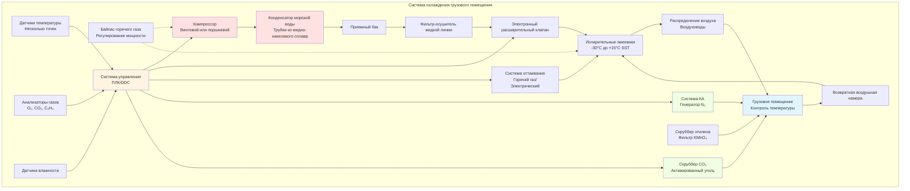

Системы охлаждения грузовых помещений и контейнерной рефрижерации поддерживают точные параметры температуры и атмосферные условия для скоропортящихся товаров во время морской доставки. Эти системы должны работать непрерывно на протяжении рейсов, длящихся недели, при этом обслуживая разнообразные грузы, требующие температур от -30°C для замороженных продуктов до контролируемых температур выше точки замерзания с определенными газовыми концентрациями для свежей продукции.

## Типы рефрижерированных грузов и требования

Различные категории скоропортящихся грузов требуют уникальных параметров управления окружающей средой для оптимального сохранения при транспортировке.

### Технические характеристики температуры и влажности

| Тип груза | Диапазон температуры | Относительная влажность | Контроль атмосферы | Длительность хранения |
|------------|-------------------|-------------------|---------------------|------------------|
| Замороженное мясо | -18°C до -25°C | 90-95% | Стандартный воздух | 6-12 месяцев |
| Замороженная рыба | -25°C до -30°C | 90-95% | Стандартный воздух | 12-24 месяца |
| Охлажденная говядина | -1,5°C до 0°C | 90-95% | Стандартный воздух | 30-60 дней |
| Свежая продукция (бананы) | 13°C до 14°C | 90-95% | КА: 2-5% O₂, 2-5% CO₂ | 20-30 дней |
| Свежая продукция (яблоки) | 0°C до 2°C | 90-95% | КА: 1-3% O₂, 1-3% CO₂ | 60-120 дней |
| Цитрусовые | 4°C до 8°C | 85-90% | Стандартный воздух | 30-60 дней |
| Молочные продукты | 2°C до 4°C | 80-85% | Стандартный воздух | 30-90 дней |
| Фармацевтические препараты | 2°C до 8°C | 40-60% | Стандартный воздух | По спецификации товара |

**Особенности, зависящие от типа груза**

Замороженный груз требует поддержания глубокой температуры с минимальными колебаниями для предотвращения роста кристаллов льда, повреждающих клеточную структуру. Свежая продукция выигрывает от хранения в контролируемой атмосфере (КА), где снижение концентрации кислорода и повышение углекислого газа замедляют процессы дыхания и продлевают срок годности. Товары, чувствительные к этилену, требуют активной системы удаления газов для предотвращения преждевременного созревания. Фармацевтические препараты требуют валидированного контроля температуры с непрерывным мониторингом и сигнализацией в соответствии с требованиями надлежащей практики распределения (GDP).

## Конструкция холодильной системы

Системы рефрижерированных трюмов используют холодильные машины с паровым сжатием, конфигурирующиеся с учетом ограничений морского применения.

### Расчеты тепловой нагрузки

Общая холодильная нагрузка состоит из нескольких компонентов, требующих индивидуального расчета:

$$Q_{total} = Q_{product} + Q_{transmission} + Q_{air} + Q_{people} + Q_{equipment} + Q_{respiration}$$

**Тепловая нагрузка на охлаждение груза**

Извлечение чувствительного тепла из груза во время охлаждения:

$$Q_{product} = \frac{m \cdot c_p \cdot (T_i - T_f)}{t_{pulldown}}$$

Где:
- $m$ = масса груза (кг)
- $c_p$ = удельная теплоемкость продукта (кДж/кг·К)
- $T_i$ = начальная температура груза (°C)
- $T_f$ = конечная температура хранения (°C)
- $t_{pulldown}$ = допустимое время охлаждения (часы)

Для замороженного груза, требующего удаления скрытого тепла во время замораживания:

$$Q_{freezing} = m \cdot h_{latent} + m \cdot c_{p,frozen} \cdot (T_{freeze} - T_f)$$

Где $h_{latent}$ представляет скрытую теплоту плавления (обычно 250-335 кДж/кг для продуктов с высоким содержанием воды).

**Тепловая нагрузка через ограждающие конструкции**

Приток тепла через изолированные границы из смежных помещений и внешней среды:

$$Q_{transmission} = U \cdot A \cdot \Delta T$$

Где:
- $U$ = общий коэффициент теплопередачи (Вт/м²К)
- $A$ = площадь поверхности (м²)
- $\Delta T$ = разность температур на границе (К)

Для изолированных грузовых трюмов типичные значения U составляют 0,15-0,25 Вт/м²К при использовании полиуретановой пены толщиной 100-150 мм.

**Тепловая нагрузка от инфильтрации воздуха**

Приток тепла при внешнем воздухе, поступающем во время открытия дверей:

$$Q_{air} = \rho \cdot V_{air} \cdot c_p \cdot (T_{ambient} - T_{hold}) + \rho \cdot V_{air} \cdot h_{fg} \cdot (\omega_{ambient} - \omega_{hold})$$

Где:
- $\rho$ = плотность воздуха (кг/м³)
- $V_{air}$ = объем инфильтруемого воздуха (м³/ч)
- $h_{fg}$ = скрытая теплота испарения (2501 кДж/кг при 0°C)
- $\omega$ = влагосодержание (кг воды/кг сухого воздуха)

### Компоненты холодильной системы

**Выбор компрессора**

Винтовые компрессоры преобладают в приложениях рефрижерации для мощности выше 50 кВ благодаря способности к непрерывной работе и модуляции мощности золотниковым клапаном с диапазоном 10-100%. Для меньших систем или контейнерных рефрижерированных установок поршневые компрессоры с отключением цилиндров обеспечивают ступенчатое регулирование мощности. Морские компрессоры имеют следующие характеристики:

- Виброизолирующие крепления для устойчивости к морским толчкам
- Системы охлаждения масла с использованием морской воды или охлажденной воды
- Высокоэффективные конструкции электродвигателей для снижения электрической нагрузки
- Устойчивые к коррозии внешние покрытия

**Конструкция испарителя**

Испарители с принудительной циркуляцией воздуха используют оребренные трубчатые змеевики с возможностью электрического или газогорячего оттаивания. Параметры конструкции включают:

- Разность температур воздуха (ΔT): 8-12°C для замороженного груза, 4-6°C для свежей продукции
- Скорость на входе: 2,5-3,5 м/с для балансировки теплопередачи и перепада давления
- Расстояние между ребрами: 4-6 мм для низкотемпературной работы, 6-10 мм для свежего груза
- Частота цикла оттаивания: каждые 6-12 часов для замороженного груза, каждые 12-24 часа для свежего груза

Расстояние между ребрами должно предотвращать чрезмерное накопление инея при сохранении циркуляции воздуха. Меньшее расстояние улучшает теплопередачу, но увеличивает требования к оттаиванию.

## Системы циркуляции воздуха

Надлежащее распределение воздуха обеспечивает равномерную температуру по всему грузовому помещению и предотвращает образование локальных теплых зон.

### Скорости циркуляции воздуха

Необходимая циркуляция воздуха зависит от типа груза и интенсивности холодильной нагрузки:

$$V_{circulation} = \frac{Q_{refrigeration}}{\rho \cdot c_p \cdot \Delta T_{supply}}$$

Где:
- $V_{circulation}$ = объемный расход воздуха (м³/с)
- $Q_{refrigeration}$ = общая холодильная мощность (кВ)
- $\Delta T_{supply}$ = разность температур между подачей и возвратом воздуха (К)

Типичные скорости воздухообмена варьируются от 30-60 ACH для замороженных трюмов до 60-120 ACH для свежей продукции, требующей точного контроля температуры. Более высокие скорости циркуляции снижают перепады температур, но увеличивают потребление энергии вентиляторами и обезвоживание груза.

### Схемы распределения воздуха

Системы подачи воздуха снизу проталкивают холодный воздух под груз через решетки пола. Воздух поднимается сквозь штабели груза, поглощая тепло перед возвратом в испарительные змеевики. Такое расположение:

- Обеспечивает контакт самого холодного воздуха с нижними слоями груза, наиболее уязвимыми к приходу тепла
- Обеспечивает равномерное распределение температуры при надлежащей укладке груза
- Требует адекватных воздушных каналов между грузовыми единицами (минимум 75-100 мм)

Системы подачи воздуха сверху подают холодный воздух над грузом с возвратом воздуха с уровня пола. Эта конфигурация подходит для контейнеризированного груза, где подача воздуха снизу непрактична, но создает большую вертикальную стратификацию температуры.

## Управление циклами оттаивания

Накопление инея на испарительных змеевиках ухудшает эффективность теплопередачи и ограничивает циркуляцию воздуха. Эффективные стратегии оттаивания поддерживают производительность системы, минимизируя колебания температуры.

### Методы оттаивания

**Оттаивание горячим газом**

Газ нагнетания компрессора в обход конденсатора поступает непосредственно в испарительные змеевики. Высокотемпературный хладагент (60-80°C) быстро плавит накопленный иней. Этот метод:

- Завершает циклы оттаивания за 15-30 минут
- Восстанавливает конденсированный хладагент в приемный бак
- Вызывает минимальное повышение температуры груза при надлежащем управлении
- Требует дополнительного трубопровода горячего газа и управляющих клапанов

**Электрическое оттаивание**

Нагревательные элементы, встроенные в ребра испарителя, плавят иней прямым контактным нагревом. Электрическое оттаивание:

- Обеспечивает простое управление без дополнительного трубопровода хладагента
- Требует более длительных циклов оттаивания (30-60 минут)
- Потребляет значительную электрическую энергию (обычно 25-35% холодильной мощности)
- Подходит для контейнерных рефрижерированных установок с интегрированными источниками питания

### Оптимизация цикла оттаивания

Стратегии инициирования оттаивания включают:

1. **На основе времени**: Фиксированные интервалы (6, 8, 12 часов) независимо от накопления инея
2. **По требованию**: Перепад давления на змеевике инициирует оттаивание при достижении ограничения потока воздуха
3. **На основе температуры**: Депрессия температуры поверхности змеевика указывает на толщину инея

Оттаивание на основе времени обеспечивает предсказуемую работу, но может происходить преждевременно или допускать чрезмерное накопление инея. Подходы по требованию оптимизируют потребление энергии путем оттаивания только при необходимости.

Завершение цикла оттаивания происходит при:
- Температуре поверхности змеевика, достигающей 10-15°C, что указывает на полное таяние инея
- Истечении фиксированного периода времени (резервное завершение)
- Подтверждении полного слива воды через температуру поддона

## Системы контролируемой атмосферы

Хранение в КА продлевает срок годности свежей продукции путем изменения концентраций кислорода и углекислого газа для замедления метаболических процессов.

### Контроль концентрации газов

Системы генерации азота, использующие адсорбцию при перепаде давления (PSA), снижают концентрацию кислорода с атмосферных 21% до целевых уровней 1-5%. Уровни углекислого газа естественно повышаются в результате дыхания продукции или требуют активного введения для достижения целевых концентраций.

Требуемая производительность генератора азота:

$$V_{N_2} = V_{hold} \cdot \frac{(O_{2,initial} - O_{2,target})}{100} + L_{leakage} \cdot t$$

Где:
- $V_{hold}$ = объем грузового помещения (м³)
- $O_{2,initial}$ = начальная концентрация кислорода (%)
- $O_{2,target}$ = целевая концентрация кислорода (%)
- $L_{leakage}$ = скорость утечки воздуха (м³/ч)
- $t$ = время достижения целевой атмосферы (часы)

Герметичность грузового помещения критична. Допустимые скорости утечки составляют <0,5% объема помещения за 24 часа при перепаде давления 100 Па.

### Мониторинг и управление газами

Непрерывный анализ газов с использованием электрохимических или парамагнитных датчиков контролирует концентрации кислорода, углекислого газа и этилена. Системы управления регулируют:

- Скорость введения азота для поддержания уставки кислорода
- Скорость удаления углекислого газа с использованием гидроксида кальция или активированного угля
- Удаление этилена посредством каталитического окисления или фильтрации с перманганатом калия

Обмен свежим воздухом при хранении в КА балансирует удаление продуктов дыхания от газов атмосферы. Типичные скорости подачи свежего воздуха составляют 5-10 м³/ч на тонну продукции.

## Международные стандарты морской холодной цепи

Международные стандарты регулируют обращение с рефрижерированными грузами и производительность оборудования.

**Требования IMO**

Международная морская организация устанавливает минимальные стандарты для пространств хранения рефрижерированных грузов, включая:

- Требования к изоляции: U-значение ≤ 0,40 Вт/м²К для рефрижерированных трюмов
- Точность контроля температуры: ±1,0°C от уставки
- Системы сигнализации при отклонении температуры и отказе оборудования
- Резервная холодильная мощность на случай чрезвычайных ситуаций

**Стандарты рефрижерированных контейнеров**

ISO 1496-2 определяет размеры, прочность и тепловые характеристики рефрижерированных контейнеров. Ключевые требования включают:

- Холодильная мощность: поддержание -25°C внутри при +30°C окружающей среды и 80% относительной влажности
- Циркуляция воздуха: минимальный расход доставки воздуха в зависимости от размера контейнера
- Равномерность температуры: ±0,5°C во всем грузовом помещении
- Возможность оттаивания без превышения +12°C внутренней температуры

**Протоколы обращения со скоропортящимися грузами**

Соглашение ATP Комитета международного железнодорожного транспорта (CITF) устанавливает требования контроля температуры для международной перевозки скоропортящихся товаров. Классификация включает категории оборудования (IN, FRC, FRF) на основе достижимых внутренних температур и качества изоляции.

Системы охлаждения грузов представляют критически важный компонент глобальных цепей поставок продуктов питания, требующий сложного проектирования холодильных машин, адаптированного к ограничениям морской эксплуатации. Надлежащее проектирование системы обеспечивает сохранение качества продукции на протяжении длительного периода рейса при одновременной минимизации потребления энергии и операционных расходов.
