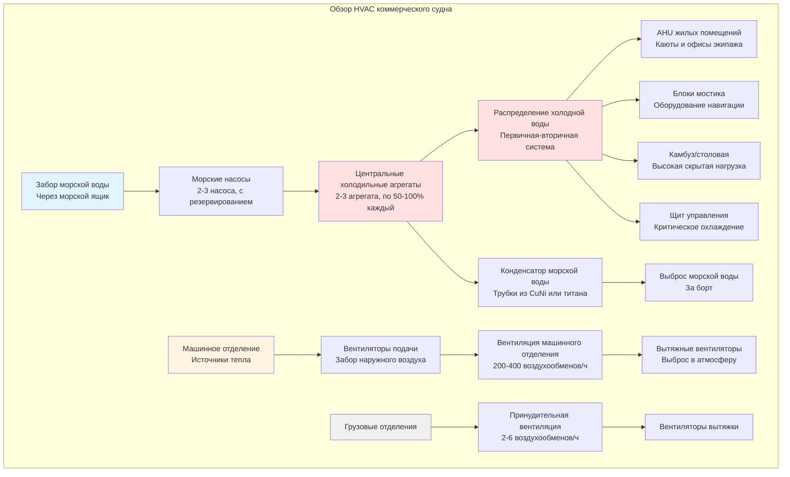

Коммерческие суда работают в сложных условиях, требующих систем HVAC, спроектированных с учетом надежности, энергоэффективности и нормативного соответствия. В отличие от пассажирских судов с обширными жилыми помещениями, коммерческие грузовые суда приоритизируют комфорт экипажа, защиту груза и охлаждение машинного отделения при минимизации потребления энергии и затрат на установку.

## Категории коммерческих судов

Различные типы коммерческих судов предъявляют отличающиеся требования к системам HVAC в зависимости от численности экипажа, чувствительности груза и режима эксплуатации.

### Сравнение типов судов

| Тип судна | Численность экипажа | Основная нагрузка HVAC | Учет груза | Типичная система |
|-----------|---------------------|------------------------|-----------|------------------|
| Универсальный сухогруз | 20-25 | Жилые помещения | Минимальная вентиляция груза | Split DX + естественная вентиляция |
| Контейнеровоз | 20-30 | Жилые помещения + мостик | Мониторинг рефрижерируемых контейнеров | Центральная система охлаждения водой |
| Танкер (нефтяной/химический) | 25-35 | Жилые помещения + щит управления | Контроль атмосферы в танках | Центральная установка + специальный выброс |
| Универсальный сухогруз | 15-25 | Жилые помещения + трюмы | Осушка грузовых отделений | DX-агрегаты + принудительная вентиляция |
| Газовоз (СПГ) | 30-40 | Жилые помещения + щит управления | Управление испарением газа | Резервированные центральные системы |
| Ro-Ro/Автовоз | 20-30 | Жилые помещения + палубы для автомобилей | Вентиляция палуб | Центральная установка + вентиляторы большой производительности |

**Сухогрузные суда и универсальные сухогрузы**

Эти суда перевозят негигроскопичные грузы (руда, зерно, уголь) с минимальным климат-контролем груза. HVAC сосредоточена на жилых помещениях экипажа, обычно расположенных в корме над машинным отделением. Типичные конфигурации включают:

- Split DX системы для отдельных кают и офисов
- Централизованная обработка воздуха для столовых и общих помещений
- Естественная вентиляция грузовых трюмов с механической поддержкой во время погрузки
- Вентиляторы подачи/вытяжки машинного отделения, рассчитанные на охлаждение оборудования

Жилые помещения требуют 25-30 кВт охлаждающей способности для типичного экипажа из 20 человек. Вентиляция грузовых трюмов обеспечивает 2-6 кратной воздухообмен в час для предотвращения накопления влаги и рисков самовозгорания материалов, таких как уголь.

**Контейнеровозы**

Современные контейнеровозы перевозят 3 000–24 000 ТЕУ со значительными электрическими нагрузками от холодильных контейнеров. Аспекты HVAC включают:

- Кондиционирование боковых крыльев мостика для электроники навигации (5-10 кВт)
- Жилая башня с центральным охлаждением водой (100-200 кВт всего)
- Вентиляция подпалубных грузовых отделений для удаления дизельных выхлопов во время портовых операций
- Выделенное охлаждение для систем мониторинга рефрижерируемых контейнеров

Жилая башня испытывает высокие солнечные нагрузки на открытые вертикальные поверхности. Расчет требует учета изменения угла солнца во время глобальных маршрутов.

**Танкеры (нефтяные, химические, СПГ)**

Суда с опасным грузом требуют взрывозащищенного оборудования HVAC в опасных зонах и специальной вентиляции атмосферы танков.

- Оборудование, сертифицированное по ATEX/IECEx для опасных зон 1/2
- Системы инертного газа, обеспечивающие азотные завесы для грузовых танков
- Системы с избыточным давлением для жилых помещений, предотвращающие проникновение паров углеводородов
- Интеграция аварийного отключения с системами обработки груза

Управление атмосферой танка поддерживает целостность груза посредством регулирования температуры и азотной завесы. Газовозы используют испаряющийся газ в качестве топлива для двигателей, сохраняя груз при −162 °C, что требует термической изоляции между системами груза и жилой HVAC.

## Расчеты тепловых нагрузок

Расчеты нагрузок морских систем HVAC следуют установленным принципам с модификациями для судовых условий.

### Охлаждающая нагрузка жилого пространства

Общая охлаждающая нагрузка объединяет явные и скрытые компоненты из множества источников:

$$Q_{\text{total}} = Q_{\text{solar}} + Q_{\text{transmission}} + Q_{\text{ventilation}} + Q_{\text{internal}} + Q_{\text{latent}}$$

**Солнечный теплоприток**

Солнечная радиация сквозь окна и поглощенная стальной конструкцией создают значительные нагрузки. Мгновенный солнечный теплоприток сквозь остекление:

$$Q_{\text{solar}} = A \cdot \text{SHGC} \cdot I_{\text{total}} \cdot \text{CLF}$$

где:
- $A$ = площадь остекления, м²
- $\text{SHGC}$ = коэффициент солнечного теплоприроста (0,25–0,85 в зависимости от типа стекла)
- $I_{\text{total}}$ = полная солнечная облученность, Вт/м² (варьируется по широте, курсу и времени)
- $\text{CLF}$ = коэффициент охлаждающей нагрузки, учитывающий тепловую массу

Для стальных корпусов с ограниченной тепловой массой CLF приближается к 1,0. Пиковые солнечные нагрузки возникают на боковых крыльях мостика с западной ориентацией остекления во время дневных вахт в тропических широтах (до 1000 Вт/м²).

**Передача тепла через ограждающие конструкции**

Теплопередача через наружные границы зависит от площади поверхности, коэффициента U и разности температур:

$$Q_{\text{transmission}} = U \cdot A \cdot \Delta T$$

Типичные значения U для морских конструкций:
- Теплоизолированная стальная переборка: 0,4–0,6 Вт/м²K
- Неизолированная стальная палуба: 5,0–6,0 Вт/м²K
- Двойное остекление: 2,5–3,0 Вт/м²K

Каюты, прилегающие к машинным отделениям, требуют повышенной изоляции (U < 0,3 Вт/м²K) для предотвращения теплопритока из машинного отделения с температурой 45–50 °C.

**Нагрузка от вентиляции**

Поступающий снаружный воздух для обеспечения качества воздуха создает как явные, так и скрытые нагрузки:

$$Q_{\text{vent,sensible}} = \dot{m}_{\text{air}} \cdot c_p \cdot (T_{\text{outside}} - T_{\text{inside}})$$

$$Q_{\text{vent,latent}} = \dot{m}_{\text{air}} \cdot h_{fg} \cdot (\omega_{\text{outside}} - \omega_{\text{inside}})$$

где:
- $\dot{m}_{\text{air}}$ = массовый расход воздуха, кг/с
- $c_p$ = удельная теплоемкость воздуха, 1,006 кДж/кгK
- $h_{fg}$ = теплота парообразования, 2500 кДж/кг
- $\omega$ = коэффициент влажности, кг воды/кг сухого воздуха

Минимальные нормы вентиляции по SOLAS: 30 м³/ч на человека для жилых помещений. В тропических условиях (35 °C, 80 % ОВ) нагрузка вентиляции доминирует над общей охлаждающей нагрузкой.

**Внутренний теплоприток**

Люди, освещение и оборудование создают явные и скрытые нагрузки:

$$Q_{\text{internal}} = Q_{\text{occupants}} + Q_{\text{lighting}} + Q_{\text{equipment}}$$

Теплоприток от людей варьируется с уровнем активности:
- Сон: 70 Вт/человека (40 Вт явный, 30 Вт скрытый)
- Сидячая работа/умеренная активность: 130 Вт/человека (70 Вт явный, 60 Вт скрытый)
- Тяжелая работа: 200 Вт/человека (100 Вт явный, 100 Вт скрытый)

Современное светодиодное освещение снижает электрические нагрузки до 5–10 Вт/м² по сравнению с 15–20 Вт/м² для традиционных люминесцентных систем.

### Общая охлаждающая способность

Суммирование всех компонентов нагрузки с применением коэффициентов запаса:

$$Q_{\text{design}} = (Q_{\text{total}}) \cdot \text{SF}$$

Коэффициенты запаса для морских применений варьируются от 1,15 до 1,25 для учета деградации оборудования от соленого воздействия и снижения производительности конденсатора при повышенных температурах морской воды (до 32 °C в тропических портах).

## Аспекты проектирования системы

Системы HVAC коммерческих судов балансируют требования производительности с ограничениями по пространству, массе и мощности.

### Выбор холодильного агрегата

Центральные установки с охлаждением водой обеспечивают охлаждение жилых помещений и электроники. Критерии выбора включают:

**Распределение производительности**

Двух-агрегатные системы работают при нагрузке 60–70 % каждый в нормальных условиях, позволяя работу одного агрегата при сниженных нагрузках или обеспечивая полную производительность при отказе одного агрегата. Конфигурации с тремя агрегатами обеспечивают большую гибкость:

- Нормальная эксплуатация: 2 агрегата при 50 % нагрузке (100 % всего)
- Тропические условия: 3 агрегата при 65 % нагрузке (195 % всего)
- Отказ одного агрегата: 2 агрегата при 75 % нагрузке (150 % минимум)

**Выбор хладагента**

Морские холодильные агрегаты используют хладагенты, балансирующие производительность, безопасность и нормативное соответствие:

| Хладагент | Тип | ODP | GWP | Безопасность | Применение |
|-----------|-----|-----|-----|--------------|-----------|
| R-134a | HFC | 0 | 1430 | A1 | Существующие установки |
| R-513A | HFO смесь | 0 | 631 | A1 | Низко-GWP замена |
| R-1234ze | HFO | 0 | 6 | A2L | Новые установки |
| R-717 (NH₃) | Природный | 0 | 0 | B2 | Крупные суда, только машинные отделения |

Правила IMO MARPOL Приложение VI и EU F-Gas регламент стимулируют переход на хладагенты с низким GWP. R-1234ze обеспечивает практически нулевой GWP, но требует протоколов безопасности A2L для мягко горючих хладагентов.

**Проектирование конденсатора**

Конденсаторы с охлаждением морской водой используют трубные материалы, устойчивые к коррозии:

- Медь-никель 90-10: стандарт для чистой морской воды, макс. скорость 2,5 м/с
- Медь-никель 70-30: загрязненная вода или более высокие скорости (3,0 м/с)
- Титан Марка 2: превосходная коррозионная стойкость, позволяет 3,5 м/с, более высокая стоимость

Коэффициенты загрязнения 0,000176 м²K/Вт учитывают биологический рост и накопление накипи. Системы автоматической очистки труб увеличивают интервалы между ручной чисткой.

### Распределение воздуха

Блоки обработки воздуха жилых помещений подают кондиционированный воздух через теплоизолированные воздуховоды.

**Маршрутизация воздуховодов**

Ограничения по пространству требуют компактного распределения. Прямоугольные воздуховоды максимизируют использование надпалубного пространства между балками палубы. Типичные скорости в воздуховодах:

- Основные распределительные воздуховоды: 6–8 м/с
- Ответвительные воздуховоды: 4–6 м/с
- Концевые диффузоры: 2–4 м/с

Более низкие скорости снижают передачу шума, критичную для зон отдыха экипажа. Звукопоглощающая прокладка в основных воздуховодах ослабляет шум вентилятора и турбулентности.

**Блоки обработки воздуха**

Морские AHU включают особенности, адресующие судовые условия:

- Конструкция из нержавеющей стали (304/316) для коррозионной стойкости
- Панели доступа со всех сторон для обслуживания в ограниченном пространстве
- Конденсатные насосы, преодолевающие качку судна (0,5–1,0 м напор)
- Виброизолирующие опоры (пружинные или эластомерные, прогиб 10–25 мм)
- Моющиеся фильтры для окружения с морскими брызгами

Температура подаваемого воздуха 12–14 °C обеспечивает адекватное осушение в тропических климатах, избегая чрезмерного переохлаждения, требующего доподогрева.

## Нормативное соответствие

Коммерческие суда должны удовлетворять требованиям классификационного общества и международных стандартов.

### Требования SOLAS

Международная конвенция по охране человеческой жизни на море устанавливает минимальные нормы HVAC:

**Контроль температуры**
- Жилые помещения: 18 °C минимум, 25 °C максимум (тропические условия)
- Щиты управления машинным отделением: 18–28 °C для работы электроники
- Медицинские объекты: 20–22 °C круглый год

**Нормы вентиляции**
- Каюты экипажа: 6 воздухообменов в час минимум
- Столовые: 8 воздухообменов/ч минимум
- Машинные отделения: 30 воздухообменов/ч минимум
- Камбузы: 10–15 воздухообменов/ч с отдельным выхлопом

**Безопасность при пожаре**
- Автоматические противопожарные клапаны на основных вертикальных границах зон (разделения класса A-60)
- Дистанционное отключение с мостика и аварийных станций
- Детектирование дыма в воздуховодах подачи и вытяжки
- Аварийное питание для существенных вентиляционных систем

### Правила классификационного общества

ABS, DNV-GL, Lloyd's Register и другие общества публикуют детальные требования HVAC:

**Сертификация оборудования**
- Испытание на типовое утверждение согласно стандартам общества
- Вибрационные испытания: IEC 60068-2-6 (развертка 10–200 Гц)
- Испытания на ударные воздействия: MIL-S-901D для военных применений
- Испытания на соляной туман: ASTM B117 (1000+ часов воздействия)

**Стандарты материалов**
- Медные сплавы: ASTM B111 для конденсаторных труб
- Нержавеющая сталь: AISI 316L минимум для контакта с морской водой
- Изоляция: Кодекс FTP IMO 2010 для пожарных свойств
- Хладагенты: классификация безопасности ISO 817

**Производительность системы**
- Условия проектирования: 35 °C сухой термометр, 70 % ОВ (тропики)
- Температура морской воды: 32 °C максимум
- Вентиляция машинного отделения: поддержание <45 °C окружающей среды
- Пределы шума: <60 дB(A) в жилых помещениях согласно IMO Res. A.468

### Экологические стандарты IMO

Правила Международной морской организации адресируют экологические воздействия:

**MARPOL Приложение VI**
- Поэтапный отказ от хладагентов с высоким GWP (>2500 GWP)
- Обязательные системы обнаружения утечек хладагента
- Требования по рекуперации и переработке хладагентов
- Пределы температуры выброса (10 °C выше окружающей) в чувствительных водах

**Энергоэффективность**
- EEDI (индекс энергоэффективности проектирования) включает потребление мощности HVAC
- SEEMP (план управления энергоэффективностью судна) требует оптимизации HVAC
- Рекуперация отходящего тепла от охлаждения двигателя для отопления жилых помещений

## Оперативные соображения

Системы HVAC коммерческих судов работают в переменных условиях, требующих адаптивных стратегий управления.

### Управление изменением нагрузок

Грузовые операции создают значительные изменения нагрузок:

- Портовые операции: экипаж работает по всему судну, высокий внутренний теплоприток
- Переходы в открытом море: сниженная активность экипажа, более низкие требования вентиляции
- Тропические переходы: максимальная охлаждающая нагрузка от солнца и окружающей среды
- Операции в Арктике: отопительные нагрузки, защита открытых трубопроводов от замерзания

Частотные преобразователи на компрессорах холодильных агрегатов и насосах холодной воды позволяют модуляцию производительности в соответствии с фактическими нагрузками. Управление последовательностью включает дополнительные холодильные агрегаты в сеть на основе отклонения температуры подаваемой воды от установки.

### Доступность для обслуживания

Длительные переходы между портами требуют возможности судового обслуживания. Аспекты проектирования включают:

- Размещение оборудования, позволяющее снять компрессор без разрезания переборок
- Доступ к фильтрам без требований входа в замкнутые пространства
- Хранилище запасных частей для критичных компонентов (клапаны компрессора, уплотнения, управления)
- Обеспечение инструментами и приборами для обслуживания, выполняемого экипажем

Классификационные общества требуют ежегодных освидетельствований, проверяющих производительность системы HVAC. Документирование деятельности по обслуживанию демонстрирует соответствие законодательным требованиям.

### Оптимизация энергии

Стоимость топлива доминирует в операционных расходах судна, делая энергоэффективность HVAC критичной:

- Включение холодильных агрегатов на основе кривых частичной нагрузки
- Свободное охлаждение с использованием морской воды во время переходов в холодной воде (прямое или через теплообменники)
- Рекуперация тепла от рубашки двигателя для отопления жилых помещений
- Светодиодное освещение, снижающее внутренние охлаждающие нагрузки
- VAV системы для помещений с изменяющейся занятостью

Современные коммерческие суда достигают удельной охлаждающей мощности 0,6–0,8 кВт холода на кВт электрической входной мощности благодаря оптимизированному выбору оборудования и стратегиям управления.

Инженерия систем HVAC коммерческих судов требует интеграции принципов термодинамики с морскими операционными реальностями. Проектирование систем, приоритизирующих надежность, соответствие и эффективность, обеспечивает комфорт экипажа и защиту груза на протяжении глобальных рейсов при минимизации затрат на жизненный цикл.
