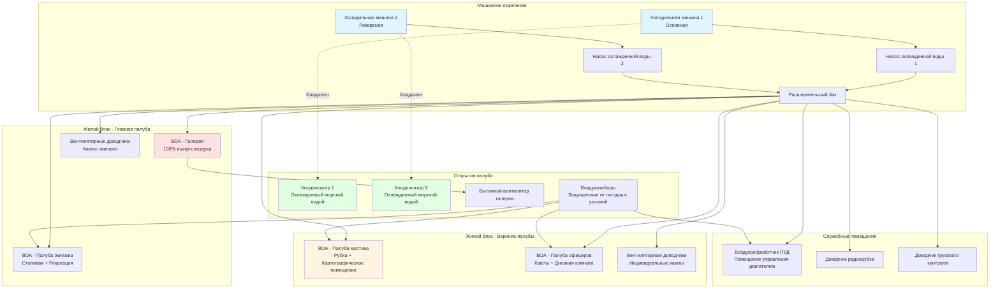

Системы HVAC на грузовых судах обеспечивают комфорт экипажа в жилых помещениях, поддерживают рабочие условия на мостике и в помещениях управления, а также поддерживают операции с охлаждаемыми грузами, соответствуя строгим морским нормативам и работая в экстремальных условиях окружающей среды.

## Требования к проектированию и стандарты

### Требования SOLAS по обеспечению комфорта

Международная конвенция по охране человеческой жизни на море (SOLAS), Глава II-1, Правило 3-12 требует кондиционирования воздуха в жилых помещениях, радиорубках и рубке для судов валовой вместимостью более 1600 тонн. Классификационные общества (Lloyd's Register, ABS, DNV, BV) вводят дополнительные стандарты комфорта.

**Требования SOLAS по температуре:**

| Тип помещения | Диапазон температур | Кратность воздухообмена/ч | Примечания |
|------------|------------------|------------------|-------|
| Каюты экипажа | 20-25°C | 6-8 ACH | Требуется индивидуальное управление |
| Офицерские каюты | 20-25°C | 6-8 ACH | Требуется индивидуальное управление |
| Столовые | 22-26°C | 10-12 ACH | Высокая нагрузка по занятости |
| Галерея | 24-28°C | 20-30 ACH | Удаление тепла и влаги |
| Мостик/Рубка | 20-24°C | 8-10 ACH | Точное управление, низкий уровень шума |
| Радиорубка | 20-24°C | 8-10 ACH | Приоритет охлаждения оборудования |
| Помещение управления двигателем | 22-26°C | 10-15 ACH | Избыточное давление |
| Медицинское помещение | 22-24°C | 6-8 ACH | Управление влажностью критично |

### Стандарты классификационных обществ

Классификационные общества устанавливают условия проектирования, сертификацию оборудования и практику установки. Правила ABS по строительству и классификации стальных судов требуют:

- Проектирование при температуре окружающей среды 35°C, относительной влажности не менее 50%
- Суда ледового класса: возможность работы при температуре -40°C
- Поддержание относительной влажности 45-55% в течение года
- Максимальные уровни шума: 55 дB(A) в каютах, 60 dB(A) в общественных помещениях, 65 dB(A) на мостике

## Архитектура системы HVAC

Грузовые суда используют централизованные системы охлажденной воды с распределенными по жилому блоку воздухообрабатывающими агрегатами. Типовая компоновка разделяет системы по функциям: комфорт экипажа, охлаждение навигационной электроники и поддержка рефконтейнеров.

## Расчеты холодильной нагрузки

### Нагрузка жилого блока

Общая холодильная нагрузка объединяет явное и скрытое тепло из различных источников:

$$Q_{total} = Q_{sensible} + Q_{latent}$$

**Компоненты явного тепла:**

$$Q_{sensible} = Q_{envelope} + Q_{equipment} + Q_{lighting} + Q_{people,sens} + Q_{ventilation,sens}$$

Где:
- $Q_{envelope}$ = Передача тепла через корпус и надстройку (Вт)
- $Q_{equipment}$ = Электроника, бытовые приборы, оборудование галереи (Вт)
- $Q_{lighting}$ = Тепловыделение от освещения (Вт)
- $Q_{people,sens}$ = Явное тепловыделение человека (Вт)
- $Q_{ventilation,sens}$ = Явная нагрузка от наружного воздуха (Вт)

**Теплопередача через оболочку:**

$$Q_{envelope} = U \cdot A \cdot (T_{outdoor} - T_{indoor})$$

Где:
- $U$ = Общий коэффициент теплопередачи (Вт/м²·K), типовые значения:
  - Изолированный стальной корпус: 0,35-0,45 Вт/м²·K
  - Стены надстройки: 0,40-0,55 Вт/м²·K
  - Окна/иллюминаторы: 2,5-3,5 Вт/м²·K
- $A$ = Площадь поверхности (м²)
- $T_{outdoor}$ = Проектная температура окружающей среды (°C)
- $T_{indoor}$ = Проектная внутренняя температура (°C)

**Солнечный теплопритоток через стекло:**

$$Q_{solar} = A_{glass} \cdot SHGC \cdot I_{solar}$$

Где:
- $A_{glass}$ = Площадь стекла (м²)
- $SHGC$ = Коэффициент солнечного теплопритока (0,25-0,40 для морского стекла)
- $I_{solar}$ = Солнечная облученность (Вт/м²), типично 800-1000 Вт/м² для тропических операций

**Компоненты скрытого тепла:**

$$Q_{latent} = Q_{people,lat} + Q_{ventilation,lat}$$

**Нагрузка от людей:**

$$Q_{people,total} = N \cdot (q_{sens} + q_{lat})$$

Типовые значения при средней активности:
- $q_{sens}$ = 75 Вт/человека (явное)
- $q_{lat}$ = 55 Вт/человека (скрытое)
- Итого = 130 Вт/человека

**Нагрузка от вентиляции:**

$$Q_{ventilation} = \dot{m}_{air} \cdot c_p \cdot \Delta T + \dot{m}_{air} \cdot h_{fg} \cdot \Delta W$$

Где:
- $\dot{m}_{air}$ = Массовый расход наружного воздуха (кг/с)
- $c_p$ = Удельная теплоемкость воздуха = 1,006 кДж/кг·K
- $\Delta T$ = Разность температур (K)
- $h_{fg}$ = Скрытая теплота парообразования = 2501 кДж/кг при 0°C
- $\Delta W$ = Разность коэффициентов влажности (кг влаги/кг сухого воздуха)

### Нагрузка системы климатизации мостика

Система HVAC мостика требует точного температурного контроля для защиты навигационной электроники и поддержания бодрствования оператора:

$$Q_{bridge} = Q_{envelope} + Q_{solar,glass} + Q_{equipment} + Q_{people} + Q_{ventilation}$$

Тепловыделение оборудования для современного интегрированного мостика:
- Дисплеи ECDIS: 200-400 Вт
- Радиолокационные системы: 300-600 Вт
- Коммуникационное оборудование: 150-300 Вт
- Освещение картографического стола: 100-150 Вт
- Общая нагрузка оборудования: 750-1450 Вт типично

**Размер холодильной машины:**

$$Q_{chiller} = \frac{Q_{design} \cdot SF}{COP}$$

Где:
- $Q_{design}$ = Общая проектная холодильная нагрузка (кВт)
- $SF$ = Коэффициент безопасности = 1,15-1,25
- $COP$ = Коэффициент производительности = 2,5-3,5 для морских холодильных машин

Для резервирования грузовые суда устанавливают конфигурацию холодильных машин N+1 с размером каждого агрегата 60-70% от общей нагрузки.

## Поддержка рефконтейнеров

Контейнеровозы, перевозящие охлаждаемые грузы, требуют значительной электрической мощности для рефконтейнеров:

**Электрическая нагрузка на один рефконтейнер:**

$$P_{reefer} = 7 \text{ до } 12 \text{ кВт на контейнер 40 фт}$$

**Общая мощность рефконтейнеров:**

$$P_{total,reefer} = N_{reefer} \cdot P_{avg} \cdot DF$$

Где:
- $N_{reefer}$ = Количество слотов рефконтейнеров
- $P_{avg}$ = Средняя мощность на контейнер = 8-10 кВт
- $DF$ = Коэффициент одновременности = 0,75-0,85

Крупные контейнеровозы могут выделять 2-4 МВт на операции рефконтейнеров.

## Компоненты системы и рассмотрения проектирования

**Система охлажденной воды:**
- Центральные холодильные машины: емкость 100-500 кВт, хладагент R-134a или R-513A
- Конденсаторы, охлаждаемые морской водой: титановые трубки, съемные трубные пучки
- Температура охлажденной воды: 7-12°C подача, 14-18°C возврат
- Давление в системе: 3-6 бар, с учетом движения судна

**Воздухообрабатывающие агрегаты:**
- Конструкция морского класса: оцинкованная/порошковая покраска стали, крепеж из нержавеющей стали
- Конфигурация всасывания через теплообменник охлажденной воды
- Экономайзеры наружного воздуха для умеренного климата
- Опциональная фильтрация HEPA для специализированных грузов

**Распределение:**
- Индивидуальные вентиляторные доводчики в каютах с местными термостатами
- Изолированная трубопроводная сеть охлажденной воды: медь или нержавеющая сталь
- Гибкие соединения у оборудования для поглощения вибрации
- Поддоны конденсата с положительным стоком, конденсатные насосы где требуется

**Управление:**
- Система DDC с центральным мониторингом с мостика
- Индивидуальное управление температурой в каютах
- Автоматическое переключение между холодильными машинами
- Интеграция с системой автоматизации судна

**Шум и вибрация:**
- Виброизоляторы на всем вращающемся оборудовании
- Гибкие воздуховодные соединения у ВОА
- Звукопоглощение в воздуховодах подачи/возврата мостика и кают
- Максимум NC-35 в рубке, NC-40 в каютах

## Рабочие рассмотрения

Системы HVAC грузовых судов работают непрерывно во время рейсов продолжительностью недели-месяцы через различные климаты. Проектирование должно учитывать тропическую жару (40°C+), арктический холод (-30°C) и высокую влажность (90%+) при поддержании комфорта экипажа в соответствии со стандартами Международной организации труда (МОТ) Конвенция о труде в морском флоте.

Резервирование систем обеспечивает продолжение работы при отказе отдельных компонентов. Автоматическое управление минимизирует вмешательство экипажа при предоставлении возможности локального регулирования. Графики профилактического обслуживания совмещаются с интервалами сухого дока судна и стоянками в портах.

## Компоненты

- HVAC жилого блока
- Климатизация мостика
- Кондиционирование помещения управления двигателем
- Вентиляция кают экипажа
- Выпуск воздуха из галереи грузового судна
- Минимальная система HVAC грузовых судов
- Мощность рефконтейнеров
- Электрическая нагрузка контейнеровоза
