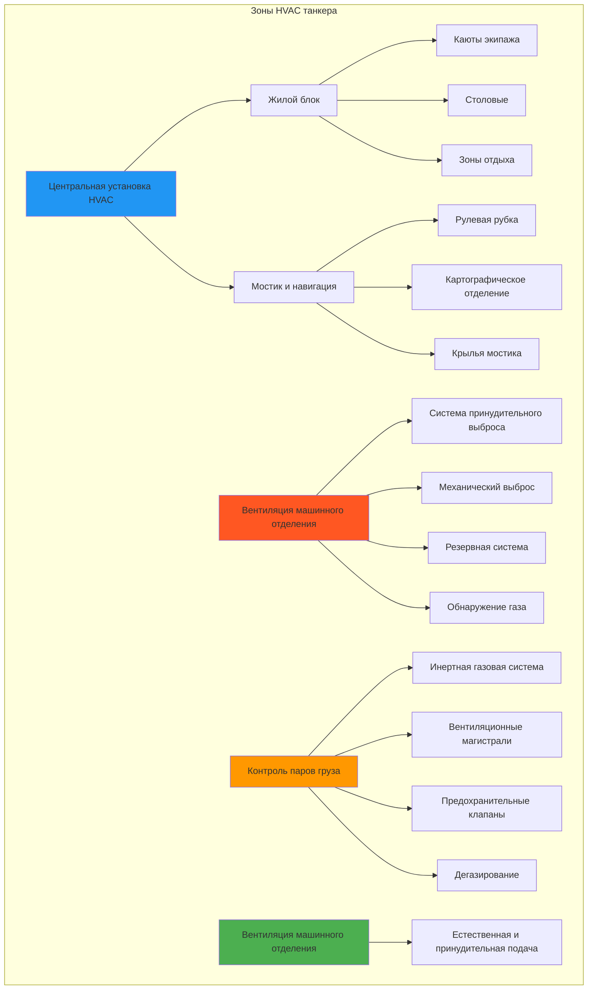

Танкеры и насыпные суда представляют уникальные проблемы для систем HVAC из-за опасных атмосфер грузов, требований вентиляции машинного отделения и разделения жилых помещений от грузовых отсеков. Эти суда требуют специализированных систем вентиляции, которые соответствуют нормативам SOLAS (Safety of Life at Sea) и IMO (International Maritime Organization) по обращению с опасными грузами.

## Конфигурация системы

Системы HVAC танкеров и насыпных судов разделяют судно на отдельные зоны с различными требованиями к вентиляции и кондиционированию. Жилой блок получает полный климат-контроль, в то время как грузовые и машинные отделения требуют специализированной вентиляции.

## Требования к вентиляции машинного отделения

Машинные отделения на танкерах требуют непрерывной механической вентиляции для предотвращения накопления взрывоопасных паров. Правило SOLAS Глава II-2 Регламент 4.5.2 устанавливает конкретные требования к воздухообмену.

### Расчет скорости вентиляции

Требуемый воздухообмен для машинного отделения:

$$
Q_{\text{pump}} = N \times V
$$

где:
- $Q_{\text{pump}}$ = требуемый воздухообмен (м³/ч)
- $N$ = кратность воздухообмена в час (минимум 20 ACH по SOLAS)
- $V$ = объем машинного отделения (м³)

Для безопасности от взрывов скорость разбавления вентиляции:

$$
Q_{\text{dilution}} = \frac{q_{\text{vap}} \times 10^4}{C_{\text{LEL}} \times K}
$$

где:
- $q_{\text{vap}}$ = максимальная скорость образования паров (кг/ч)
- $C_{\text{LEL}}$ = нижний концентрационный предел взрываемости (%)
- $K$ = коэффициент безопасности (обычно 0,25, или 25% LEL)

### Параметры конструкции машинного отделения

| Параметр | Требование | Стандарт |
|-----------|-------------|----------|
| Минимальный воздухообмен | 20 ACH | SOLAS II-2/4.5.2 |
| Местоположение выброса | Нижняя секция, несколько точек | IMO MSC.1/Circ.1432 |
| Тип вентилятора | Неискрящий, взрывозащищенный | IEC 60079 |
| Резервная система | Требуется экстренная вентиляция | SOLAS II-2/4.5.2.3 |
| Место забора | Верхняя палуба, сторона ветра | Рекомендации IMO |
| Скорость в воздуховодах | 15-20 м/с минимум | Требования SOLAS |
| Управление | Непрерывная работа при наличии груза | SOLAS II-2/4.5.2.1 |
| Обнаружение газа | Стационарные датчики углеводородов | SOLAS XI-1/7 |

## Вентиляция грузовой зоны

Грузовые танки и окружающие области требуют специализированной вентиляции для управления паров углеводородов и инертной газовой атмосферой.

### Режимы вентиляции

**Нормальная вентиляция:**
$$
Q_{\text{vent}} = \frac{Q_{\text{cargo}} \times \beta \times (T_{\text{cargo}} + 273.15)}{P_{\text{atm}}}
$$

где:
- $Q_{\text{cargo}}$ = скорость загрузки груза (м³/ч)
- $\beta$ = коэффициент расширения паров (обычно 1,2-1,4)
- $T_{\text{cargo}}$ = температура груза (°C)
- $P_{\text{atm}}$ = атмосферное давление (кПа)

### Системы контроля паров груза

| Тип системы | Применение | Основа мощности |
|-------------|-------------|----------------|
| Клапаны высокоскоростной вентиляции | Сброс давления/вакуума | 125% макс. скорость загрузки |
| Инертная газовая система | Контроль атмосферы танка | 125% макс. скорость разгрузки |
| Установка рекуперации паров | Контроль выбросов | 100% образование паров груза |
| Система вентиляции для дегазирования | Операции очистки танков | 3-5 объемов танка/час |
| Система замкнутого цикла возврата паров | Береговое соединение | Соответствие скорости загрузки |

## Системы HVAC для жилых помещений

Жилой блок на танкерах обычно расположен в корме, отделен от грузовых операций кофердамом и расположен над грузовым танком.

### Расчет охлаждающей нагрузки

Общая охлаждающая нагрузка для жилых помещений:

$$
Q_{\text{total}} = Q_{\text{sens}} + Q_{\text{lat}} + Q_{\text{solar}} + Q_{\text{deck}}
$$

Теплопередача через палубу от грузовых танков ниже:

$$
Q_{\text{deck}} = U \times A \times (T_{\text{cargo}} - T_{\text{cabin}})
$$

где:
- $U$ = общий коэффициент теплопередачи (обычно 0,3-0,5 Вт/м²·К с изоляцией)
- $A$ = площадь палубы над грузовыми танками (м²)
- $T_{\text{cargo}}$ = температура груза (°C, может достигать 60-80°C для подогреваемых грузов)
- $T_{\text{cabin}}$ = требуемая температура в каюте (обычно 24°C)

### Требования для жилых помещений

| Тип помещения | Воздухообмен/час | Температура подаваемого воздуха | Примечания |
|------------|------------------|-----------------|-------|
| Каюты экипажа | 6-8 ACH | 16-18°C | Возможность 100% свежего воздуха |
| Офицерские каюты | 6-8 ACH | 16-18°C | Индивидуальное управление |
| Столовые | 8-12 ACH | 16-18°C | Высокая плотность людей |
| Камбуз | 20-30 ACH | Окружающий воздух | Отдельный выброс |
| Спортзал | 10-15 ACH | 18-20°C | Высокая скрытая нагрузка |
| Медицинский отсек | 8-10 ACH | 22-24°C | Положительное давление |
| Прачечная | 15-20 ACH | Окружающий воздух | Удаление тепла/влажности |
| Коридоры | 4-6 ACH | 20-22°C | Распределительные пути |

## Классификация опасных зон

Системы HVAC танкеров должны учитывать классификацию опасных зон согласно IEC 60092-502.

### Требования по зонам

**Зона 0 (постоянная опасность):**
- Внутри грузовых танков
- Оборудование вентиляции не допускается

**Зона 1 (периодическая опасность):**
- Машинные отделения, комнаты грузовых компрессоров
- Требуется взрывозащищенное оборудование
- Обязательна непрерывная механическая вентиляция

**Зона 2 (только при нарушениях):**
- Открытая палубная грузовая зона (3м горизонтально, 2,4м вертикально от источников)
- Допускается защищенное оборудование
- Вентиляция для поддержания давления

## Мостик и навигационные помещения

Системы HVAC мостика поддерживают постоянную температуру для работы оборудования и обеспечивают комфорт во время длительных вахт.

### Нагрузки HVAC мостика

Расчет теплоотделения оборудования:

$$
Q_{\text{equip}} = \sum (P_i \times 3.412 \times f_u)
$$

где:
- $P_i$ = мощность отдельного оборудования (Вт)
- $f_u$ = коэффициент использования (обычно 0,7-0,9 для навигационного оборудования)
- 3.412 = коэффициент пересчета кДж/ч на Ватт

### Параметры навигационных помещений

| Помещение | Диапазон температуры | Управление влажностью | Специальные требования |
|-----------|-------------------|------------------|----------------------|
| Рулевая рубка | 22-24°C | Не критично | Минимальный шум (<50 дБ) |
| Картографическое отделение | 20-22°C | 40-60% отн. влажность | Приоритет охлаждения оборудования |
| Радиорубка | 20-22°C | 40-50% отн. влажность | Высокая плотность оборудования |
| Крылья мостика | Только отопление | Н/П | Антизапотевание стекол |
| Радарная рубка | 18-20°C | <60% отн. влажность | Отдельное охлаждение |

## Безопасность и соответствие нормативам

Все системы HVAC танкеров должны соответствовать:

- **SOLAS Глава II-2:** Безопасность от пожаров, требования вентиляции
- **IMO Resolution MSC.1/Circ.1432:** Пересмотренные рекомендации по вентиляции
- **IEC 60092-502:** Электрические установки в опасных зонах
- **ISGOTT:** Международное руководство по безопасности нефтяных танкеров и терминалов
- **OCIMF:** Рекомендации Форума нефтяных компаний международного морского флота

### Интеграция обнаружения газа

Системы HVAC взаимодействуют со стационарными системами обнаружения газа:
- Автоматический останов вентиляции при высокой сигнализации газа
- Протоколы активации аварийной вентиляции
- Повышение давления в жилых помещениях при выбросе паров
- Интеграция с мониторингом диспетчерского пункта

## Рассмотрение энергоэффективности

Танкеры работают в течение длительных периодов в тропических водах, что делает потребление энергии HVAC значительным.

**Меры по повышению эффективности:**
- Частотно-регулируемые приводы на вентиляторы вентиляции (экономия 20-30% энергии)
- Рекуперация тепла из рубашки двигателя для отопления жилых помещений
- Свободное охлаждение при работе в холодных водах
- Оптимизированная изоляция жилых помещений (минимизация теплопередачи через палубу)
- LED-освещение, снижающее внутренние тепловые нагрузки
- Экономайзеры для рулевой рубки и диспетчерских пунктов

Надлежащее проектирование систем HVAC для танкеров и насыпных судов обеспечивает безопасность экипажа, соответствие нормативам и операционную эффективность при управлении уникальными проблемами взрывоопасных атмосфер и длительных морских переходов.
