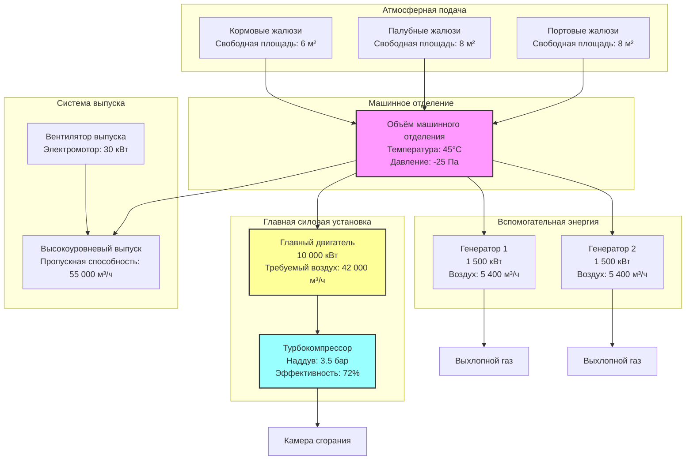

# Воздух для сгорания в машинном отделении судна

Подача воздуха для сгорания является основной функцией систем вентиляции машинного отделения морского судна. Недостаточный поток воздуха вызывает неполное сгорание, потерю мощности, перегрев и избыточные выбросы. Морские дизельные двигатели потребляют значительные объёмы воздуха — главный двигатель мощностью 10 000 кВт требует примерно 50 000 м³/ч воздуха для сгорания при полной нагрузке.

## Основные требования к воздуху для сгорания

### Стехиометрическое требование к воздуху

Теоретическое требование к воздуху для полного сгорания дизельного топлива основано на химии топлива. Для морских дизельных топлив стехиометрическое соотношение составляет:

$$A_{stoich} = \frac{11.5 \times (C + 0.375S) + 34.5H - 4.3O}{100}$$

Где:
- $A_{stoich}$ = Стехиометрическое требование к воздуху (кг воздуха/кг топлива)
- $C$ = Содержание углерода по массе (% масс.)
- $H$ = Содержание водорода по массе (% масс.)
- $O$ = Содержание кислорода по массе (% масс.)
- $S$ = Содержание серы по массе (% масс.)

Для типичного морского дизельного масла (MDO): C=87%, H=12.6%, O=0.4%, S=0.5%

$$A_{stoich} = \frac{11.5(87 + 0.375 \times 0.5) + 34.5 \times 12.6 - 4.3 \times 0.4}{100} = 14.3 \text{ кг воздуха/кг топлива}$$

### Фактическое требление к воздуху с избыточным воздухом

Дизельные двигатели работают с избыточным воздухом для обеспечения полного сгорания. Фактическое требование к воздуху составляет:

$$\dot{m}_{air} = A_{stoich} \times (1 + EA) \times \dot{m}_{fuel}$$

Где:
- $\dot{m}_{air}$ = Фактический массовый поток воздуха (кг/с)
- $EA$ = Коэффициент избыточного воздуха (обычно 1.5-2.5 для морских дизелей)
- $\dot{m}_{fuel}$ = Расход топлива (кг/с)

Коэффициенты избыточного воздуха по типам двигателей:

| Тип двигателя | Коэффициент избыточного воздуха | Полное соотношение воздуха и топлива |
|-------------|------------------|---------------------|
| Низкоскоростной 2-тактный (главная силовая установка) | 1.8-2.2 | 28-32 кг/кг |
| Среднескоростной 4-тактный (вспомогательный) | 1.5-2.0 | 23-29 кг/кг |
| Высокоскоростной 4-тактный (генераторы) | 1.4-1.8 | 21-27 кг/кг |
| Аварийные дизельные генераторы | 1.6-2.0 | 24-29 кг/кг |

### Расчёт объёмного расхода

Переведите массовый поток в объёмный поток при условиях в машинном отделении:

$$Q_{comb} = \frac{\dot{m}_{air} \times 3600}{\rho_{air}}$$

Где:
- $Q_{comb}$ = Объёмный поток воздуха (м³/ч)
- $\rho_{air}$ = Плотность воздуха при температуре машинного отделения (кг/м³)

При температуре 45°C в машинном отделении: $\rho_{air} = 1.11$ кг/м³

## Упрощённые расчёты проектирования

### Метод, основанный на мощности

Для предварительного проектирования воздух для сгорания рассчитывается непосредственно от мощности двигателя:

$$Q_{eng} = P_{eng} \times k_{fuel} \times SF$$

Где:
- $Q_{eng}$ = Необходимый поток воздуха (м³/ч)
- $P_{eng}$ = Номинальная мощность двигателя (кВт)
- $k_{fuel}$ = Коэффициент воздуха, специфичный для топлива (м³/кВт·ч)
- $SF$ = Коэффициент запаса (1.25-1.50)

#### Коэффициенты воздуха, специфичные для топлива

| Тип топлива | $k_{fuel}$ (м³/кВт·ч) | Типичное применение |
|-----------|---------------------|---------------------|
| Морское дизельное масло (MDO) | 0.36 | Вспомогательные двигатели, генераторы |
| Морское газойльное масло (MGO) | 0.34 | Высокоскоростные дизели |
| Промежуточное топливо (IFO 180) | 0.40 | Среднескоростные двигатели |
| Тяжёлое топливо (HFO 380) | 0.42 | Низкоскоростные главные двигатели |
| Топливо с низким содержанием серы (LSFO) | 0.38 | Топливо для соответствия стандартам после 2020 г. |

### Расчёт для нескольких двигателей

Для машинных отделений с несколькими источниками питания, работающими одновременно:

$$Q_{total} = SF \times \sum_{i=1}^{n} (P_i \times k_{fuel,i} \times LF_i)$$

Где:
- $LF_i$ = Коэффициент нагрузки для двигателя $i$ (обычно 0.85 для непрерывного режима)
- $n$ = Количество двигателей

**Допущение при проектировании:** Рассчитайте для всех главных двигателей плюс 50% вспомогательной мощности или максимально вероятной одновременной нагрузки.

## Требования к воздуху турбокомпрессора

### Особенности турбокомпрессорных двигателей

Современные морские дизели с турбокомпрессором означают, что турбокомпрессор подаёт основную часть воздуха для сгорания. Однако машинное отделение должно обеспечивать:

1. **Воздух на входе турбокомпрессора** (основное требование)
2. **Продувочный воздух** (вентиляция картера)
3. **Охлаждающий воздух** для генератора и вспомогательного оборудования

Общая вентиляция машинного отделения должна учитывать все источники.

### Эффект плотности воздуха турбокомпрессора

Турбокомпрессоры чувствительны к плотности воздуха на входе. Пониженная плотность воздуха (от высокой температуры или низкого барометрического давления) снижает мощность двигателя:

$$P_{actual} = P_{rated} \times \frac{\rho_{actual}}{\rho_{ISO}}$$

Где:
- $P_{actual}$ = Фактически доступная мощность (кВт)
- $P_{rated}$ = Номинальная мощность ISO при 25°C, 100 кПа (кВт)
- $\rho_{ISO}$ = 1.184 кг/м³ (условия ISO)

**Критическая точка проектирования:** Температура машинного отделения непосредственно влияет на эффективность турбокомпрессора и выходную мощность двигателя. Каждое увеличение температуры на 10°C выше условий ISO снижает мощность примерно на 3-5%.

### Бюджет перепада давления турбокомпрессора

Перепад давления в системе впуска воздуха снижает эффективность турбокомпрессора:

$$\Delta P_{intake} = \Delta P_{louver} + \Delta P_{filter} + \Delta P_{duct}$$

Максимально допустимо: **$\Delta P_{intake} < 1.5$ кПа** (зависит от производителя)

Типичные перепады давления компонентов:

| Компонент | Перепад давления (Па) | Примечания |
|-----------|-------------------|-------|
| Герметичные жалюзи | 80-150 | Чистое состояние |
| Предварительные фильтры (сетка) | 50-80 | Защита от солёных брызг |
| Воздушные фильтры (если используются) | 100-200 | Редко используются в машинных отделениях |
| Воздуховод на входе | 20-40 на 10м | На основе скорости |
| Колена и переходы | 15-30 для каждого | Колена 90°, R/D > 1.5 |

## Определение размеров жалюзи и входов

### Требования к свободной площади

Жалюзи для воздуха сгорания должны обеспечивать достаточную свободную площадь, чтобы ограничить скорость и перепад давления:

$$A_{free} = \frac{Q_{total}}{3600 \times V_{max}}$$

Где:
- $A_{free}$ = Требуемая свободная площадь (м²)
- $V_{max}$ = Максимально допустимая скорость (м/с)

**Проектные скорости:**
- Герметичные жалюзи: 4-6 м/с (чистое состояние)
- Штормовые жалюзи: 3-5 м/с (более высокое сопротивление)
- Входы аварийных генераторов: 5-7 м/с (кратковременная работа)

### Расчёт перепада давления жалюзи

Перепад давления через жалюзи следует уравнению отверстия:

$$\Delta P_{louver} = \frac{\rho_{air} \times V^2}{2 \times C_d^2}$$

Где:
- $C_d$ = Коэффициент расхода (0.60-0.75 для морских жалюзи)
- $V$ = Лицевая скорость через свободную площадь (м/с)

### Факторы выбора жалюзи

Жалюзи машинного отделения морского судна требуют:

1. **Герметичная конструкция** - Предотвращение попадания воды при сильном волнении
2. **Система дренажа** - Внутренние желоба и дренажи для скопления воды
3. **Устойчивость к коррозии** - Алюминий, нержавеющая сталь или окрашенная углеродистая сталь
4. **Конструктивная прочность** - Сопротивление воздействию "зелённой воды" (до 5 кПа)
5. **Одобрение классификационным обществом** - Сертификация от соответствующего классификационного общества

| Тип жалюзи | Коэффициент свободной площади | Типичный $C_d$ | Погодный рейтинг |
|-------------|-----------------|---------------|----------------|
| Гравитационные заслонки | 0.45-0.55 | 0.65 | Лёгкий режим |
| Герметичные дренируемые | 0.35-0.45 | 0.62 | Суровая погода |
| Штормовые жалюзи | 0.25-0.35 | 0.58 | Экстремальная погода |
| Акустические жалюзи | 0.30-0.40 | 0.60 | Погода + шум |

### Стратегия расположения с несколькими входами

Распределите входы воздуха для сгорания, чтобы обеспечить подачу воздуха при различных режимах эксплуатации судна:

- **Порт и борт — с обоих сторон** - Поддерживайте поток воздуха при крене судна
- **Передняя и задняя части** - Учтите условия дифферента
- **Вертикальное разделение** - Снизьте риск одновременного попадания воды
- **Минимальная высота** - Обычно 2.5-3.0 м выше ватерлинии

## Проектирование системы воздуха для сгорания

## Нормативные стандарты и требования

### Требования SOLAS Глава II-2

Международная конвенция по охране человеческой жизни на море (SOLAS) требует:

**Правило 4.5.1:** Машинные отделения категории A должны быть обеспечены вентиляцией, адекватной для работы машин и вспомогательных устройств при всех метеорологических условиях.

Минимальные темпы вентиляции:
- **Машинные отделения главных двигателей:** 30 воздухообменов в час (ACH)
- **Вспомогательные машинные отделения:** 20 ACH
- **Помещения аварийных генераторов:** 30 ACH с независимой подачей

Основа расчёта: Используйте **большее значение** между расчётом воздуха для сгорания и минимальным требованием ACH.

### Стандарт ISO 8861

ISO 8861:1998 "Судостроение - Вентиляция машинного отделения на дизельных судах" предоставляет подробную методологию проектирования:

**Требление к воздуху для сгорания:**

$$Q = k \times P_{MCR} \times (0.044 \times t + 1)$$

Где:
- $Q$ = Требуемый поток воздуха (м³/с)
- $k$ = 0.001 для 4-тактного, 0.0012 для 2-тактного
- $P_{MCR}$ = Максимальная непрерывная мощность (кВт)
- $t$ = Температура машинного отделения (°C)

**Требление к воздуху для отвода тепла:** Рассчитывается отдельно и добавляется к воздуху для сгорания.

### Правила классификационного общества

Главные классификационные общества устанавливают дополнительные требования:

| Общество | Ключевое требление | Типичный коэффициент |
|---------|----------------|----------------|
| Lloyd's Register (LR) | Минимум 30 ACH, проверка сгорания | 1.25× расчётное |
| DNV-GL | Сгорание + отвод тепла, макс. 50°C | 1.30× расчётное |
| American Bureau of Shipping (ABS) | Обязательность соответствия ISO 8861 | 1.25× расчётное |
| Bureau Veritas (BV) | Отдельная вентиляция аварийного генератора | 1.30× расчётное |
| ClassNK (Япония) | Требления для тропического рейтинга | 1.35× расчётное |

### Тропические и экстремальные климатические рейтинги

Для судов, работающих в тропических водах (внешняя температура >35°C) или портах на большой высоте (низкое барометрическое давление), применяются дополнительные коэффициенты проектирования:

$$Q_{tropical} = Q_{standard} \times \frac{318}{(273 + t_{ambient})} \times \frac{101.3}{P_{barometric}}$$

Где:
- $t_{ambient}$ = Максимальная внешняя температура (°C)
- $P_{barometric}$ = Минимальное барометрическое давление (кПа)

Стандартное тропическое условие: внешняя температура 45°C, барометрическое давление 100 кПа.

## Практический пример проектирования

**Дано:**
- Главный двигатель: 12 000 кВт (2-тактный, HFO)
- Дизельные генераторы: 2 × 1 800 кВт (4-тактный, MDO)
- Объём машинного отделения: 2 500 м³
- Проектная температура: 45°C

**Расчёт общего требления к воздуху для сгорания:**

Главный двигатель:
$$Q_{main} = 12 000 \times 0.42 \times 1.30 = 6 552 \text{ м}^3/\text{ч}$$

Генераторы (оба работают):
$$Q_{gen} = 2 \times 1 800 \times 0.36 \times 1.25 = 1 620 \text{ м}^3/\text{ч}$$

Общее требление к воздуху для сгорания:
$$Q_{comb} = 6 552 + 1 620 = 8 172 \text{ м}^3/\text{ч}$$

Проверка минимального ACH:
$$Q_{ACH} = 2 500 \times 30 = 75 000 \text{ м}^3/\text{ч}$$

**Основа проектирования: 75 000 м³/ч** (требление ACH определяет)

Требуемая свободная площадь жалюзи (проектная скорость 5 м/с):
$$A_{free} = \frac{75 000}{3 600 \times 5} = 4.17 \text{ м}^2$$

При типичной герметичной жалюзи (коэффициент свободной площади 40%):
$$A_{louver} = \frac{4.17}{0.40} = 10.4 \text{ м}^2 \text{ общая площадь лица жалюзи}$$

Используйте: 3 жалюзи × 3.5 м² каждая = 10.5 м² (портовые, палубные, кормовые)

## Передовая практика проектирования

### Стратегия распределения воздуха

1. **Входы на низком уровне** - Подача воздуха ниже линии центра двигателя для восходящего потока
2. **Несколько отделённых входов** - Резервирование для сценариев с погодой и повреждениями
3. **Прямой путь к турбокомпрессору** - Минимизируйте перепад давления и рост температуры
4. **Избегайте рециркуляции** - Отдельный путь для горячего выхлопного воздуха и свежего входящего

### Распространённые ошибки проектирования

| Ошибка | Последствие | Исправление |
|-------|-------------|------------|
| Недостаточная свободная площадь | Высокая скорость, чрезмерный перепад давления | Увеличьте размер жалюзи на 30-50% |
| Одиночное расположение входа | Потеря воздуха при крене/дифференте | Несколько распределённых входов |
| Вход рядом с выпуском | Горячая рециркуляция воздуха | Отделите на >5м в горизонтальной плоскости |
| Отсутствие дренажа | Скопление воды, коррозия | Встроенные поддоны дренажа и переборочные дренажи |
| Недостаточная защита сетью | Риск посторонних предметов турбокомпрессору | Сетка 10-15 мм на всех входах |

### Проверка производительности

Испытание при вводе в эксплуатацию должно проверить:
- **Измерение потока воздуха** - Проходные измерения на местах расположения жалюзи
- **Проверка перепада давления** - Статическое давление на входе турбокомпрессора < лимит
- **Распределение температуры** - Максимальная температура машинного отделения ≤ 50°C при полной нагрузке
- **Отсутствие рециркуляции** - Дымовой тест подтверждает путь воздуха от входа к выпуску

Установите постоянные индикаторы дифференциального давления по критическим входным жалюзи для контроля засорения фильтра/сетки во время эксплуатации.

---

**Связанные темы:**
- Расчёты отвода тепла
- Проектирование системы выпуска
- Системы аварийной вентиляции
- Защита машинного отделения от пожара
