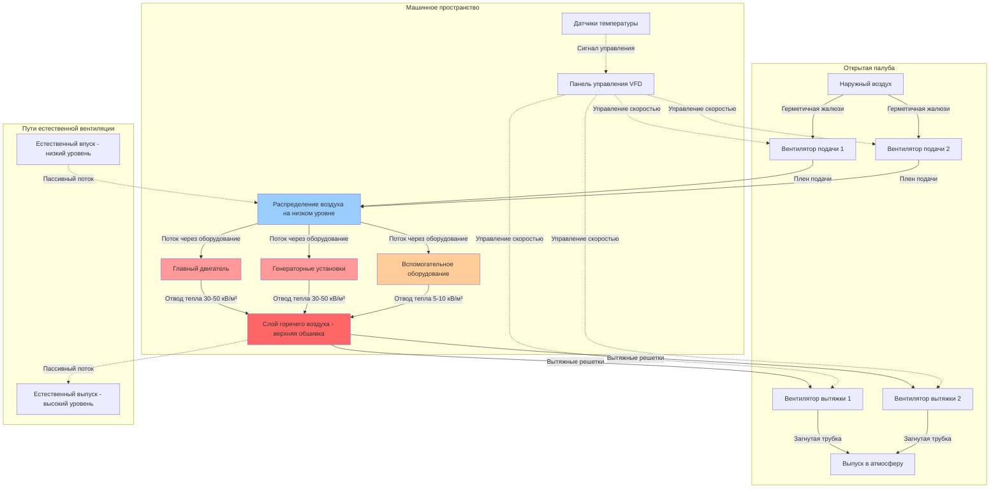

# Системы охлаждения и вентиляции машинного отделения

Вентиляция машинного отделения морского судна служит двойной цели: обеспечение воздуха для горения в машинах и отвод значительных тепловых нагрузок, генерируемых при работе. Функция охлаждения поддерживает температуру машинного пространства в допустимых пределах для обеспечения надежности оборудования, безопасности персонала и соответствия правилам классификационных обществ. Правильное проектирование вентиляции обеспечивает баланс между требованиями к отводу тепла и практическими ограничениями потребления энергии вентиляторов, генерирования шума и надежности системы.

## Системы принудительной вентиляции

Принудительная вентиляция использует механические вентиляторы для создания воздушного потока через машинные помещения с интенсивностью, достаточной как для подачи воздуха горения, так и для отвода тепла. Такой подход обеспечивает прогнозируемую производительность независимо от скорости судна и условий ветра.

### Конфигурация системы

Системы принудительной вентиляции используют вентиляторы подачи, создающие избыточное давление в машинном пространстве, и вентиляторы вытяжки, удаляющие нагретый воздух. Типовое расположение предусматривает размещение вентиляторов подачи на низких уровнях для подачи холодного воздуха у палубы, а вентиляторов вытяжки – в верхней части для удаления самого горячего воздуха, накапливающегося у верхней обшивки.

**Расположение вентилятора подачи**

Вентиляторы подачи засасывают наружный воздух через герметичные жалюзи, оборудованные дренажными системами для предотвращения попадания морской воды. Вентиляторы нагнетают воздух в распределительные плены, направляющие воздух по машинному оборудованию. Несколько точек подачи обеспечивают равномерное распределение воздуха по всему пространству. При выборе мест размещения вентиляторов учитываются:

- Доступность для техническое обслуживание без входа в замкнутые пространства
- Защита от атмосферных воздействий и брызг
- Достаточная площадь впуска (1,5-2,0 от площади входа вентилятора)
- Дренаж для конденсата и случайного попадания воды
- Изоляция звука в смежные помещения

**Конфигурация вентилятора вытяжки**

Вентиляторы вытяжки устанавливаются вблизи верхней обшивки в самых горячих зонах. Воздухозаборники вытяжки проходят через палубу наружного борта через герметичные отверстия с грибовидными вентиляторами или загнутыми вверх трубопроводами. Пропускная способность вытяжки обычно на 10-15% превышает подачу для поддержания небольшого отрицательного давления, предотвращающего миграцию горячего воздуха, паров и масляного тумана в соседние жилые помещения.

### Расчет тепловой нагрузки

Общая тепловая нагрузка определяет требуемую интенсивность вентиляционного воздушного потока для адекватного охлаждения. Полная тепловая нагрузка включает все источники в машинном пространстве.

#### Отвод тепла двигателем

Дизельные двигатели отводят тепло несколькими способами:

$$Q_{\text{eng}} = P_{\text{brake}} \times \eta_{\text{rad}}$$

Где:
- $Q_{\text{eng}}$ = отвод тепла двигателем в пространство (кВ)
- $P_{\text{brake}}$ = мощность на валу двигателя (кВ)
- $\eta_{\text{rad}}$ = коэффициент эффективности излучения (0,03-0,05)

Коэффициент эффективности излучения учитывает теплопередачу от блока двигателя, выпускных коллекторов, турбокомпрессоров и связанных компонентов. Малооборотные дизельные двигатели обычно имеют $\eta_{\text{rad}} = 0,03$ благодаря лучшей теплоизоляции, в то время как среднеоборотные двигатели достигают 0,04-0,05.

#### Потери генератора

Электрические потери генератора преобразуются в тепло в машинном пространстве:

$$Q_{\text{gen}} = P_{\text{elec}} \times \left(\frac{1}{\eta_{\text{gen}}} - 1\right)$$

Где:
- $Q_{\text{gen}}$ = потеря тепла генератором (кВ)
- $P_{\text{elec}}$ = электрическая мощность (кВ)
- $\eta_{\text{gen}}$ = КПД генератора (0,93-0,96)

Современные морские генераторы достигают КПД 94-96%, в результате чего 4-6% номинальной мощности становятся тепловой нагрузкой.

#### Трубопроводы и оборудование

Горячие трубопроводные системы излучают тепло в зависимости от температуры поверхности и эффективности теплоизоляции:

$$Q_{\text{pipe}} = U \times A \times (T_{\text{pipe}} - T_{\text{amb}})$$

Где:
- $Q_{\text{pipe}}$ = тепловые потери трубопровода (Вт)
- $U$ = общий коэффициент теплопередачи (2-8 Вт/м²K в зависимости от теплоизоляции)
- $A$ = площадь поверхности трубопровода (м²)
- $T_{\text{pipe}}$ = температура поверхности трубопровода (°C)
- $T_{\text{amb}}$ = температура окружающего воздуха (°C)

Для целей оценки тепловые потери трубопровода составляют 50-100 Вт/м² открытой поверхности.

#### Полная тепловая нагрузка

Полная тепловая нагрузка машинного пространства суммирует все вклады:

$$Q_{\text{total}} = \sum Q_{\text{eng,i}} + \sum Q_{\text{gen,j}} + Q_{\text{pipe}} + Q_{\text{aux}} + Q_{\text{solar}}$$

Где:
- $Q_{\text{aux}}$ = тепло вспомогательного оборудования (насосы, компрессоры, по 1-2 кВ каждый)
- $Q_{\text{solar}}$ = солнечное излучение через открытую палубу (150-300 Вт/м²)

### Расчет требуемого воздушного потока

Интенсивность вентиляционного воздушного потока, требуемая для отвода тепла при поддержании допустимого повышения температуры:

$$Q_{\text{air}} = \frac{Q_{\text{total}}}{\rho \times c_p \times \Delta T} \times 3600$$

Где:
- $Q_{\text{air}}$ = требуемый воздушный поток (м³/ч)
- $Q_{\text{total}}$ = полная тепловая нагрузка (кВ)
- $\rho$ = плотность воздуха (1,2 кг/м³ на уровне моря, 15°C)
- $c_p$ = теплоемкость воздуха (1,005 кДж/кг·K)
- $\Delta T$ = допустимое повышение температуры (°C)
- 3600 = коэффициент пересчета (с/ч)

Упрощение при стандартных условиях:

$$Q_{\text{air}} = \frac{Q_{\text{total}} \times 2985}{\Delta T}$$

Допустимое повышение температуры обычно составляет 10-15°C. Меньшее повышение температуры требует более высокого воздушного потока, но поддерживает более прохладные условия пространства. Большее повышение температуры снижает мощность вентилятора, но может превысить максимально допустимую температуру машинного пространства.

### Пределы температуры

Классификационные общества и производители двигателей определяют максимальные температуры окружающей среды для машинных пространств:

| Тип пространства | Максимальная температура | Основание |
|------------|-------------------|-------|
| Главное машинное отделение | 45°C | Стандарт оценки двигателя ISO 3046 |
| Вспомогательное машинное оборудование | 45°C | Правила классификационного общества |
| Аварийный генератор | 50°C | Допустимо кратковременное использование |
| Котельное отделение | 50°C | Ограничение доступа персонала |
| Насосные отделения | 40°C | Снижено из-за возможной взрывоопасной атмосферы |
| Отделение рулевого механизма | 45°C | Требование SOLAS Глава II-1 |

Превышение этих пределов приводит к:
- Снижению мощности двигателя (снижение на 1-2% на каждые 5°C выше номинальной)
- Ускоренной деградации смазочного масла
- Повышенному термическому стрессу компонентов
- Небезопасным условиям работы персонала
- Несоответствию требованиям обследований классификационного общества

### Расчетные интенсивности воздушного потока

Фактический расчетный воздушный поток должен одновременно удовлетворять нескольким критериям:

| Критерий | Типовое требование | Применение |
|-----------|-------------------|-------------|
| Воздух для горения | $P_{\text{total}} \times 0,36$ до $0,42$ м³/кВч | Дизельные двигатели при MCR |
| Отвод тепла | $\frac{Q_{\text{total}} \times 2985}{\Delta T}$ м³/ч | Контроль температуры |
| Минимальное воздухообмен | 30 ACH | SOLAS Глава II-2 |
| Вентиляция персонала | 0,3 м³/мин на человека | При постоянном присутствии |

Расчетный воздушный поток равен максимальному значению из всех критериев. Для большинства машинных пространств отвод тепла превалирует над требованиями воздуха для горения.

## Естественная вентиляция

Естественная вентиляция полагается на давление ветра и тепловую плавучесть для создания воздушного потока без механических вентиляторов. Такой подход обеспечивает резервную вентиляцию при отсутствии электроэнергии и снижает эксплуатационные расходы путем исключения потребления энергии вентиляторов.

### Принципы работы

Естественная вентиляция создает движущее давление двумя механизмами:

**Давление ветра**

Когда ветер встречает надстройку судна, он создает перепады давления. Отверстия на наветренной стороне испытывают положительное давление, а на подветренной стороне – отрицательное давление. Разница давлений приводит в движение воздух:

$$\Delta P_{\text{wind}} = C_p \times \frac{1}{2} \times \rho \times v^2$$

Где:
- $\Delta P_{\text{wind}}$ = разница давления ветра (Па)
- $C_p$ = коэффициент давления (0,5-0,9 на наветренной стороне, -0,3 до -0,5 на подветренной)
- $\rho$ = плотность воздуха (1,2 кг/м³)
- $v$ = скорость ветра (м/с)

Общая разница давления между отверстиями на наветренной и подветренной сторонах:

$$\Delta P_{\text{total}} = (C_{p,\text{wind}} - C_{p,\text{lee}}) \times \frac{1}{2} \times \rho \times v^2$$

Для типовых коэффициентов это дает $\Delta P_{\text{total}} \approx 0,5 \times \rho \times v^2$.

**Эффект стека**

Разница температур между воздухом машинного отделения и окружающим воздухом создает поток, вызванный плавучестью. Горячий воздух поднимается через выходные отверстия, а более холодный воздух поступает через низкоуровневые впуски:

$$\Delta P_{\text{stack}} = \rho \times g \times h \times \frac{\Delta T}{T_{\text{avg}}}$$

Где:
- $\Delta P_{\text{stack}}$ = давление стека (Па)
- $g$ = ускорение свободного падения (9,81 м/с²)
- $h$ = высота между входом и выходом (м)
- $\Delta T$ = разница температур (K)
- $T_{\text{avg}}$ = средняя абсолютная температура (K)

Для высоты 10 м и разницы температур 20°C при средней температуре 25°C:

$$\Delta P_{\text{stack}} = 1,2 \times 9,81 \times 10 \times \frac{20}{298} = 7,9 \text{ Па}$$

### Оценка воздушного потока

Воздушный поток при естественной вентиляции зависит от движущего давления и сопротивления отверстий:

$$Q_{\text{nat}} = C_d \times A_{\text{eff}} \times \sqrt{\frac{2 \times \Delta P}{\rho}}$$

Где:
- $Q_{\text{nat}}$ = естественный воздушный поток (м³/с)
- $C_d$ = коэффициент выхода (0,6-0,75 для морских жалюзи)
- $A_{\text{eff}}$ = эффективная площадь отверстия (м²)
- $\Delta P$ = общее движущее давление (Па)

Для комбинированного воздействия ветра и эффекта стека:

$$\Delta P = \sqrt{\Delta P_{\text{wind}}^2 + \Delta P_{\text{stack}}^2}$$

### Соображения проектирования

Естественная вентиляция обеспечивает только 10-30% воздушного потока, достижимого при механической вентиляции. Ее эффективность зависит от:

**Определение размеров отверстий**

Впускные и выпускные отверстия должны обеспечивать адекватную свободную площадь. Эффективная площадь учитывает блокировку жалюзи, сетки и сопротивление потоку:

$$A_{\text{eff}} = A_{\text{gross}} \times \alpha_{\text{louver}} \times \alpha_{\text{screen}}$$

Где типовые значения:
- $\alpha_{\text{louver}} = 0,45$ для герметичных морских жалюзи
- $\alpha_{\text{screen}} = 0,75$ для защитных сеток от птиц

**Расположение**

Отверстия должны быть расположены для максимизации перепадов давления:
- Впуски на наветренной стороне и открытых палубах
- Выпуски на подветренной стороне или на большой высоте
- Максимальное вертикальное разделение между входом и выходом
- Несколько отверстий на разных сторонах для приспособления к изменчивому направлению ветра

**Ограничения**

Естественная вентиляция не может поддерживать температуру машинного пространства в пределах, установленных классификационными обществами при работе на полную мощность. Она служит:
- Дополнительным охлаждением при работе на сниженной мощности
- Аварийной вентиляцией при отсутствии электроэнергии
- Сниженной вентиляцией в периоды техническое обслуживания
- Пассивным охлаждением неконтролируемых пространств

## Стратегии контроля температуры

Поддержание температуры машинного пространства в пределах допустимых требует активных стратегий контроля, которые адаптируют интенсивность вентиляции к изменяющимся тепловым нагрузкам и условиям окружающей среды.

### Контроль вентилятора с переменной скоростью

Частотные преобразователи (VFD) на вентиляторах вентиляции модулируют воздушный поток в ответ на измеренные температуры. Такой подход обеспечивает:

**Экономия энергии**

Потребление мощности вентилятором подчиняется закону куба:

$$P_{\text{fan}} = k \times Q^3$$

Снижение воздушного потока до 75% от расчетного снижает мощность до 42% потребления при полной нагрузке. При работе на сниженной мощности или при холодных условиях окружающей среды контроль VFD обеспечивает значительную экономию энергии.

**Стабильность температуры**

Множество датчиков температуры, расположенных по всему машинному пространству, подают сигнал на алгоритм управления, который регулирует скорость вентилятора для поддержания уставки:

$$\text{Скорость вентилятора} = \text{Скорость}_{\text{min}} + \left(\frac{T_{\text{actual}} - T_{\text{setpoint}}}{T_{\text{max}} - T_{\text{setpoint}}}\right) \times (\text{Скорость}_{\text{max}} - \text{Скорость}_{\text{min}})$$

PID-алгоритмы управления обеспечивают плавный отклик на изменения нагрузки при предотвращении колебаний.

### Многоступенчатая работа вентилятора

Системы с несколькими вентиляторами обеспечивают дискретное управление мощностью путем включения и выключения устройств в зависимости от спроса. Типовая четырехвентиляторная система работает:

- 1 вентилятор: <25% тепловой нагрузки
- 2 вентилятора: 25-50% тепловой нагрузки
- 3 вентилятора: 50-75% тепловой нагрузки
- 4 вентилятора: >75% тепловой нагрузки

Такой подход обеспечивает резервность и позволяет проводить техническое обслуживание отдельных устройств при поддержании адекватной вентиляции.

### Заслонки с контролем температуры

Автоматические заслонки модулируют воздушный поток по различным путям в системе вентиляции. Применения включают:

**Смесительные заслонки**

При холодных условиях окружающей среды рециркуляция теплого воздуха машинного пространства предотвращает переохлаждение. Смесительные заслонки пропорционируют свежий воздух и рециркулируемый воздух для поддержания оптимальной температуры.

**Байпасные заслонки**

Направляют часть подаваемого воздуха в обход машинного оборудования для снижения локальных скоростей при поддержании полного воздушного потока для требований воздуха горения.

### Дополнительные системы охлаждения

Когда температура окружающего воздуха приближается или превышает расчетные пределы машинного пространства, одна вентиляция не может поддерживать допустимые температуры. Дополнительные системы включают:

**Воздухомойки**

Испарительное охлаждение снижает температуру подаваемого воздуха на 5-10°C в условиях сухого климата. Морские воздухомойки морской водой распространены в морских приложениях, но требуют конструкции, устойчивой к коррозии, и регулярного обслуживания для предотвращения накопления соли.

**Системы охлажденного воздуха**

Крупные суда могут включать батареи охлажденной воды в потоках подаваемого воздуха для снижения температуры впуска. Такой подход требует значительной холодильной мощности (100-200 кВ на 10 000 м³/ч подаваемого воздуха для снижения температуры на 10°C), но позволяет работу в экстремальных условиях окружающей среды.

## Принципиальная схема системы вентиляции

Следующая диаграмма иллюстрирует полное расположение принудительной вентиляции для машинного отделения морского судна:

## Проверка производительности

Валидация производительности системы вентиляции обеспечивает соответствие проектным намерениям и нормативным требованиям.

### Измерение воздушного потока

Прямое измерение полного объема вентиляционного воздушного потока представляет трудности из-за больших размеров воздуховодов и ограничений доступа. Практические методы включают:

**Испытание производительности вентилятора**

Производители предоставляют кривые вентиляторов, связывающие воздушный поток со статическим давлением. Измерение статического давления на выходе вентилятора с помощью манометрических портов позволяет определить рабочую точку и соответствующий воздушный поток.

**Траверс скорости**

Для воздуховодных участков измерения траверса с использованием трубок Пито или тепловых анемометров определяют среднюю скорость:

$$Q = A_{\text{duct}} \times v_{\text{avg}} \times 3600$$

Где $v_{\text{avg}}$ – средняя взвешенная по площади скорость из сетки траверса.

### Обследование температуры

Полное температурное картирование валидирует производительность отвода тепла:

| Место измерения | Типовая рабочая температура | Максимально допустимая |
|---------------------|------------------------------|-------------------|
| Подаваемый воздух (впуск) | Окружающая (варьируется по местоположению) | Окружающая + 5°C |
| Машинное пространство (рабочий уровень) | Окружающая + 10-15°C | 45°C |
| Вблизи блока двигателя | Окружающая + 15-20°C | 50°C |
| Верхняя обшивка (вытяжка) | Окружающая + 15-25°C | 55°C |
| Выпускаемый воздух (выпуск) | Окружающая + 12-18°C | 60°C |

Повышение температуры от входа к выпуску должно совпадать с расчетными значениями на основе тепловой нагрузки и воздушного потока.

### Документирование соответствия

Обследования классификационного общества требуют документации, демонстрирующей:

1. Расчетные тепловые нагрузки с разбивкой по компонентам
2. Требуемый воздушный поток на основе отвода тепла и воздуха горения
3. Данные производительности вентилятора, показывающие рабочие точки
4. Измеренные интенсивности воздушного потока во время морских испытаний
5. Результаты температурного обследования при различных условиях работы
6. Проверка функциональности системы автоматического управления

Несоответствие требует корректирующих мер, начиная от регулировки управления до установки дополнительных вентиляторов.

## Операционная оптимизация

Эффективная работа систем вентиляции машинного пространства достигает баланса между производительностью охлаждения и энергопотреблением и износом оборудования.

### График на основе нагрузки

Соотношение работы вентилятора с нагрузкой машинного оборудования снижает ненужное потребление энергии:

| Нагрузка машинного оборудования | Типовой отвод тепла | Работа вентилятора |
|----------------|----------------------|---------------|
| Простой/стоянка | 20-30% полной мощности | Минимальная скорость (40-50%) |
| Маневрирование | 40-60% полной мощности | Умеренная скорость (60-70%) |
| Морской переход | 70-85% полной мощности | Высокая скорость (80-90%) |
| Полная мощность | 100% полной мощности | Максимальная скорость (100%) |

Автоматическое датчание нагрузки через измерение мощности или контроль скорости вала обеспечивает динамическое управление вентилятором без ручного вмешательства.

### Компенсация температуры окружающей среды

Регулировка интенсивности вентиляции для температуры окружающей среды оптимизирует эффективность охлаждения. Когда температура окружающей среды низкая, сниженный воздушный поток поддерживает температуру машинного пространства при одновременном снижении мощности вентилятора:

$$\text{Отрегулированный воздушный поток} = Q_{\text{design}} \times \sqrt{\frac{\Delta T_{\text{design}}}{\Delta T_{\text{actual}}}}$$

Это соотношение поддерживает постоянный отвод тепла при адаптации к доступному температурному перепаду.

### График планового обслуживания

Техническое обслуживание системы вентиляции влияет на надежность и эффективность:

- **Очистка фильтра:** ежемесячно или при превышении перепада давления 150 Па
- **Обследование жалюзи:** ежеквартально на предмет коррозии и функции дренажа
- **Смазка подшипников вентилятора:** согласно графику производителя (типично 2000-4000 часов)
- **Обследование ремней:** ежемесячно для натяжения и износа (ременные устройства)
- **Обследование VFD:** ежегодно для функциональности управления и чистоты теплоотвода

Надлежащее техническое обслуживание предотвращает деградацию производительности и продлевает срок службы оборудования до 15-20 лет в суровой морской среде.

Системы охлаждения и вентиляции машинного отделения морского судна должны надежно отводить значительные тепловые нагрузки при всех условиях работы. Успешные конструкции используют принудительную вентиляцию как основной метод охлаждения, дополненный естественной вентиляцией для аварийного резерва. Точный расчет тепловой нагрузки, надлежащее определение размеров вентилятора и эффективные стратегии контроля температуры обеспечивают, чтобы температуры машинного пространства оставались в пределах, установленных классификационным обществом, при одновременной оптимизации энергопотребления. Соответствие требованиям SOLAS и правилам классификационного общества требует полной документации и проверки производительности во время морских испытаний и периодических обследований.
