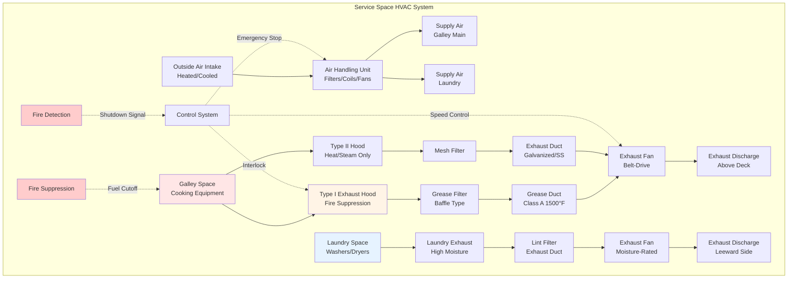

Морские камбузы и прачечные генерируют экстремальные нагрузки по теплу, влажности и загрязнениям в замкнутых пространствах, при этом создавая значительные угрозы противопожарной безопасности. Эти служебные помещения требуют специализированного проектирования HVAC для обеспечения безопасных условий работы, предотвращения распространения запахов и соответствия требованиям SOLAS, USCG и классификационных обществ.

## Характеристики тепловых нагрузок служебных помещений

Камбузы представляют наибольшую концентрацию явного и скрытого теплопроизводства на большинстве судов, при этом кухонное оборудование генерирует 8,8-29,3 кВт теплоты на единицу. Прачечные производят значительные нагрузки по влажности от операций стирки и сушки, с увеличением теплоты от оборудования и процессного пара.

### Расчет тепловой нагрузки камбуза

Общая тепловая нагрузка камбуза объединяет нагрузки оборудования, освещения, присутствия людей и вентиляционного воздуха:

$$Q_{total} = Q_{appliance} + Q_{lights} + Q_{occupancy} + Q_{ventilation}$$

$$Q_{appliance} = \sum_{i=1}^{n} (P_i \times U_i \times F_i \times R_i)$$

где $P_i$ = номинальная мощность оборудования (кВт), $U_i$ = коэффициент использования (0,3-0,7 для кухонного оборудования), $F_i$ = коэффициент излучения (0,3-0,5 в зависимости от захвата вытяжкой), $R_i$ = коэффициент номинальной нагрузки (обычно 0,8-1,0).

Коэффициент явного тепла в камбузах составляет 0,65-0,75, скрытое тепло поступает от процессов приготовления, мытья посуды и деятельности персонала.

### Расчет нагрузки прачечной

Пространства прачечной испытывают высокие скрытые нагрузки от паровых прессов, сушилок и обработки влажных тканей:

$$Q_{latent,laundry} = m_{evap} \times h_{fg}$$

где $m_{evap}$ = скорость испарения влаги (кг/ч), $h_{fg}$ = скрытая теплота парообразования (2257 кДж/кг при атмосферном давлении).

Для барабанных сушилок примерная скрытая нагрузка:

$$Q_{latent,dryer} = \frac{W_{fabric} \times M_{content}}{t_{dry}} \times h_{fg}$$

где $W_{fabric}$ = масса ткани (кг/загрузка), $M_{content}$ = влажность (обычно 0,5-0,7 кг воды/кг сухой ткани), $t_{dry}$ = время сушки (часы).

## Требования к вентиляции

Нормы вентиляции морских служебных помещений превышают типичные коммерческие стандарты из-за ограничений пространства, плотности оборудования и нормативных требований.

| Тип помещения | Воздухообмены/час | Мин. CFM (м³/ч)/м² | Подача воздуха | Вытяжка |
|------------|------------------|-----------------|------------|---------|
| Основной камбуз | 30-40 ACH | 2,0-3,0 (10,8-16,1) | Требуется | Требуется |
| Камбуз/Мытье посуды | 40-50 ACH | 2,5-4,0 (13,5-21,5) | Требуется | Требуется |
| Пекарня | 25-35 ACH | 1,5-2,5 (8,1-13,5) | Требуется | Требуется |
| Прачечная (стирка) | 30-40 ACH | 2,0-3,0 (10,8-16,1) | Требуется | Требуется |
| Прачечная (сушка/прессование) | 40-60 ACH | 3,0-5,0 (16,1-26,9) | Требуется | Требуется |
| Складские помещения | 8-12 ACH | 0,5-1,0 (2,7-5,4) | Требуется | Опционально |
| Холодильные камеры | 2-4 ACH | - | Опционально | Опционально |

Нормативные требования USCG (46 CFR 62.35) требуют механической вентиляции во всех машинных и служебных помещениях с минимальными нормами, различающимися по классификации.

## Проектирование вытяжной вентиляции

Вентиляционные вытяжки камбуза должны захватывать кулинарные выбросы, минимизируя помехи для систем пожаротушения на борту. SOLAS требует вытяжек типа I над оборудованием, выделяющим жиры, с встроенными системами пожаротушения.

Расход вытяжного воздуха:

$$Q_{hood} = V_{capture} \times A_{hood} \times 60$$

где $V_{capture}$ = скорость захвата (0,51-0,76 м/с для подвесной вытяжки, 0,76-1,02 м/с для островных вытяжек), $A_{hood}$ = площадь лица вытяжки (м²).

Для приложений с жирным паром минимальная норма вытяжки 2286 CFM (3880 м³/ч) на линейный метр длины вытяжки для настенных вытяжек, 3432 CFM (5821 м³/ч)/м для конфигураций островных вытяжек.

### Требования к подаче компенсирующего воздуха

Подаваемый воздух должен составлять 80-90% вытяжки для поддержания небольшого отрицательного давления (-5-12 Па) и предотвращения распространения запахов в жилые помещения. Подаваемый воздух должен быть темперирован в пределах 5,6-8,3°C от температуры камбуза, чтобы избежать термического дискомфорта.

## Контроль запахов и загрязнений

Системы вентиляции служебных помещений применяют множество стратегий для предотвращения передачи запахов:

- Выделенные системы вытяжки с выбросом выше воздухозаборников жилых помещений
- Дифференциал отрицательного давления (-5-24 Па относительно коридоров)
- Угольная фильтрация или электростатическое осаждение для операций с интенсивными запахами
- Прямой выход вытяжки камбуза через палубу, минимизирующий горизонтальные воздуховоды
- Отделение вестибюля или воздушная завеса у входов камбуза

Точки выброса вытяжки должны соответствовать нормативному документу SOLAS II-2/4.2, требующему выброса от воздухозаборников и жилых помещений с минимальными расстояниями разделения в зависимости от типа судна.

## Интеграция противопожарной безопасности

Системы HVAC морских камбузов интегрируются с системами противопожарной безопасности согласно Кодексу SOLAS Глава II-2:

1. **Автоматические противопожарные заслонки** на граничных проходах камбуза (разделы типа A-60 или A-30)
2. **Системы пожаротушения, установленные на вытяжке** (мокрохимические или CO₂) с автоматическим перекрытием топлива
3. **Выключение вентиляции** через управляемые с мостика аварийные остановки
4. **Противопожарная защита жирового канала** - каналы типа A с рейтингом 816°C
5. **Панели доступа к воздуховодам** для контроля и очистки с максимальным интервалом 3,7 м

## Соображения при проектировании системы

### Выбор оборудования

- **Коррозионностойкая конструкция**: Нержавеющая сталь типа 304/316 для условий соленой атмосферы
- **Вытяжные вентиляторы с жировым рейтингом**: Искробезопасные, высокотемпературные (148-204°C непрерывно)
- **Виброизоляция**: Критична для судовой установки для предотвращения структурной передачи
- **Доступные фильтры**: Съемные рашпиль-фильтры для жира, сетчатые фильтры для вытяжек типа II
- **Защищенный выброс**: Защищенные окончания для вытяжки выше палубы

### Маршрутизация воздуховодов

Выхлопные воздуховоды камбуза и прачечной следуют по выделенным путям:

- Минимум 18-калиберная оцинкованная или нержавеющая сталь
- Жировые каналы: минимум 16-калибр, сварные соединения, рейтинг 816°C
- Наклон к точкам сбора (минимум 0,63 см на 30 см)
- Избегать горизонтальных пролетов, превышающих 3 м без доступа для очистки
- Проходы через противопожарные разделы требуют одобренных заслонок и уплотнений

### Оптимизация производительности

Системы переменного объема вытяжки модулируют вытяжку вентиляции в зависимости от активности готовки, снижая энергопотребление в периоды низкого использования при сохранении кодовых минимумов. Синхронизированный объем подаваемого воздуха отслеживает изменения вытяжки, сохраняя отношения давления в помещении.

## Контроль и техническое обслуживание

SOLAS предписывает квартальный контроль систем вентиляции камбуза с документированной очисткой компонентов, содержащих жиры. Классификационные общества требуют ежегодную проверку посредством освидетельствования работы противопожарных заслонок, производительности вытяжного вентилятора и целостности воздуховода.

Накопление жира представляет основную опасность пожара - максимум 25% уменьшение площади воздуховода перед обязательной очисткой. Ультразвуковое измерение толщины обнаруживает коррозию в выхлопных воздуховодах, подвергшихся воздействию морской атмосферы и высокотемпературных кулинарных выбросов.

Системы HVAC для морских камбузов и прачечных балансируют экстремальные требования нагрузок с строгими требованиями безопасности в пространстве с ограниченным объемом. Надлежащее проектирование обеспечивает безопасность экипажа, предотвращает загрязнение жилого помещения и поддерживает нормативное соответствие во всех условиях работы судна.
