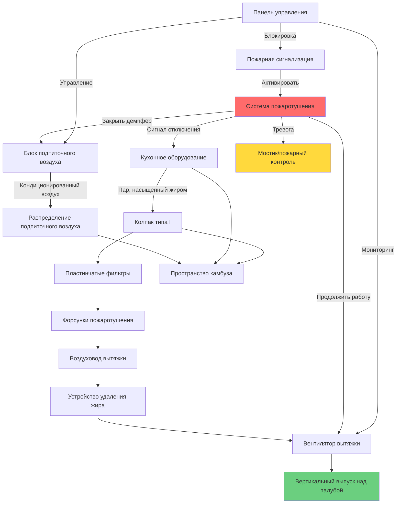

## Обзор

Судовые коммерческие кухни создают уникальные проблемы HVAC, сочетающие строгие требования безопасности пожара, ограниченное пространство, учёт движения судна и необходимость удаления паров, насыщенных жиром, в ограниченной среде. Системы HVAC камбузов судов должны поддерживать безопасное качество воздуха при управлении высокими тепловыми нагрузками от кухонного оборудования, интеграции с системами пожаротушения и надёжной работе в суровых морских условиях.

## Проектирование вытяжных колпаков

### Типы колпаков и применение

Судовые камбузы используют специализированные вытяжные колпаки, разработанные для судовых установок:

**Колпаки типа I (удаление жира)**
- Требуются для всего оборудования, производящего жир
- Конструкция минимум 24-калибра из нержавеющей стали 316 морского класса
- Сварные швы с герметичной конструкцией
- Интегральные жировые желоба с минимальным уклоном 3%
- Сертификация UL 710 для морского применения

**Колпаки типа II (тепло и пар)**
- Используются для оборудования, не производящего жир
- Паровые котлы, посудомоечные машины, печи
- Допустима более лёгкая конструкция
- Требуется сбор конденсата

### Скорости выпуска вытяжки

Расходы вытяжного воздуха зависят от типа оборудования, стиля приготовления и конфигурации колпака:

| Тип оборудования | Расход вытяжки (м³/ч/м²) | Типовая работа |
|---|---|---|
| Тяжёлые угольные гриль-печи | 4000-5000 | Непрерывный высокотемпературный режим |
| Среднемощные плиты | 3000-4000 | Стандартное приготовление |
| Лёгкие печи | 2000-3000 | Хлебопекарное производство |
| Фритюрницы | 3000-4000 | Глубокое жарение |
| Пароварки | 2500-3500 | Скороварочное приготовление |
| Гридили | 2000-3000 | Плоское жарение |
| Станции вока | 5000-6000 | Высокотемпературное обжаривание с перемешиванием |

### Расчёт выпуска вытяжки

Общее требование по вытяжке объединяет удаление конвективного тепла и скорость захвата:

$$Q_{total} = Q_{convective} + Q_{capture}$$

Где удаление конвективного тепла:

$$Q_{convective} = \frac{q_{sensible}}{1.08 \times \Delta T}$$

$$q_{sensible} = \text{Тепловыпуск оборудования (кДж/ч)}$$
$$\Delta T = \text{Повышение температуры через колпак (°C), обычно 28-56°C}$$

Требование скорости захвата:

$$Q_{capture} = A_{face} \times V_{capture}$$

$$A_{face} = \text{Площадь лица колпака (м²)}$$
$$V_{capture} = \text{Скорость захвата (м/с), обычно 0.5-0.75 м/с для настенного козырька}$$

Для судовых установок с движением судна увеличьте вытяжку на 15-20%:

$$Q_{marine} = Q_{total} \times 1.15$$

## Системы фильтрации жира

### Пластинчатые фильтры

Морские пластинчатые фильтры обеспечивают первичное удаление жира:

**Требования производительности**
- Минимальная эффективность удаления жира 70%
- Сертификация UL 1046
- Конструкция из нержавеющей стали 304 или 316
- Съёмные для очистки
- Номинальная толщина 51 мм

**Перепад давления**
$$\Delta P_{filter} = K_{filter} \times \left(\frac{V_{face}}{1000}\right)^{1.8}$$

$$K_{filter} = \text{Коэффициент фильтра, обычно 0.8-1.2 для пластинчатых фильтров}$$
$$V_{face} = \text{Скорость потока через фильтр (м/с), обычно 1.75-2.0 м/с}$$

### Высокоэффективное удаление жира

Передовые системы фильтрации для военных кораблей и пассажирских судов:

- Многоступенчатая фильтрация, достигающая 90-95% удаления
- Системы промывки водой с автоматической очисткой
- Электростатические осадители (ESP) для критических применений
- Уменьшенное накопление жира в воздуховодах
- Продлённые интервалы очистки

## Интеграция систем пожаротушения

### Координация систем

Пожаротушение морского камбуза интегрируется с элементами управления HVAC согласно NFPA 96 и нормативам IMO:

**Предварительно спроектированные системы мокрого тушения химикатами**
- Ansul R-102, Kidde или эквивалент
- Автоматическая активация через плавкие вставки
- Ручные точки приведения в действие у выходов
- Защита капюшона, воздуховода и оборудования

**Последовательность блокировки HVAC**
1. Пожарная сигнализация активирует пожаротушение
2. Вентилятор вытяжки продолжает работу
3. Демпфер подпиточного воздуха закрывается немедленно
4. Отключение газо/электроснабжения
5. Уведомление на мостик

### Защита воздуховода от огня

Вытяжные воздуховоды требуют непрерывной защиты от огня:

- Полностью сварная нержавеющая сталь 304 16-калибра минимум
- Сертифицирована для обслуживания жирных воздуховодов
- Панели доступа каждые 3.6 м максимум
- Минимальный уклон 6 мм на 0.3 м в сторону колпака
- Без горизонтальных участков, превышающих 75% длины воздуховода
- Форсунки пожаротушения в воздуховоде (если участок превышает 3.6 м)

## Системы подпиточного воздуха

### Требования проектирования

Подпиточный воздух заменяет вытяжку, поддерживая комфорт в камбузе:

**Балансировка расхода**
$$Q_{MA} = Q_{exhaust} - Q_{transfer}$$

$$Q_{MA} = \text{Требуемый подпиточный воздух (м³/ч)}$$
$$Q_{exhaust} = \text{Общая вытяжка колпака (м³/ч)}$$
$$Q_{transfer} = \text{Воздух из соседних пространств (м³/ч), обычно 10-15% вытяжки}$$

**Управление отрицательным давлением**

Поддерживайте лёгкое отрицательное давление для предотвращения миграции жира:

$$\Delta P_{galley} = -2.5 \text{ до } -7.5 \text{ Па}$$

### Кондиционирование подпиточного воздуха

Судовые блоки подпиточного воздуха обеспечивают кондиционированный фильтрованный воздух:

**Теплопроизводительность отопления**

$$q_{heating} = 1.08 \times Q_{MA} \times (T_{supply} - T_{outdoor})$$

Зимний расчёт: нагрев до минимума 15-18°C

**Холодопроизводительность**

$$q_{cooling} = 1.08 \times Q_{MA} \times (T_{outdoor} - T_{supply}) + (0.68 \times Q_{MA} \times \Delta W)$$

$$\Delta W = \text{Разница в соотношении влажности (г/г)}$$

Летний расчёт: охлаждение до максимума 21-24°C

### Методы распределения

| Метод | Применение | Преимущества | Ограничения |
|---|---|---|---|
| Потолочные диффузоры | Малые камбузы | Простая установка | Плохое удаление тепла |
| Боковое вытеснение | Средние камбузы | Хорошее перемешивание | Требования по пространству |
| Интегрированная подача колпака | Все размеры | Прямая замена | Более высокая первоначальная стоимость |
| Периметровый плинтус | Холодный климат | Обогрев пола | Ограниченная производительность |

## Расчёты тепловой нагрузки

Общая тепловая нагрузка камбуза включает излучение оборудования, конвекцию и освещение:

$$q_{total} = q_{appliances} \times F_{usage} \times F_{radiation} + q_{lighting} + q_{envelope}$$

**Тепловой прирост оборудования**

$$q_{appliances} = \sum (\text{Номинальная мощность} \times F_{usage} \times F_{radiation})$$

| Тип оборудования | Коэффициент использования | Коэффициент излучения |
|---|---|---|
| Плиты | 0.30-0.40 | 0.35-0.45 |
| Печи | 0.50-0.70 | 0.15-0.25 |
| Фритюрницы | 0.70-0.85 | 0.30-0.40 |
| Гридили | 0.60-0.75 | 0.25-0.35 |
| Угольные гриль-печи | 0.70-0.85 | 0.40-0.50 |
| Паровые котлы | 0.60-0.80 | 0.15-0.25 |

Оборудование под колпаком, захватываемое вытяжкой, снижает нагрузку охлаждения пространства на 60-80%.

## Морские специальные требования

### Движение судна

Положения проектирования для крена и дифферента судна:

- Увеличенная скорость захвата (добавьте 15-20%)
- Более глубокие выступы колпака (минимум 30 см)
- Положительный уклон жирового дренажа во всех ориентациях
- Гибкие соединения воздуховодов на оборудовании
- Виброизоляция всего вращающегося оборудования

### Ограничения по пространству

Максимизируйте эффективность на ограниченной площади:

- Компактные блоки подпиточного воздуха с интегрированным отоплением/охлаждением
- Вертикальная прокладка воздуховодов для минимизации горизонтальных участков
- Комбинированные узлы колпака/подпиточного воздуха
- Высокоэффективное удаление жира для уменьшения размера воздуховода

### Защита от коррозии

Морская среда требует улучшенных материалов:

- Нержавеющая сталь 316 для всех компонентов вытяжки
- Пассивация сварных швов
- Защитные покрытия на конструктивных опорах
- Жертвенные аноды на вентиляторах в условиях соляного воздуха

## Стандарты и нормативы

**NFPA 96**: Стандарт вентиляции, управления и защиты от огня в коммерческих кухнях
- Требования к проектированию и установке колпака
- Конструкция воздуховода и зазоры
- Интеграция системы пожаротушения
- Протоколы очистки и обслуживания

**IMO SOLAS Глава II-2**: Безопасность от огня на пассажирских и грузовых судах
- Вентиляция камбуза и защита от огня
- Требования отключения топлива
- Системы пожарной сигнализации и обнаружения

**Требования ABS/DNV**: Стандарты классификационного общества
- Спецификации материалов
- Конструктивная поддержка и вибрация
- Системы аварийного отключения

**Справочник ASHRAE**: Глава судов
- Условия и тепловые нагрузки проектирования
- Нормы вентиляции и распределение воздуха

## Обслуживание и эксплуатация

### График очистки фильтров

| Тип фильтра | Частота очистки | Метод |
|---|---|---|
| Пластинчатые фильтры | Ежедневно | Посудомоечная машина или щелочное замачивание |
| Сетчатые фильтры | Каждую смену | Горячая вода с моющим средством |
| Коллекторы ESP | Еженедельно | Цикл автоматической промывки |

### Очистка жирового воздуховода

Профессиональная очистка требуется согласно NFPA 96:

- Высокообъёмные операции: ежемесячно до ежеквартально
- Средний объём: ежеквартально до дважды в год
- Низкий объём: дважды в год до ежегодно
- Требуется осмотр и документирование
- Доступ через очистные люки

### Тестирование пожаротушения

Полугодовой осмотр и тестирование:
- Замена плавких вставок
- Осмотр и очистка форсунок
- Работа ручных точек приведения в действие
- Проверка давления в системе
- Тест функции блокировки HVAC

## Лучшие практики эксплуатации

**Последовательность запуска**
1. Проверьте, что система пожаротушения активирована
2. Запустите вентилятор вытяжки и проверьте расход воздуха
3. Активируйте систему подпиточного воздуха
4. Подтвердите отрицательное давление в камбузе
5. Включите кухонное оборудование

**Энергосбережение**
- Переменная скорость вытяжки в зависимости от кулинарной активности
- Управляемая вентиляция с оптическими датчиками
- Рекуперация тепла из выпускного воздуха (подогрев воды)
- Ночное снижение при закрытии камбуза

**Протоколы безопасности**
- Ежедневный визуальный осмотр фильтров и воздуховодов
- Еженедельная проверка системы пожаротушения
- Ежемесячная проверка расхода воздуха
- Ежеквартальный комплексный осмотр
- Ежегодная профессиональная очистка воздуховодов

---

*Системы HVAC камбузов судов требуют специализированного проектирования, обеспечивающего безопасность пожара, контроль жира и морские экологические факторы, при этом поддерживая комфорт экипажа и операционную эффективность в требовательных судовых условиях.*
