## Обзор

Районы мытья посуды в морских камбузах представляют экстремальные задачи для HVAC из-за интенсивной генерации влаги, производства пара и строгих санитарных требований в ограниченном пространстве. Коммерческие посудомойки, работающие непрерывно в морских камбузах, выделяют значительное количество влаги и тепла, которые должны быть эффективно захвачены и удалены для предотвращения ущерба от конденсации, поддержания санитарных условий и обеспечения комфорта экипажа.

Замкнутый характер морских пространств усугубляет эти задачи. Недостаточная вентиляция приводит к конденсации на потолочных поверхностях, переборках и электрооборудовании, создавая риск коррозии и антисанитарных условий. Надлежащее проектирование HVAC должно учитывать циклический характер работы посудомоек, ограничения по пространству и необходимость подачи воздуха в среду, где наружный воздух должен быть кондиционирован.

## Тепловые нагрузки и нагрузки по влаге посудомойки

Коммерческие посудомойки в морских камбузах производят значительные явные и скрытые тепловые нагрузки во время работы. Общая выделяемая тепловая нагрузка зависит от типа посудомойки, ее производительности и частоты циклов.

### Расчет нагрузки

Полная тепловая нагрузка посудомойки состоит из явной и скрытой компонентов:

$$Q_{total} = Q_{sensible} + Q_{latent}$$

Где явное тепло от корпуса посудомойки и нагретой воды:

$$Q_{sensible} = \dot{m}_{water} \cdot c_p \cdot \Delta T \cdot \eta_{loss} + Q_{enclosure}$$

Скрытое тепло от испарения влаги и выделения пара:

$$Q_{latent} = \dot{m}_{evap} \cdot h_{fg}$$

Для типичной проходной посудомойки скорость испарения во время работы можно оценить как:

$$\dot{m}_{evap} = 0.15 \text{ to } 0.30 \text{ кг/ч на единицу производительности корзины}$$

Полная нагрузка вытяжного кожуха с учетом коэффициента запаса:

$$Q_{hood} = (Q_{sensible} + Q_{latent}) \cdot SF$$

Где SF = 1.25–1.50 (коэффициент запаса, учитывающий открытие дверей и пиковые нагрузки).

### Типичные скорости генерации тепла

| Тип посудомойки | Явное тепло (кВ) | Скрытое тепло (кВ) | Полное тепло (кВ) | Выделение влаги (кг/ч) |
|-----------------|------------------|-------------------|------------------|----------------------|
| Дверная (одиночный бак) | 2.5 - 4.0 | 8.0 - 12.0 | 10.5 - 16.0 | 12 - 18 |
| Конвейерная (проходная) | 8.0 - 15.0 | 25.0 - 40.0 | 33.0 - 55.0 | 36 - 60 |
| Встраиваемая | 1.5 - 2.5 | 4.0 - 7.0 | 5.5 - 9.5 | 6 - 11 |
| Мойка кастрюль/сковород | 3.5 - 6.0 | 10.0 - 18.0 | 13.5 - 24.0 | 15 - 27 |

## Конструкция вытяжного кожуха

Вытяжные кожухи морской посудомойки должны захватывать весь пар и влагу перед их поступлением в пространство камбуза. В отличие от кухонных кожухов, кожухи посудомоек имеют дело в основном со струями пара, а не с тепловыми струями, содержащими жир.

### Требования к расходу воздуха вытяжного кожуха

Скорость выпускного воздуха на основе площади кожуха:

$$Q_{exhaust} = A_{hood} \cdot v_{capture} \cdot K_{adjustment}$$

Где:
- $A_{hood}$ = площадь лицевой части кожуха (м²)
- $v_{capture}$ = скорость захвата (0.25 - 0.40 м/с для посудомоек)
- $K_{adjustment}$ = коэффициент коррекции перекрестной тяги (1.2 - 1.5)

Для конденсирующих кожухов (рекомендуется для морского применения):

$$Q_{condensing} = 0.6 \cdot Q_{standard}$$

Конденсирующие кожухи снижают требования к выпуску на 30-40% благодаря внутренним охлаждающим змеевикам, которые конденсируют пар до того, как он достигнет системы выпуска.

### Конфигурация кожуха

Вытяжные кожухи морской посудомойки обычно используют:

**Кожухи Type I Condensing (конденсирующие):**
- Внутренние охлаждающие змеевики с холодной водой 4-7°C
- Система сбора конденсата с непрямым сливом
- Пониженный расход выпускного воздуха (150-250 м³/ч на погонный метр)
- Конструкция из нержавеющей стали (304 или 316)

**Кожухи Type II Standard (стандартные):**
- Большие скорости выпуска (300-400 м³/ч на погонный метр)
- Фильтрация жира не требуется (только влага)
- Требует больших размеров воздуховодов и емкости вентилятора

## Проектирование системы вентиляции

```mermaid
graph TB
    subgraph "Вентиляция района мытья посуды"
        DW[Коммерческая посудомойка<br/>Генерация пара<br/>12-60 кг/ч влаги]

        HOOD[Конденсирующий вытяжной кожух<br/>Type I морской класс<br/>Нержавеющая сталь 316]

        COIL[Система охлаждающего змеевика<br/>Холодная вода 4-7°C<br/>Конденсация]

        DRAIN[Слив конденсата<br/>Непрямое соединение<br/>Требуется воздушный зазор]

        EF[Вытяжной вентилятор<br/>Коррозионностойкий<br/>Переменная скорость]

        DUCT[Вытяжной воздуховод<br/>Наклон для дренажа<br/>Изолированный]

        DISCH[Выпуск наружу<br/>Выше ватерлинии<br/>Защита от дождя]

        MA[Система подачи воздуха<br/>Фильтрованный и кондиционированный<br/>Легкое избыточное давление]

        DIST[Распределяющие диффузоры<br/>Низкая скорость на потолке<br/>Направлены от кожуха]

        CTRL[BAS управление<br/>Интеграция с<br/>Работой посудомойки]
    end

    DW -->|Струя пара| HOOD
    HOOD -->|Внутренний| COIL
    COIL -->|Конденсат| DRAIN
    HOOD -->|Выпускной воздух| EF
    EF -->|Воздух с влагой| DUCT
    DUCT -->|За борт| DISCH

    MA -->|Кондиционированный воздух| DIST
    DIST -->|Замещающий воздух| DW

    CTRL -.->|Контроль| EF
    CTRL -.->|Контроль| MA
    CTRL -.->|Интеграция| DW

    style DW fill:#ffcccc
    style HOOD fill:#cce5ff
    style COIL fill:#b3d9ff
    style EF fill:#99ccff
    style MA fill:#ffffcc
    style CTRL fill:#ccffcc
```

## Требования к подаче воздуха (Makeup air)

Выпуск из вытяжных кожухов посудомоек должен быть компенсирован кондиционированным воздухом подачи для предотвращения избыточного разрежения в пространстве камбуза. Чрезмерное разрежение вызывает:

- Затруднение при открытии дверей
- Поступление некондиционированного воздуха из смежных пространств
- Обратный поток из систем сгорания (если имеются)
- Сниженную эффективность системы выпуска

### Расчет подающего воздуха

Для сбалансированной работы:

$$Q_{makeup} = Q_{exhaust} - Q_{transfer}$$

Где $Q_{transfer}$ представляет допустимый воздухообмен из смежных областей камбуза (обычно 20-30% выпуска).

Подающий воздух должен:
- Быть отфильтрован (минимум MERV 8)
- Кондиционирован в пределах 5°C температуры помещения
- Поступать с низкой скоростью (< 0.50 м/с на выходе)
- Направляться в сторону от зоны захвата вытяжного кожуха

Морские приложения требуют 100% наружного воздуха подачи (без рециркуляции) для поддержания санитарных стандартов согласно NSF/ANSI 37.

## Предотвращение конденсации

Контроль конденсации критичен в районах мытья посуды морских камбузов из-за холодных металлических поверхностей (корпус, конструктивные элементы) и высокого содержания влаги.

### Стратегии предотвращения

**Изоляция системы выпуска:**

Требуемое тепловое сопротивление для выпускного воздуховода:

$$R_{insulation} \geq \frac{T_{duct} - T_{dewpoint}}{U_{max} \cdot (T_{duct} - T_{ambient})}$$

Минимальная изоляция: 50 мм стекловолокна (R-2.1 м²·K/W) с паронепроницаемой оболочкой.

**Наклон воздуховода:**

Все горизонтальные выпускные воздуховоды должны иметь уклон к сливам конденсата:

$$slope = \frac{1}{96} \text{ to } \frac{1}{48}$$

(минимум 1-2% уклон)

**Управление температурой поверхности:**

Поддержание всех открытых поверхностей выше температуры точки росы:

$$T_{surface} > T_{dewpoint} + 3°C$$

Это обычно требует:
- Температура в помещении: 22-24°C
- Относительная влажность: < 60%
- Непрерывное движение воздуха по поверхностям

## Санитарные требования

Районы мытья посуды в морских камбузах должны соответствовать строгим санитарным стандартам, установленным нормативами флага, USPH (Служба общественного здоровья США) и руководящими принципами ИМО.

### Стандарты вентиляции

| Параметр | Требование | Стандарт |
|----------|-----------|----------|
| Минимальная скорость вентиляции | 30 ACH во время работы | NSF/ANSI 37 |
| Эффективность захвата выпуска | ≥ 95% захват пара | Общество морской классификации |
| Качество подающего воздуха | Минимум MERV 8 фильтрация | IMO Resolution A.468(XII) |
| Давление в помещении | -2.5 to -7.5 Pa vs. соседние | USPH Vessel Sanitation Program |
| Выпуск выхлопа | > 3 м от воздухозаборников | IMO MARPOL Annex VI |

### Требования к материалам

Все компоненты HVAC в районах мытья посуды должны использовать коррозионностойкие материалы:

- **Воздуховоды:** нержавеющая сталь 316L (предпочтительна) или 304 SS с морскими покрытиями
- **Кожухи:** 316 SS, минимум 16 калибр (1.5 мм)
- **Вентиляторы:** конструкция, устойчивая к искрам, герметичные подшипники
- **Заслонки:** лезвия и рамы из нержавеющей стали
- **Крепежи:** 316 SS или Монель (без углеродистой стали)

### Системы дренажа

Дренаж конденсата должен обеспечивать воздушный зазор:

$$h_{gap} \geq 2 \times D_{drain}$$

Где $D_{drain}$ — диаметр дренажной трубы, с минимальным зазором 50 мм.

Непрямые дренажные соединения предотвращают обратный поток из дренажных систем в оборудование HVAC, поддерживая санитарные требования.

## Управление и интеграция

Современные системы вентиляции морской посудомойки интегрируются с системами автоматизации зданий (BAS) для эффективности и безопасности.

### Последовательности управления

**Последовательность работы посудомойки:**

1. Сигнал запуска посудомойки → Вытяжной вентилятор включается на полную мощность
2. Задержка 30 секунд → Вентилятор подачи воздуха запускается (предотвращает чрезмерное разрежение)
3. Во время работы → Вытяжной вентилятор поддерживает постоянный расход воздуха
4. Сигнал остановки посудомойки → 5-минутный наддув выпуска (очистка остаточной влаги)
5. Выпуск останавливается → Подающий воздух снижается до минимальной вентиляции

**Управление выпуском переменной мощностью:**

Для установок с несколькими посудомойками:

$$Q_{exhaust,total} = \sum_{i=1}^{n} (Q_{i} \cdot status_i)$$

Где $status_i$ = 1 (работает) или 0 (отключено) для каждой посудомойки.

Выпускные вентиляторы с частотным приводом (VFD) модулируют в зависимости от фактического спроса, снижая потребление энергии на 40-60% по сравнению с системами постоянного объема.

### Блокировки безопасности

Критические блокировки для морской безопасности:

- Отказ вытяжного вентилятора → Работа посудомойки предотвращена
- Чрезмерное разрежение (< -12.5 Pa) → Увеличение подающего воздуха
- Обнаружение пожара → Остановка системы выпуска, закрытие заслонок
- Переполнение конденсата → Остановка оборудования, аварийный сигнал

## Проверка производительности

После установки системы вентиляции морской посудомойки требуют испытания и регулировки для проверки производительности.

### Процедуры испытания

**Тест эффективности захвата:**

Визуальный дымовой тест во время пиковой работы посудомойки. Критерии приемки: ≥ 95% видимого пара захвачено кожухом без утечек в пространство камбуза.

**Проверка расхода воздуха:**

$$Q_{measured} = V_{duct} \cdot A_{duct} \cdot K_{correction}$$

Измерения во всех точках доступа с помощью питоттрубки или теплового анемометра.

**Проверка перепада давления:**

Давление в помещении относительно смежных областей:

- Камбуз к столовой: -5 Pa ± 2 Pa
- Район мытья посуды к камбузу: -2.5 Pa ± 1.5 Pa

## Меры энергетической эффективности

Морские суда требуют энергосберегающего проектирования HVAC из-за ограниченной мощности электрогенерации.

### Стратегии эффективности

| Стратегия | Экономия энергии | Реализация |
|-----------|-----------------|-----------|
| Технология конденсирующего кожуха | 30-40% снижение выпуска | Охлаждающие змеевики с холодной водой в кожухе |
| Вентиляция по требованию | 40-60% энергии вентилятора | Управление VFD, датчики работы |
| Рекуперация тепла из выпуска | 15-25% нагрева подающего воздуха | Контур с рекуперацией или пластинчатый теплообменник |
| Высокоэффективные посудомойки | 20-30% снижение полной нагрузки | Оборудование ENERGY STAR |
| Интегрированное управление | 10-20% энергии системы | Оптимизация BAS |

**Расчет рекуперации тепла:**

Рекуперируемое тепло из выпуска посудомойки:

$$Q_{recovery} = \dot{m}_{exhaust} \cdot c_p \cdot (T_{exhaust} - T_{ambient}) \cdot \eta_{HX}$$

Где $\eta_{HX}$ = 0.50 to 0.70 для типичных систем с контуром рекуперации.

Это восстановленное тепло предварительно нагревает подающий воздух во время холодного времени года, снижая нагрузку на отопление на 15-25%.

## Заключение

Системы HVAC для районов мытья посуды в морских камбузах требуют специализированного проектирования для решения экстремальных нагрузок по влаге, ограничений по пространству и строгих санитарных требований. Надлежащий выбор кожуха, достаточная емкость выпуска, эффективный контроль конденсации и интегрированные системы подачи воздуха необходимы для поддержания безопасных, санитарных и эффективных операций на борту судна. Технология конденсирующего кожуха в сочетании с управлением вентиляцией по требованию обеспечивает оптимальную производительность при минимизации потребления энергии в этом сложном приложении.
