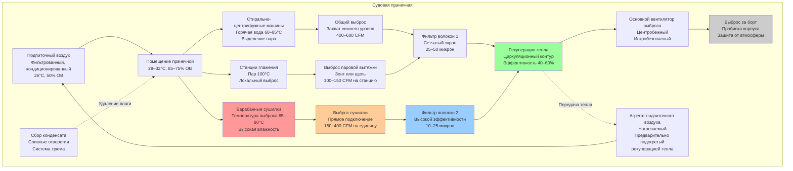

## Обзор

Судовые прачечные создают уникальные проблемы HVAC из-за экстремального выделения тепла и влаги в ограниченных пространствах. Судовые прачечные работают непрерывно с ограниченной емкостью вентиляции, требуя специализированных систем выброса, агрессивного контроля влажности и стратегий рекуперации тепла для поддержания приемлемых условий при минимизации энергопотребления.

Основные проблемы HVAC включают управление уровнями влажности, превышающими 70% ОВ, удаление воздуха выброса, содержащего волокна, рекуперацию явного и скрытого тепла, обеспечение достаточного подпиточного воздуха и предотвращение конденсации в соседних отсеках. Надлежащее проектирование вентиляции предотвращает рост плесени, защищает электронное оборудование и поддерживает комфорт экипажа в этих высоконагруженных пространствах.

## Расчеты тепловых и влажностных нагрузок

### Явное тепло от оборудования

Коммерческие стиральные машины и сушилки генерируют значительные нагрузки явного тепла, которые должны быть удалены через вентиляцию:

$$Q_s = \sum_{i=1}^{n} \left( P_i \times \eta_i \times f_u \right)$$

Где:
- $Q_s$ = Общее выделение явного тепла (Вт)
- $P_i$ = Номинальная мощность оборудования $i$ (Вт)
- $\eta_i$ = Эффективность выделения тепла (0,70–0,90 для стиральных машин, 0,40–0,60 для сушилок)
- $f_u$ = Коэффициент использования (0,60–0,85 для судовых прачечных)
- $n$ = Количество единиц оборудования

### Скорость генерации влаги

Стиральные машины и сушилки выделяют значительное количество влаги, которая должна быть выведена для предотвращения конденсации:

$$\dot{m}_w = \sum_{j=1}^{m} \left( C_j \times L_j \times E_j \times f_c \right)$$

Где:
- $\dot{m}_w$ = Общая скорость генерации влаги (кг/ч)
- $C_j$ = Вместимость машины (кг сухого белья)
- $L_j$ = Извлечение влаги за цикл (кг воды/кг сухого белья)
- $E_j$ = Эффективность испарения (0,85–0,95 для сушилок)
- $f_c$ = Частота цикла (циклов/ч)
- $m$ = Количество оборудования, генерирующего влагу

**Типичные значения извлечения влаги:**
- Стиральные машины: 0,5–0,8 кг воды/кг сухого белья (остаточная влага)
- Сушилки: 0,4–0,7 кг воды/кг сухого белья (испаряется в выброс)

### Требуемый расход воздуха выброса

Расход воздуха выброса должен удалять как явное тепло, так и скрытую влагу:

$$\dot{V}_{exh} = \max \left( \frac{Q_s}{\rho c_p \Delta T}, \frac{\dot{m}_w}{\rho (\omega_{exh} - \omega_{supply})} \right)$$

Где:
- $\dot{V}_{exh}$ = Требуемый расход воздуха выброса (м³/с)
- $\rho$ = Плотность воздуха (кг/м³)
- $c_p$ = Удельная теплоемкость воздуха (1,006 кДж/кг·К)
- $\Delta T$ = Разность температур между выбросом и подачей (К)
- $\omega_{exh}$ = Коэффициент влажности воздуха выброса (кг воды/кг сухого воздуха)
- $\omega_{supply}$ = Коэффициент влажности подпиточного воздуха (кг воды/кг сухого воздуха)

## Требования к выбросу по оборудованию

| Тип оборудования | Минимальный расход выброса | Тип подключения | Скорость в воздуховоде | Нагрузка волокон |
|------------------|---------------------------|-----------------|------------------------|------------------|
| Коммерческая сушилка (10 кг) | 150–200 CFM (250–340 м³/ч) | Прямое подключение | 1500–2500 fpm (7,6–12,7 м/с) | Высокая |
| Коммерческая сушилка (15 кг) | 225–300 CFM (380–510 м³/ч) | Прямое подключение | 1500–2500 fpm (7,6–12,7 м/с) | Высокая |
| Барабанная сушилка (20 кг) | 300–400 CFM (510–680 м³/ч) | Прямое подключение | 1500–2500 fpm (7,6–12,7 м/с) | Высокая |
| Стирально-центрифужная машина | 50–100 CFM (85–170 м³/ч) | Общий выброс | 1000–1500 fpm (5,1–7,6 м/с) | Средняя |
| Станция глажения | 100–150 CFM (170–255 м³/ч) | Вытяжной зонт | 800–1200 fpm (4,1–6,1 м/с) | Низкая |
| Площадь складывания белья | 1,5–2,0 ACH | Общий выброс | 600–1000 fpm (3,0–5,1 м/с) | Низкая |

**Примечания:**
- Прямое подключение обязательно для сушилок согласно NFPA 120
- Скорость в воздуховоде должна предотвращать осаждение волокон (минимум 1500 fpm для выброса сушилки)
- Только металлические воздуховоды; гибкие воздуховоды не допускаются для выброса сушилки

## Система вентиляции судовой прачечной

## Требования к фильтрации волокон

### Этапы фильтрации

**Первичное отделение волокон:**
- Сетчатые фильтры: захват 25–50 микрон
- Расположены непосредственно после выброса сушилки
- Конструкция с возможностью очистки и дверцами доступа
- Осмотр еженедельно, очистка по необходимости

**Вторичная фильтрация:**
- Фильтры волокон высокой эффективности: 10–25 микрон
- Предотвращает накопление волокон в устройствах рекуперации тепла
- Мониторинг перепада давления (замена при 37 Па)
- Критично для предотвращения пожарных рисков

**Характеристики фильтров для судового применения:**
- Коррозионностойкие материалы (нержавеющая сталь 316)
- Вибростойкое крепление
- Доступ без инструментов для очистки
- Мониторинг перепада давления с сигналом тревоги при 49 Па

### Конструкция системы удаления волокон

| Компонент системы | Требование к проектированию | Целевой результат |
|-------------------|---------------------------|-------------------|
| Первичный фильтр | Сетчатый экран, 25–50 микрон | Захват 70–85% волокон по массе |
| Вторичный фильтр | Мешок или картридж, 10–25 микрон | 90–95% оставшихся волокон |
| Скорость фильтрации | 200–400 fpm (1,0–2,0 м/с) | Минимизация перепада давления |
| Доступ для очистки | Без инструментов, откидной | Очистка <5 минут |
| Выключатель перепада давления | Сигнал тревоги при 37 Па | Предотвращение деградации системы |
| Конструкция воздуховода | Без горизонтальных участков, минимум 45° уклон | Предотвращение накопления волокон |

## Стратегии рекуперации тепла

### Системы циркуляционного контура

Системы рекуперации тепла циркуляционного контура эффективно восстанавливают 40–60% тепла выброса без перекрестного загрязнения:

$$\epsilon_{ral} = \frac{\dot{Q}_{recovered}}{\dot{Q}_{available}} = \frac{\dot{m}_{min} c_p (T_{exh,in} - T_{exh,out})}{\dot{m}_{min} c_p (T_{exh,in} - T_{supply,in})}$$

Где:
- $\epsilon_{ral}$ = Эффективность циркуляционного контура (0,40–0,60)
- $\dot{Q}_{recovered}$ = Скорость восстановленного тепла (Вт)
- $\dot{Q}_{available}$ = Доступное тепло выброса (Вт)
- $\dot{m}_{min}$ = Минимальный массовый расход (кг/с)
- $T_{exh,in}$ = Температура поступающего воздуха выброса (°C)
- $T_{exh,out}$ = Температура выходящего воздуха выброса (°C)
- $T_{supply,in}$ = Температура поступающего подпиточного воздуха (°C)

**Преимущества рекуперации тепла судовой прачечной:**
- Отсутствие перекрестного загрязнения между загруженным волокнами выбросом и чистой подачей
- Катушки могут быть расположены удаленно (подходит для ограничений отсеков судна)
- Раствор гликоля предотвращает замерзание (неактуально для морской среды, но обеспечивает защиту от коррозии)
- Возможна отдельная очистка катушек без остановки системы

### Результаты рекуперации тепла

| Условие выброса | Предварительный нагрев подачи | Восстановление энергии | Годовая экономия (Типичная) |
|-----------------|------------------------------|------------------------|----------------------------|
| 75°C, 80% ОВ | 15°C → 35°C | 45–55 кВт | 40 000–50 000 кВтч |
| 70°C, 75% ОВ | 20°C → 38°C | 38–48 кВт | 35 000–45 000 кВтч |
| 65°C, 70% ОВ | 22°C → 36°C | 32–42 кВт | 30 000–40 000 кВтч |

**Примечание:** Экономия рассчитана на 16 часов/день операции, 300 дней/год для судовой прачечной.

## Стратегии контроля влажности

### Удаление влаги на основе вентиляции

Поддерживайте влажность помещения прачечной ниже 75% ОВ через достаточный выброс:

$$RH_{space} = \frac{\omega_{space}}{\omega_{sat}(T_{space})} \times 100\%$$

**Целевые условия:**
- Помещение прачечной: 28–32°C, максимум 65–75% ОВ
- Смежные коридоры: 24–26°C, максимум 55–65% ОВ
- Дифференциал влажности: Поддерживайте отрицательное давление для предотвращения миграции

### Требования к осушению

Дополнительное осушение может потребоваться при:
- Работе прачечной >16 часов/день
- Внешних условиях, превышающих 30°C, 70% ОВ
- Ограниченном количестве подпиточного воздуха из-за емкости вентиляции судна

**Осушение десикантом:**
- Эффективно для выброса при высокой температуре и высокой влажности
- Может достичь снижения точки росы на 40–50°C
- Регенерационное тепло доступно от выброса сушилки

## Стандарты проектирования и ссылки

**Применимые судовые стандарты:**
- IMO SOLAS Глава II-2: Противопожарная безопасность, контроль волокон
- ANSI/ASHRAE 62.1: Вентиляция для приемлемого качества воздуха
- NFPA 120: Стандарт противопожарной защиты в угольных шахтах (применимы положения выброса сушилки)
- IEEE 45: Рекомендуемая практика для электрических установок на судах
- Правила классификационных обществ (ABS, DNV-GL, Lloyd's): Вентиляция и противопожарная безопасность

**Рекомендуемые расходы выброса:**
- Минимум 25 ACH для помещений прачечной (согласно правилам классификационного общества)
- Выброс сушилки согласно спецификациям производителя (типично 150–400 CFM на единицу)
- Общего выброса достаточно для поддержания <75% ОВ

**Соображения безопасности:**
- Все электрооборудование рассчитано на высокую влажность (минимум IP65)
- Фильтры волокон осматриваются и очищаются еженедельно
- Воздуховоды выброса сушилки осматриваются ежемесячно на предмет накопления волокон
- Противопожарные заслонки не допускаются в выбросе сушилки (согласно NFPA 120)
- Аварийный выброс вентиляции для условий пожара

## Предотвращение конденсации

### Критические контрольные меры

**Изоляция воздуховодов:**
- Все воздуховоды выброса: минимум 2" (50 мм) изоляции закрытого типа
- Паровой барьер необходим на всех холодных поверхностях
- Особое внимание к пробивкам корпуса

**Соотношения давления:**
- Помещение прачечной: –5 до –10 Па относительно коридоров
- Предотвращает миграцию влаги в жилые помещения
- Выброс на 10–15% больше подачи

**Управление температурой поверхности:**
- Все поверхности поддерживаются >5°C выше точки росы
- Изоляция трубопроводов холодной воды
- Осушение в помещениях оборудования

---

**Связанные темы:**
- [Камбуз и прачечная HVAC](../)
- [Коммерческая кухня](../commercial-kitchen/)
- [Зона мытья посуды](../dishwashing-area/)
- [Суда и морская HVAC](../../)
