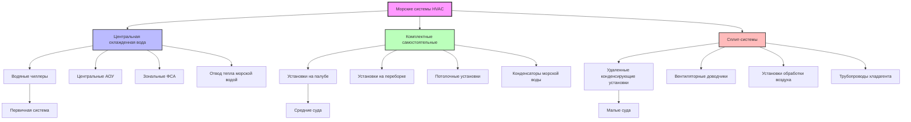

Морские системы HVAC сталкиваются с уникальными эксплуатационными проблемами, которые отличают их от наземных приложений. Ограничения пространства, напряжения, вызванные движением, коррозионная среда морской соли и переменное качество электроснабжения требуют специализированных архитектур систем и выбора компонентов.

## Уникальные морские вызовы

**Факторы окружающей среды:**
- Постоянное воздействие соленого воздуха, ускоряющего коррозию
- Экстремальные условия окружающей среды: -40°C до 54°C в зависимости от регионов эксплуатации
- Высокие уровни влажности (85-95% ОВ в тропических зонах)
- Качка судна, вызывающая вибрацию и ударные нагрузки
- Колебания температуры морской воды: -2°C (Арктика) до 35°C (Персидский залив)

**Операционные ограничения:**
- Ограниченное пространство и допуски по весу
- Ограничения генерации электроэнергии и вариации напряжения/частоты
- Требования непрерывной эксплуатации (24/7/365)
- Минимальный доступ к техническому обслуживанию во время рейсов
- Требования избыточности для критических помещений

**Нормативные требования:**
- Соответствие SOLAS (Международная конвенция по охране человеческой жизни на море)
- Правила классификационных обществ (ABS, DNV, Lloyd's Register)
- Экологические нормативы IMO
- Военные стандарты (MIL-STD) для военных судов

## Расчеты тепловых нагрузок морских систем HVAC

Общая тепловая нагрузка охлаждения для морских помещений учитывает компоненты передачи тепла, солнечного излучения, внутренних источников и вентиляции с морскими поправками:

$$Q_{total} = Q_{trans} + Q_{solar} + Q_{internal} + Q_{vent} + Q_{mech}$$

**Тепловая нагрузка передачи через корпус:**

$$Q_{trans} = U \cdot A \cdot (t_{sw} - t_{indoor}) \cdot F_{motion}$$

где:
- $U$ = общий коэффициент теплопередачи (кДж/ч·м²·°C)
- $A$ = площадь поверхности (м²)
- $t_{sw}$ = температура морской воды (°C)
- $t_{indoor}$ = расчетная температура в помещении (°C)
- $F_{motion}$ = коэффициент качки (1,1-1,15 для усиленной конвекции)

**Приток солнечного тепла (палуба и надстройка):**

$$Q_{solar} = A_{proj} \cdot SHGF \cdot SC \cdot CLF \cdot F_{reflect}$$

где:
- $A_{proj}$ = проектируемая площадь (м²)
- $SHGF$ = коэффициент прибыли солнечного тепла (кДж/ч·м²)
- $SC$ = коэффициент затемнения
- $CLF$ = коэффициент охлаждающей нагрузки
- $F_{reflect}$ = коэффициент отражения водой (1,15-1,25)

**Тепло механического оборудования:**

$$Q_{mech} = 2545 \cdot \eta \cdot kW_{installed} \cdot DF$$

где:
- $\eta$ = коэффициент полезного действия двигателя
- $kW_{installed}$ = установленная мощность
- $DF$ = коэффициент одновременности (0,6-0,8 для машинных отделений)

**Нагрузка вентиляции:**

$$Q_{vent} = 1.08 \cdot CFM \cdot \Delta T + 0.68 \cdot CFM \cdot \Delta W$$

Для минимального наружного воздуха в соответствии со стандартами ASHRAE 62.1 и SNAME T&R 3-42.

## Типы морских систем HVAC

## Сравнение архитектур систем

| Тип системы | Преимущества | Недостатки | Типовое применение |
|-------------|-----------|---------------|---------------------|
| **Центральная охлажденная вода** | Высокая эффективность, централизованное обслуживание, гибкое зонирование, низкий уровень шума в помещениях | Высокая начальная стоимость, сложный трубопровод, риск единой точки отказа | Крупные круизные суда, военные суда, морские платформы |
| **Комплектные самостоятельные** | Более низкая первоначальная стоимость, модульная избыточность, простой монтаж | Меньшая эффективность, распределенное обслуживание, требует больше места | Грузовые суда, паромы, суда среднего коммерческого тоннажа |
| **Сплит-системы** | Гибкая компоновка, умеренная стоимость, зональное управление | Ограничения трубопровода хладагента, несколько компрессоров | Малые суда, яхты, патрульные катера, буксиры |
| **Гибридные системы** | Оптимизированная эффективность, поэтапная избыточность | Сложное управление, выше требования к обслуживанию | Многоцелевые суда, научные суда |

## Критерии выбора системы

**Классификация судов по размеру:**

| Длина судна | Тоннаж | Рекомендуемая основная система | Резервная система |
|---------------|---------|---------------------------|---------------|
| < 30,5 м | < 500 GT | Сплит-системы | Портативные установки |
| 30,5-91,5 м | 500-5 000 GT | Комплектные установки | Сплит-системы |
| 91,5-183 м | 5 000-25 000 GT | Центральная охлажденная вода или комплектные | Комплектные установки |
| > 183 м | > 25 000 GT | Центральная охлажденная вода | Зональная охлажденная вода |

**Рассмотрение плотности нагрузки:**

$$\text{Плотность нагрузки} = \frac{Q_{total}}{V_{conditioned}} \quad (\text{кДж/ч·м}^3)$$

- **Низкая плотность** (< 176 кДж/ч·м³): Грузовые трюмы, хранилища → Естественная/механическая вентиляция
- **Средняя плотность** (176-529 кДж/ч·м³): Жилые помещения, офисы → Комплектные или охлажденная вода
- **Высокая плотность** (> 529 кДж/ч·м³): Камбузы, помещения управления двигателем → Центральная охлажденная вода с выделенными АОУ

## Выбор компонентов для морской эксплуатации

**Чиллеры:**
- Конденсаторы морской воды с трубками из медно-никелевого сплава (70/30 или 90/10)
- Титановые конденсаторы для расширенного срока службы при тяжелых условиях
- Центробежные чиллеры (> 353 кВт) или винтовые чиллеры (71-353 кВт)
- Минимум 2 чиллера для избыточности (конфигурация N+1)

**Оборудование обработки воздуха:**
- Морская конструкция: нержавеющая сталь 316 или эпоксидное покрытие алюминия
- Виброизоляция (прогиб 12,7-25,4 мм)
- Двигатели, защищенные от капель (NEMA Type 2) или полностью закрытые (NEMA Type 4)
- Поддоны конденсата с постоянным уклоном и замкнутыми сливами

**Воздуховоды:**
- Оцинкованная сталь с эпоксидным покрытием или нержавеющая сталь 316
- Сварные швы для гидравлической герметичности
- Максимальная скорость 12,7 м/с для снижения шума
- Противопожарные заслонки по SOLAS на границах зон

**Системы трубопроводов:**
- Медно-никелевый сплав (90/10) для службы морской воды
- Нержавеющая сталь Type 316 для охлажденной воды в коррозионной среде
- Устойчивые к расслоению латунные фитинги
- Изолирующие вентили каждые 2-3 отсека для контроля повреждений

## Интеграция охлаждения морской водой

Морские системы HVAC используют морскую воду в качестве среды отвода тепла, исключая необходимость в градирнях:

$$Q_{reject} = \dot{m}_{sw} \cdot c_{p} \cdot \Delta T_{sw}$$

где:
- $\dot{m}_{sw}$ = расход морской воды (кг/ч)
- $c_{p}$ = удельная теплоемкость морской воды ≈ 3,93 кДж/кг·°C
- $\Delta T_{sw}$ = повышение температуры (обычно 5,6-8,3°C)

**Проектирование системы морской воды:**
- Двойные насосы морской воды для избыточности
- Фильтры с автоматической промывкой
- Электролитическая или потенциостатическая катодная защита
- Контроль биообрастания: впрыск гипохлорита или материалы из медно-никелевого сплава

## Архитектура системы управления

Современная морская HVAC использует сетевое управление, интегрированное с системами управления судном:

- **Управление температурой зон**: точность уставки ±1,1°C
- **Последовательность запуска**: ступенчатое включение чиллеров по нагрузке (обычно 40%, 60%, 80%, 100%)
- **Ограничение спроса**: сброс нагрузки при пиковом электрическом спросе
- **Автоматическое переключение**: активация резервного оборудования при отказе
- **Удаленный мониторинг**: дисплеи состояния мостика/машинного отделения

**Стратегии энергоэффективности:**
- Преобразователи частоты на насосах охлажденной воды (экономия энергии 30-40%)
- Сброс температуры морской воды (снижение подъема чиллера при холодной морской воде)
- Вентиляция, управляемая спросом, с использованием датчиков CO₂
- Рекуперация тепла из рубашки двигателя и выхлопа

## Стандарты и ссылки

**Справочник приложений ASHRAE:**
- Глава 14: Торговые суда
- Условия проектирования и расчеты тепловых нагрузок, специфичные для морской среды

**Бюллетени SNAME T&R:**
- T&R 3-42: Системы распределения воздуха HVAC
- T&R 4-16: Проектирование морских установок HVAC

**Правила классификационных обществ:**
- Правила ABS для строительства и классификации стальных судов
- Правила DNV для классификации судов
- Правила и положения Lloyd's Register

**Военные стандарты:**
- MIL-STD-1623: Атмосферный контроль подводных лодок
- MIL-STD-167: Механические вибрации корабельного оборудования

Выбор морской системы HVAC требует балансировки эффективности, надежности, ограничений по пространству и затрат жизненного цикла в суровой морской среде. Правильная архитектура системы обеспечивает комфорт, долговечность оборудования и операционную безопасность на протяжении всего срока эксплуатации судна.
