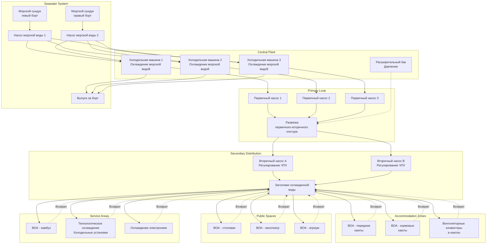

Центральные системы охлажденной воды представляют собой основной подход HVAC для больших коммерческих судов, круизных лайнеров и боевых кораблей. Эти системы используют централизованное холодильное оборудование с распределенной охлаждающей способностью через водную распределительную сеть. Морская среда требует специализированных решений, включая охлаждение морской водой, избыточность для непрерывного функционирования, компенсацию движения судна и оборудование, рассчитанное на удары, вибрацию и коррозионные условия.

## Конфигурация судовой установки охлаждения

Судовые установки охлажденной воды принципиально отличаются от наземных установок из-за ограничений по пространству, требований к избыточности и ограничений отвода тепла.

**Расположение холодильных машин**

Несколько холодильных машин обеспечивают избыточность и операционную гибкость. Конфигурация зависит от типа судна и критичности системы:

| Тип судна | Типичная конфигурация | Уровень избыточности | Общая мощность |
|-----------|----------------------|---------------------|----------------|
| Грузовые суда | 2 холодильные машины по 60% | N+0 (минимум) | 120% расчетной нагрузки |
| Пассажирские суда | 3-4 холодильные машины по 40% | N+1 | 120-160% расчетной нагрузки |
| Круизные лайнеры | 6-10 холодильных машин по 20-25% | N+2 | 140-180% расчетной нагрузки |
| Боевые корабли | 4-6 холодильных машин по 33-50% | N+1 до N+2 | 150-200% расчетной нагрузки |
| Больничные суда | 4+ холодильные машины по 33% | N+2 | 165% расчетной нагрузки |

Избыточность обеспечивает непрерывное функционирование при техническом обслуживании, отказе оборудования или повреждении от боевого воздействия. Круизные лайнеры требуют максимальной избыточности для поддержания комфорта пассажиров при любых условиях, в то время как боевые корабли приоритизируют живучесть с географически разделенным оборудованием.

**Расположение установки**

Размещение холодильных машин уравновешивает несколько конкурирующих факторов. Близость к машинным отделениям обеспечивает доступ к системам охлаждения морской водой и сокращает длину трубопроводов хладагента для отвода тепла конденсатора. Однако температуры в машинных отделениях (40-50°C) снижают эффективность холодильной машины и затрудняют доступ для техническое обслуживание. Крупные суда размещают производство охлажденной воды в отдельных кондиционирующих машинных отделениях с контролируемыми температурами окружающей среды 25-35°C.

Вертикальное размещение, как правило, располагает холодильные машины на нижних палубах вблизи ватерлинии для минимизации напора при прокачке морской воды и обеспечения гравитационного дренажа. Боевые корабли распределяют холодильные машины по нескольким противопожарным отсекам и водонепроницаемым отсекам для предотвращения отказа из-за затопления или пожара.

## Системы охлаждения морской водой

Отвод тепла через конденсаторы морской воды представляет собой стандартный подход для морских приложений, исключая необходимость в градирнях и используя неограниченный источник охлаждения.

**Конструкция конденсатора**

Кожухотрубные теплообменники с морской водой, поступающей в трубки, обеспечивают оптимальные характеристики и ремонтопригодность. Выбор материала трубок определяет долговечность и требования к техническому обслуживанию:

| Материал | Применение | Скорость морской воды | Коэффициент теплопередачи | Срок службы |
|----------|-----------|----------------------|--------------------------|------------|
| Медно-никелевый сплав 90-10 | Стандартный | 2,0-2,4 м/с | 850-1100 Вт/м²·К | 15-20 лет |
| Медно-никелевый сплав 70-30 | Загрязненные воды | 2,2-2,5 м/с | 900-1200 Вт/м²·К | 20-25 лет |
| Титан | Высоко коррозионные | 2,0-2,8 м/с | 700-950 Вт/м²·К | 30+ лет |
| Адмиралтейская латунь | Старые установки | 1,8-2,2 м/с | 950-1250 Вт/м²·К | 10-15 лет |

Скорость в трубках должна уравновешивать усиление теплопередачи и эрозионное повреждение. Скорости ниже 2,0 м/с допускают биологическое загрязнение, в то время как скорости свыше 2,5 м/с ускоряют эрозию медных сплавов. Титановые трубки переносят более высокие скорости благодаря высокой сопротивляемости эрозии, но обеспечивают более низкие коэффициенты теплопередачи, требуя больших площадей поверхности.

**Расположение системы охлаждения морской водой**

Контур охлаждения морской водой включает морские сундуки, насосы, распределение трубопроводов и выпуск за борт. Дублированные морские сундуки, расположенные на противоположных сторонах корпуса, обеспечивают наличие охлаждающей воды независимо от угла крена судна. Каждый морской сундук содержит грубые сетки (отверстия 50-75 мм) для исключения мусора и морской фауны.

Насосы морской воды рассчитаны на 110-120% расчетного расхода, чтобы преодолеть потери давления в трубопроводе, трубках конденсатора и фильтрах. Центробежные насосы с корпусами из бронзы или дуплексной нержавеющей стали устойчивы к коррозии и обеспечивают адекватный напор. Размещение насоса ниже ватерлинии обеспечивает положительный напор на всасывании, исключая необходимость в заполнении.

Повышение температуры в конденсаторах обычно варьируется от 5-8°C. Более низкие повышения температуры требуют более высоких расходов, увеличивая мощность насоса, но улучшая эффективность отвода тепла. Соотношение следует:

$$Q_{rejection} = \dot{m}_{sw} c_{p,sw} \Delta T_{sw}$$

где $Q_{rejection}$ представляет общий отвод тепла (кВт), $\dot{m}_{sw}$ — расход морской воды (кг/с), $c_{p,sw}$ — удельная теплоемкость морской воды (примерно 3,99 кДж/кг·К), и $\Delta T_{sw}$ — повышение температуры (К).

Нормативные акты ограничивают температуру выпуска для предотвращения теплового загрязнения. Большинство юрисдикций ограничивают выпуск до 10°C выше температуры окружающей морской воды в месте выпуска.

## Расчет размеров морской холодильной машины

Определение мощности холодильной машины требует анализа явного и скрытого тепла по всему судну, учитывая солнечное облучение, внутреннее выделение тепла и инфильтрацию.

**Компоненты охлаждающей нагрузки**

Общая охлаждающая нагрузка судна включает:

$$Q_{total} = Q_{sensible} + Q_{latent} + Q_{ventilation} + Q_{equipment} + Q_{solar}$$

где:
- $Q_{sensible}$ = явное тепло от теплопроводности через корпус, палубы и надстройку
- $Q_{latent}$ = скрытое тепло от влаги людей и процессов приготовления пищи
- $Q_{ventilation}$ = тепловая нагрузка от вентиляции наружного воздуха
- $Q_{equipment}$ = отвод тепла от оборудования камбуза, электроники, освещения
- $Q_{solar}$ = солнечное излучение через окна и поглощаемое открытыми поверхностями

**Расчет мощности холодильной машины**

Мощность отдельной холодильной машины учитывает требования к избыточности и коэффициенты использования:

$$Q_{chiller} = \frac{Q_{total} \times SF \times DF}{n - r}$$

где:
- $Q_{chiller}$ = мощность отдельной холодильной машины (кВт)
- $Q_{total}$ = общая рассчитанная охлаждающая нагрузка
- $SF$ = коэффициент запаса (обычно 1,10-1,15)
- $DF$ = коэффициент использования (0,75-0,85 для пассажирских судов, 0,90-1,0 для грузовых)
- $n$ = общее число холодильных машин
- $r$ = количество избыточных холодильных машин

**Расход морской воды**

Требуемый расход морской воды для охлаждения конденсатора:

$$\dot{V}_{sw} = \frac{Q_{chiller} \times (1 + \frac{1}{COP})}{\rho_{sw} c_{p,sw} \Delta T_{sw}}$$

где:
- $\dot{V}_{sw}$ = объемный расход морской воды (м³/с)
- $COP$ = коэффициент производительности (обычно 4,5-5,5 для морских холодильных машин)
- $\rho_{sw}$ = плотность морской воды (примерно 1025 кг/м³)
- $\Delta T_{sw}$ = расчетное повышение температуры (5-8 К)

**Расход охлажденной воды**

Требования к расходу распределительной системы:

$$\dot{V}_{chw} = \frac{Q_{chiller}}{\rho_{chw} c_{p,chw} \Delta T_{chw}}$$

где:
- $\dot{V}_{chw}$ = расход охлажденной воды (м³/с или л/с)
- $\rho_{chw}$ = плотность охлажденной воды (примерно 1000 кг/м³ при 7°C)
- $c_{p,chw}$ = удельная теплоемкость охлажденной воды (4,18 кДж/кг·К)
- $\Delta T_{chw}$ = разность температур охлажденной воды (обычно 5-7 К)

Морские системы обычно используют температуру подачи 6-7°C с возвратом 12-13°C, обеспечивая адекватное осушение, сохраняя разумные расходы.

## Распределительная система охлажденной воды

Распределительная сеть доставляет охлаждающую способность от центральных холодильных машин к воздухообрабатывающим агрегатам, вентиляторным конвекторам и технологическому охлаждению по всему судну.

**Первичное и вторичное насосное питание**

Эта конфигурация развязывает расход холодильной машины от расхода распределения, позволяя независимую оптимизацию. Первичные насосы поддерживают постоянный расход через работающие холодильные машины, обеспечивая адекватную скорость в испарителе для теплопередачи и стабильности управления хладагентом. Вторичные насосы модулируют управление через частотные преобразователи для соответствия нагрузке здания, снижая энергию насосов при частичных нагрузках.

Длина развязки должна обеспечивать адекватное гидравлическое разделение:

$$L_{decoupler} = 10 \times D_{pipe}$$

где $L_{decoupler}$ — минимальная длина развязки, а $D_{pipe}$ — диаметр трубопровода. Это гарантирует, что расход в одном контуре не вызывает расход в другом контуре.

**Соображения по проектированию трубопроводов**

Морские трубопроводы охлажденной воды требуют специализированных решений для размещения движения судна и вибрации:

Компенсация расширения через гибкие петли трубопроводов или компенсационные узлы поглощает тепловое движение и гибкость корпуса. Опоры трубопроводов с интервалом 2-3 метра предотвращают провисание, позволяя продольное движение. Пружинные хомуты поддерживают поддержку при крене и дифференте, компенсируя изменения угла до 15-20 градусов.

Выбор материала трубопровода уравновешивает стоимость, сопротивляемость коррозии и вес. Медь (тип L) обеспечивает превосходную коррозионную стойкость для малого диаметра трубопровода (<50 мм). Углеродистая сталь с внутренним покрытием служит основным трубопроводам распределения (>50 мм), в то время как нержавеющая сталь 316L обеспечивает высокую долговечность в коррозионных средах по премиальной цене.

Изоляция предотвращает конденсацию на холодных поверхностях, что создает опасность скольжения и способствует коррозии. Закрытопористая эластомерная пена с паробарьером поддерживает тепловые характеристики во влажной морской среде. Минимальная толщина изоляции:

$$t_{ins} = \frac{k_{ins}(T_{ambient} - T_{pipe})}{\dot{q}_{max}}$$

где $t_{ins}$ — толщина изоляции (м), $k_{ins}$ — теплопроводность изоляции (Вт/м·К), и $\dot{q}_{max}$ — максимальный допустимый приход тепла (Вт/м²).

## Эффекты крена и дифферента

Движение судна создает динамические силы на трубопроводные системы и влияет на распределение жидкости в теплообменниках.

**Компенсация на основе инклинометров**

Современные системы используют инклинометры, измеряющие углы крена и дифферента для регулирования работы насосов. При устойчивом крене (до 30 градусов для пассажирских судов, 45 градусов для боевых кораблей) жидкость накапливается на низкой стороне горизонтальных трубопроводов и трубок теплообменников. Это неравномерное распределение снижает эффективность теплопередачи и может вызвать нестабильность управления хладагентом.

Стратегии компенсации включают:
- Увеличенный заряд хладагента для поддержания покрытия жидкостью при крене
- Увеличенная мощность насоса (15-20% выше статических требований) для преодоления изменений гравитационного напора
- Обратные клапаны для предотвращения обратного потока при экстремальном дифференте
- Аккумуляторы на линиях низкого давления хладагента для предотвращения гидравлических ударов жидкостью

**Структурные нагрузки**

Динамические силы от движения судна создают напряжения на опорах трубопроводов и основаниях оборудования:

$$F_{dynamic} = m \times a_{max} \times (1 + \phi_{roll})$$

где $F_{dynamic}$ — динамическая сила на опоры (Н), $m$ — масса трубопровода и содержимого (кг), $a_{max}$ — максимальное ускорение (обычно 0,3-0,5g для коммерческих судов, до 2,0g для боевых кораблей), и $\phi_{roll}$ — коэффициент угла крена, учитывающий циклические нагрузки.

Все опоры трубопроводов должны выдерживать комбинированные статические и динамические нагрузки с коэффициентами безопасности минимум 3:1 для коммерческих судов, 5:1 для боевых приложений согласно SNAME T&R Bulletin 3-47.

## Системы управления и автоматизация

Судовые установки охлажденной воды используют сложные стратегии управления для оптимизации эффективности при сохранении избыточности.

**Поочередное включение холодильных машин**

Управление с ведущим-ведомым включает холодильные машины в зависимости от требуемой нагрузки, измеренной через температуру возвратной воды или расход. Логика управления включает дополнительные холодильные машины, когда:

$$\Delta T_{return} < (T_{setpoint} - T_{deadband})$$

указывает на недостаточную мощность. Альтернативно, управление на основе расхода добавляет мощность, когда:

$$\dot{V}_{actual} > 0.85 \times \dot{V}_{design}$$

Алгоритмы ротации выравнивают время работы всех холодильных машин, предотвращая предпочтительный износ. Таймеры блокировки предотвращают короткие циклы, обеспечивая минимальные времена простоя 10-15 минут между попытками запуска.

**Дистанционный мониторинг**

Интеграция с системами управления судном обеспечивает централизованный контроль:
- Статус работы холодильной машины и мощность
- Температуры входа и выпуска морской воды
- Температуры подачи и возврата охлажденной воды
- Расходы через первичный и вторичный контуры
- Условия тревоги, включая низкий расход, высокую температуру, утечки хладагента

Мониторинг с мостика позволяет инженерным офицерам проверять статус системы без входа в машинные отделения. Спутниковая связь обеспечивает удаленную техническую поддержку для устранения сложных проблем во время рейсов.

## Избыточность и надежность

Требования непрерывной работы требуют надежной избыточности на множественных уровнях системы.

**Конфигурации N+1 и N+2**

Обозначение указывает на общее количество холодильных машин (N) плюс запасная мощность. Установка с 3 холодильными машинами и избыточностью N+1 работает с двумя холодильными машинами, обеспечивающими 100% мощности, с третьей, доступной для резервного копирования. Эта конфигурация переносит отказ одной холодильной машины без потери охлаждения.

Круизные лайнеры обычно используют избыточность N+2, позволяя продолжить операции с двумя одновременными отказами. Конфигурация с 6 холодильными машинами может работать с четырьмя холодильными машинами на 75% мощности, с двумя полными запасами доступными.

**Избыточность компонентов**

Критические компоненты требуют дублирования:
- Насосы морской воды: минимум два насоса по 100% мощности каждый
- Вторичные насосы охлажденной воды: два или более с управлением ЧПУ
- Расширительные баки: двойные баки для первичного и вторичного контуров
- Приборостроение: дублированные датчики температуры и расхода

**Доступ для технического обслуживания**

Расположение оборудования должно обеспечивать удаление и замену без сухого дока. Холодильные машины, расположенные с адекватным верхним зазором, позволяют извлечение трубного пучка для очистки или переобработки. Съемные палубные пластины или люки обеспечивают доступ крана к машинным отделениям для замены основных компонентов.

## Морские стандарты и спецификации

Судовые системы охлажденной воды должны соответствовать требованиям классификационного общества и отраслевым стандартам.

**SNAME (Общество военно-морских архитекторов и инженеров-строителей)**

SNAME T&R Bulletin 3-47 "Системы HVAC для поверхностных кораблей" обеспечивает руководство по проектированию, включая:
- Требования по виброизоляции вращающегося оборудования
- Спецификации шокового крепления для боевых приложений (MIL-S-901)
- Интервалы опор трубопроводов и методы крепления
- Ограничения скорости морской воды и спецификации материалов

**Правила классификационного общества**

ABS (Американское бюро судоходства), DNV (Det Norske Veritas), Lloyd's Register и другие общества указывают:
- Минимальные уровни избыточности в зависимости от типа судна
- Одобрения материалов для морского обслуживания
- Сертификация сосудов высокого давления для систем с хладагентом
- Рейтинги степени защиты электродвигателей (обычно IP56 минимум)

**Требования IMO**

Международная морская организация устанавливает нормативные акты:
- Максимальные уровни шума в жилых помещениях (60 дБ(А) согласно Резолюции A.468)
- Нормативные акты по хладагентам согласно Приложению VI МАРПОЛ
- Требования противопожарной защиты машинных отделений
- Ограничения на тепловой выпуск для предотвращения воздействия на окружающую среду

**Испытания с целью получения одобрения типа**

Морское оборудование требует сертификации одобрения типа, демонстрирующей:
- Устойчивость к вибрации согласно IEC 60092-504 (развертка 2-25 Гц)
- Испытания при наклоне на расчетные углы крена
- Воздействие соленого тумана согласно ASTM B117 (1000+ часов)
- Температурные циклы между -20°C и +65°C окружающей среды

Оборудование, прошедшее испытания одобрения типа, получает сертификат, действительный на нескольких классификационных обществах, упрощая одобрение для новых судовых установок.

## Заключение

Центральные системы охлажденной воды обеспечивают эффективное, надежное климатическое управление для крупных морских судов. Специализированные требования охлаждения морской водой, избыточной конфигурации, компенсации движения и оборудования, рассчитанного на морские условия, отличают эти установки от наземных приложений. Надлежащее проектирование требует интеграции принципов термодинамики, морских инженерных стандартов и операционных соображений для создания систем, способных к непрерывному обслуживанию в требовательной морской среде. Соответствие рекомендациям SNAME, правилам классификационного общества и нормативным актам IMO гарантирует установки, отвечающие требованиям безопасности и производительности, обеспечивая избыточность, необходимую для длительных рейсов без поддержки с берега.
