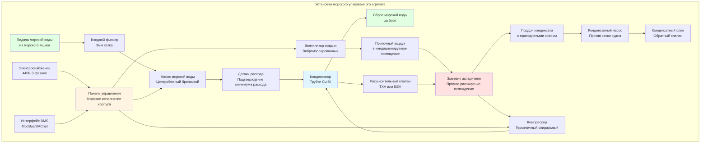

Морские упакованные агрегаты HVAC обеспечивают автономные решения климат-контроля, специально разработанные для судовых условий. Эти заводские собранные системы интегрируют все компоненты холодильной установки, воздухообработки и органов управления в компактные, морского исполнения корпуса, спроектированные для сопротивления коррозионной атмосфере, постоянным вибрациям и пространственным ограничениям, присущим установкам на судах.

## Основы упакованных агрегатов

Автономные морские упакованные агрегаты исключают необходимость в полевых хладагентных трубопроводах и снижают сложность монтажа в сравнении с раздельными системами. Каждый агрегат содержит компрессор, испаритель, конденсатор, расширительное устройство и оборудование для перемещения воздуха в едином корпусе морского исполнения. Такая конфигурация минимизирует заряд хладагента, упрощает техническое обслуживание и обеспечивает избыточность на уровне зоны, критически важную для судовых операций.

**Архитектура системы**

Морские упакованные агрегаты работают по циклу паровой компрессии холодильной установки с воздушными или морской водой охлаждаемыми конденсаторами. Холодопроизводительность определяется эффективностью теплопередачи как на испарителе, так и на конденсаторе:

$$Q_{\text{total}} = \dot{m}_a \cdot (h_{\text{entering}} - h_{\text{leaving}})$$

где расход воздуха через змеевик испарителя ($\dot{m}_a$, кг/с) и разность энтальпий на змеевике (кДж/кг) определяют общую холодопроизводительность. Для морских приложений она разделяется на явную и скрытую составляющие:

$$Q_{\text{sensible}} = \dot{m}_a \cdot c_{p,a} \cdot (T_{\text{db,in}} - T_{\text{db,out}})$$

$$Q_{\text{latent}} = \dot{m}_a \cdot h_{fg} \cdot (\omega_{\text{in}} - \omega_{\text{out}})$$

Коэффициент явного тепла (SHR) для морских приложений обычно находится в диапазоне 0,70-0,85, отражая высокие скрытые нагрузки от солесодержащего воздуха и влажного приточного воздуха.

**Методы охлаждения конденсатора**

Конденсаторы, охлаждаемые морской водой, доминируют в конструкции морских упакованных агрегатов благодаря превосходной эффективности отвода тепла и независимости от температуры окружающего воздуха. Требуемый расход морской воды составляет:

$$\dot{m}_{\text{sw}} = \frac{Q_{\text{rejection}}}{\rho_{\text{sw}} \cdot c_{p,sw} \cdot \Delta T_{\text{sw}}}$$

где отвод тепла конденсатором ($Q_{\text{rejection}}$) равен энергозатратам компрессора плюс холодопроизводительность испарителя. Типичный рост температуры морской воды варьируется от 5-8°C через конденсатор, с скоростями потока поддерживаемыми на уровне 2,0-2,5 м/с для предотвращения биообрастания при ограничении эрозии поверхностей трубок.

## Типы морских упакованных агрегатов

Различные типы судов и конфигурации пространства требуют специализированных конструкций упакованных агрегатов, оптимизированных для конкретных ограничений установки и рабочих требований.

| Тип агрегата | Холодопроизводительность | Тип конденсатора | Основное применение | Место установки |
|-----------|------------------|----------------|---------------------|----------------------|
| Компактный настенный | 3,5-10,5 кВт | Морской водой | Отдельные каюты, небольшие офисы | Через переборку |
| Палубный горизонтальный | 10,5-35 кВт | Морской водой/воздухом | Жилые помещения экипажа, столовые | Над потолком в коридорах |
| Вертикальный напольный | 17,5-70 кВт | Морской водой | Большие помещения, щиты управления | Угловое/вспомогательное помещение |
| Упакованный раздельный | 35-105 кВт | Морской водой | Мостик, центры операций | Испаритель в помещении, конденсатор удаленно |
| Модульный воздухообработчик | 70-175 кВт | Морской водой (отдельный чиллер) | Основные салоны, столовые | Выделенное машинное помещение |
| Автономный крышный | 35-140 кВт | Воздушный | Палубные помещения | Наружное крепление |

**Компактные настенные агрегаты**

Агрегаты, монтируемые через переборку, обеспечивают индивидуальный зональный контроль кают и небольших помещений. Секция испарителя расширяется в кондиционируемое помещение, в то время как конденсирующая секция монтируется в прилежащий коридор или снаружи помещения. Такая конфигурация позволяет проводить техническое обслуживание без входа в жилые помещения и поддерживает уровень шума в каютах ниже 40 дБ(A).

Конструкция использует морское исполнение листового металла с порошковым покрытием поверх коррозионностойкого грунтовочного слоя. Конденсатные стоки оснащены обратными клапанами для предотвращения обратного потока при качке судна, а поддоны конденсата включают приподнятые края высотой 50-75 мм для удержания воды при крене и дифференте.

**Вертикальные агрегаты с охлаждением морской водой**

Отдельно стоящие вертикальные агрегаты максимизируют эффективность использования площади пола в машинных помещениях и щитах управления. Змеевик испарителя монтируется над приточной камерой с встроенным вентилятором, в то время как компрессор и охлаждаемый морской водой конденсатор занимают нижнюю секцию. Такая компоновка размещает компоненты высокого уровня обслуживания на доступной высоте, минимизируя требуемую площадь пола до 0,5-0,8 м².

Трубопроводы морской воды подсоединяются к судовым системам через изоляционные и дроссельные клапаны и фильтры. Датчики расхода обеспечивают отключение компрессора при потере охлаждающей воды, а датчики температуры контролируют температуру воды на выходе для обнаружения загрязнения конденсатора. Трубки конденсатора из медно-никелевого сплава (сплав Cu-Ni 90-10) обеспечивают 20-летний срок службы в приложениях с морской водой при надлежащей обработке воды.

**Воздухоохлаждаемые палубные агрегаты**

Суда с адекватным наружным пространством могут использовать воздухоохлаждаемые упакованные агрегаты, установленные на палубах или крышах надстроек. Эти автономные агрегаты исключают необходимость в трубопроводах морской воды, но требуют усиленной защиты от коррозии при прямом воздействии брызг соленой воды. Алюминиевые ребра змеевика конденсатора получают эпоксидное покрытие, а вентиляторы конденсатора используют герметичные двигатели с защитой IP56 (NEMA 4).

Воздухоохлаждаемые агрегаты испытывают деградацию холодопроизводительности при повышении температуры окружающего воздуха выше проектных условий. Коэффициенты коррекции холодопроизводительности находятся в диапазоне 0,85-0,95 для работы при температуре окружающего воздуха 45°C в сравнении с номинальной холодопроизводительностью при 35°C. Это требует увеличения размера на 10-15% при работе в тропических регионах.

## Системы охлаждения морской водой

Прямое охлаждение морской водой обеспечивает наиболее термодинамически эффективный метод отвода тепла для морских приложений, используя температуры морской воды 5-30°C в сравнении с температурами окружающего воздуха, которые могут превышать 40°C в тропических регионах.

**Конструкция конденсатора**

Кожухотрубные конденсаторы с морской водой в трубках и конденсирующимся хладагентом на стороне кожуха доминируют в морских упакованных агрегатах. Диаметр трубок 19-25 мм обеспечивает адекватную площадь потока при одновременном сохранении доступа для очистки. Усиленные трубки с внутренней нарезкой или волнистостью увеличивают коэффициенты теплопередачи с 3500 Вт/м²K для гладких трубок до 5000-6500 Вт/м²K для усиленных поверхностей.

Метод логарифмической средней разности температур (LMTD) определяет требуемую площадь теплопередачи:

$$Q_{\text{cond}} = U \cdot A \cdot \text{LMTD}$$

где общий коэффициент теплопередачи ($U$) находится в диапазоне 800-1200 Вт/м²K для медно-никелевых трубок с типичными коэффициентами загрязнения 0,000088 м²K/Вт для обработанной морской воды.

**Компоненты цепи морской воды**

Каждый упакованный агрегат требует выделенных подсоединений подачи и возврата морской воды. Цепь включает:

1. **Насос морской воды**: центробежный или поршневой, бронзовое или сверхдуплексное нержавеющее исполнение, расход 0,03-0,05 л/с на кВт холодопроизводительности
2. **Входной фильтр**: 3-5 мм сетка, доступная корзина для очистки, перепад давления <10 кПа при чистоте
3. **Датчик расхода**: лопаточный или термический тип, подтверждает минимальный расход перед пуском компрессора
4. **Датчики температуры**: контролируют температуры на входе и выходе для отслеживания производительности
5. **Изоляционные клапаны**: бронзовые шаровые краны для изоляции при техническом обслуживании, ручные или автоматические

Скорость морской воды через трубки конденсатора поддерживается на уровне 2,0-2,5 м/с. Более низкие скорости позволяют биообрастание и осадконакопление, в то время как более высокие скорости вызывают эрозионную коррозию, особенно в турбулентных зонах на входах трубок.

## Преимущества модульной конструкции

Морские упакованные агрегаты используют принципы модульной конструкции, которые облегчают установку через узкие коридоры и герметичные двери, распространенные на судах.

**Секционная сборка**

Крупнотоннажные агрегаты используют конструкцию на болтах, позволяющую полевую сборку в ограниченных пространствах. Отдельные секции (модуль компрессора, секция испарителя, панель управления) имеют ширину менее 600 мм для прохождения через стандартные морские двери. Хладагентные подсоединения используют пайку или развальцованные соединения вместо сварных соединений для обеспечения возможности разборки при замене основных компонентов.

Эта модульность распространяется на процедуры обслуживания. Узлы компрессора монтируются на выдвижные направляющие, позволяя демонтаж без отключения хладагентных линий. Змеевики испарителя вынимаются через люки доступа, имеющие размер для замены без снятия корпуса. Платы управления используют штепсельные разъемы вместо жестко припаянных клемм.

**Стандартизированные интерфейсы**

Морские упакованные агрегаты высочайшего качества поддерживают стандартизированные точки подсоединения для судовых услуг:

- Электрическое: клеммные колодки для 440В/60Гц 3-фазного или 220В/50Гц 3-фазного в соответствии с судовой системой электроснабжения
- Морской водой: фланцевые или резьбовые подсоединения, рассчитанные на стандартные морские графики трубопроводов
- Конденсатный слив: резьбовое подсоединение с обратным клапаном, диаметр 25-40 мм
- Сигналы управления: клеммная колодка для удаленного мониторинга и интеграции системы управления зданием (BMS)

## Характеристики конструкции морского исполнения

Условия окружающей среды на судне требуют усиленной конструкции сверх стандартных спецификаций коммерческого оборудования HVAC.

**Защита от коррозии**

Все наружные поверхности получают многослойные системы покрытия. Основной металл обрабатывается цинкосодержащей эпоксидной грунтовкой, за которой следует полиуретановое топовое покрытие. Крепежные элементы используют нержавеющую сталь 316 вместо цинкованной углеродистой стали. Электрические компоненты монтируются в корпусах NEMA 4X (IP66) с уплотняющими прокладками для предотвращения проникновения соляного воздуха.

Внутренние компоненты, подверженные конденсату, используют нержавеющую сталь 304 для поддонов слива и опорных кронштейнов. Змеевики испарителя и воздухоохлаждаемого конденсатора получают эпоксидное покрытие на алюминиевых ребрах. Медные хладагентные трубопроводы используют паяные соединения вместо припаянных для сопротивления усталостным нагрузкам, вызванным вибрацией.

**Сопротивление вибрации и ударным воздействиям**

Непрерывная вибрация двигателя и вызванное волнами движение создают усталостные нагрузки на все механические соединения. Компрессоры монтируются на пружинных изоляторах, рассчитанных на 90% изоляцию на доминирующей частоте вибрации судна (обычно 8-12 Гц для дизельного двигателя). Хладагентные трубопроводы включают вибропетли и гибкие секции при всех жестких интерфейсах.

Военные суда требуют конструкции, стойкой к ударам по MIL-S-901. Это включает дополнительное подкрепление внутренних компонентов, виброизолированное крепление и испытание на сопротивление вертикальным ударам 2-5G и горизонтальным ударам 1-3G, представляющим эффекты близлежащих взрывов.

**Оптимизация пространства**

Упакованные агрегаты, разработанные для морской службы, минимизируют объем при сохранении возможности обслуживания. Типичная эффективность занимаемой площади достигает 70-100 Вт/м² площади пола для вертикальных агрегатов и 150-200 Вт/м² для горизонтальных потолочных конфигураций. Это сравнивается с 40-60 Вт/м² для стандартного коммерческого оборудования.

Компоновка компонентов приоритизирует доступность компонентов высокого уровня обслуживания. Компрессоры, платы управления и приводные ремни (для вентиляторов с ременным приводом) расположены за панелями, съемными с использованием простых ручных инструментов. Секции фильтров позволяют замену без остановки системы. Вентили обслуживания хладагента выходят на наружную часть корпуса для подсоединения манометров без открытия корпусов.

## Системы управления и интеграция

Морские упакованные агрегаты включают управление на микропроцессорной основе, обеспечивающее автономную работу при одновременном интегрировании с системами управления судном.

**Функции локального управления**

Бортовые контроллеры регулируют:

- Модуляцию холодопроизводительности путем разгрузки компрессора или привода с переменной скоростью
- Управление температурой приточного воздуха с использованием пропорционально-интегральных (PI) алгоритмов
- Последовательность насосов морской воды и мониторинг расхода
- Циклы оттаивания для низкотемпературных приложений
- Генерация аварийных сигналов и локальная сигнализация

Регулировка установки происходит через локальные дисплейные панели с возможностью переопределения с удаленных станций. Управление температурой поддерживает ±1°C от установки в стационарных условиях с использованием термисторных датчиков с разрешением 0,1°C.

**Удаленный мониторинг**

Коммуникационные протоколы (ModBus RTU, BACnet или проприетарные системы) предоставляют точки данных в центральные станции мониторинга:

- Статус работы (работает, режим ожидания, аварийный сигнал)
- Температура в помещении и относительная влажность
- Температуры входа/выхода морской воды и расход
- Часы работы компрессора и счетчики циклов
- Индикаторы перепада давления фильтра и замены
- Давления хладагента (всасывающее и нагнетающее)

Эта интеграция обеспечивает централизованное управление со станций мостика или щита управления машинным отделением, критично для операций без экипажа в машинном отделении на современных судах.

## Стандарты и сертификация

Морские упакованные агрегаты HVAC должны соответствовать требованиям классификационных обществ и международным морским нормам.

**Требования типового одобрения**

Классификационные общества (ABS, DNV, Lloyd's Register, Bureau Veritas) выдают типовое одобрение после проверки конструкции и испытания прототипа. Требования включают:

- Испытание на вибрацию по IEC 60068-2-6 или эквивалентному стандарту классификационного общества
- Испытание при наклоне при крене 15° и 22,5° и дифференте
- Испытание на соляной туман по ASTM B117 (минимум 500 часов)
- Испытание на электромагнитную совместимость (EMC) по IEC 60945
- Испытание под давлением хладагентных цепей на 1,5× рабочего давления
- Электробезопасность в соответствии с морскими электрическими стандартами IEC 60092

**Проверка производительности**

Заводские испытания подтверждают номинальную холодопроизводительность, потребление энергии и расход воздуха при указанных условиях. Морские упакованные агрегаты должны демонстрировать холодопроизводительность при температурах входа морской воды от 5-32°C и параметрах приточного воздуха от 20-30°C по сухому термометру при относительной влажности до 70%.

Требования энергоэффективности по ISO 5149 (оборудование холодильное) предусматривают минимальные значения коэффициента производительности (COP) 2,5-3,0 для агрегатов, охлаждаемых морской водой, при стандартных условиях номинала. Это представляет коэффициент энергоэффективности компрессора (EER) 8,5-10,2 кДж/кВч.

## Соображения применения

Надлежащий выбор и установка морских упакованных агрегатов требует анализа факторов, специфичных для судна, выходящих за рамки стандартной практики проектирования HVAC.

**Корректировки расчета нагрузки**

Судовые холодильные нагрузки отличаются от наземных приложений в связи с:

- Более высокие солнечные поступления через потолки на палубе (до 1000 Вт/м² в тропических условиях)
- Инфильтрация через неплотные двери и системы вентиляции
- Поступления тепла из смежных машинных помещений через переборки
- Переменные схемы использования людьми при различных режимах операции
- Повышенные требования к наружному воздуху в соответствии с морскими стандартами обитаемости (минимум 8,5 л/с на человека)

Эти факторы обычно увеличивают рассчитанные нагрузки на 15-25% в сравнении с эквивалентными наземными помещениями.

**Планирование избыточности**

Критические помещения, такие как мостик, радиорубка и щит управления машинным отделением, требуют избыточной холодопроизводительности. Распространенные подходы включают:

- Двойные агрегаты на 100% холодопроизводительности с автоматическим переключением при отказе
- Несколько агрегатов на 50% с избыточностью N+1
- Комбинация упакованных агрегатов и аварийных вентиляторов охлаждения для резервной вентиляции

Машинные помещения и жилые помещения экипажа обычно работают с одиночными агрегатами, но содержат запас запасных агрегатов для быстрой замены при стоянках в порту.

Морские упакованные агрегаты HVAC обеспечивают надежные, автономные решения климат-контроля, оптимизированные для требовательного судового окружения. Интеграция всех компонентов холодильной установки в компактные, коррозионностойкие корпуса упрощает установку, обеспечивая при этом модульность и надежность, необходимые для продолжительных операций в море. Надлежащий выбор требует рассмотрения морскоспецифичных факторов, включая возможности охлаждения морской водой, сопротивление вибрации, ограничения пространства и соответствие требованиям классификационных обществ.
