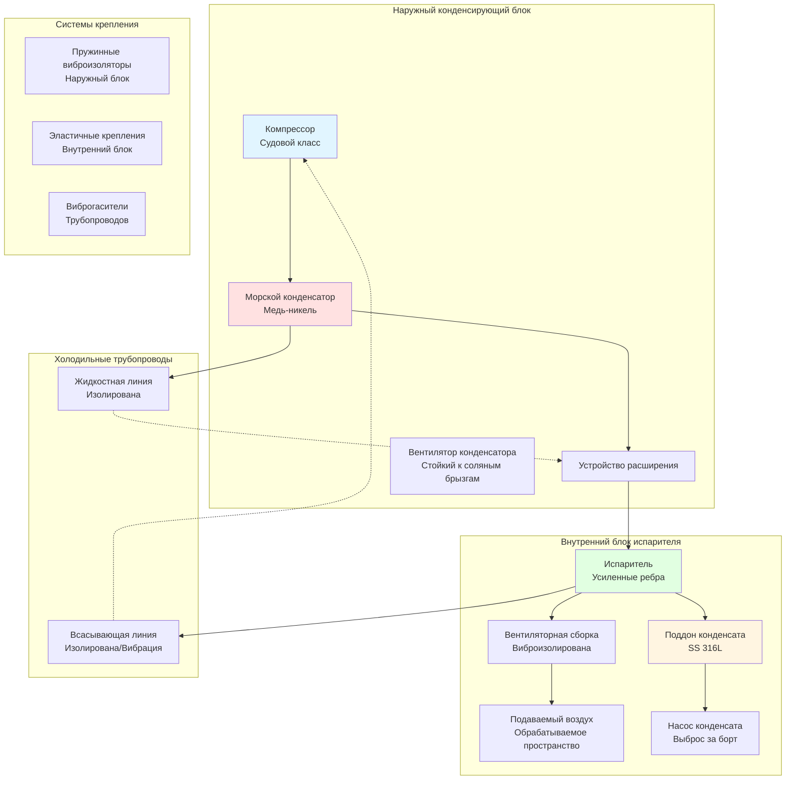

Судовые сплит-системы представляют собой универсальное и эффективное решение HVAC для кораблей и морских установок, обеспечивая гибкость размещения оборудования при сохранении преимуществ холодоснабжения прямого расширения. Эти системы специально разработаны для работы в суровых морских условиях, включая соляные брызги, постоянную вибрацию, качку и ограниченное пространство для установки.

## Конфигурация судовой сплит-системы

Сплит-системы разделяют холодильный контур на два основных компонента: наружный конденсирующий блок и внутренний блок испарителя/обработки воздуха. Эта конфигурация обеспечивает ряд преимуществ в морских приложениях, включая гибкое размещение оборудования, снижение шума в занятых пространствах и упрощенный доступ для обслуживания.

## Расчеты мощности охлаждения

Расчет размеров судовой сплит-системы требует учета теплозаприятия, специфичного для судов, включая солнечное излучение через иллюминаторы и окна, передачу тепла через стальные конструкции корпуса, тепловыделение от людей, тепло от оборудования и требования вентиляции для подачи свежего воздуха.

Общая охлаждающая нагрузка для морского помещения рассчитывается как:

$$Q_{total} = Q_{sensible} + Q_{latent}$$

Где явное тепловыделение включает:

$$Q_{sensible} = Q_{transmission} + Q_{solar} + Q_{occupants} + Q_{equipment} + Q_{ventilation}$$

Передача тепла через морские конструкции корпуса:

$$Q_{transmission} = U \cdot A \cdot CLTD_{marine}$$

Где:
- $U$ = коэффициент общей теплопередачи для морской конструкции (кДж/ч·м²·°C)
- $A$ = площадь поверхности (м²)
- $CLTD_{marine}$ = разность температур охлаждающей нагрузки, скорректированная на ориентацию судна и морские условия

Солнечное тепловыделение через морское остекление:

$$Q_{solar} = A_{glazing} \cdot SHGC \cdot SC \cdot SHGF_{marine}$$

Где:
- $SHGC$ = коэффициент солнечного тепловыделения
- $SC$ = коэффициент затемнения для морского остекления
- $SHGF_{marine}$ = фактор солнечного тепловыделения, скорректированный на широту и ориентацию

Скрытое тепловыделение от вентиляции и инфильтрации:

$$Q_{latent} = 0.68 \cdot CFM \cdot \Delta W$$

Где $\Delta W$ — разница коэффициента влажности между наружным и внутренним условиями (зерна/фунт).

Требуемая мощность компрессора с морским коэффициентом безопасности:

$$P_{comp} = \frac{Q_{total} \cdot 12000}{EER \cdot \eta_{marine}} \cdot SF_{marine}$$

Где $SF_{marine}$ = 1,15–1,25 учитывает сниженную способность отвода тепла из-за повышенных температур морской воды.

## Технические характеристики судового оборудования

Судовые сплит-системы включают специальные материалы и методы конструирования для обеспечения долгосрочной надежности в коррозионной морской среде.

| Компонент | Стандартная конструкция | Судовая конструкция | Срок службы |
|-----------|----------------------|--------------------------|--------------|
| Катушка конденсатора | Медная трубка/алюминиевое ребро | Медь-никелевая трубка/покрытое эпоксидной смолой ребро | 15-20 лет |
| Испаритель | Медная трубка/алюминиевое ребро | Медная трубка/усиленное покрытое ребро | 12-15 лет |
| Шкаф/корпус | Окрашенная сталь | Нержавеющая сталь 316L или судовой алюминий | 20+ лет |
| Крепежные элементы | Оцинкованная сталь | Нержавеющая сталь 316 | 20+ лет |
| Лопасти вентилятора | Алюминий | Композит или 316 SS | 15-20 лет |
| Электрические компоненты | Стандартный корпус (IP44) | Морской корпус (IP56/IP65) | 10-15 лет |
| Холодильные трубопроводы | Стандартная медь | Медь с улучшенной толщиной стенки | 15-20 лет |
| Поддон конденсата | Оцинкованная сталь | Нержавеющая сталь 316L | 20+ лет |
| Устройства управления | Стандартное покрытие PCB | Конформное покрытие PCB, герметичные реле | 10-15 лет |

## Стратегии защиты от коррозии

Морская среда представляет серьезные коррозионные вызовы из-за соляных брызг, высокой влажности и постоянного воздействия морского воздуха. Комплексная защита от коррозии необходима для надежной работы системы.

**Выбор материалов:**
- Медь-никель (90/10 или 70/30) для труб конденсатора, устойчивая к коррозии, вызванной морской водой
- Нержавеющая сталь типа 316L для всех смоченных поверхностей и конструктивных компонентов
- Ребра алюминия с эпоксидным или электрохимическим покрытием толщиной минимум 50 микрон
- Судовые алюминиевые сплавы (5052, 5086, 6061-T6) для неструктурных компонентов

**Защитные покрытия:**
- Полиуретановое порошковое покрытие (минимум 100 микрон) для наружных шкафов
- Система эпоксидный грунтовок + полиуретановый верхний слой для стальных конструкций
- Жертвенные цинковые аноды на теплообменниках, подвергающихся воздействию морской воды
- Конформное покрытие на всех электронных платах

**Особенности конструкции:**
- Наклонные поверхности для предотвращения накопления воды
- Уплотненные кабельные вводы с морскими кабельными вводами
- Дренажные отверстия с коррозионно-стойкими втулками
- Разделение несовместимых металлов изолирующими барьерами

## Требования к виброизоляции

Суда испытывают постоянную вибрацию от машин движения, волнения и вспомогательного оборудования. Надлежащая виброизоляция защищает компоненты HVAC и предотвращает передачу структурного шума.

**Установка наружного блока:**
- Пружинные виброизоляторы с прогибом минимум 0,5–1,0 дюйма
- Сейсмические распорки в соответствии с требованиями классификационного общества
- Рама крепления, изолированная от палубной конструкции
- База, рассчитанная на учет гибкости судна

**Установка внутреннего блока:**
- Неопреновые или резиновые виброизоляторы со сдвигом
- Блоки подвесного потолка требуют независимой опоры
- Зазор от переборок для предотвращения контакта при качке судна
- Гибкие воздуховоды (минимум 30 см)

**Холодильные трубопроводы:**
- Виброльп или компенсационный шов возле каждого соединения
- Расстояние между опорами 2–2,5 м с амортизирующими скобами
- Процедуры пайки в соответствии с морскими спецификациями
- Продувка азотом при всех работах с хладагентом

Выбор виброизолятора на основе частоты возмущения:

$$f_{n} = \frac{1}{2\pi} \sqrt{\frac{k}{m}}$$

Где собственная частота $f_n$ должна быть менее чем в 0,25 раза превышать частоту возмущения для достижения 90% эффективности изоляции.

## Управление конденсатом

Эффективное удаление конденсата критично в морских приложениях из-за качки судна, которая может привести к переливу конденсата и повреждению водой электрических систем и отделки.

**Конструкция поддона конденсата:**
- Минимальная глубина 5 см с перегородками для предотвращения волнообразования
- Наклон в сторону дренажного соединения (минимум 0,6 см на 0,3 м)
- Два дренажных соединения в противоположных углах
- Датчик переполнения с сигнализацией/отключением
- Конструкция из нержавеющей стали 316L со сварными швами

**Насосы конденсата:**
- Судовые насосы конденсата с герметичными двигателями
- Конфигурация с дублирующимся насосом для критичных пространств
- Обратный клапан на нагнетании для предотвращения обратного потока при качке
- Поплавковый выключатель с широким дифференциалом для предотвращения циклирования
- Пропускная способность в 2–3 раза больше, чем скорость образования конденсата

**Маршрутизация дренажа:**
- Выброс через корпусовой патрубок или в морскую санитарную систему
- Защита сифона от разреженного давления
- Вентиляционный трубопровод для предотвращения образования вакуума
- Тепловой кабель в охлаждаемых помещениях для предотвращения замерзания
- Дренажные линии минимум 2 см с доступом для прочистки

Скорость образования конденсата:

$$Q_{condensate} = \frac{Q_{latent}}{h_{fg}} \cdot 60$$

Где $h_{fg}$ = теплота парообразования (приблизительно 1050 кДж/кг при типичных условиях), выраженная в литрах в час.

## Требования классификационных обществ

Судовое оборудование HVAC должно соответствовать правилам классификационных обществ, которые определяют проектирование, конструкцию, испытание и установку на судах.

**Основные классификационные общества:**
- American Bureau of Shipping (ABS)
- Det Norske Veritas - Germanischer Lloyd (DNV-GL)
- Lloyd's Register (LR)
- Bureau Veritas (BV)
- Registro Italiano Navale (RINA)

**Требования к одобрению типа:**
- Испытание на вибрацию: 2–25 Гц, ускорение 0,7g
- Испытание на наклон: ±22,5° статический, ±10° динамический
- Возможность при температуре окружающей среды: 0°C до 50°C
- Испытание на соляной туман по IEC 60068-2-52
- Степень защиты минимум IP56
- Электрическая безопасность по серии IEC 60092

**Стандарты установки:**
- Холодильные трубопроводы по ASHRAE 15 и требованиям IMO
- Электрическая установка по IEC 60092-502
- Пожарная безопасность по регламенту SOLAS
- Ограничения по шуму в соответствии с резолюцией IMO A.468(XII)
- Интеграция аварийного отключения с судовыми системами

## Рассмотрение хладагентов

Выбор хладагента для судовых сплит-систем балансирует холодопроизводительность, экологические нормы и требования безопасности, специфичные для морских операций.

**Одобренные судовые хладагенты:**
- R-410A: высокая эффективность, требует специального оборудования
- R-407C: вариант модификации, умеренный GWP
- R-454B: альтернатива с низким GWP с классификацией A2L
- R-513A: замена R-134a в меньших системах

**Требования, специфичные для судов:**
- Системы обнаружения утечек в машинных отделениях
- Запас хладагента для обслуживания в море
- Оборудование для восстановления, соответствующее MARPOL Annex VI IMO
- Обучение экипажа по работе с хладагентом
- Документация в соответствии с международными морскими нормами

Критическая температура при конденсации с повышенной морской водой:

$$T_{cond} = T_{seawater} + \Delta T_{approach} + \Delta T_{fouling}$$

Где $\Delta T_{approach}$ = 10–15°F и $\Delta T_{fouling}$ = 5°F допуск.

## Электрическая интеграция

Судовые сплит-системы требуют специализированного электроконструирования для интеграции с судовыми энергосистемами и соответствия морским стандартам безопасности.

**Характеристики источника питания:**
- Напряжение: 440 В, 3-фазное, 60 Гц (американские суда) или 380 В, 50 Гц (международные)
- Допуск напряжения: ±10% по IEC 60092-101
- Допуск частоты: ±5%
- Дисбаланс фаз: максимум 3%
- Координация короткого замыкания с судовым распределением

**Интеграция управления:**
- Интеграция с судовыми автоматизированными системами (BMS/SCADA)
- Удаленное мониторирование с капитанского мостика или машинного отделения
- Аннункирование сигналов тревоги на судовую систему сигнализации
- Аварийное отключение из нескольких мест
- Возможность снижения нагрузки при работе на аварийной энергии

**Функции безопасности:**
- Защита от замыкания на землю в соответствии с морским электрическим кодексом
- Защита от переднего тока согласована с судовым распределением
- Тепловая защита двигателя
- Отсечные устройства высокого/низкого давления с ручным сбросом
- Защита от потери фазы

## Доступ для технического обслуживания и пригодность к обслуживанию

Судовые сплит-системы должны быть спроектированы так, чтобы их можно было обслуживать в ограниченном пространстве с ограниченным доступом, часто когда судно находится в ходу.

**Требования к доступности:**
- Минимум 75 см свободного пространства для доступа при обслуживании
- Съемные панели с стопорными крепежными элементами
- Сервисные вентили на всех холодильных соединениях
- Смотровые окна для контроля уровня хладагента и масла
- Портативные приборы для измерения давления и температуры

**Профилактическое обслуживание:**
- Чистка катушек каждые 3–6 месяцев (чаще в тропических условиях)
- Замена фильтров по графику производителя или при перепаде давления
- Проверка электрических соединений и проверка крутящего момента ежеквартально
- Проверка заполнения хладагентом ежегодно
- Проверка виброизоляторов один раз в полугодие
- Чистка и тестирование системы конденсата ежеквартально

**Запас запасных частей:**
- Фильтры (минимум 2 полных набора)
- Насос конденсата и поплавковый выключатель
- Платы управления и датчики
- Контакторы и реле
- Вентиляторные двигатели и конденсаторы
- Хладагент для подзарядки системы

Морские условия эксплуатации сокращают интервалы обслуживания на 30–50% по сравнению с установками на берегу. Комплексные журналы обслуживания требуются классификационными обществами и проверками портового государства.

## Мониторинг производительности системы

Непрерывный мониторинг обеспечивает прогностическое обслуживание и оптимальную производительность системы на протяжении операционного профиля судна.

**Критические точки мониторинга:**
- Давления всасывания и нагнетания
- Температуры всасывания и нагнетания
- Температура и расход подаваемого воздуха
- Температура и влажность возвратного воздуха
- Сила тока компрессора
- Расход конденсата
- Уровни вибрации в критических точках

**Показатели производительности:**
- Расчет коэффициента энергоэффективности (EER) по измеренным данным
- Отклонение уставки температуры
- Время работы для планирования обслуживания
- Анализ частоты сигналов тревоги
- Контроль переохлаждения хладагента и перегрева

Логирование данных в соответствии с требованиями системы сбора данных IMO (DCS) поддерживает соответствие SEEMP (План управления энергоэффективностью судна) и выявляет возможности оптимизации энергии.
