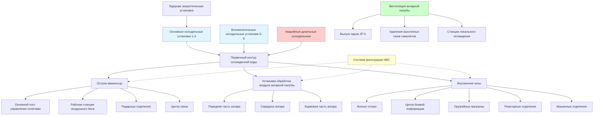

Системы HVAC авианосцев представляют наиболее сложные морские установки контроля окружающей среды, обеспечивающие поддержку плавучих авиабаз с населением более 5000 человек. Эти системы интегрируют контроль паров авиационного топлива, охлаждение высокоплотной электроники, кондиционирование оружейных систем и условия проживания персонала в 24+ тепловых зонах, охватывающих 1,8 га полетной палубы и огромные внутренние объемы.

## Расчет тепловых нагрузок и выбор мощности систем

Тепловые нагрузки авианосца комбинируют традиционные морские нагрузки с источниками тепла, специфичными для авиации. Общая холодильная мощность авианосцев класса Nimitz составляет от 8,8 до 12,3 МВт, распределённая по нескольким холодильным установкам.

**Общая явная тепловая нагрузка:**

$$Q_{total} = Q_{solar} + Q_{crew} + Q_{equipment} + Q_{aviation} + Q_{ventilation}$$

Где отдельные компоненты:

$$Q_{crew} = n_{crew} \times SHG_{person} = 5500 \times 73 \, \text{кДж/ч} = 402 \, \text{ГДж/ч}$$

$$Q_{equipment} = A_{electronics} \times q_{electronics} + P_{machinery}$$

$$Q_{aviation} = Q_{exhaust} + Q_{fuel\,handling} + Q_{ordnance\,cooling}$$

**Тепловая нагрузка ангарной палубы:**

$$Q_{hangar} = 1.08 \times \text{CFM} \times \Delta T + 0.68 \times \text{CFM} \times \Delta W$$

Для ангарной палубы, поддерживающей 20 воздухообменов в час при объеме 208 м × 33 м × 7,6 м:

$$V_{hangar} = 208 \times 33 \times 7,6 = 52,229 \, \text{м}^3$$

$$\text{CFM}_{required} = \frac{52,229 \times 20 \times 35.315}{60} = 615,900 \, \text{CFM} \, (17,434 \, \text{м}^3/\text{ч})$$

Наружный воздух при 35°C сухого термометра/26°C мокрого термометра и желаемая 29°C сухого термометра/65% относительной влажности:

$$Q_{sensible} = 1.08 \times 615,900 \times (35-29) = 4,019 \, \text{ГДж/ч}$$

**Разбавление паров топлива JP-5:**

$$\text{CFM}_{dilution} = \frac{E_{vapor} \times 10^6}{\text{LEL}_{fraction} \times 387}$$

Где $E_{vapor}$ — скорость испарения (кг/ч), доля LEL = 0,25 (25% от нижнего взрывоопасного предела для безопасности), 387 — коэффициент пересчёта. Для JP-5 с температурой вспышки 60°C и с учетом давления паров:

$$\text{CFM}_{safety} = \frac{Q_{spillage}}{0.01 \times \text{LEL}_{JP5}}$$

Поддержание концентрации паров топлива ниже 0,25% LEL (LEL для JP-5 ≈ 0,7% по объёму) требует постоянной вентиляции с коэффициентом разбавления минимум 50:1.

## Конфигурация зон HVAC

## Требования по окружающей среде по помещениям

| Тип отсека | Температура (°C) | Влажность (%ОВ) | Вентиляция (воздухообмены/ч) | Давление (Па) | Приоритет |
|---|---|---|---|---|---|
| Центр боевой информации | 20-22 | 45-55 | 15-20 | +12 | 1A |
| Радарные отделения | 18-21 | 40-50 | 20-30 | +7 | 1A |
| Основной пост управления полётами | 21-24 | 40-60 | 12-15 | +5 | 1A |
| Ангарная палуба (без работающих самолётов) | 24-29 | 30-70 | 20 | Нейтральное | 1B |
| Ангарная палуба (полётные операции) | 24-32 | 30-70 | 30-40 | -5 | 1B |
| Оружейные магазины | 16-27 | 30-60 | 8-12 | +2 | 1A |
| Готовые комнаты | 21-24 | 40-60 | 10-15 | Нейтральное | 2 |
| Жилые отсеки | 21-26 | 40-65 | 6-10 | Нейтральное | 3 |
| Столовые и камбузы | 24-29 | 40-70 | 15-25 | -12 | 2 |
| Медицинские отделения | 21-24 | 45-55 | 12-18 | +7 | 1B |
| Реакторное отделение | 32-43 | н/д | 15-25 | -24 | 1A |
| Машинные отделения катапультных систем | 24-35 | 30-70 | 10-15 | Нейтральное | 1B |

**Определения приоритетов:**
- **1A**: Критично для выполнения боевой задачи, поддерживается при любых аварийных ситуациях
- **1B**: Существенно для операций, поддерживается, если не произойдёт значительная потеря мощности
- **2**: Важно для операций, сброс нагрузки при аварийных ситуациях
- **3**: Комфорт персонала, первая система для сброса нагрузки

## Конструкция вентиляции ангарной палубы

Системы ангарной палубы обеспечивают наиболее сложные требования к вентиляции на авианосцах, справляясь с обслуживанием самолётов, контролем паров топлива, удалением выхлопных газов и интеграцией с системами пожаротушения.

**Критерии проектирования:**

1. **Базовая вентиляция**: 20 воздухообменов в час без работающих самолётов
2. **Работающие самолёты**: 30-40 воздухообменов/ч с дополнительным выбросом в позициях двигателей
3. **Реагирование на разливы топлива**: Автоматический переход на 50+ воздухообменов/ч при обнаружении паров
4. **Режим пожара**: Взаимодействие с системами подачи пены и удаления дыма

Распределение приточного воздуха использует потолочные диффузоры с горизонтальной схемой подачи, чтобы избежать помех при движении самолётов и технического обслуживания. Скорость выпуска остаётся ниже 4,1 м/с на высоте 3 м над палубой для предотвращения рассеивания посторонних предметов (FOD).

**Станции локального охлаждения** обеспечивают локализованный контроль окружающей среды для персонала технического обслуживания, работающего внутри или рядом припаркованными самолётами. Эти портативные агрегаты подключаются к коллекторам быстрого отключения, предоставляя:

- Охлажденный воздух 10-13°C для охлаждения кабины при работе авионики
- Нагретый воздух 49-60°C для прогрева двигателей в холодные периоды
- Кондиционированный воздух для калибровки приборов, требующей стабильных тепловых условий

Системы выброса используют как потолочную экстракцию, так и выпуски на уровне палубы. Потолочные выпуски справляются с основными вентиляционными нагрузками, а палубные выпуски активируются при работе двигателей самолётов для захвата выхлопных газов до их распространения по ангару.

**Меры защиты от взрыва:**

- Электрооборудование, классифицированное как Класс I, Группа 2 (ранее Класс I, Группа D)
- Заземление и соединение воздуховодов для предотвращения накопления статического заряда
- Конструкция вентилятора, устойчивая к искрам, с алюминиевыми или бронзовыми рабочими колесами
- Автоматическая активация аварийной вентиляции при срабатывании пожарной сигнализации или обнаружении разлива топлива
- Изоляционные заслонки для предотвращения распространения пламени между ангарными отсеками

## Контроль паров топлива JP-5

JP-5 (реактивное топливо, NATO F-44) служит основным авиационным топливом на авианосцах из-за его высокой температуры вспышки (минимум 60°C), обеспечивающей повышенную безопасность при операциях на корабле. Несмотря на повышенную температуру вспышки, контроль паров остаётся критичным при заправке, техническом обслуживании топливных цистерн и реагировании на разливы.

**Скорость образования паров** зависит от температуры топлива, площади поверхности и движения воздуха:

$$E_{evap} = K \times A \times (P_{sat} - P_{partial}) \times M^{0.67}$$

Где:
- $K$ = коэффициент массопередачи
- $A$ = площадь поверхности жидкости (м²)
- $P_{sat}$ = давление насыщенного пара при температуре топлива
- $P_{partial}$ = парциальное давление паров топлива в воздухе
- $M$ = коэффициент молекулярного веса

При температуре ангарной палубы 29°C давление паров JP-5 остаётся низким (< 0,07 кПа), но наихудшие сценарии предполагают топливо, нагретое до 49°C при тропических операциях или циркуляции насосом.

**Обнаружение паров и реагирование:**

- Непрерывный мониторинг через каталитические датчики с интервалом 15 м
- Первая сигнализация при 10% LEL (0,07% по объёму для JP-5)
- Вторая сигнализация при 25% LEL с автоматическим увеличением вентиляции
- Эвакуационная сигнализация при 50% LEL с активацией аварийных протоколов

Зоны обслуживания топлива и цистерны авиационного топлива имеют отдельную вентиляцию, отличную от общей системы ангарной палубы. Эти системы поддерживают небольшое отрицательное давление (-5 до -12 Па) и выбрасывают воздух выше полётной палубы в направлении от стоянок самолётов и воздухозаборников.

**Системы вентиляции цистерн** используют огнепреградители и предохранительно-вакуумные клапаны, предотвращающие избыточное давление в цистернах во время заправки, одновременно содержа пары. Выпускные отверстия расположены на краю полётной палубы с достаточным расстоянием от стоянок самолётов и воздухозаборников.

## Конфигурация холодильной установки

Ядерные авианосцы используют турбокомпрессорные центробежные холодильники с паровым приводом в качестве основных холодильных установок, используя избыточный пар от ядерных реакторов корабля. Электрические холодильники с асинхронным двигателем обеспечивают резервную мощность и поддержку при снабжении в море, когда спрос на пар достигает пика.

**Основные холодильные установки (4 типичных):**

- Холодопроизводительность: 2,1–2,8 МВт каждая
- Паровой привод турбины: 1790–2240 кВт при 1,0–2,1 МПа пара
- Конденсаторы, охлаждаемые морской водой: Титановые пучки труб, расчёт при входе морской воды 29°C
- Подача охлажденной воды: 5,9°C при 1900–2500 л/мин на установку
- Хладагент: R-134a или HFC-125 (низкий потенциал глобального потепления, без озоноразрушающего действия)

**Вспомогательные холодильные установки (2-4 типичных):**

- Холодопроизводительность: 1,4–2,1 МВт каждая
- Электрический привод: 340–450 кВт при 450В, 60 Гц
- Способность резервного питания от дизель-генератора
- Возможность быстрого запуска (менее 5 минут до полной мощности)

**Аварийные холодильники:**

- Холодопроизводительность: 0,7–1,4 МВт
- Прямой привод от дизельного двигателя или питание от аварийной электросети
- Запасной конденсатор, охлаждаемый пожарной магистралью
- Автоматический запуск при отказе основной установки

Распределение охлажденной воды использует первичную-вторичную схему с переменным расходом вторичных контуров. Первичные насосы поддерживают постоянный расход через холодильники, в то время как вторичные насосы модулируют расход в зависимости от спроса системы, снижая энергопотребление насосов при сниженных нагрузках.

**Оптимизация температурного перепада:**

$$\Delta T = \frac{Q_{cooling}}{500 \times \text{GPM}}$$

Увеличение температурного перепада с традиционных 5,6°C до 7,8–8,9°C уменьшает расходы на 30–40%, снижая энергопотребление насосов и позволяя использовать трубопроводы меньшего диаметра. Однако это требует тщательного выбора теплообменников для поддержания надлежащей теплопередачи при сниженных расходах.

## Конструкция условий проживания персонала

Обеспечение приемлемых условий проживания для 5000+ человек в ограниченных пространствах при экстремальных внешних условиях представляет уникальные проблемы. Жилые отсеки имеют трёхъярусные кровати в помещениях с высотой потолка 2,1–2,4 м, создавая высокую плотность занятия и локализованные тепловые нагрузки.

**Вентиляция жилых отсеков:**

$$\text{CFM}_{berthing} = \text{max}\left(15 \times n_{occupants}, \, 6 \times \text{ACH} \times \frac{V}{60}\right)$$

Где $n_{occupants}$ — расчётная численность и $V$ — объём отсека (м³).

Для типичного жилого отсека на 60 человек (12 м × 9 м × 2,4 м):

$$\text{CFM}_{required} = \text{max}(900, \, 576) = 900 \, \text{CFM} \, (25,4 \, \text{м}^3/\text{ч})$$

Распределение использует линейные щелевые диффузоры между рядами кроватей, обеспечивающие низкую скорость воздуха (менее 0,25 м/с). Выпуски обратного воздуха расположены в концах отсека, предотвращая короткое замыкание и обеспечивая распространение воздуха во все занятые зоны.

**Проблемы теплового комфорта:**

- График работы персонала создаёт круглосуточное занятие со сменными нагрузками
- Минимальные перегородки конфиденциальности ограничивают индивидуальное управление зонами
- Вертикальное расслоение температуры в трёхъярусных кроватях (верхние кровати на 2–3°C теплее)
- Высокие радиационные нагрузки от надстройки, нагреваемой солнечным излучением на полётной палубе

Звукоизоляция получает критическое внимание в жилых отсеках. Пересечения воздуховодов включают звукопоглощающие плены, а установки обработки воздуха расположены отдалённо от жилых отсеков. Целевые уровни шума: NC-30 до NC-35 для жилых отсеков, NC-40 до NC-45 для переходов.

## Охлаждение центра боевой информации

Отсеки ЦБИ концентрируют дисплеи радара, коммуникационное оборудование, компьютеры и операторов в затемнённых помещениях с плотностью тепловых нагрузок, приближающейся к 5,4 кВт/м². Проектирование системы охлаждения должно обеспечивать надёжность оборудования при поддержании комфорта операторов во время продолжительных боевых станций.

**Характеристики нагрузок:**

$$Q_{CIC} = A_{floor} \times q_{equipment} + n_{operators} \times SHG_{person} + Q_{lighting}$$

Для типичного ЦБИ: 279 м² × 58 кВт/м² = 16,2 МВт = 16,2 ГДж/ч

Это превышает типичные офисные здания в 8–10 раз и требует 4,6 МВт холодопроизводительности только для ЦБИ.

**Избыточное проектирование систем охлаждения:**

- Двойные установки обработки воздуха из отдельных противопожарных зон и холодильных установок
- Каждая УОВ способна работать на 60% мощности (в сумме = 120% проектной нагрузки)
- Автоматическое переключение при отказе с прерыванием менее 30 секунд
- Резервные портативные охлаждающие агрегаты для аварийных условий
- Аварийная охлажденная вода от выделенной боевой системы

Расходы приточного воздуха достигают 15–20 воздухообменов/ч при 11–13°C для компенсации высокой плотности тепла. Системы распределения воздуха под полом обеспечивают эффективное охлаждение непосредственно в стойках оборудования при снижении заторов воздуховодов в верхних пространствах, заполненных кабельными лотками и трубопроводами.

**Контроль влажности** предотвращает конденсацию на холодных поверхностях оборудования и поддерживает комфорт операторов. Осушение до 45–50% ОВ происходит в центральных установках обработки воздуха с использованием охлажденных водой теплообменников с температурой воды 3–6°C, достигая точки росы аппарата 9–11°C.

## Охлаждение полётной палубы и острова

Остров авианосца размещает основной пост управления полётами, рабочую станцию воздушного боса, навигационный мостик, радарные отделения и центры связи в конструкции, возвышающейся на 55+ м над ватерлинией. Солнечные нагрузки, радиационное тепло от алюминиевой полётной палубы, достигающей 60–71°C, и тепло оборудования создают экстремальные требования к охлаждению.

**Проблемы охлаждения острова:**

- Солнечное излучение через большие оконные площади в постах управления полётами
- Радиационная нагрузка от алюминиевой полётной палубы (поглощение солнечного излучения α = 0,4–0,6)
- Ограниченное пространство для оборудования внутри узкой конструкции острова
- Длинные трубопроводы хладагента или охлажденной воды от центральных установок
- Вибрация от полётных операций, влияющая на чувствительное оборудование

Основной пост управления полётами ("Pri-Fly") поддерживает 21–24°C несмотря на оконные площади, превышающие 28 м², и прямое солнечное воздействие. Многослойные окна с интегрированными солнечными экранами снижают нагрузки, в то время как высокоскоростной приточный воздух (до 7,6 м/с) из потолочных диффузоров обеспечивает быстрое охлаждение без сквозняков на рабочих местах операторов.

**Охлаждение радарного оборудования** использует выделенные системы, отдельные от бытовой вентиляции. Высокомощные радарные передатчики выделяют 37–150 кВт тепла, требующего круглогодичного охлаждения независимо от условий окружающей среды. Эти системы используют:

- Вторичные контуры с гликолем, изолирующие морскую воду от чувствительной электроники
- Избыточные насосы и теплообменники для непрерывной работы
- Автоматический контроль температуры, поддерживающий стабильность ±1°C
- Фильтрацию по ISO 16890 ePM1 60% минимум (ранее MERV 13)

## Нормы и спецификации

Системы HVAC авианосцев соответствуют обширным военным стандартам, касающимся производительности, живучести и требований интеграции:

**Основные спецификации:**

- **MIL-STD-2036**: HVAC для надводных кораблей (общие требования)
- **MIL-STD-167-1A**: Механические вибрации корабельного оборудования
- **MIL-STD-901D**: Требования испытаний на удар для корабельного оборудования
- **NAVSEA S9AAO-AB-GOS-010**: Общие спецификации кораблей ВМС США
- **MIL-PRF-32016**: Оборудование коллективной защиты, фильтрация NBC
- **NFPA 409**: Авиационные ангары (адаптировано для морской авиации)
- **UFC 4-211-01**: Объекты морской авиации (справочник береговых объектов)

**Обращение с авиационным топливом:**

- **MIL-DTL-5624**: Турбинное топливо, авиационное, марки JP-4, JP-5 и JP-8
- **NFPA 30**: Кодекс легковоспламеняющихся и горючих жидкостей
- **NAVSEA OP 5 Vol 1**: Регламент безопасности при боеприпасах и взрывчатых веществах на берегу (оружейные магазины)

**Испытания и ввод в эксплуатацию:**

- **NAVSEA T9074-AS-GIB-010/271**: Требования к системам кондиционирования воздуха, холодильным и вентиляционным системам
- **Стандарты процедур NEBB**: Испытания, регулировка и балансировка (адаптировано для корабельных приложений)
- **CNSCINST 9090.1**: Комплексная спецификация строительства и ремонта кораблей

## Оперативные соображения

Системы HVAC авианосца должны поддерживать производительность во всём диапазоне операционных профилей от арктических операций до развёртываний в Персидском заливе, где температура морской воды превышает 32°C, а температура наружного воздуха достигает 46°C.

**Проблемы тропических операций:**

- Эффективность охлаждения морской водой снижается на 40–50% (29°C вместо 13°C)
- Холодопроизводительность холодильника деградирует на 15–25% при повышенных температурах конденсатора
- Радиационные нагрузки полётной палубы увеличиваются на 30–40%
- Тепловой стресс персонала усиливается, требуя дополнительного охлаждения жилых отсеков

**Операции в холодном климате:**

- Температура морской воды ниже 2°C требует систем защиты от замерзания
- Сниженные холодильные нагрузки позволяют ротацию установок для технического обслуживания
- Нагрузки на отопление увеличиваются для открытой конструкции острова и палуб
- Контроль конденсации становится критичным на холодных поверхностях корпуса

**Операции снабжения в море (UNREP):**

- Спрос на пар для катапультных систем и полётных операций достигает пика одновременно
- Подача пара на холодильники может снизиться, требуя управления нагрузкой
- Вспомогательные электрические холодильники активируются для поддержания критического охлаждения
- Временное снижение вентиляции приемлемо в некритичных помещениях

---

Системы HVAC авианосцев exemplify крупномасштабного морского проектирования контроля окружающей среды, интегрирующего ядерные энергетические установки, поддержку авиационных операций, защиту NBC и жизнеобеспечение персонала в комплексные платформы, поддерживающие продолжённые развёртывания в оспариваемых окружениях.
