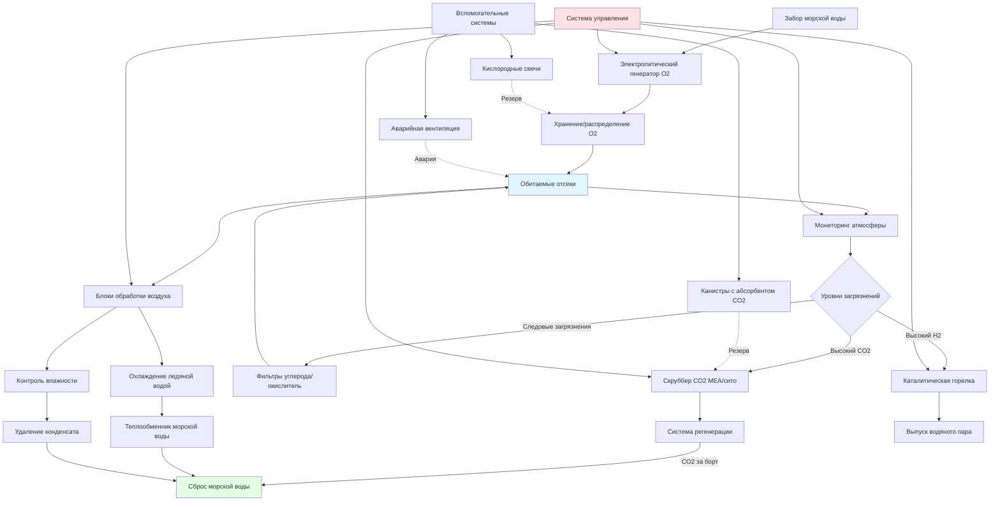

Системы экологического контроля (ECS) подводных лодок представляют наиболее сложные приложения HVAC с герметичной атмосферой, интегрирующие функции жизнеобеспечения с контролем теплового комфорта. Эти системы поддерживают состав дышащей атмосферы, удаляют метаболические загрязнения, контролируют температуру и влажность, обеспечивая выживаемость экипажа во время погруженных операций, длящихся от недель до месяцев без всплытия.

## Контроль состава атмосферы

Контроль атмосферы подводной лодки поддерживает точные концентрации газов в физиологических пределах для длительного воздействия на экипаж. Система активно управляет уровнями кислорода, удаляет углекислый газ, контролирует следовые загрязнения и предотвращает накопление взрывоопасных газов через непрерывный мониторинг и регенерацию.

**Спецификации компонентов атмосферы:**

| Параметр | Нормальный диапазон | Максимальный предел | Физиологическая основа |
|-----------|--------------|---------------|---------------------|
| Кислород (O₂) | 19-21% | 23% макс., 17% мин. | Профилактика гипоксии, риск пожара |
| Двуокись углерода (CO₂) | < 0,5% (5000 ppm) | 1,0% (10000 ppm) 24ч | Предел респираторного ацидоза |
| Оксид углерода (CO) | < 10 ppm | 50 ppm TWA | Образование карбоксигемоглобина |
| Водород (H₂) | < 1% | 2% (рассмотрение НДВ) | Опасность взрыва от батарей |
| Всего углеводородов | < 1 ppm | 5 ppm | Порог раздражения, токсичности |
| Азот (N₂) | Баланс | - | Инертный разбавитель |
| Температура | 21-24°C | 29°C мокрый термометр | Профилактика теплового стресса |
| Относительная влажность | 30-50% | 60% | Профилактика конденсации, плесени |

Фундаментальное уравнение баланса атмосферы для герметичной среды подводной лодки:

$$\frac{dC}{dt} = \frac{G - R - V \cdot C}{V}$$

Где:
- $C$ = концентрация загрязнения (ppm или %)
- $t$ = время (часы)
- $G$ = скорость генерации (масса/время)
- $R$ = скорость удаления (масса/время)
- $V$ = обитаемый объем (м³)

Для установившихся режима $\frac{dC}{dt} = 0$, получается:

$$C_{ss} = \frac{G}{R + V \cdot \lambda}$$

где $\lambda$ — естественная константа распада загрязнения.

## Системы генерации кислорода

Современные подводные лодки генерируют кислород электрохимически из морской воды, а не хранят запасы сжатого газа. Системы электролиза разлагают морскую воду на кислород и водород через приложение постоянного тока к специализированным электродам.

Реакция электролиза:

$$2H_2O \xrightarrow{электрическая\ энергия} 2H_2 + O_2$$

Требования к производству кислорода масштабируются в соответствии с метаболическим спросом экипажа:

$$\dot{m}_{O_2} = n_{crew} \times 0,38 \frac{\text{кг}}{\text{чел-день}} \times SF$$

Где:
- $\dot{m}_{O_2}$ = скорость генерации кислорода (кг/день)
- $n_{crew}$ = количество персонала
- $SF$ = коэффициент безопасности (обычно 1,15-1,25)

Для экипажа из 140 человек потребление кислорода составляет примерно 54 кг/день или 2,3 кг/ч. При стандартных условиях это соответствует производительности генерации кислорода примерно 1,2 м³/ч.

**Спецификации электролитического генератора кислорода:**

| Параметр системы | Типичное значение | Единицы |
|------------------|---------------|-------|
| Производительность | 2-3 | м³/ч O₂ |
| Потребление энергии | 3,2-3,9 | кВт·ч/кг O₂ |
| Потребление морской воды | 6,8-9,1 | л/кг O₂ |
| Напряжение элемента | 1,8-2,2 | VDC |
| Температура эксплуатации | 71-82 | °C |
| Чистота | 99,5% | % O₂ |
| Производство водорода | 2,4 | м³/ч H₂ (побочный продукт) |

Побочный продукт водорода требует немедленного удаления через каталитические горелки или выпуска для предотвращения накопления сверх нижних пределов воспламеняемости (4% H₂ в воздухе).

## Системы удаления углекислого газа

Системы очистки CO₂ удаляют дыхательный углекислый газ для поддержания концентраций ниже 0,5% (5000 ppm) для здоровья экипажа. Подводные лодки используют либо химическое поглощение (моноэтаноламин), либо регенеративные системы на основе молекулярного сита в зависимости от класса судна и требований операций.

**Поглощение моноэтаноламином (MEA):**

Химическая реакция захвата CO₂:

$$2(R-NH_2) + CO_2 + H_2O \rightleftharpoons (R-NH_3)_2CO_3$$

Процесс поглощения работает через противоточный контакт газ-жидкость в насадочных башнях. Богатый раствор амина регенерируется в колонне отпарки при повышенной температуре (104-116°C), выделяя концентрированный CO₂ для сброса за борт и возвращая обедненный раствор для повторного использования.

Проектная производительность системы MEA:

$$Q_{scrubber} = \frac{n_{crew} \times 1,0 \frac{\text{кг CO}_2}{\text{чел-день}}}{C_{in} - C_{out}} \times \frac{1}{\eta}$$

Где:
- $Q_{scrubber}$ = скорость потока воздуха через скруббер (м³/ч)
- $C_{in}$ = входная концентрация CO₂ (кг/м³)
- $C_{out}$ = выходная концентрация CO₂ (кг/м³)
- $\eta$ = эффективность удаления (обычно 0,85-0,92)

**Системы молекулярного сита:**

Системы адсорбции с перепадом давления (PSA) или с перепадом температуры (TSA) используют цеолитные слои, чередующиеся между циклами адсорбции и регенерации. Эти системы предлагают меньшее энергопотребление, чем MEA, но требуют большего объема.

| Тип системы | Скорость удаления | Мощность | Объем | Регенерация |
|-------------|--------------|-------|--------|--------------|
| Поглощение MEA | 136-181 кг/день CO₂ | 26-34 кВт | 3,4-4,2 м³ | Тепловая (пар) |
| Молекулярное сито (PSA) | 136-181 кг/день CO₂ | 15-22 кВт | 5,7-7,1 м³ | Перепад давления |
| Гидроксид лития | 136-181 кг/день CO₂ | Минимум | 2,3-2,8 м³ | Нерегенеративный |

## Контроль следовых загрязнений

Помимо O₂ и CO₂, подводные лодки должны удалять следовые загрязнения из готовки, выделения газов оборудованием, хладагентов, химикатов для очистки и неполного сгорания. Эти загрязнения накапливаются в герметичной среде и требуют активного удаления.

**Основные следовые загрязнители:**

- Окись углерода (CO) от источников сгорания
- Летучие органические соединения (VOC) из растворителей, красок, клеев
- Фреон из кондиционирования воздуха и утечек холодильных установок
- Водород от зарядки батарей и электролиза
- Метан и другие углеводороды из систем отходов
- Озон из электронного оборудования

**Технологии удаления:**

1. **Каталитические горелки**: Окисляют водород, CO и углеводороды при 315-427°C над катализаторами платины или палладия
2. **Адсорбция активированным углем**: Удаляют VOC и хладагенты через физическую адсорбцию
3. **Каталитические окислители**: Окисление при низкой температуре (204-316°C) органических веществ
4. **Фильтрация HEPA**: Удаляют взвешенные частицы и биоаэрозоли (99,97% при 0,3 микрон)

Удаление водорода горелкой с катализатором следует:

$$H_2 + \frac{1}{2}O_2 \xrightarrow{катализатор} H_2O + 242 \frac{\text{кДж}}{\text{моль}}$$

Горелка должна обрабатывать весь воздух, содержащий водород выше 0,5% концентрации, обычно 14-17 м³/ч во время операций зарядки батареи.

## Архитектура ECS подводной лодки

Интегрированная система экологического контроля координирует контроль атмосферы, тепловое управление и вентиляцию через автоматический мониторинг и управление.

## Управление тепловой нагрузкой

Внутренние тепловые нагрузки подводной лодки значительно превышают требования надводных судов из-за плотной установки оборудования, систем ядерного двигателя и герметичной конструкции корпуса, препятствующей естественной вентиляции.

**Источники тепловой нагрузки:**

| Источник | Тепловая нагрузка | Процент |
|--------|-----------|------------|
| Электроника и системы вооружения | 575-863 кВт | 35-45% |
| Главная двигательная установка и вспомогательное оборудование | 432-648 кВт | 25-35% |
| Персонал (140 чел @ 117 Вт/чел) | 117 кВт | 7-10% |
| Освещение | 86-130 кВт | 5-8% |
| Готовка и камбуз | 58-86 кВт | 3-5% |
| Прочее оборудование | 108-180 кВт | 7-12% |
| **Общая внутренняя нагрузка** | **1,376-2,025 кВт** | **100%** |

Теплопередача через корпус обеспечивает минимальное охлаждение из-за низкого отношения площади поверхности к объему и требований изоляции. Чистый прирост тепла через прочный корпус:

$$q_{hull} = U \cdot A \cdot (T_{sw} - T_{int})$$

Где:
- $q_{hull}$ = теплопередача через корпус (кДж/ч)
- $U$ = общий коэффициент теплопередачи (0,026-0,044 кДж/ч-м²-°C с изоляцией)
- $A$ = смоченная площадь корпуса (3,700-5,600 м² для SSN)
- $T_{sw}$ = температура морской воды (-2 до 29°C)
- $T_{int}$ = внутренняя температура (22°C целевая)

На глубине 305 м с морской водой 2°C и внутренней температурой 22°C, корпус площадью 4,650 м² с U = 0,035 удаляет только:

$$q_{hull} = 0,035 \times 4,650 \times (2-22) = -3,255 \text{ кДж/ч} = -78 \text{ кВт}$$

Это представляет только 4-6% от общего производства тепла, требуя активного охлаждения для оставшихся 1,300-1,950 кВт.

## Кондиционирование воздуха и осушение

Системы охлаждения ледяной водой обеспечивают распределенное охлаждение через блоки обработки воздуха, обслуживающие отсеки. Морские холодильные установки используют хладагенты R-134a или R-114 в герметичных конфигурациях центробежных или винтовых компрессоров.

**Типичные спецификации установки кондиционирования подводной лодки:**

| Параметр | Значение |
|-----------|-------|
| Производительность охлаждения на установку | 528-879 кВт |
| Количество установок | 2-3 (резервные) |
| Температура подачи ледяной воды | 5,6-7,2°C |
| Температура возврата ледяной воды | 11,1-12,8°C |
| Расход конденсатора морской воды | 3,0-4,5 м³/ч на 176 кВт |
| Коэффициент производительности системы (COP) | 3,5-4,5 |
| Требование уровня шума | < 65 дБ(A) на расстоянии 0,9 м |

Осушение происходит естественно через конденсацию теплого газа на катушке ледяной воды. Требования к ежедневному удалению влаги:

$$\dot{m}_{H_2O} = n_{crew} \times 0,23 \frac{\text{кг}}{\text{чел-день}} + \dot{m}_{cooking} + \dot{m}_{equipment}$$

Для 140 человек общее производство влаги составляет 38-50 кг/день (38-50 л/день), требуя непрерывного осушения для поддержания 30-50% ОВ.

## Системы мониторинга атмосферы

Непрерывный мониторинг атмосферы обеспечивает данные состава в реальном времени для автоматического управления и безопасности экипажа. Массивы датчиков измеряют критические параметры с резервными приборами в нескольких отсеках.

**Комплект датчиков мониторинга:**

- Датчики кислорода: Электрохимические или парамагнитные (точность ±0,1%)
- Датчики CO₂: Инфракрасное поглощение (точность ±50 ppm)
- Датчики CO: Электрохимические (точность ±1 ppm)
- Датчики H₂: Каталитический шарик или термопроводность (точность ±0,1%)
- Датчики углеводородов: Детектор ионизации пламени (точность ±0,5 ppm)
- Датчики давления: Дифференциальное и абсолютное (точность ±0,0069 кПа)
- Датчики температуры/влажности: RTD и емкостные (точность ±0,3°C, ±2% ОВ)

Логирование данных происходит с интервалом 1 минута с пороговыми значениями тревоги, запускающими автоматические реакции систем. Концентрация кислорода ниже 19% активирует дополнительное выпуск кислорода; CO₂ выше 0,8% увеличивает поток скруббера; водород выше 1,5% активирует каталитические горелки.

## Аварийные системы

Резервные системы жизнеобеспечения обеспечивают избыточность для отказов системы контроля атмосферы во время боевых повреждений или аварий оборудования.

**Аварийные источники кислорода:**

1. **Кислородные свечи** (хлорат натрия): Генерируют O₂ через термическое разложение
   $$2NaClO_3 \rightarrow 2NaCl + 3O_2$$
   Каждая свеча производит примерно 170 м³ O₂ (достаточно для 1 человека на 24 часа)

2. **Аварийные баллоны воздуха**: Сжатый воздух высокого давления (206-310 кПа) обеспечивает запас на 6-12 часов

3. **Аварийная система продува**: Воздух высокого давления для продува балластных танков при аварийном всплытии

**Аварийное удаление CO₂:**

Канистры гидроксида лития (LiOH) обеспечивают нерегенеративное поглощение CO₂:

$$2LiOH + CO_2 \rightarrow Li_2CO_3 + H_2O$$

Каждый килограмм LiOH поглощает 0,24 кг CO₂. Для 140 человек, генерирующих 140 кг CO₂/день, аварийная операция требует 265 кг LiOH ежедневно (50-60 канистр).

---

*Системы экологического контроля подводных лодок интегрируют жизнеобеспечение, тепловое управление и очистку атмосферы в автономные платформы, поддерживающие продолжительные погруженные операции без обмена внешней атмосферой.*
