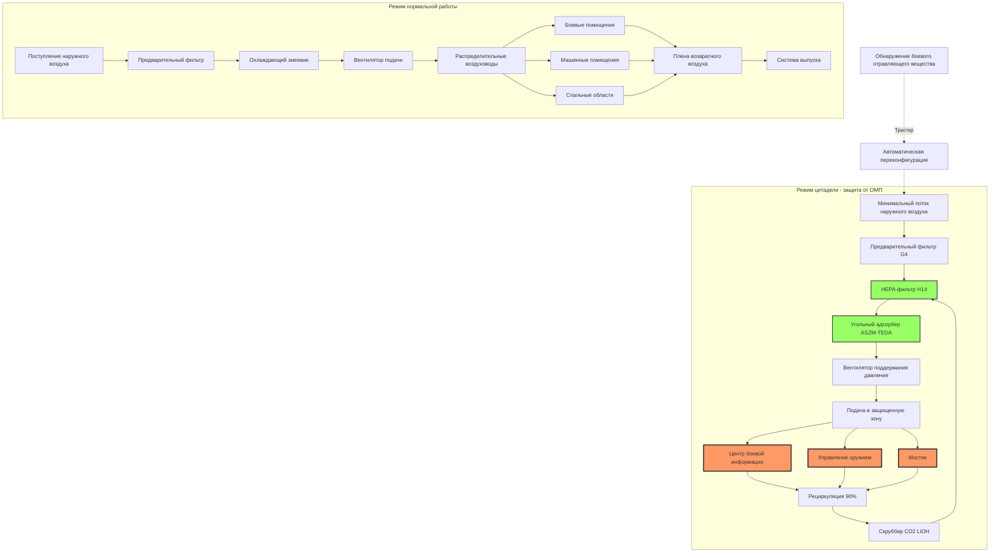

Системы HVAC боевых кораблей интегрируют экологический контроль с боевой выживаемостью, обеспечивая жизнеобеспечение во время угроз ОЗМП (органические, биологические, радиационные, ядерные) при сохранении оперативной способности при сценариях боевых повреждений. Эти системы используют распределенную архитектуру, конструкцию, устойчивую к ударам, и автоматизированные протоколы переконфигурации, согласованные с требованиями MIL-STD-2036.

## Расчеты проектных нагрузок

Тепловые нагрузки боевых кораблей значительно отличаются от коммерческих судов из-за высокой плотности электроники и потребления энергии оборудованием. Стандартные расчеты применяют измененные предположения для военных объектов.

**Уравнение общей холодильной нагрузки:**

$$Q_{total} = Q_{sensible} + Q_{latent} + Q_{equipment} + Q_{solar} + Q_{hull}$$

Где отдельные компоненты:

$$Q_{sensible} = \dot{m}_{air} \cdot c_p \cdot (T_{outside} - T_{supply})$$

$$Q_{equipment} = \sum_{i=1}^{n} P_i \cdot \eta_i \cdot DF_i$$

$$Q_{hull} = U \cdot A \cdot (T_{ambient} - T_{internal})$$

**Тепловая нагрузка электроники доминирует в помещениях боевых систем:**

| Тип помещения | Тепловая нагрузка от оборудования | Тепловая нагрузка от персонала | Соотношение |
|------------|---------------|----------------|-------|
| Центр боевой информации | 3008 Вт/м² | 269 Вт/м² | 11:1 |
| Помещение радарного оборудования | 4843 Вт/м² | 161 Вт/м² | 30:1 |
| Центр управления оружием | 3440 Вт/м² | 323 Вт/м² | 10.7:1 |
| Спальные помещения | 161 Вт/м² | 914 Вт/м² | 0.18:1 |
| Помещения камбуза | 2366 Вт/м² | 646 Вт/м² | 3.7:1 |

**Размер холодильной мощности по MIL-STD-2036:**

$$\text{Общая мощность охлаждения} = \frac{Q_{total}}{35146} \cdot SF \cdot BF$$

Где:
- $SF$ = коэффициент безопасности (1,15–1,25 для военно-морских приложений)
- $BF$ = коэффициент боевых повреждений (1,33 для выживаемости N-1, 1,50 для N-2)
- кВ = киловатты охлаждения

Для эсминца класса (DDG) с кондиционированным пространством 7896 м²:

$$Q_{avg} = 1938 \text{ Вт/м}^2 \times 7896 \text{ м}^2 = 15,3 \times 10^6 \text{ кДж/ч}$$

$$\text{Требуемая мощность} = \frac{15,3 \times 10^6}{35146} \times 1,20 \times 1,50 = 6,236 \text{ кВ}$$

Эта мощность распределяется на 4–6 независимых установок для стойкости к боевым повреждениям.

## Архитектура защиты от ОМП

Системы коллективной защиты создают зоны положительного давления, где персонал работает без индивидуальных средств защиты во время атак химическими или биологическими боевыми отравляющими веществами. Система HVAC выполняет координированную переконфигурацию от нормальной вентиляции к режиму цитадели.

**Требования давления в цитадели:**

Положительный дифференциальный перепад давления поддерживает исключение загрязнений:

$$\Delta P = P_{citadel} - P_{ambient} \geq 37 \text{ Па}$$

Необходимый расход воздуха для компенсации утечек:

$$Q_{leakage} = A_{surface} \cdot C \cdot \sqrt{\Delta P}$$

Где:
- $A_{surface}$ = общая площадь границы (м²)
- $C$ = коэффициент утечки (обычно 11,1 м³/ч/м² для военно-морского строительства)
- $\Delta P$ = дифференциальный перепад давления (Па)

Для защищенной зоны 1393 м²:

$$Q_{leakage} = 1393 \times 11,1 \times \sqrt{37} = 94,2 \text{ м}^3\text{/ч}$$

**Спецификации фильтровального блока по MIL-PRF-32016:**

| Ступень фильтра | Тип | Эффективность | Перепад давления |
|--------------|------|------------|---------------|
| Предварительный фильтр | EN 779 G4 | 90% > 10 мкм | 75 Па |
| HEPA-фильтр | EN 1822 H14 | 99,995% при 0,3 мкм | 295 Па |
| Угольный адсорбер | ASZM-TEDA 12×30 mesh | >99,9% боевых отравляющих веществ | 442 Па |
| Общая система | Комбинированная | Соответствует MIL-PRF-32016 | 812 Па чистой |

Расчет времени нахождения угольного слоя:

$$t_{residence} = \frac{V_{bed}}{Q_{air}} \geq 0,025 \text{ сек}$$

Это обеспечивает адекватное время контакта для адсорбции боевых отравляющих веществ.

## Зональное распределение и избыточность

Боевые корабли используют распределенные установки HVAC с перекрестно соединенной раздачей для боевой выживаемости. Зональная изоляция предотвращает распространение дыма и загрязнений при сохранении оперативной способности.

**Типовая конфигурация эсминца класса DDG-51:**

| Зона | Назначение установок | Приоритет | Резервное питание | Способность изоляции |
|------|------------------|----------|-------------|---------------------|
| 1 - Передние боевые системы | Установка 1, 3 | 1A | Установка 2 | Газонепроницаемая |
| 2 - Мостик и навигация | Установка 1, 2 | 1A | Установка 3 | Газонепроницаемая |
| 3 - Передние спальные помещения | Установка 2 | 2 | Установка 1 | Дымонепроницаемая |
| 4 - Средние машинные помещения | Установка 2, 4 | 1B | Отдельная | Водонепроницаемая |
| 5 - Боеприпасные погреба | Установка 3, 4 | 1A | Только температурный контроль | Газонепроницаемая |
| 6 - Задние боевые системы | Установка 3, 4 | 1A | Установка 2 | Газонепроницаемая |
| 7 - Задние спальные помещения | Установка 4 | 2 | Установка 3 | Дымонепроницаемая |
| 8 - Ангар | Установка 1, 4 | 2 | Естественная вентиляция | Открытая |

**Требования к окружающей среде по типам помещений:**

| Тип помещения | Температура | Влажность | Давление | Воздухообмены |
|------------|-------------|----------|----------|-------------|
| Центр боевой информации | 21–24°C ± 1° | 35–55% ОВ | Нейтральное | 15–20 ACH |
| Помещения радарного оборудования | 18–22°C ± 2° | 40–60% ОВ | Положительное +12 Па | 25–35 ACH |
| Боеприпасные погреба | 15–27°C ± 3° | <60% ОВ | Нейтральное | 8–12 ACH |
| Машинные помещения | <49°C макс | Неконтролируемая | Отрицательное -12 Па | 30–60 ACH |
| Спальные помещения | 22–26°C ± 2° | 40–65% ОВ | Нейтральное | 10–15 ACH |
| Помещения камбуза | 24–29°C макс | Неконтролируемая | Отрицательное -24 Па | 20–30 ACH |
| Мостик | 20–24°C ± 1° | 35–55% ОВ | Положительное +7 Па | 12–18 ACH |
| Медицинские помещения | 21–24°C ± 1° | 30–60% ОВ | Положительное +12 Па | 15–25 ACH |

## Закалка от ударов и стойкость к боевым повреждениям

Все оборудование HVAC проходит испытания на удар согласно MIL-S-901D для проверки выживаемости при условиях подводного взрыва (UNDEX). Применяются три степени испытания в зависимости от веса оборудования и расположения крепления.

**Степени испытания на удар MIL-S-901D:**

- **Степень A**: Оборудование среднего веса (68–159 кг) с виброизоляцией - молотковое испытание 454 кг с высоты 0,91 м
- **Степень B**: Оборудование большого веса (>159 кг) на палубе - испытание взрывным барже
- **Степень C**: Оборудование легкого веса (<68 кг) на корпусе - молотковое испытание 227 кг с высоты 0,61 м

**Монтаж виброизоляции от ударов:**

Крепления оборудования используют упругие изоляторы, рассчитанные как для виброизоляции, так и для защиты от ударов:

$$f_n = \frac{1}{2\pi} \sqrt{\frac{k}{m}}$$

Где:
- $f_n$ = собственная частота (Гц)
- $k$ = коэффициент жесткости (кН/м)
- $m$ = масса оборудования (кг)

Для защиты от ударов собственная частота должна удовлетворять:

$$f_n \leq 0,5 \times f_{shock}$$

Типичные военно-морские спектры ударов имеют основное содержание частоты при 30–100 Гц, требуя собственных частот изолятора ниже 15 Гц.

**Максимальное ударное ускорение согласно MIL-S-901D степень A:**

| Направление | Ускорение | Изменение скорости |
|-----------|--------------|-----------------|
| Вертикальное | 20–35 G | 4,6–7,6 м/с |
| Поперечное | 10–18 G | 3,0–5,5 м/с |
| Продольное | 8–15 G | 2,4–4,6 м/с |

Оборудование должно продолжать работу после воздействия этих уровней без деградации производительности.

**Критерии проектирования стойкости к боевым повреждениям:**

Проект систем предполагает одновременное повреждение одной полной пожарной зоны. Оставшиеся зоны должны обеспечивать:

1. 100% охлаждение для помещений приоритета 1A (боевые системы, мостик, CIC)
2. 75% охлаждение для помещений приоритета 1B (управление машинами, коммуникации)
3. 50% охлаждение для помещений приоритета 2 (спальные, камбуз, административные)

Это требует минимальной избыточности N+1 для критических систем, с N+2 предпочтительна для кораблей 1-го ранга.

**Последовательность автоматического сброса нагрузки:**

Когда мощность установки падает ниже общего требования нагрузки:

$$\text{Доступная мощность} < \sum_{i=1}^{n} \text{Нагрузка зоны}_i$$

Системы управления выполняют программный сброс:

1. Отключить зоны приоритета 3 (хранилища, мастерские) - немедленно
2. Снизить зоны приоритета 2 до минимальной вентиляции - 30 секунд
3. Снизить приоритет 1B до 75% мощности - 60 секунд
4. Поддерживать приоритет 1A на 100% мощности - всегда

Этот протокол поддерживает боевую эффективность при предотвращении полной перегрузки системы.

## Воздуховоды и трубопроводы, устойчивые к ударам

Распределительные системы требуют сейсмического/ударного крепления, превосходящих коммерческие морские стандарты. MIL-STD-2036 устанавливает максимальные пролеты без опор и углы крепления.

**Требования к максимальному пролету воздуховода:**

| Размер воздуховода (см) | Круглый макс пролет | Прямоугольный макс пролет | Угол крепления |
|----------------|----------------|----------------------|-------------|
| ≤30 | 2,44 м | 1,83 м | 45° ± 5° |
| 33–61 | 1,83 м | 1,52 м | 45° ± 5° |
| 64–91 | 1,52 м | 1,22 м | 45° ± 5° |
| >91 | 1,22 м | 0,91 м | 45° ± 5° |

**Интервалы поддержки трубопроводов для устойчивости к ударам:**

Холодильная вода и трубопроводы хладагента требуют более близких интервалов поддержки, чем коммерческие приложения:

$$L_{max} = 0,75 \times L_{commercial}$$

Для трубопровода стальной длины 76 мм (тип 40) с холодной водой:

- Коммерческий максимальный пролет: 3,66 м
- Военно-морской ударостойкий пролет: 2,74 м
- Требование поперечной скобы: каждые 5,49 м в чередующихся направлениях

**Гибкие соединения на интерфейсах оборудования:**

Все соединения вращающегося оборудования используют гибкие плетеные трубки из нержавеющей стали или соединительные элементы, рассчитанные на:

- Осевое перемещение: ± 25 мм
- Боковое перемещение: ± 13 мм
- Угловое вращение: ± 5 градусов

Это предотвращает концентрацию напряжений и отказ трубопровода во время ударных событий.

## Границы пожара и целостность газонепроницаемости

Проходы HVAC через водонепроницаемые и газонепроницаемые границы должны сохранять классификацию границы. Военно-морские спецификации превосходят коммерческие морские требования.

**Требования герметизации проходов:**

| Тип границы | Метод герметизации | Давление испытания | Скорость утечки |
|---------------|-------------|---------------|--------------|
| Водонепроницаемая | Набивная труба с уплотнением | 34 кПа воды | Нулевая видимая |
| Газонепроницаемая | Сварная гильза с уплотнением | 7 кПа воздуха | <2,1 м³/ч при 25 Па |
| Огнестойкая (A-60) | Вспучивающаяся + минеральная вата | 1000°C в течение 60 мин | Соответствует SOLAS |
| Ударостойкая | Гибкая сборка уплотнения | 20G удар | Без деградации |

**Спецификации демпфера для противопожарных зон:**

Автоматические противопожарные демпферы на основных границах зон работают на:
- Термическая плавкая ссылка (74°C или 100°C рейтинг)
- Сигнал датчика дыма (фотоэлектрический или ионизационный)
- Активация вручную со станции управления боевыми повреждениями
- Потеря питания управления (отказ-сейф закрыто)

Время закрытия демпфера: <5 секунд от сигнала
Скорость утечки при закрытии: <214 м³/ч на м² площади демпфера при 98 Па

**Система аварийной вентиляции:**

Независимая аварийная вентиляция работает во время чрезвычайных ситуаций, когда нормальный HVAC отключен:

- Портативные электрические вентиляторы (283–1130 м³/ч на единицу)
- Дизельные дымоудаляющие установки для поддержки пожаротушения
- Аварийные дыхательные аппараты (EEBD) в машинных помещениях
- Выделенные вентиляторы продувки для дезконтаминации от ОМП

Эти системы поддерживают команды управления повреждениями, работающие в загрязненных или заполненных дымом отсеках.

---

*Системы HVAC боевых кораблей exemplify интеграцию экологического контроля с боевой выживаемостью, используя распределенную избыточность, конструкцию, устойчивую к ударам, и автоматизированную переконфигурацию для поддержания оперативной способности при боевых повреждениях и условиях угроз ОМП, указанных в MIL-STD-2036 и связанных стандартах военно-морского строительства.*
