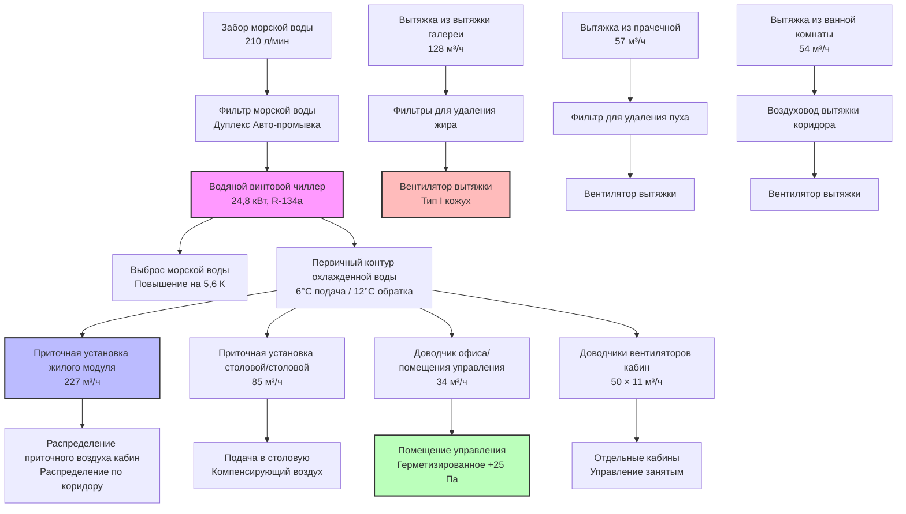

## Требования HVAC для буровых платформ

Буровые платформы сочетают интенсивные промышленные операции с жилыми помещениями в опасной морской среде. HVAC системы должны обеспечивать вентиляцию буровой палубы для рассеивания газов, выброс воздуха из кабины промывочной жидкости для контроля сероводорода и твердых частиц, климатический контроль в помещениях для точного буросбыт оборудования и комфортные жилые помещения для команд, работающих 12-часовые смены в течение многонедельных ротаций.

Конфигурации платформ, требующие специализированного HVAC:
- Винтовые буровые установки (расширение ног на 90-120 м)
- Полупогружаемые буровые платформы (плавучие, динамически позиционируемые)
- Буровые суда (судовые буровые операции)
- Платформенные буровые установки (стационарные конструкции буровых единиц)
- Вспомогательное бурение (плавучий жилой модуль плюс платформа скважины)

HVAC системы должны обеспечивать:
- Вентиляцию площади буровой палубы (классификация Зона 1/2 опасной зоны)
- Выброс воздуха из помещения обработки промывочной жидкости (H₂S, аэрозоли буровой жидкости, пыль бентонита)
- Вентиляцию площади встряхивателей сланца (высокая нагрузка по твердым частицам)
- Охлаждение подводной управления комнаты (точный температурный контроль ±1,1°C)
- Размещение 80-150 человек (24/7 занятость)
- Климатический контроль в кабине бурильщика (видимость через большие стеклянные панели)
- Непрерывная эксплуатация во время бурения скважины (без периодов остановки)

## Классификация опасных зон - буровые операции

Буровые платформы содержат несколько опасных зон, требующих взрывозащищенного оборудования HVAC и вентиляции с избыточным давлением.

### Классификация буровой палубы

**Зоны 1** (взрывоопасная атмосфера вероятна при нормальных операциях):
- Площадь ротационного стола при бурении
- Площадь скважины при циркуляции и извлечении
- Ямы встряхивателя сланца (воздействие промывочной жидкости с газом)
- Область линии возврата промывочной жидкости
- Площадь дегазатора (концентрация выделяемого газа)

**Зоны 2** (взрывоопасная атмосфера маловероятна, но возможна):
- Общая площадь буровой палубы на расстоянии более 4,5 м от скважины
- Кабина бурильщика (герметизированная, входы наружного воздуха в безопасных зонах)
- Площади обработки труб
- Площадь отката для хранения буровых труб

### Классификация площади обработки промывочной жидкости

**Зоны 1**:
- Область разряда сепаратора газа промывочной жидкости (высокая концентрация газа)
- Площадь дегазатора (непрерывное выделение газа)
- Точки разряда жидкости встряхивателя сланца
- Площадь смешивания промывочной жидкости (потенциал выделения сероводорода)

**Зоны 2**:
- Помещение насоса промывочной жидкости (закрытое пространство, потенциальные выпуски из манжет)
- Площадь резервуара промывочной жидкости (хранение и кондиционирование буровой жидкости)
- Площадь центрифуги (закрытое оборудование обработки)

Скорости вентиляции должны достигать концентрации газа ниже 25% от нижнего предела взрывоопасности (LEL) при нормальных операциях и ниже 60% LEL при сценариях аномального выпуска.

## Проектирование вентиляции буровой палубы

Вентиляция буровой палубы рассеивает углеводородные газы, выделяемые из возвратов буровой жидкости, и предотвращает накопление взрывоопасной атмосферы.

### Расчет нагрузки вентиляции

Общее требование к расходу воздуха сочетает разбавляющую вентиляцию для рассеивания газов с общей вентиляцией площади:

$$Q_{total} = \max(Q_{dilution}, Q_{area})$$

**Расход воздуха для разбавления газа**:

$$Q_{dilution} = \frac{G \times 10^6 \times SG}{LEL \times 0.25 \times \rho_{air}}$$

Где:
- $G$ = скорость выделения газа из буровой жидкости (м³/ч при стандартных условиях)
- $SG$ = удельный вес газа (метан = 0,554, H₂S = 1,19)
- $LEL$ = нижний предел взрывоопасности (метан = 5,0%, H₂S = 4,3%)
- $\rho_{air}$ = плотность воздуха (1,2 кг/м³ при стандартных условиях)
- коэффициент 0,25 поддерживает концентрацию на уровне 25% LEL с запасом безопасности

Для буровой операции с выделением 47 м³/ч метана из возвратов промывочной жидкости:

$$Q_{dilution} = \frac{47 \times 10^6 \times 0,554}{50000 \times 1,2} = 434 \text{ м³/ч}$$

**Расход воздуха для вентиляции площади**:

$$Q_{area} = V \times ACH$$

Для типичной буровой палубы (18 м × 24 м × 7,6 м высоты = 3 400 м³):
- Требование Зоны 1: минимум 15 ACH
- $Q_{area} = 3400 \times 15 / 60 = 850$ м³/ч

Расход проектирования: 850 м³/ч (вентиляция площади определяющая)

Добавить 25% запас на ветровые эффекты и деградацию оборудования: **1 063 м³/ч общей подачи**

### Структуры потоков воздуха

Вентиляция буровой палубы создает направленный поток воздуха из безопасных зон в опасные зоны:

**Распределение приточного воздуха**:
- Низкоскоростные диффузоры по периметру буровой палубы (безопасные зоны)
- Температура приточного воздуха на 5-8°C ниже окружающей для нисходящего потока (тяжелый холодный воздух подметает уровень палубы)
- Распределенная подача предотвращает мертвые зоны и застойные карманы
- Расход приточного воздуха на 5-10% больше вытяжного поддерживает небольшое избыточное давление относительно окружающей среды

**Удаление вытяжного воздуха**:
- Точки выхода расположены у встряхивателей сланца (наибольшая концентрация газа)
- Дополнительные выходы в площади ротационного стола и дегазатора
- Низкоуровневая вытяжка удаляет газы тяжелее воздуха (пропан, бутан, H₂S)
- Высокоуровневая вытяжка удаляет газы легче воздуха (метан)
- Вентиляторы вытяжки расположены в неопасных областях с воздуховодным подводом с буровой палубы

**Интеграция обнаружения газа**:
- Непрерывный мониторинг газа на ротационном столе, встряхивателях сланца, дегазаторе
- Нормальная операция: вентиляция при расходе проектирования
- Низкий сигнал тревоги газа (25% LEL): увеличить до максимального расхода, визуальная/звуковая сигнализация
- Высокий сигнал тревоги газа (60% LEL): аварийное отключение, эвакуация площади, активировать аварийную вентиляцию
- Блокировка предотвращает возобновление бурения до подтверждения операционной вентиляции

## Системы выброса воздуха из помещений обработки промывочной жидкости

Помещения обработки промывочной жидкости требуют высоких скоростей вытяжки для удаления сероводорода, контроля твердых частиц и теплоотвода из оборудования.

### Требования по выбросу воздуха по площадям

| Площадь | Скорость выброса | Загрязнитель | Основа проектирования |
|---------|------------------|--------------|----------------------|
| Встряхиватели сланца | 20-30 ACH | Аэрозоли буровой жидкости, пыль бентонита, газ | API RP 500, контроль твердых частиц |
| Помещение дегазатора | 30-40 ACH | Метан, H₂S, CO₂ | Разбавление газа до <25% LEL |
| Площадь смешивания промывочной жидкости | 15-20 ACH | Пыль барита, бентонит, пары щелочи | Соответствие ACGIH TLV |
| Помещение насоса промывочной жидкости | 12-15 ACH | Тепло, масляный туман, незначительные выпуски газа | Охлаждение оборудования, комфорт оператора |
| Площадь центрифуги | 20-25 ACH | Тонкие твердые частицы, жидкостный туман | Видимость, контроль опасности скольжения |

### Вентиляция сероводорода

Бурение в месторождениях с кислым газом (присутствует H₂S) требует улучшенной вентиляции и мониторинга:

**Разбавляющий расход воздуха для H₂S**:

$$Q_{H_2S} = \frac{R_{H_2S} \times 10^6}{C_{safe} \times 60}$$

Где:
- $R_{H_2S}$ = скорость выпуска H₂S (кг/ч из буровой жидкости)
- $C_{safe}$ = безопасная концентрация (10 ppm = 14,3 мг/м³ при длительном воздействии)
- Коэффициенты преобразования: 10⁶ мг/кг, 60 мин/ч

Для выпуска H₂S 2,3 кг/ч из дегазатора:

$$Q_{H_2S} = \frac{2,3 \times 10^6}{14,3 \times 60} = 2 674 \text{ м³/ч}$$

**Мониторинг и контроль H₂S**:
- Непрерывное обнаружение у дегазатора, встряхивателей сланца, резервуаров промывочной жидкости
- Низкий сигнал тревоги: 10 ppm (предел OSHA для 8-часовой смены)
- Высокий сигнал тревоги: 20 ppm (увеличить вентиляцию, исследовать источник)
- Сигнал эвакуации: 50 ppm (эвакуация площади, требуется SCBA для входа)
- Блокировка с буровыми операциями предотвращает циркуляцию промывочной жидкости при отказе вентиляции

### Контроль твердых частиц

Встряхиватели сланца и площади смешивания промывочной жидкости генерируют высокие концентрации твердых частиц, требующие захвата у источника и фильтрации:

**Кожухи встряхивателя сланца**:
- Закрытые единицы встряхивателя с интегральными соединениями вытяжки
- Скорость захвата: 30-45 м/мин на отверстиях кожуха
- Вытяжка в мешковые фильтры или циклонные сепараторы
- Рециркуляция воздуха на буровую палубу после фильтрации (рекуперация тепла)
- Утилизация собранных твердых веществ согласно нормативам опасных отходов

**Расход воздуха для сбора пыли**:

$$Q_{capture} = V_{capture} \times A_{opening}$$

Для кожуха встряхивателя с площадью отверстия 3,7 м², скорость захвата 37 м/мин:

$$Q_{capture} = 37 \times 3,7 = 237 \text{ м³/ч на один встряхиватель}$$

Установка с тремя встряхивателями: 710 м³/ч общей вытяжки через систему сбора пыли.

## HVAC жилых помещений - буровые платформы

Жилые помещения на буровых платформах вмещают команды на ротациях 14-28 дней, требуя условий комфорта, эквивалентных береговым объектам.

### Условия проектирования и нагрузки

**Внешние условия проектирования** (пример Мексиканского залива):
- Лето: 35°C DB, 27°C WB, 90% RH
- Зима: 2°C DB, 80% RH, ветер 30 км/ч
- Солнечная радиация: зависит от широты, отражение от воды увеличивает нагрузку на 10-15%
- Соляной туман: постоянный, требует коррозионностойких материалов

**Условия внутри помещения**:

| Тип помещения | Температура (°C) | Относительная влажность | Наружный воздух (м³/ч на человека) | Примечания |
|---|---|---|---|---|
| Спальные кабины | 22-23 | 45-55% | 12 | Индивидуальный контроль ±1,1°C |
| Офисы/помещения управления | 22-24 | 40-50% | 10 | Прецизионный контроль ±0,6°C электроники |
| Столовая/галерея | 23-24 | 50-60% | 12 | Более высокая скрытая нагрузка от занятости |
| Комната отдыха | 23-24 | 45-55% | 10 | Периодическая высокая занятость |
| Спортзал/фитнес | 21-22 | 40-50% | 14 | Более высокая вентиляция для упражнений |
| Медицинское учреждение | 22-23 | 40-60% | 12 | Избыточное давление, фильтрация HEPA |
| Прачечная | 24-27 | 50-70% | N/A | Высокая вытяжка, удаление влаги |

**Явная нагрузка охлаждения**:

$$Q_{sensible} = 1,08 \times Q \times \Delta T$$

$$Q_{sensible} = U \times A \times \Delta T + q_{solar} + q_{occupants} + q_{equipment} + q_{lighting}$$

Типичный модуль размещения на 150 человек:
- Оболочка здания: 128 000 кДж/ч (стены, крыша, окна)
- Солнечный прирост: 85 000 кДж/ч (южная/западная экспозиция)
- Явная нагрузка от занятых: 21 000 кДж/ч (150 человек × 140 кДж/ч явное)
- Оборудование: 53 000 кДж/ч (кухня, компьютеры, насосы)
- Освещение: 32 000 кДж/ч (LED светильники, 13 Вт/м²)
- **Общая явная нагрузка: 319 000 кДж/ч**

**Скрытая нагрузка охлаждения**:

$$Q_{latent} = 0,68 \times Q \times \Delta W$$

$$Q_{latent} = m_{moisture} \times h_{fg}$$

- Скрытая нагрузка от занятых: 26 500 кДж/ч (150 человек × 177 кДж/ч скрытое)
- Кухня/столовая: 57 000 кДж/ч (приготовление, мытье посуды)
- Прачечная: 28 000 кДж/ч (стирка, сушка вытяжки)
- Душ/ванная комната: 18 000 кДж/ч (купание, влага)
- Наружный воздух: 78 000 кДж/ч (1 500 м³/ч OA, 35°C/27°C WB на 24°C/50% RH)
- **Общая скрытая нагрузка: 207 500 кДж/ч**

**Общая нагрузка охлаждения**: 319 000 + 207 500 = 526 500 кДж/ч ≈ **20,7 кВт**

Добавить 20% запас безопасности и разнообразие: **24,8 кВт холодопроизводительность чиллера**

### Конфигурация системы

### Стратегия герметизации

Модули размещения поддерживают избыточное давление относительно промышленных зон, предотвращая вторжение паров углеводородов:

**Каскад давления**:
1. Чистые зоны (медицина, помещение управления): +37,5 Па относительно окружающей среды
2. Жилые помещения (кабины, коридоры): +25 Па
3. Полузащищенные зоны (столовая, отдых): +12 Па
4. Служебные зоны (прачечная, хранилище): +5 Па
5. Промышленные зоны (буровая палуба, кабина промывочной жидкости): 0,00 Па (эталон)

**Расход воздуха для герметизации**:

$$Q_{press} = Q_{leakage} + Q_{doors}$$

$$Q_{leakage} = C \times A \times \sqrt{\Delta P}$$

Где:
- $C$ = коэффициент потока (0,65 типичный для строительной конструкции)
- $A$ = площадь утечки (м²)
- $\Delta P$ = дифференциальное давление (Па)

Для модуля размещения (1 100 м² площади этажа, дифференциал 25 Па):
- Утечка конструкции: 0,15 м²/100 м² = 0,165 м² общая
- Утечка двери (8 дверей): 0,01 м²/дверь = 0,08 м²
- Общая площадь утечки: 0,245 м²

$$Q_{leakage} = 0,65 \times 0,245 \times \sqrt{25} = 0,797 \text{ м³/ч}$$

Добавить допуск открывания двери (115 м³/ч за дверь × 8 дверей × 5% цикл работы) = 46 м³/ч

**Общий расход воздуха для герметизации: 486 м³/ч избытка подачи над вытяжкой**

## HVAC подводного помещения управления

Подводные помещения управления содержат электронику для управления ПВО (устройство противовыброса), динамического позиционирования и автоматизации бурения, требующие точного контроля температуры и влажности.

### Анализ нагрузки охлаждения

**Рассеивание тепла электронного оборудования**:

| Тип оборудования | Количество | Тепловая нагрузка (кДж/ч) | Общая (кДж/ч) |
|---|---|---|---|
| Компьютеры управления бурением | 4 | 2 800 | 11 200 |
| Панели управления ПВО | 2 | 3 360 | 6 720 |
| Система динамического позиционирования | 1 | 8 960 | 8 960 |
| Оборудование связи | 3 | 1 350 | 4 050 |
| Системы ИБП | 2 | 4 480 | 8 960 |
| Мониторы и дисплеи | 12 | 450 | 5 400 |
| **Общая электроника** | - | - | **45 290** |

**Общая нагрузка охлаждения** (37 м² помещение управления):
- Электронное оборудование: 45 290 кДж/ч
- Оболочка (изолированная, внутри): 1 410 кДж/ч
- Освещение (LED, 11 Вт/м²): 960 кДж/ч
- Занятые (4 человека × 450 кДж/ч): 1 800 кДж/ч
- Наружный воздух (минимальный, только герметизация): 565 кДж/ч
- **Общая: 50 025 кДж/ч ≈ 1,97 кВт**

**Проектная производительность**: 2,5 кВт выделенная установка прецизионного кондиционирования воздуха (избыточность N+1: 2 × 2,5 кВт единиц)

### Требования управления температурой

Точное оборудование требует жесткого контроля температуры:
- Значение уставки: 22°C ± 0,6°C (требования центра обработки данных ASHRAE TC 9.9 Class A1)
- Скорость изменения: <2,8°C/ч предотвращает тепловой удар электроники
- Избыточные единицы охлаждения с автоматическим переключением при отказе
- Мониторинг температуры с сигналами тревоги на ±1,1°C отклонение
- Аварийное охлаждение поддерживает операцию при отказе первичной системы

## Климатический контроль кабины бурильщика

Кабина бурильщика требует видимости через большие стеклянные панели при поддержании комфортной температуры для оператора во время 12-часовых смен.

### Расчет солнечной нагрузки

**Нагрузка охлаждения из стекла**:

$$Q_{glass} = U \times A \times \Delta T + A \times SHGC \times I_{solar}$$

Где:
- $U$ = общий коэффициент теплопередачи (2,8 кДж/ч·м²·К для двойного стекла)
- $A$ = площадь стекла (11 м² типичные окна кабины бурильщика)
- $\Delta T$ = разница температур (35°C - 22°C = 13°C)
- $SHGC$ = коэффициент солнечного коэффициента прироста (0,35 для тонированного, низко-E стекла)
- $I_{solar}$ = интенсивность солнечного излучения (790 кДж/ч·м² пик, южная/западная экспозиция)

$$Q_{glass} = 2,8 \times 11 \times 13 + 11 \times 0,35 \times 790$$

$$Q_{glass} = 401 + 3 050 = 3 451 \text{ кДж/ч}$$

**Общая нагрузка кабины бурильщика**:
- Передача стекла и солнечная: 3 451 кДж/ч
- Стены/крыша: 1 700 кДж/ч
- Занятые (2 человека): 565 кДж/ч
- Оборудование (компьютеры, управление): 1 060 кДж/ч
- Наружный воздух (23,5 м³/ч): 425 кДж/ч
- **Общая: 7 201 кДж/ч ≈ 0,59 кВт**

**Проектирование системы**:
- Выделенная раздельная система или доводчик вентилятора
- Верхние приточные диффузоры предотвращают нисходящие потоки на окнах
- Радиационные нагревательные панели у стеклянных поверхностей предотвращают конденсацию в холодную погоду
- Герметизация поддерживает +25 Па относительно буровой палубы
- Резервная единица охлаждения обеспечивает избыточность для непрерывной эксплуатации

## Применимые стандарты и коды

Проектирование HVAC буровых платформ соответствует многочисленным международным стандартам, регулирующим безопасность в море и сертификацию оборудования.

### Рекомендуемые практики API

**API RP 14C**: Анализ, проектирование, установка и испытание базовых систем безопасности поверхности для морских производственных платформ
- Требования вентиляции для опасных зон
- Интеграция системы обнаружения газа с HVAC
- Последовательности аварийного отключения
- Критерии герметизации жилых помещений

**API RP 500**: Рекомендуемая практика для классификации мест расположения для установок электрооборудования на нефтяных объектах
- Определение степени опасной зоны
- Требования сертификации оборудования для Зоны 1/2
- Критерии адекватности вентиляции для рассекретации зоны

**API RP 14F**: Проектирование и установка электрических систем для стационарных и плавучих морских нефтяных объектов
- Требования взрывозащищенного электрооборудования HVAC
- Спецификации кожуха герметизированного и давления
- Методы прокладки кабелей в опасных местах

### Международные стандарты

**NORSOK S-002**: Рабочая среда (норвежский континентальный шельф)
- Требования к внутреннему климату жилых помещений
- Скорости вентиляции для морских жилых помещений
- Критерии шума и вибрации оборудования HVAC

**IEC 60079 серия**: Взрывоопасные атмосферы
- Сертификация оборудования для применений Зона 1/2
- Рейтинги температурных классов для компонентов HVAC
- Требования проверки и обслуживания

**Кодекс МАМС MODU**: Кодекс передвижных морских буровых установок
- Требования вентиляции жилых помещений
- Критерии производительности отопления и охлаждения
- Аварийная вентиляция для сценариев эвакуации

**ISO 13702**: Контроль и смягчение возгорания и взрывов на морских производственных установках
- Требования противопожарной заслонки и контроля дыма
- Последовательности отключения HVAC во время пожара
- Вентиляция для удаления дыма в закрытых пространствах

**DNVGL-OS-D201**: Электрические установки (Det Norske Veritas)
- Сертификация оборудования HVAC для морской среды
- Требования защиты от коррозии
- Спецификации устойчивости к вибрации и ударам

HVAC системы буровых платформ обеспечивают вентиляцию опасной зоны для рассеивания газов, системы выброса воздуха для контроля загрязнения в кабине промывочной жидкости, прецизионное охлаждение для буровой электроники и комфортные жилые помещения для морских команд. Соответствие рекомендуемым практикам API и международным стандартам морской безопасности обеспечивает безопасность персонала при поддержании надежности эксплуатации в требовательной морской среде. Надлежащая интеграция вентиляции с системами обнаружения газа, надежная герметизация безопасных зон и избыточное охлаждение критических оборудований обеспечивают непрерывные буровые операции в опасных и коррозионных условиях.
