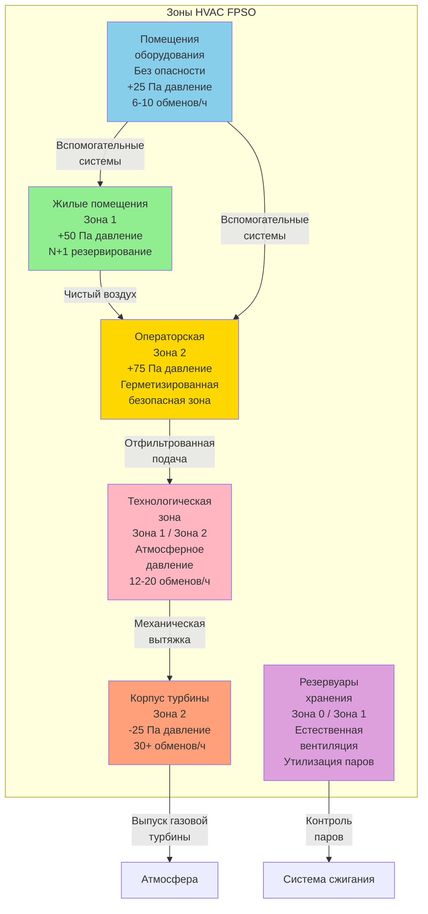

## Обзор судна FPSO

Плавучие системы производства, хранения и отгрузки нефти (FPSO) объединяют объекты производства нефти и газа с хранилищами и жилыми помещениями на переоборудованных или специально построенных танкерах. Эти суда работают в удаленных морских районах, перерабатывая сырую нефть и природный газ из подводных скважин при одновременном хранении продукции для периодической отгрузки на челночные танкеры.

Системы HVAC для FPSO сталкиваются с уникальными проблемами интеграции жилых комфортных систем для 100-200 сотрудников с промышленной вентиляцией опасных зон переработки углеводородов, все в условиях качки судна, воздействия соленых брызг, ограниченного пространства и строгих требований взрывозащиты.

### Характеристики судна

Типичные размеры и компоновка FPSO:
- Длина: 250-350 м
- Ширина: 40-60 м
- Водоизмещение: 150 000-350 000 DWT
- Вместимость персонала: 100-200 человек
- Площадь палубы обработки: 3 000-8 000 м²
- Жилые помещения: 2 500-5 000 м²
- Емкость хранилища: 1-2 миллиона баррелей сырой нефти

Зоны HVAC распределены по нескольким палубам:
- **Верхние палубы**: Жилые помещения, вертолетная площадка, радиорубка
- **Главная палуба**: Технологическое оборудование, сепараторы, насосы, компрессоры
- **Палуба резервуаров**: Резервуары хранения (обычно без экипажа)
- **Машинное отделение**: Генерация электроэнергии, подсобные помещения

## Расчет тепловых нагрузок HVAC для судна FPSO

Тепловые нагрузки FPSO сочетают приток теплоты морского судна с тепловыделением промышленных процессов и факторами, вызванными качкой.

### Расчет тепловой нагрузки жилых помещений

Общая тепловая нагрузка модуля размещения:

$$Q_{total} = Q_{sensible} + Q_{latent}$$

**Компоненты явного теплоотвода**:

$$Q_{sensible} = Q_{solar} + Q_{transmission} + Q_{occupants,sens} + Q_{lighting} + Q_{equipment} + Q_{ventilation,sens}$$

**Нагрузка от солнечной радиации** (увеличена для надстройки судна):

$$Q_{solar} = A_{wall} \times SHGC \times I_{solar} \times CLF$$

Где:
- $A_{wall}$ = площадь открытой стены (м²)
- $SHGC$ = коэффициент поглощения солнечной энергии (0,25-0,40 для тонированного стекла)
- $I_{solar}$ = интенсивность падающей солнечной радиации (300-1000 Вт/м² в зависимости от широты)
- $CLF$ = коэффициент охлаждения нагрузки (0,6-0,85 для тепловой массы)

Для экваториального FPSO с большими застекленными поверхностями:
- Площадь стены: 800 м²
- Пиковая солнечная радиация: 800 Вт/м²
- SHGC: 0,30
- CLF: 0,70

$$Q_{solar} = 800 \times 0,30 \times 800 \times 0,70 = 134 400 \text{ Вт} = 134,4 \text{ кВт}$$

**Теплопередача через стены и крышу**:

$$Q_{transmission} = U \times A \times \Delta T$$

Жилые помещения FPSO обычно изолированы до:
- Стены: U = 0,30 Вт/м²·K (эквивалент R-19)
- Крыша: U = 0,20 Вт/м²·K (эквивалент R-28)
- Окна: U = 2,0 Вт/м²·K (двойной слой)

При наружной температуре 35°C, внутренней 24°C:
- Площадь стены: 1 200 м² × 0,30 × 11°C = 3 960 Вт
- Площадь крыши: 500 м² × 0,20 × 11°C = 1 100 Вт
- Площадь окон: 200 м² × 2,0 × 11°C = 4 400 Вт

$$Q_{transmission} = 9 460 \text{ Вт} = 9,5 \text{ кВт}$$

**Тепловыделение от присутствия людей** (150 человек):

$$Q_{occupants} = N \times (Q_{sens,person} + Q_{lat,person})$$

- Явное теплоотвод: 150 человек × 75 Вт/человек = 11 250 Вт
- Скрытое теплоотвод: 150 человек × 55 Вт/человек = 8 250 Вт

**Освещение и оборудование**:
- Освещение: 2 500 м² × 15 Вт/м² = 37 500 Вт
- Оборудование: 2 500 м² × 10 Вт/м² = 25 000 Вт

**Вентиляционная нагрузка** (требование наружного воздуха):

$$Q_{ventilation} = \dot{m}_{air} \times c_p \times \Delta T$$

Наружный воздух: 150 человек × 25 cfm/человек = 3 750 cfm (1 770 л/с)

$$\dot{m}_{air} = 1 770 \text{ л/с} \times 1,2 \text{ кг/м}^3 = 2,12 \text{ кг/с}$$

Явная нагрузка (35°C наружной температуры, 24°C внутренней):

$$Q_{vent,sens} = 2,12 \times 1006 \times 11 = 23 460 \text{ Вт} = 23,5 \text{ кВт}$$

Скрытая нагрузка (наружное влагосодержание 0,020 кг/кг, внутреннее 0,009 кг/кг):

$$Q_{vent,lat} = \dot{m}_{air} \times h_{fg} \times \Delta W = 2,12 \times 2 501 \times 0,011 = 58 350 \text{ Вт} = 58,4 \text{ кВт}$$

**Общая охлаждающая нагрузка**:
- Явное теплоотвод: 134,4 + 9,5 + 11,3 + 37,5 + 25,0 + 23,5 = 241,2 кВт (68,6 тонн)
- Скрытое теплоотвод: 8,3 + 58,4 = 66,7 кВт (19,0 тонн)
- **Всего: 307,9 кВт (87,6 тонн)**

С коэффициентом безопасности (1,15) и коэффициентом одновременной нагрузки (0,90):

$$Q_{design} = 307,9 \times 1,15 \times 0,90 = 318 \text{ кВт} (90 \text{ тонн})$$

### Расчет вентиляционной нагрузки технологической зоны

Вентиляция палубы обработки удаляет тепло от оборудования и разбавляет летучие выбросы углеводородов:

$$Q_{process} = Q_{equipment} + Q_{solar,deck} + Q_{ventilation}$$

Теплоотвод оборудования (практические формулы):
- Газовые турбины: 300-500 кВт теплоизлучения на МВт вала
- Электродвигатели: 2,5% от номинальной мощности в виде тепла
- Насосы: 10-15% гидравлической мощности в виде тепла в окружающее пространство
- Технологические сосуды: 1-3 Вт/м² поверхности для изолированных сосудов

Для палубы обработки с установленной мощностью 10 МВт:

$$Q_{equipment} \approx 10 000 \text{ кВт} \times 0,03 = 300 \text{ кВт}$$

Вентиляция удаляет тепло, предполагая рост температуры:

$$Q_{ventilation} = \dot{V} \times \rho \times c_p \times \Delta T$$

При повышении температуры на 5°C выше окружающей среды и 20 обменов/ч для площади палубы 6 000 м²:

$$\dot{V} = 6 000 \text{ м}^3 \times 20 \text{ обменов/ч} = 120 000 \text{ м}^3/\text{ч} = 33,3 \text{ м}^3/\text{с}$$

$$Q_{ventilation} = 33,3 \times 1,2 \times 1006 \times 5 = 201 000 \text{ Вт} = 201 \text{ кВт}$$

## Системы HVAC жилых помещений

Модули проживания обеспечивают жилищный комфорт для морских работников, работающих в смены по 12 часов в течение 2-4 недельных ротаций.

### Условия проектирования

| Параметр | Требование | Примечание |
|----------|-----------|-----------|
| **Внутренняя температура** | 22-24°C | Индивидуальное управление в каютах ±2°C |
| **Относительная влажность** | 40-60% | Предотвращение конденсации и сухости |
| **Обмены воздуха** | 6-8 обменов/ч | Спальные помещения |
| **Наружный воздух** | 25 cfm/человек (12 л/с) | Непрерывная вентиляция |
| **Давление** | +50 Па | Относительно технологических зон |
| **Уровень шума** | NC 30-35 | Спальные помещения |
| **Фильтрация** | MERV 13 минимум | Удаление соли и твердых частиц |

### Конфигурация системы

**Центральная установка охлаждения**:
- Два холодильника 50%-ной мощности (резервирование N+1): по 200-300 кВт каждый
- Конденсаторы, охлаждаемые морской водой, с титановыми трубками
- Охлажденная вода: 7°C подача / 12°C возврат
- Первичное-вторичное насосное оборудование с переменным расходом
- Резервные насосы морской воды и теплообменники

**Распределение воздуха**:
- Центральные приточные установки для каждой палубы размещения
- Подача воздуха: 15-18°C при 90% RH
- Вентиляторные доводчики в индивидуальных каютах (2-трубные или 4-трубные системы)
- Боковые напольные диффузоры для обеспечения хорошего перемешивания
- Низкие вытяжные решетки предотвращают короткое замыкание

**Система отопления** (эксплуатация в холодном климате):
- Горячая вода из системы утилизации отработанного тепла (вода рубашки генератора)
- Резервные паровые или электрические котлы
- Горячая вода: 80°C подача / 60°C возврат
- Периметральное отопление через вентиляторные доводчики или радиантные панели
- Защита от замерзания для систем морской воды

### Проектирование HVAC в каютах

Индивидуальные спальные помещения (10-15 м²):
- Вентиляторный доводчик: 0,8-1,2 кВт охлаждающей способности
- Объем подачи воздуха: 100-150 cfm (50-75 л/с)
- Индивидуальное управление термостатом
- Вентиляция свежим воздухом: 25-35 cfm (12-17 л/с) от центральной приточной установки
- Акустическая изоляция: NRC 0,80 минимум на стенах/потолке
- Управление влажностью через центральную установку осушивания

## Вентиляция технологических зон

Вентиляция опасных зон поддерживает безопасную атмосферу в зонах переработки углеводородов.

### Классификация опасных зон

Технологические зоны FPSO классифицируются согласно IEC 60079-10-1 или API RP 505:

| Место расположения | Классификация | Требования к оборудованию | Вентиляция |
|---------|------------|-------------------|---------|
| Модули сепарации | Зона 1 | Ex d, Ex p, Ex e | 15-20 обменов/ч |
| Корпусы компрессоров | Зона 1 | Ex d двигатели, Ex p управление | 20-30 обменов/ч |
| Модули насосов | Зона 2 | Ex e двигатели | 12-15 обменов/ч |
| Корпусы турбин | Зона 2 | Ex e / общего назначения | 30-40 обменов/ч |
| Электрические помещения | Без опасности | Общего назначения | 8-10 обменов/ч |
| Аккумуляторные помещения | Опасное (H₂) | Ex d, принудительная вентиляция | 20-30 обменов/ч |

### Методология проектирования вентиляции

**Расчет числа обменов воздуха**:

$$ACH = \frac{Q_{required}}{V_{space}} \times 3600$$

Где:
- $Q_{required}$ = требуемый объемный расход (м³/с)
- $V_{space}$ = объем помещения (м³)
- 3600 = секунд в часе

Для модуля компрессора (200 м² × 6 м высота = 1 200 м³):

$$Q = \frac{1 200 \times 20}{3600} = 6,67 \text{ м}^3/\text{с} = 14 120 \text{ cfm}$$

**Разбавляющая вентиляция** для летучих выбросов:

$$Q_{dilution} = \frac{G \times K}{C_{max} - C_{ambient}}$$

Где:
- $G$ = скорость образования газа (л/мин)
- $K$ = коэффициент безопасности (4-10 для воспламеняющихся газов)
- $C_{max}$ = максимально допустимая концентрация (обычно 25% НПВ)
- $C_{ambient}$ = концентрация окружающего воздуха (0 для свежего воздуха)

Для утечки метана (НПВ = 5% по объему):
- $C_{max}$ = 0,05 × 0,25 = 0,0125 (1,25% по объему)
- Предполагаемая утечка: 10 л/мин метана
- Коэффициент безопасности: 6

$$Q_{dilution} = \frac{10 \times 6}{0,0125} = 4 800 \text{ л/мин} = 80 \text{ л/с} = 170 \text{ cfm}$$

### Особенности вентиляционной системы

**Проектирование направления потока воздуха**:
- Подача воздуха на высокий уровень, движение вниз
- Вытяжка на низком уровне удаляет более тяжелые углеводороды (пропан, бутан)
- Вытяжка на высоком уровне удаляет более легкие газы (метан)
- Направленный поток из безопасных зон в опасные
- Моделирование CFD подтверждает адекватное перемешивание и удаление газов

**Выбор вентиляторов**:
- Взрывозащищенные двигатели (Ex d) в зонах 1
- Неискрящиеся рабочие колеса (алюминий или устойчивые к искрам сплавы)
- Ременная передача изолирует двигатель от потока воздуха
- Приводы с переменной скоростью для оптимизации энергопотребления
- Резервные вентиляторы: 2×100% мощности для критических зон

**Интеграция газовой сигнализации**:
- Непрерывное контролирование в потенциальных местах утечек
- Нормальная работа: расчетный объем вентиляции
- Обнаружение газа (>10% НПВ): увеличение до максимального потока
- Высокая концентрация газа (>25% НПВ): тревога и аварийные процедуры
- Блокировка вентиляции предотвращает запуск оборудования без адекватного потока воздуха

## Герметизация операторской

Центральные операторские поддерживают атмосферу без взрывов для персонала и контрольно-измерительных приборов во время событий выброса газа.

### Требования герметизации

Проектный перепад давления: +75 Па относительно наружной атмосферы

**Расчет утечек**:

$$Q_{leakage} = C \times A_{leak} \times \sqrt{\Delta P}$$

Где:
- $C$ = коэффициент расхода = 776 для единиц SI (cfm/ft² при 1 in. w.c.)
- $A_{leak}$ = эквивалентная площадь утечки (м² или ft²)
- $\Delta P$ = перепад давления (Па или in. w.c.)

Для операторской (250 м², 4 двери, плотная конструкция):
- Утечка через двери: 0,014 м² на дверь = 0,056 м² всего
- Утечка через стены/потолок: 0,001 м²/м² × 350 м² = 0,350 м²
- Общая утечка: 0,406 м² (4,37 ft²)

Преобразование в британские единицы для стандартного уравнения:

$$Q_{leakage} = 776 \times 4,37 \times \sqrt{0,30} = 1 856 \text{ cfm}$$

Добавление коэффициента безопасности (1,20) и учет открытия дверей:

$$Q_{supply} = 1 856 \times 1,20 = 2 227 \text{ cfm} \approx 2 250 \text{ cfm}$$

### Проектирование системы герметизации

**Система подачи воздуха**:
- Выделенные вентиляторы подачи: 2×100% мощности с автоматическим переключением
- HEPA фильтры: категория H13 удаляет 99,95% частиц 0,3 мкм
- Фильтры с активированным углем: удаление паров углеводородов (опционально)
- Место забора воздуха: с наветренной стороны и выше палубы обработки
- Объем подачи воздуха: 2 500 cfm (1 180 л/с) с учетом использования дверей

**Управление давлением**:
- Датчик дифференциального давления: точность ±0,05 Па
- Модулирующий клапан сброса поддерживает заданное значение
- Сигнализация низкого давления: <50 Па запускает звуковой/световой сигнал
- Предел высокого давления: >100 Па открывает клапан сброса для предотвращения проблем с открыванием дверей
- Интеграция с системой управления зданием

**Аварийный ответ**:
- Обнаружение газа снаружи операторской: закрытие напорных заслонок, герметизация помещения
- Аварийная емкостная система со сжатым воздухом (запас 30-60 минут)
- Аварийная депрессуризация позволяет доступ пожарным
- Цикл очистки после события восстанавливает безопасную атмосферу

## Требования к взрывозащищенному оборудованию

Электрическое оборудование в опасных зонах должно предотвращать воспламенение взрывоопасных атмосфер.

### Выбор оборудования по зонам

**Требования Зоны 1** (Ex d - Взрывоустойчивый):
- Пускатели моторов и контакторы в взрывозащищенных корпусах
- Алюминиевые или стальные корпусы, рассчитанные на газовую группу IIB, температурный класс T3
- Кабельные вводы через сертифицированные уплотнители с надлежащим захватом резьбы
- Панели управления в герметизированных/герметизируемых корпусах (Ex p)

**Требования Зоны 2** (Ex e - Повышенная безопасность):
- Двигатели с улучшенной изоляцией и контролем температуры
- Неискрящиеся вентиляторы и рабочие колеса
- Закрытые и уплотненные электрические коробки
- Оборудование общего назначения приемлемо, если доказана неинцендивность

### Спецификации оборудования

Типичный взрывозащищенный электродвигатель вентилятора:
- Мощность: 15 кВт, 1 750 об/мин
- Корпус: Ex d IIB T3 (взрывоустойчивый, газовая группа IIB, температурный класс T3)
- Сертификация: IECEx, ATEX или местные органы власти
- Максимальная температура поверхности: 200°C (намного ниже температуры воспламенения метана 537°C)
- Штраф по весу: 2,0× вес стандартного двигателя

## Защита от коррозии и материалы

Морская атмосфера и постоянное воздействие соленых брызг требуют комплексной защиты от коррозии.

### Выбор материалов

| Компонент | Материал | Покрытие/защита | Ожидаемый срок |
|-----------|----------|-----------------|--------------|
| Воздуховоды (наружные) | Алюминиевый сплав 5086 | Анодирование + эпоксидная краска | 20-25 лет |
| Воздуховоды (внутренние) | Оцинкованная сталь | Отсутствует (защищенная среда) | 20+ лет |
| Вентиляторы (воздействие морской воды) | Нержавеющая сталь 316 | Не требуется | 25+ лет |
| Корпусы приточных установок | Алюминий или композит | Полиэфирный гелькоут | 15-20 лет |
| Трубопроводы (морская вода) | Титан или медно-никелевый сплав 90/10 | Не требуется (внутренняя коррозионная стойкость) | 30+ лет |
| Трубопроводы (охлаждающая вода) | Углеродистая сталь | Внутреннее оцинкование | 20-25 лет |
| Жалюзи и решетки | Алюминий 6063 | Анодирование, порошковое покрытие | 15-20 лет |
| Заслонки | Нержавеющая сталь 316 | Не требуется | 25+ лет |

### Стратегии защиты от коррозии

**Конструктивные особенности**:
- Герметизация оборудования в климатизируемых помещениях, где возможно
- Дренажные отверстия предотвращают скопление воды в воздуховодах
- Наклонные участки воздуховодов избегают горизонтальных плоских секций
- Съемные панели доступа позволяют внутреннее обследование
- Жертвенные аноды на оборудовании, охлаждаемом морской водой

**Программа обслуживания**:
- Ежеквартальное обследование состояния покрытия
- Ежегодное промывание пресной водой открытого оборудования
- Двухгодичное тестирование толщины критических металлических компонентов
- Немедленное подкрашивание повреждений покрытия
- Мониторинг защиты системы в системах морской воды

## Применяемые стандарты и нормы

### Международные морские стандарты

**Правила классификационных обществ**:
- DNV-GL Rules for Classification of Ships, Part 6 Chapter 6: Системы HVAC
- ABS Rules for Building and Classing Steel Vessels: Системы машиностроения и трубопроводы
- Lloyd's Register Rules and Regulations: Системы контроля окружающей среды

### Стандарты опасных зон

**Сертификация оборудования**:
- Серия IEC 60079: Взрывоопасные атмосферы - Требования к оборудованию
- IEC 60079-10-1: Классификация зон - Взрывоопасные газовые атмосферы
- Директива ATEX 2014/34/EU: Оборудование для взрывоопасных атмосфер (Европейская)
- Система IECEx: Международная сертификация оборудования для взрывоопасных атмосфер

**Требования к установке**:
- API RP 505: Рекомендуемая практика классификации мест расположения электрических установок на нефтяных объектах
- NFPA 70 (NEC) Статьи 500-505: Опасные расположения
- IEC 60092-502: Электрические установки на судах - Танкеры

### Стандарты проектирования HVAC

**Вентиляция и комфорт**:
- ISO 8861: Судостроение - вентиляция машинного отделения на дизельных судах
- ISO 7547: Суда - кондиционирование воздуха и вентиляция помещений размещения
- ASHRAE 62.1: Вентиляция для приемлемого качества воздуха в помещениях (адаптировано для морских судов)

**Оффшорные специалисты**:
- API RP 14C: Анализ, проектирование, установка и тестирование базовых систем безопасности на поверхности
- NORSOK S-002: Рабочая среда (норвежский оффшорный стандарт)
- ISO 13702: Управление и смягчение пожаров и взрывов на оффшорных производственных установках

Системы HVAC для FPSO интегрируют разнообразные требования - обеспечивают комфортное проживание для длительных оффшорных ротаций при одновременном поддержании безопасных атмосфер в опасных технологических зонах. Успешные проекты балансируют комфорт персонала, интеграцию систем безопасности, резервирование оборудования, коррозионную стойкость морской среды и соответствие множеству международных стандартов, регулирующих как морские суда, так и оффшорные нефтегазовые объекты.
