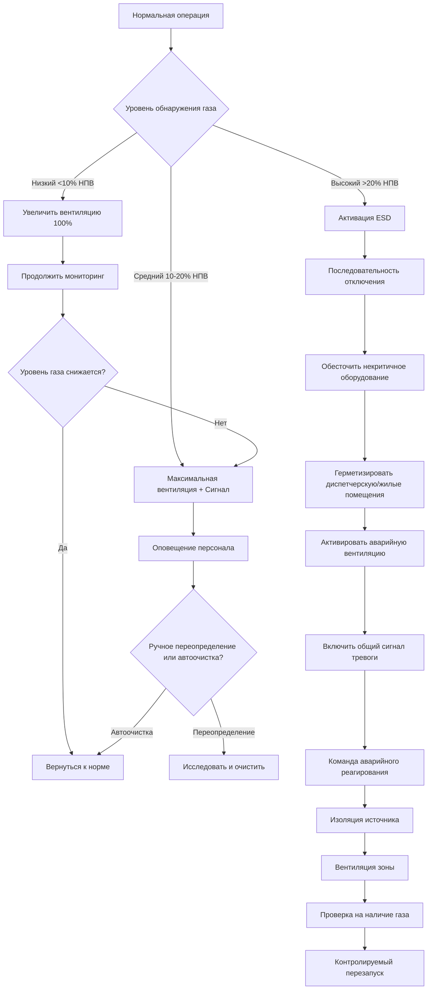

## Основы проектирования HVAC на нефтяных платформах

Системы HVAC на нефтяных платформах работают в наиболее сложных условиях промышленной среды, сочетая риск взрывоопасной атмосферы с постоянными требованиями по обеспечению жилыми помещениями персонала. Такие установки требуют одновременного соответствия кодексам нефтяной безопасности, стандартам электротехники для опасных зон и критериям комфорта людей при обеспечении работы 24/7 в агрессивной морской среде.

Стационарные и плавучие платформы добычи представляют собой пик сложности инженерного проектирования HVAC. Системы должны предотвращать скопление взрывоопасного газа в технологических зонах, поддерживать избыточное давление в диспетчерских и жилых помещениях, обеспечивать возможность аварийного отключения, скоординированного с системами обнаружения пожара и газа, и противостоять ускоренной деградации от соляных брызг и температурных перепадов.

## Влияние классификации опасных зон на HVAC

Классификация зон принципиально определяет выбор оборудования, методы установки и стратегии работы системы. Процесс классификации выявляет места, где концентрации углеводородов взрывоопасного уровня могут существовать при нормальной или ненормальной эксплуатации.

### Классификация зон для оборудования HVAC

Размещение оборудования HVAC следует методологиям классификации зон API RP 500 и NFPA 70 Article 500:

**Зоны Class I, Division 1**:
- Буровая площадка во время скважинных операций
- Платформы устья скважины и технологические палубы
- Внутри грязевых ямы и зоны шейкеров
- Насосные помещения со службой лёгких углеводородов
- Помещения аварийных генераторов на дизельном топливе

Оборудование HVAC в зонах Division 1 требует взрывозащищённого исполнения (NFPA 70 Type X, Y или Z с продувкой) или удаления из классифицированных зон. Большинство проектов исключают устройства HVAC из зон Division 1 посредством надлежащего разделения зон и вентиляции.

**Зоны Class I, Division 2**:
- Зоны, прилегающие к зонам Division 1
- Закрытые буровые площадки
- Помещения оборудования, содержащие трубопроводы с углеводородами
- Аккумуляторные помещения и хранилища химикатов
- Трубопроводные проходы и зоны перекачки

Division 2 допускает стандартное промышленное оборудование HVAC с ограничениями на компоненты с дугообразованием и температуру поверхности. Двигатели должны быть полностью закрытыми, электрические корпуса должны предотвращать излучение воспламеняющейся искры, и температура поверхности должна оставаться ниже классификации T3 (200°C).

**Неклассифицированные зоны**:
- Жилые помещения и модули проживания
- Диспетчерские с избыточным давлением
- Комнаты радиосвязи
- Офисы и столовые
- Медицинские и рекреационные помещения

Стандартное коммерческое оборудование HVAC приемлемо с надлежащей защитой от окружающей среды для морской службы.

### Выбор оборудования HVAC по классификации

| Классификация зоны | Двигатели вентиляторов | Электрические управления | Воздуховоды | Воздухозаборники | Типичные применения |
|---------------------|------------------------|--------------------------|-------------|------------------|---------------------|
| Division 1 | Взрывозащищённые (Ex d) или с продувкой (Ex p) | Внутренне безопасные или взрывозащищённые | Искронепроницаемые, заземленные | В безопасной зоне | Вентиляция технологических зон, охлаждение устья |
| Division 2 | TEFC двигатели, температура поверхности <200°C | Герметизированные контакторы, защищённые пускатели | Стандартные промышленные, заземленные | Экранированные, защищённые от птиц | Закрытые буровые площадки, помещения оборудования |
| Неклассифицированные | Стандартные промышленные двигатели | Стандартные управления | Стандартные воздуховоды HVAC | Защищённые от погоды жалюзи | HVAC проживания, диспетчерские |

## Системы защиты избыточного давления

Избыточное давление предотвращает проникновение опасной атмосферы в критические пространства, содержащие персонал или оборудование, способное вызвать воспламенение. Эти системы представляют основную защиту от миграции взрывоопасного газа.

### Проектирование pressurization диспетчерской

Диспетчерские требуют непрерывного избыточного давления в соответствии с API RP 14C Section 7. Проектирование поддерживает среду, свободную от взрывоопасных веществ, для оперативного персонала и электрического/электронного оборудования.

**Требования дифференциального давления**:

Минимальный дифференциал давления:

$$\Delta P_{min} = 12,5 \text{ Па}$$

Типичный рабочий дифференциал:

$$\Delta P_{operating} = 25 - 37 \text{ Па}$$

Максимальный дифференциал (предел работоспособности двери):

$$\Delta P_{max} = 75 \text{ Па}$$

**Расчёт утечки воздуха**:

Расходный воздух должен преодолевать утечку конверта при проектном дифференциале давления:

$$Q_{leakage} = A_{leak} \cdot C \cdot \sqrt{\Delta P}$$

Где:
- $Q_{leakage}$ = расход утечки воздуха (м³/ч)
- $A_{leak}$ = общая эффективная площадь утечки (м²)
- $C$ = 1,620 (константа для стандартного воздуха)
- $\Delta P$ = дифференциал давления (Па)

**Оценка площади утечки**:

Для типичной морской конструкции диспетчерской:

Утечка через дверь на дверь:

$$A_{door} = 0,011 - 0,017 \text{ м}^2 \text{ на дверь}$$

Утечка конструкции стены/потолка:

$$A_{construction} = 0,0001 - 0,0003 \text{ м}^2 \text{ на м}^2 \text{ площади поверхности}$$

Утечка через проходы (кабелепроводы, трубопроводы):

$$A_{penetration} = 0,005 - 0,009 \text{ м}^2 \text{ всего}$$

**Пример проектирования**:

Спецификации диспетчерской:
- Площадь пола: 185,8 м²
- Высота потолка: 3,05 м
- 4 двери персонала
- Расчётная площадь стены: 74,3 м²
- Проектный дифференциал: 12,5 Па

Расчёт общей площади утечки:

$$A_{leak} = (4 \times 0,014) + (74,3 \times 0,0002) + 0,007 = 0,056 + 0,015 + 0,007 = 0,078 \text{ м}^2$$

Расчёт требуемого расхода приточного воздуха:

$$Q_{supply} = 0,078 \times 1,620 \times \sqrt{12,5} = 445 \text{ м}^3\text{/ч}$$

Добавление коэффициента безопасности (25%):

$$Q_{design} = 445 \times 1,25 = 556 \text{ м}^3\text{/ч}$$

Добавление требования вентиляции наружного воздуха (9,4 м³/ч на человека, 15 человек):

$$Q_{total} = 556 + 141 = 697 \text{ м}^3\text{/ч минимальная подача}$$

### Каскад давления модуля проживания

Жилые помещения применяют многоступенчатое давление для создания множественных барьеров против проникновения опасного газа:

**Проектирование каскада давления**:

$$P_{quarters} > P_{corridors} > P_{vestibules} > P_{industrial} > P_{process}$$

Типичное многоступенчатое давление:

| Зона | Давление относительно наружного воздуха | Давление относительно промышленной зоны |
|------|-------------------------------------------|----------------------------------------|
| Спальные помещения | +12,5 Па | +12,5 Па |
| Коридоры/общие зоны | +8,75 Па | +8,75 Па |
| Вестибюли | +6,25 Па | +6,25 Па |
| Промышленные/помещения оборудования | 0 Па | 0 Па (эталон) |
| Технологическая палуба (открытая) | -2,5 Па | -2,5 Па |

**Потери воздуха через вестибюль**:

Проход персонала вызывает временную потерю давления. Объём вестибюля обеспечивает буфер:

$$V_{vestibule} = Q_{loss} \times t_{passage} / (\Delta P_{drop,max})$$

Где:
- $V_{vestibule}$ = объём вестибюля (м³)
- $Q_{loss}$ = потери воздуха при открытии двери (м³/ч)
- $t_{passage}$ = время прохода (минуты)
- $\Delta P_{drop,max}$ = допустимое падение давления (Па)

Типичный вестибюль: 1,8 м × 1,8 м × 2,4 м = 7,78 м³

## Интеграция аварийного отключения

Системы HVAC интегрируются с логикой аварийного отключения (ESD) для реагирования на условия газоdetection, пожара или нарушения технологического процесса.

### Последовательности реагирования ESD

### Функции HVAC ESD по зонам

| Зона/Система | ESD Уровень 1 (Низкий газ) | ESD Уровень 2 (Средний газ) | ESD Уровень 3 (Высокий газ/Пожар) |
|-------------|---------------------------|------------------------------|-----------------------------------|
| Вентиляция технологической зоны | Увеличить до 100% мощности | Увеличить до максимальной мощности | Продолжить работу (режим продувки) |
| Приток проживания | Нормальная работа | Увеличить фильтрацию | Герметизация, только рециркуляция |
| Диспетчерская | Поддерживать избыточное давление | Увеличить приток на 25% | Режим герметизации, резервный воздухозаборник |
| Помещения оборудования | Нормальная вентиляция | Максимальная вентиляция | Отключение при наличии в зоне |
| Буровая площадка | Нормальная работа | Максимальный выброс | Отключение некритичного, поддержание аварийного |
| Помещение аварийного генератора | Нормальная работа | Увеличить охлаждение | Максимальное охлаждение, обеспечить работу |

## Требования к вентиляции опасных зон

Технологические и буровые зоны требуют непрерывной механической вентиляции для предотвращения скопления взрывоопасной атмосферы.

### Расчёты скорости вентиляции

**Метод минимальной смены воздуха**:

$$Q_{ACH} = \frac{V_{space} \times ACH}{60}$$

Где:
- $Q_{ACH}$ = расход воздуха (м³/ч)
- $V_{space}$ = объём пространства (м³)
- $ACH$ = смены воздуха в час (ч⁻¹)

**Разбавляющая вентиляция для непрерывных источников газа**:

$$Q_{dilution} = \frac{G_{release} \times 10^6}{C_{safe} \times \rho_{air}}$$

Где:
- $Q_{dilution}$ = расход разбавляющей вентиляции (м³/ч)
- $G_{release}$ = скорость выделения газа (кг/мин)
- $C_{safe}$ = безопасная концентрация (обычно 25% НПВ, ppm)
- $\rho_{air}$ = плотность воздуха (1,2 кг/м³ стандартная)

**Объёмный метод разбавления API RP 500**:

Для закрытых зон, содержащих оборудование Class I:

$$Q_{API} = \frac{V_{space}}{2} \times \frac{1}{60}$$

Это обеспечивает минимум 30 воздухообменов в час для закрытых технологических зон.

### Скорости вентиляции по типам зон

| Классификация зоны | Минимум ACH | Типичный проектный ACH | Место выброса | Место приточного воздуха |
|-------------------|------------|----------------------|-----------------|------------------------|
| Закрытая буровая площадка | 12 | 15-20 | Высокий уровень (метан) + Низкий уровень (дизель) | Боковое низкое |
| Зона грязевой ямы | 15 | 20-30 | Высокий уровень, непрерывный | Направленный, от источника воспламенения |
| Помещения технологического оборудования | 15 | 20-25 | Высокий + низкий уровень | Множественные точки |
| Аккумуляторные помещения | 12 | 15-20 | Высокий уровень (водород) | Приток низкого уровня |
| Хранилища краски/химикатов | 20 | 30-40 | Низкий уровень (удаление паров) | Приток высокого уровня |
| Закрытые зоны устья | 12 | 15-20 | Высокий уровень | Защищённые от погоды |

## Взрывозащищённое оборудование HVAC

Оборудование, установленное в зонах Division 1 или Division 2, требует специфичной конструкции и сертификации.

### Требования к двигателям и приводам

**Двигатели для Division 1**:
- Взрывозащищённая конструкция в соответствии с NFPA 70 Section 501.125
- Проектирование фламепровода предотвращает передачу воспламенения
- Только внешнее охлаждение (без внутренней вентиляции)
- Классификация температуры T3 (максимальная температура поверхности 200°C)
- Сертифицировано NRTL (FM, UL, CSA) для Class I, Group C или D
- Типичное снижение мощности: 15-25% от стандартного двигателя

**Двигатели для Division 2**:
- Полностью закрытая конструкция с охлаждением вентилятором (TEFC)
- Без открытых компонентов с дугообразованием
- Температура поверхности ниже температуры воспламенения
- Стандартная конструкция NEMA приемлема с ограничениями
- Материалы вентилятора без искр (алюминий, пластик)

### Электрические управления и устройства

| Компонент | Требование Division 1 | Требование Division 2 | Типичное применение |
|-----------|----------------------|----------------------|---------------------|
| Пускатели двигателя | Взрывозащищённый или продуваемый корпус | Герметизированные контакторы в универсальном корпусе | Пускатели вентилятора/насоса |
| Выключатели отключения | Взрывозащищённый корпус | Стандартный закрытый выключатель | Отключение оборудования |
| Частотные преобразователи | Продуваемый/находящийся под давлением корпус (Type Z) | Заключенные в вентилируемое помещение | Управление вентилятором технологической зоны |
| Термостаты/датчики | Внутренне безопасные схемы или взрывозащищённые | Стандартные закрытые | Мониторинг температуры |
| Приводы заслонки | Взрывозащищённый двигатель, герметизированная электроника | Двигатель TEFC, закрытое управление | Управление вентиляцией |

### Продуваемые и находящиеся под давлением корпуса

NFPA 496 и ISA 12.4.01 определяют классификации продуваемых корпусов:

**Type X (служба Division 1)**:
- Снижает опасную классификацию внутри корпуса до неклассифицированной
- Защитное газовое давление поддерживается во время работы
- Блокировки предотвращают включение энергии до завершения продувки
- Требуется минимум 4 смены объёма корпуса перед включением
- Непрерывный мониторинг давления и потока
- Сигнал и отключение при потере давления

**Type Y (интерфейс Division 1/Division 2)**:
- Снижает Division 1 внутри корпуса к Division 2
- Сниженные требования объёма защитного газа
- Упрощённая логика блокировки

**Type Z (служба Division 2)**:
- Предотвращает проникновение атмосферы Division 2
- Минимальное требуемое давление
- Используется для центров управления двигателем, зданий анализаторов

Расчёт объёма продувки:

$$V_{purge} = V_{enclosure} \times N_{volumes} \times \frac{P_{operating} + 101,3}{101,3}$$

Где:
- $V_{purge}$ = общий объём продувки (м³)
- $V_{enclosure}$ = внутренний объём корпуса (м³)
- $N_{volumes}$ = число смен объёма (4 для Type X)
- $P_{operating}$ = рабочее манометрическое давление (кПа)

## Архитектура системы HVAC на нефтяной платформе

```mermaid
graph TB
    subgraph "Технологическая палуба - Division 1/2"
        A[Зона устья скважины] --> B[Выхлопные вентиляторы - Ex d двигатели]
        C[Зона сепаратора] --> B
        D[Помещение компрессора] --> E[Выделенный выброс - Type Z VFD]
    end

    subgraph "Буровая палуба - Division 2"
        F[Буровая площадка] --> G[Выхлопные вентиляторы высокой мощности]
        H[Зона грязевой ямы] --> G
        I[Шейкер] --> G
        G --> J[Взрывозащищённые выхлопные вентиляторы]
    end

    subgraph "Палуба оборудования - Division 2/Неклассифицированные"
        K[Помещение генератора] --> L[Воздух горения + Охлаждение]
        M[Электрическое помещение] --> N[Блоки охлаждения высокой точности]
        O[Аккумуляторное помещение] --> P[Выброс водорода - Высокий уровень]
    end

    subgraph "Модуль проживания - Неклассифицированные"
        Q[Центральный ВДОУ] --> R[Катушки охлаждённой воды]
        S[Охлаждаемый морской водой чиллер] --> R
        Q --> T[Фильтрация HEPA + Активированный уголь]
        T --> U[Приток избыточного давления]
        U --> V[Жилые помещения +12,5 Па]
        U --> W[Коридоры +8,75 Па]
        U --> X[Вестибюли +6,25 Па]
    end

    subgraph "Диспетчерская - Защищённая область с избыточным давлением"
        Y[Выделенный приточный вентилятор] --> Z[Резервный приточный вентилятор]
        Z --> AA[Цепь фильтрации]
        AA --> AB[Диспетчерская +18,75 Па]
        AB --> AC[Монитор давления]
        AC --> AD{Давление OK?}
        AD -->|Нет| AE[Сигнал низкого давления]
        AD -->|Да| AF[Нормальная операция]
    end

    subgraph "Системы аварийного реагирования"
        AG[Система обнаружения газа] --> AH{Уровень газа}
        AH -->|Низкий| AI[Увеличить вентиляцию]
        AH -->|Высокий| AJ[Активация ESD]
        AJ --> AK[Герметизировать проживание]
        AJ --> AL[Герметизировать диспетчерскую]
        AJ --> AM[Максимальная вентиляция технологической зоны]
    end

    B --> AN[Выброс в атмосферу]
    J --> AN
    P --> AN

    style A fill:#ff9999
    style C fill:#ff9999
    style F fill:#ffcc99
    style H fill:#ffcc99
    style V fill:#99ff99
    style AB fill:#99ccff
```

## Особенности расчёта нагрузок

Нагрузки HVAC на нефтяных платформах значительно отличаются от обычных зданий из-за непрерывной работы, высоких внутренних выделений и экстремального воздействия окружающей среды.

### Охлаждающие нагрузки модуля проживания

**Приток солнечной энергии**:

$$Q_{solar} = A_{surface} \times SHGC \times SHGF \times CLF$$

Где:
- $A_{surface}$ = площадь открытой поверхности (м²)
- $SHGC$ = коэффициент пропускания солнечной энергии
- $SHGF$ = коэффициент прибыли от солнечной энергии (кДж/(ч·м²))
- $CLF$ = коэффициент охлаждающей нагрузки

Для низкоширотных платформ приток солнечной энергии увеличивается на 15-25% по сравнению с проектом для средних широт из-за высокого солнечного угла и интенсивности.

**Передачи тепла через изолированные стены**:

$$Q_{transmission} = U \times A \times (T_{outdoor} - T_{indoor}) \times CLTD$$

С морским воздействием и белой окраской поверхностей:

$$U_{effective} = \frac{1}{R_{insulation} + R_{interior} + R_{exterior,marine}}$$

$R_{exterior,marine}$ снижена на 20% из-за ветровой нагрузки.

**Выделение тепла персоналом (явное и скрытое)**:

Высокие уровни активности в морской работе:

$$Q_{sensible,person} = 73 - 88 \text{ кДж/ч на человека}$$
$$Q_{latent,person} = 59 - 74 \text{ кДж/ч на человека}$$

**Нагрузки оборудования**:

- Офисное оборудование: 54-108 Вт/м²
- Оборудование камбуза: 11,7-23,4 кДж/ч всего
- Оборудование прачечной: 8,8-14,6 кДж/ч
- Оборудование тренажёрного зала: 0,59-0,88 кДж/ч на аппарат

### Охлаждающие нагрузки технологической зоны

Отвод тепла оборудованием доминирует в нагрузках технологической зоны:

**Отвод тепла компрессором**:

$$Q_{compressor} = \frac{HP_{brake} \times 0,746}{efficiency} \times (1 - \eta_{motor})$$

**Потери трансформатора**:

$$Q_{transformer} = kVA_{rating} \times (losses_{no-load} + losses_{load})$$

Типичные: 1,5-2,5% от номинала трансформатора как тепло.

**Приток тепла трубопровода и сосуда** (неизолированный или деградированная изоляция):

$$Q_{pipe} = \frac{2\pi L k (T_{fluid} - T_{ambient})}{\ln(r_{outer}/r_{inner})}$$

## Применимые коды и стандарты

### Основные стандарты проектирования

**Рекомендуемые практики API**:
- API RP 500: Рекомендуемая практика по классификации мест для электрических установок на объектах переработки нефти (Class I, Division 1 и 2)
- API RP 505: Рекомендуемая практика по классификации мест для электрических установок на объектах переработки нефти (Zone 0, 1 и 2)
- API RP 14C: Анализ, проектирование, установка и испытание базовых поверхностных систем безопасности для морских платформ добычи
- API RP 14F: Проектирование и установка электрических систем для стационарных и плавучих морских нефтяных установок

**Стандарты NFPA**:
- NFPA 70 (NEC): Национальный электротехнический код, Articles 500-505 (Опасные места)
- NFPA 496: Стандарт для продуваемых и находящихся под давлением корпусов электрического оборудования
- NFPA 30: Кодекс горючих и легковоспламеняющихся жидкостей

**Международные стандарты**:
- IEC 60079-10-1: Взрывоопасные атмосферы - Классификация мест (газ и пары)
- IEC 60079-0: Взрывоопасные атмосферы - Оборудование - Общие требования
- ISO 13702: Нефтяная и газовая промышленность - Управление и снижение пожаров и взрывов

**Морская классификация**:
- ABS Rules for Building and Classing Mobile Offshore Drilling Units (MODU)
- DNV-GL Offshore Standards
- Lloyd's Register Rules for Offshore Units

### Вентиляция и качество воздуха

- ASHRAE 62.1: Вентиляция для приемлемого качества внутреннего воздуха (основа проживания)
- API RP 14J: Рекомендуемая практика по проектированию и анализу опасности морских производственных объектов
- NORSOK S-002: Рабочая среда (норвежские морские стандарты)

## Рассмотрения обслуживания и надёжности

Требования непрерывной работы требуют исключительной надёжности и возможности обслуживания:

**Требования избыточности**:
- Критическое охлаждение: конфигурация N+1 чиллера
- Pressurization диспетчерской: 2 × 100% приточных вентилятора с автоматическим переключением
- Вентиляция технологической зоны: 2 × 100% или 3 × 50% массивов вентилятора
- Резервное питание: Всё HVAC жизнеобеспечения на генераторе аварийного питания

**Интервалы профилактического обслуживания**:
- Замена фильтра: каждые 3-6 месяцев (соляная нагрузка)
- Очистка катушки: ежеквартально (охлаждённое морской водой оборудование)
- Инспекция двигателя/подшипника: полугодовая
- Инспекция взрывозащищённого устройства: ежегодно в соответствии с NFPA 70
- Испытание под давлением продуваемых корпусов: ежегодно

**Инвентаризация запасных частей**:
- Двигатели до 37 кВт: 1 запасная часть на 4 установленные
- Критические вентиляторы: 1 полная запасная сборка
- Фильтры: 6-месячный запас на платформе
- Взрывозащищённые устройства: специализированные компоненты на берегу с быстрой доставкой

Системы HVAC на нефтяных платформах представляют пересечение критичного для безопасности проектирования, надёжности непрерывной работы и инженерии в условиях враждебной среды. Успешные реализации уравновешивают защиту опасных зон, комфорт персонала и возможность обслуживания при соответствии комплексной нормативно-правовой базе, регулирующей морские нефтяные объекты.
