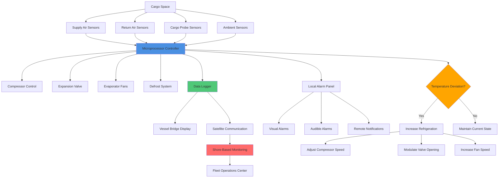

Системы контроля температуры грузов поддерживают точные тепловые условия на протяжении всей морской холодной цепи от загрузки до выгрузки. Эффективное управление температурой требует понимания тепловых свойств грузов, внедрения надлежащих протоколов предварительного охлаждения, непрерывного мониторинга и быстрого реагирования на отклонения. Современные системы интегрируют автоматизированные элементы управления с возможностями удаленного мониторинга для обеспечения качества груза и соответствия нормативным требованиям.

## Требования к температурному режиму конкретных грузов

Различные типы грузов требуют специфических температурных режимов и допусков на основе физиологических характеристик и требований к сохранению качества.

| Категория груза | Диапазон уставки | Допуск | Целевая температура предварительного охлаждения | Критические примечания |
|----------------|---------------|-----------|----------------|----------------|
| Замороженная рыба/морепродукты | -25°C до -18°C | ±1,0°C | -25°C минимум | Предотвращает ферментативную активность |
| Замороженные мясные продукты | -18°C до -12°C | ±1,5°C | -18°C минимум | Контроль образования кристаллов льда |
| Мороженое, замороженные молочные продукты | -28°C до -23°C | ±0,5°C | -28°C минимум | Сохранение текстуры критично |
| Свежее мясо (охлажденное) | -1,5°C до 0°C | ±0,3°C | 0°C перед загрузкой | Избегать повреждения от замерзания |
| Свежая рыба (охлажденная) | -1°C до +2°C | ±0,5°C | +1°C оптимально | Рекомендуется контакт со льдом |
| Молочные продукты | +2°C до +4°C | ±0,5°C | +2°C минимум | Предотвращение роста бактерий |
| Фармацевтические препараты (охлажденные) | +2°C до +8°C | ±0,3°C | В диапазоне за 24 часа до загрузки | Требуется валидация |
| Вакцины (замороженные) | -25°C до -15°C | ±0,2°C | Непрерывная холодная цепь | Отклонения недопустимы |
| Бананы (зеленые) | +13°C до +14°C | ±0,3°C | +13,5°C оптимально | Подавление созревания |
| Цитрусовые фрукты | +4°C до +10°C | ±1,0°C | +8°C типично | Зависит от сорта |
| Косточковые фрукты | -1°C до +4°C | ±0,5°C | +2°C рекомендуется | Контроль дыхания |
| Ягоды (свежие) | 0°C до +2°C | ±0,3°C | 0°C незамедлительно | Высокая скоропортируемость |
| Тропические фрукты | +10°C до +15°C | ±1,0°C | +12°C типично | Избегать холодовых повреждений |
| Срезанные цветы | +1°C до +4°C | ±0,5°C | +2°C оптимально | Требуется контроль этилена |
| Вино (бутилированное) | +12°C до +16°C | ±1,0°C | +14°C стабильно | Избегать температурного шока |

Равномерность температуры в пространстве груза должна оставаться в пределах установленного допуска с учетом режимов циркуляции воздуха и конфигурации загрузки груза.

## Стратегии и расчеты предварительного охлаждения

Предварительное охлаждение груза до требуемой уставки перед загрузкой предотвращает чрезмерную нагрузку на холодильную машину во время рейса и минимизирует деградацию качества.

### Удаление тепла при предварительном охлаждении

Общее количество тепла, которое должно быть удалено во время предварительного охлаждения, объединяет снижение явного тепла и, для сельскохозяйственной продукции, выделение тепла дыхания:

$$Q_{precool} = m \cdot c_p \cdot (T_{initial} - T_{target}) + q_{resp} \cdot t_{precool}$$

Где:
- $Q_{precool}$ = общее необходимое удаление тепла (кДж)
- $m$ = масса груза (кг)
- $c_p$ = удельная теплоемкость груза (кДж/кг·К)
- $T_{initial}$ = начальная температура груза (°C)
- $T_{target}$ = целевая температура предварительного охлаждения (°C)
- $q_{resp}$ = скорость выделения тепла дыхания (Вт)
- $t_{precool}$ = продолжительность предварительного охлаждения (с)

### Расчет времени предварительного охлаждения

Необходимое время предварительного охлаждения зависит от доступной холодильной производительности и тепловых свойств груза:

$$t_{precool} = \frac{m \cdot c_p \cdot \Delta T}{Q_{ref} - q_{resp}}$$

Где:
- $Q_{ref}$ = доступная холодильная производительность (Вт)
- $\Delta T$ = необходимое снижение температуры (К)

### Эффективная скорость предварительного охлаждения

Для грузов с неравномерным распределением температуры предварительное охлаждение следует экспоненциальному затуханию:

$$T(t) = T_{ambient} + (T_{initial} - T_{ambient}) \cdot e^{-\frac{t}{\tau}}$$

Где постоянная времени $\tau$ зависит от тепловой массы и характеристик теплопередачи:

$$\tau = \frac{m \cdot c_p}{h \cdot A}$$

Где:
- $h$ = коэффициент конвективной теплопередачи (Вт/м²·К)
- $A$ = эффективная площадь поверхности теплопередачи (м²)

### Практический пример предварительного охлаждения

Для 20 000 кг бананов, охлаждаемых с 25°C до 13,5°C:

Дано:
- $c_p = 3,35$ кДж/кг·К (бананы)
- $q_{resp} = 1200$ Вт (при 20°C)
- Доступная $Q_{ref} = 15 000$ Вт

$$Q_{precool} = 20 000 \times 3,35 \times (25 - 13,5) + 1200 \times t$$

$$t_{precool} = \frac{20 000 \times 3,35 \times 11,5}{15 000 - 1200} = \frac{770 500}{13 800} = 55 833 \text{ с} = 15,5 \text{ часов}$$

Этот расчет предполагает непрерывную работу и не учитывает тепловую инерцию паллетированного груза, которая обычно увеличивает фактическое время на 20-40%.

## Архитектура мониторинга и управления температурой

Современный мониторинг температуры груза интегрирует несколько слоев мониторинга с автоматизированными системами реагирования.

### Размещение и конфигурация датчиков

**Датчики температуры подаваемого воздуха:**
- Расположение: Непосредственно после испарительной катушки
- Точность: ±0,1°C для фармацевтических грузов, ±0,3°C стандартная
- Время отклика: <30 секунд до 90% переходного процесса
- Избыточность: Двойные датчики с автоматическим переключением

**Датчики температуры возвратного воздуха:**
- Расположение: Путь возвратного воздуха груза перед испарителем
- Цель: Указывает фактическую нагрузку охлаждения груза
- Дифференциальное управление: Поддерживает разность температур подачи-возврата 8-12°C для замороженного груза, 4-6°C для охлажденного

**Датчики груза в зондах (беспроводные):**
- Размещение: В паллетированном грузе в геометрическом центре
- Время работы батареи: 30-60 дней непрерывной работы
- Передача: Протоколы 433 МГц или 2,4 ГГц
- Критично для фармацевтической валидации

### Алгоритмы управления

Современные контроллеры используют логику пропорционально-интегрально-дифференциальной (PID) регуляции:

$$u(t) = K_p \cdot e(t) + K_i \int_0^t e(\tau)d\tau + K_d \frac{de(t)}{dt}$$

Где:
- $u(t)$ = управляющий выход (скорость компрессора, положение клапана)
- $e(t)$ = сигнал ошибки (уставка - измеренная температура)
- $K_p, K_i, K_d$ = константы настройки

Типичные параметры настройки для управления температурой рефрижератора:
- $K_p = 0,5$ до 1,5 (коэффициент пропорциональности)
- $K_i = 0,1$ до 0,3 (постоянная времени интегрирования)
- $K_d = 0,05$ до 0,15 (постоянная времени дифференцирования)

## Системы непрерывного мониторинга

### Требования к регистрации данных

Соответствие морской холодной цепи требует непрерывной записи данных о температуре на протяжении всего рейса:

**Параметры записи:**
- Температура подаваемого воздуха (основная переменная управления)
- Температура возвратного воздуха (индикатор нагрузки)
- Значение уставки
- Время начала/конца цикла размораживания
- События аварий с временными метками
- Перерывы в подаче питания
- Часы работы компрессора

**Интервалы записи:**
- Стандартный груз: интервалы 10-15 минут
- Фармацевтический груз: интервалы 1-5 минут
- Груз высокой стоимости/чувствительный груз: Непрерывно (интервалы 30-60 секунд)

**Хранение данных:**
- Минимальный период хранения: 3 года для соответствия нормативам
- Формат: Загружаемые CSV, XML или проприетарные форматы
- Защита от подделки: Криптографические подписи для фармацевтических партий

### Интеграция удаленного мониторинга

Системы спутникового мониторинга передают статус груза в реальном времени на береговые объекты:

**Протоколы связи:**
- Спутниковая сеть Iridium (глобальное покрытие)
- Inmarsat C или FleetBroadband
- GSM/сотовая связь при прибрежном расположении
- Частота передачи: Каждые 4-8 часов стандартная, почасовая для критического груза

**Передаваемые данные:**
- Текущие температуры (подача, возврат, уставка)
- Статус и история аварий
- GPS-позиция и расчетное время прибытия
- Рабочие параметры холодильной системы
- Статус резервной батареи

**Ответ со стороны берега:**
- 24/7 центры мониторинга отслеживают статус флота
- Автоматические оповещения об отклонениях температуры >30 минут
- Техническая поддержка для устранения неполадок
- Оптимизация маршрута для минимизации воздействия на груз

## Интеграция контролируемой атмосферы

Грузы, требующие контролируемой атмосферы (CA) в дополнение к контролю температуры, требуют интегрированного мониторинга состава газов.

### Параметры атмосферы

**Контроль кислорода:**
- Целевое значение: 2-5% O₂ для большинства приложений CA
- Допуск: ±0,5% для критических приложений
- Мониторинг: Электрохимические или парамагнитные датчики
- Регулировка: Впрыск азота или очистка CO₂

**Контроль углекислого газа:**
- Целевое значение: 3-10% CO₂ в зависимости от товара
- Допуск: ±1,0% типично
- Мониторинг: Датчики NDIR (недисперсионная инфракрасная спектроскопия)
- Регулировка: Впрыск CO₂ или известковая очистка

**Удаление этилена:**
- Целевое значение: <0,02 м.д. для чувствительной к этилену продукции
- Методы: Скрубберы перманганата калия, каталитическое окисление
- Критично для: Киви, брокколи, салата, срезанных цветов

### Взаимодействие температуры CA

Эффективность контролируемой атмосферы сильно зависит от поддержания температуры:

$$RR = RR_{ref} \cdot Q_{10}^{\frac{T-T_{ref}}{10}}$$

Где:
- $RR$ = скорость дыхания при температуре $T$
- $RR_{ref}$ = скорость дыхания при эталонной температуре $T_{ref}$
- $Q_{10}$ = температурный коэффициент (обычно 2,0-3,0 для продукции)

Увеличение температуры на 1°C может повысить скорость дыхания на 7-12%, что значительно сокращает срок хранения даже при оптимальном составе атмосферы.

## Соответствие холодной цепи и стандарты

### Нормативно-правовая база

**Международные стандарты:**
- **ATP Agreement (ООН)**: Соглашение о международной перевозке скоропортящихся пищевых продуктов
  - Классификация оборудования: Класс FRC для механизированных рефрижерируемых контейнеров
  - Требования испытаний: Проверка K-коэффициента
  - Требование к минимальной температуре внутреннего воздуха

- **ISO 1496-2**: Спецификации теплоизоляционных контейнеров
  - Тест поддержания температуры: 18 часов при указанных условиях
  - Проверка характеристик охлаждения
  - Требования конструкции и безопасности

- **ISTA (Международная ассоциация безопасной транспортировки)**:
  - Протоколы для климатически контролируемых партий
  - Стандарты квалификации упаковки

**Фармацевтические специалисты:**
- **WHO TRS 961**: Мониторинг температуры при транспортировке вакцин
  - Требуется непрерывный мониторинг
  - Максимальный диапазон 2°C до 8°C
  - События замерзания недопустимы

- **EU GDP (надлежащая практика распределения)**:
  - Квалификация рефрижерируемых контейнеров
  - Требуются исследования температурного картирования
  - Ежегодная повторная калибровка датчиков

- **FDA Title 21 CFR Part 11**:
  - Валидация электронных записей
  - Требования журнала аудита
  - Средства управления доступом в систему

### Протоколы реагирования на аварию

**Уровни отклонения температуры:**

| Отклонение | Требуемое действие | Время отклика |
|-----------|----------------|---------------|
| ±0,5°C от уставки | Логирование события, мониторинг тренда | Немедленное осознание |
| ±1,0°C более 30 мин | Расследование причины, корректировка управления | В течение 1 часа |
| ±2,0°C более 15 мин | Требуется инженерное вмешательство | В течение 30 минут |
| ±3,0°C или событие замерзания | Срочное реагирование, оценка груза | Немедленно |

**Типичные действия по вмешательству:**
1. Проверка точности датчика (сравнение избыточных датчиков)
2. Проверка работы холодильной системы (компрессор, вентиляторы)
3. Осмотр схемы загрузки груза (блокировка циркуляции воздуха)
4. Проверка внешних условий (температура окружающей среды, подача питания)
5. Инициирование резервного охлаждения при наличии
6. Документирование всех выводов и корректирующих действий

## Оптимизация производительности

### Эффективность быстрого охлаждения

Быстрое снижение температуры после загрузки минимизирует деградацию продукции:

$$\eta_{pulldown} = \frac{m \cdot c_p \cdot \Delta T}{E_{consumed}}$$

Где:
- $\eta_{pulldown}$ = эффективность быстрого охлаждения (безразмерная)
- $E_{consumed}$ = потребленная электрическая энергия во время быстрого охлаждения (кДж)

Целевые значения эффективности:
- Современные рефрижерирующие контейнеры: 0,6-0,8
- Старое оборудование: 0,4-0,6
- Хорошо предварительно охлажденный груз: 0,8-1,0

### Управление энергией

Минимизация потребления энергии при поддержании температуры:

**Стратегии соответствия нагрузке:**
- Работа компрессора с переменной скоростью (30-100% производительность)
- Управление скоростью вентилятора по требуемому спросу
- Оптимизированное расписание размораживания (только при необходимости)
- Ночное снижение для некритических температурных диапазонов

**Типичное потребление энергии:**
- Замороженный груз (-20°C): 8-12 кВт в среднем
- Охлажденный груз (+2°C): 4-7 кВ в среднем
- Контролируемая атмосфера: +10-15% выше стандартного охлаждения

Надлежащее предварительное охлаждение снижает потребление энергии во время рейса на 15-25% по сравнению с загрузкой теплого груза.

## Валидация системы и ввод в эксплуатацию

### Температурное картирование

Перед размещением рефрижерируемых пространств для грузов в эксплуатацию проводятся комплексные исследования распределения температуры для проверки равномерных условий:

**Процедура картирования:**
1. Установка минимум 9-точечного набора датчиков (углы, центр, середины граней)
2. Эксплуатация системы на уставке минимум 12 часов
3. Запись температур с интервалами 5 минут
4. Расчет максимального дифференциала температуры
5. Проверка соблюдения всеми точками требуемого диапазона

**Критерии приемки:**
- Максимальный дифференциал точка-точка ≤2,0°C для стандартного груза
- Максимальный дифференциал точка-точка ≤1,0°C для фармацевтических препаратов
- Все точки должны непрерывно оставаться в пределах установленного диапазона

### Требования к калибровке

**Калибровка датчиков:**
- Частота: Ежегодно или согласно нормативному требованию
- Метод: Эталонные стандарты с прослеживаемостью NIST
- Проверка точности: ±0,2°C в диапазоне эксплуатации
- Документирование: Сертификат калибровки с прослеживаемостью

**Испытание производительности системы:**
- Проверка времени охлаждения
- Измерение K-коэффициента (скорость проникновения тепла)
- Валидация цикла размораживания
- Функциональное тестирование системы аварийной сигнализации

Надлежащая калибровка и валидация обеспечивают надежный контроль температуры на протяжении всего пути груза, поддерживая качество от отправки до пункта назначения при соответствии международным требованиям холодной цепи.
