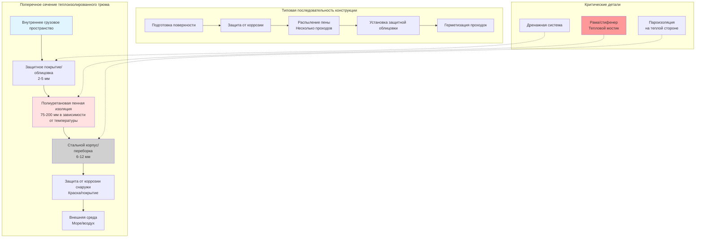

Теплоизолированные грузовые трюмы формируют тепловую оболочку для морского охлажденного транспорта, поддерживая температуру груза от -30°C до +15°C при воздействии внешних условий окружающей среды в диапазоне от -20°C до +50°C. Надлежащее проектирование изоляции обеспечивает баланс между тепловыми характеристиками, структурной целостностью, контролем влаги и экономическими ограничениями. Многослойная конструкция должна выдерживать морскую качку, стрессы от грузовых нагрузок и десятилетия эксплуатации в коррозионной морской среде.

## Выбор материалов изоляции

Выбор материала учитывает теплопроводность, прочность на сжатие, влагостойкость, пожарную безопасность и требования установки.

### Распространенные морские материалы изоляции

| Материал | Теплопроводность (Вт/мK) | Значение RSI на дюйм (м²K/Вт) | Плотность (кг/м³) | Прочность на сжатие (кПа) | Поглощение влаги |
|----------|---------------------------|-------------------------------|-------------------|---------------------------|-----------------|
| Полиуретановая пена (жесткая) | 0,020-0,023 | 1,14-1,23 | 30-40 | 150-250 | Очень низкое (<3%) |
| Расширенный полистирол (EPS) | 0,033-0,038 | 0,67-0,77 | 15-30 | 70-120 | Низкое (<5%) |
| Экструдированный полистирол (XPS) | 0,028-0,032 | 0,79-0,91 | 25-40 | 200-400 | Очень низкое (<1%) |
| Полиизоцианурат (PIR) | 0,021-0,024 | 1,05-1,19 | 30-45 | 120-200 | Очень низкое (<2%) |
| Пробковая плита | 0,040-0,045 | 0,56-0,63 | 110-140 | 300-500 | Среднее (8-12%) |
| Минеральная вата (высокой плотности) | 0,036-0,042 | 0,60-0,70 | 100-150 | 30-60 | Высокое (требует защиты) |

Полиуретановая пена доминирует в современном строительстве морских охлаждаемых трюмов благодаря оптимальным тепловым характеристикам, структурной грузоподъемности и методам нанесения на месте, обеспечивающим бесшовную установку.

### Системы полиуретановой пены

Двухкомпонентная полиуретановая пена реагирует на месте, образуя жесткую закрытоячеистую изоляцию, прилипающую к стальным основаниям.

**Характеристики рецептуры:**

- **Плотность**: 32-40 кг/м³ обеспечивает оптимальные тепловые и структурные свойства
- **Содержание закрытых ячеек**: >90% обеспечивает влагостойкость и размерную стабильность
- **Распространение пламени**: Классы 1 или A соответствуют требованиям морской пожарной безопасности
- **Температурная стойкость**: Стабильна от -40°C до +110°C для эксплуатации и периодических операций размораживания
- **Вспенивающие агенты**: HFC-245fa или HFO-1233zd(E), заменяющие устаревший HCFC-141b для соответствия экологическим требованиям

Нанесение происходит несколькими проходами толщиной 25-50 мм за проход для контроля температуры экзотермической реакции и предотвращения растрескивания ядра. Распыление заполняет неправильные пространства и создает монолитную изоляцию, исключая стыки и пустоты.

## Передача тепла через теплоизолированные конструкции

Точный тепловой анализ определяет требуемую толщину изоляции для ограничения теплопритока проектными значениями.

### Установившаяся передача тепла

Тепловой поток через многослойную изоляцию подчиняется одномерному уравнению кондукции:

$$Q = \frac{A \cdot \Delta T}{R_{total}}$$

где:
- $Q$ = скорость передачи тепла (Вт)
- $A$ = площадь поверхности (м²)
- $\Delta T$ = разность температур внутренняя к внешней (K)
- $R_{total}$ = полное тепловое сопротивление (м²K/Вт)

Полное тепловое сопротивление включает все слои и поверхностные сопротивления:

$$R_{total} = R_{si} + \frac{L_1}{k_1} + \frac{L_2}{k_2} + \cdots + \frac{L_n}{k_n} + R_{so}$$

где:
- $R_{si}$ = внутреннее поверхностное сопротивление = 0,12-0,17 м²K/Вт (в зависимости от скорости воздуха)
- $L_i$ = толщина слоя $i$ (м)
- $k_i$ = теплопроводность слоя $i$ (Вт/мK)
- $R_{so}$ = внешнее поверхностное сопротивление = 0,04-0,06 м²K/Вт (морские условия)

### Общий коэффициент передачи тепла

Значение U представляет общую теплопередачу:

$$U = \frac{1}{R_{total}}$$

Целевые значения U для охлаждаемых трюмов находятся в диапазоне от 0,15 до 0,35 Вт/м²K в зависимости от температуры груза и экономической оптимизации. Более низкие температуры груза требуют более низких значений U (более толстая изоляция) для ограничения теплопритока.

### Требуемая толщина изоляции

Решение для требуемой толщины изоляции для достижения целевого значения U:

$$L = k \cdot \left(\frac{1}{U} - R_{si} - R_{so} - \frac{L_{steel}}{k_{steel}} - \frac{L_{barrier}}{k_{barrier}}\right)$$

Для полиуретановой пены с $k$ = 0,022 Вт/мK, достигающей U = 0,25 Вт/м²K:

$$L = 0,022 \cdot \left(\frac{1}{0,25} - 0,15 - 0,05 - 0,00013 - 0,0005\right)$$

$$L = 0,022 \cdot (4,0 - 0,15 - 0,05 - 0,00163)$$

$$L = 0,022 \cdot 3,798 = 0,0836 \text{ м} = 84 \text{ мм}$$

Стандартная морская практика применяет 100-150 мм полиуретановой пены для трюмов замороженного груза (-20°C до -25°C) и 75-100 мм для трюмов охлажденного груза (0°C до +5°C).

## Системы пароизоляции

Миграция влаги через изоляцию ухудшает тепловые характеристики и вызывает структурную коррозию. Пароизоляция предотвращает передачу водяного пара из теплого наружного воздуха на холодные внутренние поверхности.

### Требования пароизоляции

Пароизоляция размещается на теплой стороне изоляции и предотвращает конденсацию внутри системы изоляции. Для охлаждаемых трюмов ниже температуры окружающей среды наружная стальная оболочка служит пароизоляцией при надлежащей герметизации.

**Критерии паропроницаемости:**

- Первичная пароизоляция: <0,06 перм (3,5 нг/Па·с·м²)
- Внутреннее защитное покрытие: 0,5-2,0 перм (зависит от требований груза)
- Общая система: Минимизировать направленный внутрь поток пара при всех условиях эксплуатации

### Обычные материалы пароизоляции

**Стальное основание**: 6-10 мм стального корпуса и переборочного листа служит встроенной пароизоляцией при сварке стыков.

**Алюминиевые фольговые облицовки**: 0,05-0,10 мм алюминиевой фольги, ламинированной к пенным панелям или нанесенной отдельным слоем, достигает 0,01-0,02 перм.

**Покрытия, задерживающие пары**: Эпоксидные или полиуретановые покрытия, применяемые на внутренних поверхностях, обеспечивают защиту 0,1-0,5 перм, позволяя некоторую влажность.

**Критические места герметизации:**

- Проходки для холодильного трубопровода, электрического кабелепровода и дренажных линий
- Стыки изоляционных панелей (при использовании готовых панелей вместо распыленной пены)
- Конструктивные рамы и стифенеры, создающие тепловые мостики
- Люки доступа и двери

Распыленная на месте полиуретановая пена создает монолитную изоляцию с минимальными стыками, снижая точки отказа пароизоляции по сравнению с панельными системами.

## Контроль тепловых мостиков

Конструктивные стальные элементы, проникающие через изоляцию, создают тепловые мостики с локальной скоростью теплопередачи в 10-50 раз выше, чем в изолированных областях.

### Анализ теплового мостика

Поток тепла через тепловой мостик следует:

$$Q_{bridge} = \psi \cdot L_{bridge} \cdot \Delta T$$

где:
- $\psi$ = линейный коэффициент теплопередачи (Вт/мK)
- $L_{bridge}$ = длина теплового мостика (м)

Для неизолированной стальной рамы (уголок 100×50 мм):

$$\psi \approx k_{steel} \cdot A_{steel} / L_{insulation} = 45 \cdot 0,005 / 0,1 = 2,25 \text{ Вт/мK}$$

Рама длиной 10 метров при разности температур 30°C:

$$Q_{bridge} = 2,25 \cdot 10 \cdot 30 = 675 \text{ Вт}$$

Этот единственный каркас создает тепловой приток, эквивалентный 9 м² изолированной поверхности при U = 0,25 Вт/м²K.

### Снижение тепловых мостиков

**Полное покрытие изоляцией**: Распыленная пена или панельная изоляция, применяемые поверх конструктивных рам, где это возможно.

**Тепловые разрывы**: Неметаллические прокладки или материалы с низкой теплопроводностью прерывают стальную непрерывность.

**Внутренний каркас**: Стальной каркас на теплой стороне изоляции исключает холодные мостики (непрактично для грузовых трюмов).

**Повышенная толщина изоляции**: Дополнительная толщина на 25-50% в местах мостиков частично компенсирует увеличенный поток тепла.

Современное проектирование охлаждаемых трюмов минимизирует тепловые мостики благодаря оптимизированной структурной разработке и полному покрытию изоляцией.

## Слои конструкции теплоизолированного трюма

Охлаждаемые грузовые трюмы используют многослойную конструкцию от внутреннего грузового пространства наружу.

### Функции слоев

**Защитное покрытие/облицовка** (внутренняя поверхность):
- Обеспечивает моющуюся санитарную поверхность для пищевого груза
- Защищает изоляцию от механических повреждений при грузовых операциях
- Материалы: Оцинкованная сталь, алюминий, FRP (стеклопластик), или эпоксидное покрытие
- Толщина: 0,5-3,0 мм для металлических облицовок, 2-5 мм для FRP

**Полиуретановая пенная изоляция**:
- Основной слой теплового сопротивления
- Непрерывное покрытие исключает тепловые мостики
- Прилипает к основанию, обеспечивая структурное композитное действие
- Толщина: 75-200 мм в зависимости от требований температуры груза

**Стальной корпус/переборка**:
- Конструктивный элемент, воспринимающий грузовые и морские нагрузки
- Пароизоляция, предотвращающая проникновение влаги
- Требуется защита от коррозии на обеих сторонах

**Внешняя защита от коррозии**:
- Морские покрытия противостоят воздействию соленой воды
- Периодическое обслуживание требуется на протяжении всей жизни судна

## Процедуры установки

Надлежащая установка обеспечивает достижение проектных тепловых характеристик и долгосрочную надежность.

### Подготовка поверхности

Стальные поверхности должны быть чистыми, сухими и свободными от ржавчины, масла или рыхлых окалин. Абразивная очистка до SSPC-SP6 (коммерческая очистка) или SP10 (почти белая очистка) обеспечивает оптимальную адгезию пены. Подготовка поверхности непосредственно предшествует нанесению пены, чтобы предотвратить вспышную коррозию.

### Применение распыленной пены

Двухкомпонентная полиуретановая пена наносится с использованием оборудования множественного компонента:

1. **Подготовка оборудования**: Нагреваемые шланги поддерживают температуру компонента 40-50°C, соотношение смеси 1:1 по объему
2. **Проходы нанесения**: 25-50 мм за проход позволяет рассеивать экзотермическое тепло, 15-30 минут выдержки между проходами
3. **Контроль толщины**: Контрольные штифты или направляющие для измерения обеспечивают равномерную толщину, обычно допуск +10%
4. **Покрытие**: Перекрытие смежных областей обеспечивает отсутствие пустот или тонких участков
5. **Контроль качества**: Образцы ядра проверяют плотность (32-40 кг/м³) и содержание закрытых ячеек (>90%)

### Установка защитной облицовки

Металлические или FRP облицовки крепятся к отвержденной пене с использованием клея и механических крепежных элементов. Стыки панелей требуют герметика для сохранения герметичной внутренней поверхности. Облицовка должна выдерживать циклы теплового расширения/сжатия без коробления или открытия стыков.

## Стандарты производительности и тестирование

Морская охлаждаемая изоляция трюма соответствует международным стандартам и требованиям классификационных обществ.

### Применимые стандарты

**IMO (Международная морская организация)**:
- SOLAS Глава II-2: Требования пожарной безопасности материалов изоляции
- Руководящие принципы перевозки скоропортящихся пищевых продуктов

**Стандарты ISO**:
- ISO 1496-2: Технические характеристики теплоизолированных контейнеров, включая тестирование U-значения
- ISO 8568: Механические системы охлаждения для судов

**Классификационные общества**:
- Руководство ABS по системам рефрижерации
- Правила DNV для классификации судов Часть 5 Глава 13
- Правила Lloyd's Register для судов Часть 5 Глава 11

### Тестирование тепловых характеристик

Изоляция трюма подлежит тепловому тестированию для проверки проектных значений U:

**Тест передачи тепла**: Измерение потока тепла при управляемой разности температур
- Внутренняя часть поддерживается при проектной температуре груза (например, -20°C)
- Внешняя часть при внешней температуре или контролируемой температуре (например, +25°C)
- Теплозвод для поддержания внутренней температуры записывается
- Фактическое значение U рассчитывается из измеренных данных

**Критерии приемки**: Измеренное значение U не должно превышать проектное значение более чем на 10%.

### Огневое тестирование

Материалы изоляции подлежат огневому тестированию согласно Кодексу процедур огневого тестирования IMO:
- Воспламеняемость поверхности (распространение пламени и образование дыма)
- Тестирование негорючести для критических областей
- Токсичность продуктов сгорания

Полиуретановые пенные рецептуры соответствуют классам воспламеняемости 1 или A с соответствующими огнезадерживающими добавками.

## Техническое обслуживание и срок службы

Надлежащее техническое обслуживание сохраняет тепловые характеристики изоляции на протяжении 20-30 лет эксплуатации судна.

**Интервалы проверки**: Ежегодные обследования проверяют состояние внутренней облицовки, герметизацию стыков и признаки проникновения влаги. Пятилетние обследования включают отбор образцов изоляционного ядра для проверки сохранения физических свойств.

**Распространенные режимы деградации**:
- Физические повреждения от грузоподъемного оборудования
- Проникновение влаги через поврежденные пароизоляции
- Усталость при тепловых циклах в стыках и проходках
- Коррозия стального основания, снижающая структурную целостность

**Процедуры ремонта**: Поврежденная изоляция требует удаления и замены с сохранением непрерывности с окружающим материалом. Распыленная пена облегчает полевые ремонты при надлежащей подготовке поверхности и технике нанесения.

Надлежащим образом спроектированные и установленные системы полиуретановой пенной изоляции регулярно достигают полного срока эксплуатации судна с минимальной деградацией тепловых характеристик.

## Экономическая оптимизация

Толщина изоляции представляет компромисс между первоначальной стоимостью материала и постоянными энергосбережениями от снижения холодильной нагрузки.

**Анализ жизненного цикла стоимости** определяет оптимальную толщину:

$$LCC = C_{insulation} + C_{energy} \cdot PW$$

где:
- $C_{insulation}$ = стоимость установленной изоляции ($/м²)
- $C_{energy}$ = годовая стоимость энергии от теплопритока ($/м²-год)
- $PW$ = коэффициент приведенной стоимости для энергетических затрат в течение жизни судна

Стоимость энергии зависит от теплопритока, эффективности холодильной системы и стоимости электроэнергии (обычно $0,15-0,30/кВт⋅ч электроэнергии на борту судна). Оптимальная толщина изоляции обычно варьируется от 100-150 мм для трюмов замороженного груза, определяемая экономическим анализом, а не только тепловыми требованиями.

---

**Ссылки:**
- Справочник ASHRAE - приложения HVAC, Глава 26: Суда
- Руководящие принципы IMO по перевозке скоропортящихся пищевых продуктов
- SOLAS Консолидированное издание 2020, Глава II-2
- ISO 1496-2:2018 Тестирование теплоизолированных контейнеров
