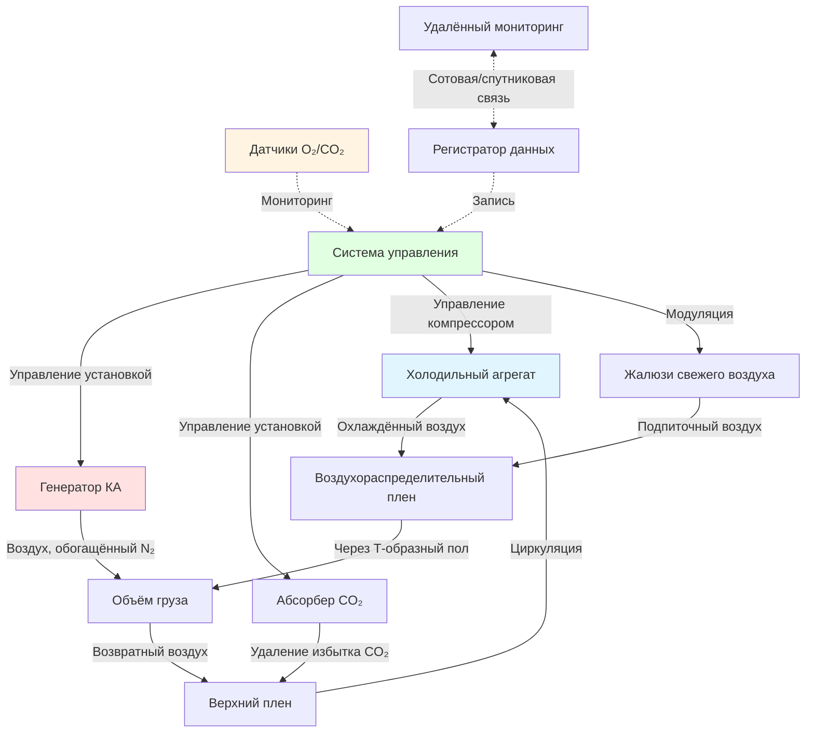

## Встроенные холодильные агрегаты

Охлаждённые транспортные контейнеры (рефрижераторы) включают самостоятельные холодильные системы, предназначенные для интермодального транспорта морским, железнодорожным и автомобильным транспортом. Встроенный холодильный агрегат монтируется в передней части контейнера и питается от судовых электросистем (440В трёхфазный ток), береговых источников питания или генераторных установок при наземном транспорте.

Холодильный цикл использует спиральные или поршневые компрессоры с хладагентами R-134a или R-452A. Системы распределения воздуха циркулируют воздух через алюминиевый пол с Т-образным профилем, вверх сквозь груз и обратно через верхнее подпотолочное пространство. Этот нижневерхний направленный поток воздуха обеспечивает равномерное распределение температуры по всему объёму груза.

Испарительные змеевики оснащены автоматическими циклами оттаивания (горячий газ или электрическое сопротивление) для предотвращения накопления льда, снижающего эффективность теплопередачи. Цикл работает по временной или требуемой основе, как правило, каждые 6–8 часов в зависимости от условий окружающей среды и тепловых нагрузок дыхания груза.

## Конструкционные стандарты контейнеров-рефрижераторов

ISO 1496-2 определяет размерные и конструкционные требования для охлаждённых контейнеров. Стандартные типоразмеры включают:

| Тип контейнера | Внешние размеры | Внутренний объём | Производительность охлаждения |
|----------------|---------------------|-----------------|----------------------|
| 20-футовый рефрижератор | 6,06 × 2,44 × 2,59 м | 28,3 м³ | 5,0–7,0 кВт |
| 40-футовый стандартный | 12,19 × 2,44 × 2,59 м | 67,5 м³ | 8,5–10,5 кВт |
| 40-футовый high cube | 12,19 × 2,44 × 2,90 м | 76,2 м³ | 9,5–11,5 кВт |

Оболочка контейнера состоит из теплоизоляции из полиуретанового пенопласта (толщина 100–120 мм) с коэффициентом теплопроводности 0,019–0,022 Вт/(м·К), внутренних облицовок из нержавеющей стали и внешних панелей из гофрированной стали. Угловые тантальные произ производства соответствуют требованиям прочности ISO 1161 для операций штабелирования и подъёма.

## Расчёты производительности холодильной системы

Требуемая производительность охлаждения контейнера-рефрижератора учитывает несколько компонентов тепловой нагрузки:

$$Q_{total} = Q_{transmission} + Q_{air} + Q_{product} + Q_{respiration} + Q_{equipment}$$

Где:

**Тепловая нагрузка через изолированные стены:**

$$Q_{transmission} = U \cdot A \cdot (T_{ambient} - T_{setpoint})$$

- $U$ = общий коэффициент теплопередачи, обычно 0,35–0,45 Вт/(м²·К)
- $A$ = общая площадь поверхности оболочки контейнера (м²)
- $T_{ambient}$ = температура наружного воздуха (°C)
- $T_{setpoint}$ = установленная температура груза (°C)

**Тепловая нагрузка от инфильтрации воздуха:**

$$Q_{air} = \dot{m}_{air} \cdot c_{p,air} \cdot (T_{ambient} - T_{setpoint}) + \dot{m}_{air} \cdot h_{fg} \cdot (\omega_{ambient} - \omega_{setpoint})$$

- $\dot{m}_{air}$ = массовый расход инфильтрующегося воздуха (кг/с)
- $c_{p,air}$ = удельная теплоёмкость воздуха, 1,006 кДж/(кг·К)
- $h_{fg}$ = скрытая теплота испарения, 2501 кДж/кг при 0°C
- $\omega$ = коэффициент влажности (кг воды/кг сухого воздуха)

**Тепловая нагрузка охлаждения груза:**

$$Q_{product} = \frac{m_{product} \cdot c_{p,product} \cdot (T_{initial} - T_{final})}{\Delta t}$$

- $m_{product}$ = масса груза (кг)
- $c_{p,product}$ = удельная теплоёмкость продукта (кДж/(кг·К))
- $\Delta t$ = время достижения температуры охлаждения (с)

**Тепловая нагрузка дыхания живых продуктов:**

$$Q_{respiration} = m_{product} \cdot q_{resp}$$

- $q_{resp}$ = удельное тепло дыхания (Вт/кг), зависит от температуры

Для 40-футового контейнера high cube при номинальных условиях (38°C окружающая среда, +2°C установка, груз фруктов массой 9 т с дыханием 0,08 Вт/кг):

$$Q_{total} = 3,2 + 0,8 + 1,5 + 1,6 + 0,4 = 7,5 \text{ кВт}$$

При добавлении коэффициента безопасности 25% требуемая производительность составляет 9,4 кВт.

## Диапазоны управления температурой

Контейнеры-рефрижераторы поддерживают точное управление температурой в широком рабочем диапазоне:

| Категория груза | Диапазон температур | Относительная влажность | Типичные продукты |
|----------------|-------------------|-------------------|------------------|
| Глубокая заморозка | -30 до -18°C | Не контролируется | Рыба, мясо, мороженое |
| Замороженные | -18 до -10°C | Не контролируется | Замороженные овощи, птица |
| Охлаждённое мясо | -2 до +2°C | 85–90% | Говядина, свинина, баранина |
| Свежие продукты | 0 до +15°C | 85–95% | Фрукты, овощи |
| Фармацевтические препараты | +2 до +8°C | 50–60% | Вакцины, биопрепараты |
| Бананы | +12,5 до +14,5°C | 85–92% | Бананы (предотвращение холодовых травм) |
| Цветы | +2 до +5°C | 90–95% | Срезанные цветы |
| Шоколад | +15 до +18°C | 50–65% | Кондитерские изделия |

Спецификации равномерности температуры требуют отклонения ±0,5°C по всему объёму груза в условиях установившегося режима в соответствии со стандартами Соглашения ATP.

## Системы контролируемой атмосферы

Продвинутые контейнеры-рефрижераторы включают технологию контролируемой атмосферы (КА) для продления срока хранения путём изменения концентраций кислорода и диоксида углерода. Системы КА поддерживают:

- **Кислород (O₂):** Снижение с 21% до 1–5% в зависимости от товара
- **Диоксид углерода (CO₂):** Повышение с 0,04% до 1–10%
- **Азот (N₂):** Остальной объём как инертный газ-наполнитель

**Работа генератора КА:**

Мембранные или адсорбционные генераторы с перепадом давления (PSA) выделяют азот из сжатого воздуха. Обогащённый азотом поток (95–99% N₂) вытесняет кислород внутри герметичного контейнера. Типичная производительность генерирования: 40–60 Нм³/ч для 40-футового контейнера.

**Управление CO₂:**

Активное удаление использует скрубберы с молекулярным углеродным ситом при превышении CO₂ установки (обычно 5–10% для большинства фруктов). Пассивное управление опирается на обмен свежего воздуха через модулирующиеся жалюзи.

## Требования к электроснабжению

Электротехнические характеристики контейнера-рефрижератора:

| Параметр электроснабжения | 20-футовый контейнер | 40-футовый контейнер | 40-футовый high cube |
|-----------------|-------------------|-------------------|-------------------|
| Напряжение | 440В 3-фаза 60Гц | 440В 3-фаза 60Гц | 440В 3-фаза 60Гц |
| Ток полной нагрузки | 10–12 А | 14–18 А | 16–20 А |
| Пиковый бросок тока | 45–60 А | 60–80 А | 65–85 А |
| Потребление мощности | 7,5–9,0 кВт | 10,5–13,5 кВт | 12,0–15,0 кВт |
| Среднее суточное потребление энергии | 55–75 кВт·ч | 85–110 кВт·ч | 95–120 кВт·ч |

Установки берегового питания требуют электроники мягкого пуска или реле с задержкой по времени для предотвращения отключения автоматического выключателя при запуске компрессора. Судовые электросистемы обеспечивают выделенные розетки рефрижератора с защитой цепи, рассчитанной на 125% тока полной нагрузки.

Генераторные установки для грузовиков обычно имеют производительность 15–20 кВт с расходом дизельного топлива 3–4 л/ч при полной нагрузке охлаждения.

## Системы мониторинга контейнеров

Современные контейнеры-рефрижераторы включают комплексные системы мониторинга и регистрации данных:

**Параметры локального дисплея:**
- Температура нагнетаемого воздуха (измеряется на выходе испарителя)
- Температура возвратного воздуха (окружающая среда объёма груза)
- Установленная температура с разрешением ±0,1°C
- Статус оттаивания и счётчик циклов
- Отработанные часы компрессора
- Коды сигналов и история неисправностей

**Возможности удалённого мониторинга:**

Системы телематики передают данные через сотовые или спутниковые сети:
- Отслеживание местоположения GPS
- Запись тенденций температуры (интервалы 1 минуту)
- События открытия/закрытия двери
- Регистрация прерывания электроснабжения
- Уровни влажности (при наличии)
- Концентрации O₂/CO₂ (установки КА)

**Условия срабатывания сигналов:**

Системы генерируют оповещения для:
- Отклонения температуры >±2°C от установки на >30 минут
- Отказа компрессора или высокого давления нагнетания
- Потери электроснабжения
- Открытия двери >5 минут при транспортировке
- Выхода атмосферы КА за пределы допуска

Регистраторы данных сохраняют историю за 60–90 дней для проверки цепи холода и документации страховки груза. USB-порты для загрузки обеспечивают доступ к полным данным рейса для аудитов обеспечения качества.

## Стандарты ISO и соответствие цепи холода

Эксплуатация контейнеров-рефрижераторов соответствует нескольким международным стандартам:

**ISO 1496-2:** Охлаждённые грузовые контейнеры — спецификации и испытания тепловой эффективности, конструкционной целостности и производительности холодильного оборудования.

**Соглашение ATP (ООН):** Соглашение о международной перевозке скоропортящихся пищевых продуктов — определяет классификацию теплоизоляции (IN/IR) и требования к испытаниям оборудования.

**ISO 10368:** Грузовые терморегулируемые контейнеры — удалённый мониторинг состояния — стандартизирует протоколы передачи данных для систем отслеживания рефрижераторов.

Сертификационное испытание требует:
- Проверку К-фактора (коэффициент теплопередачи)
- Производительность охлаждения при установленных условиях окружающей среды
- Обследование равномерности температуры с 9+ датчиками
- 24-часовую запись температуры под нагрузкой

Контейнеры отображают пластины сертификации ATP, указывающие класс изоляции и эффективную производительность охлаждения при нормализованных условиях испытания (30°C окружающая среда, 0°C или -20°C установка).

Документирование цепи холода включает отчёты предвыездной проверки (PTI), непрерывные записи температуры и сертификат проверки, подтверждающий надлежащую работу перед загрузкой груза.

---

## Связанные темы

- [Охлаждённые грузовые трюмы](../cargo-holds/)
- [Мониторинг цепи холода](../monitoring-systems/)
- [Морские системы HVAC](../../)
