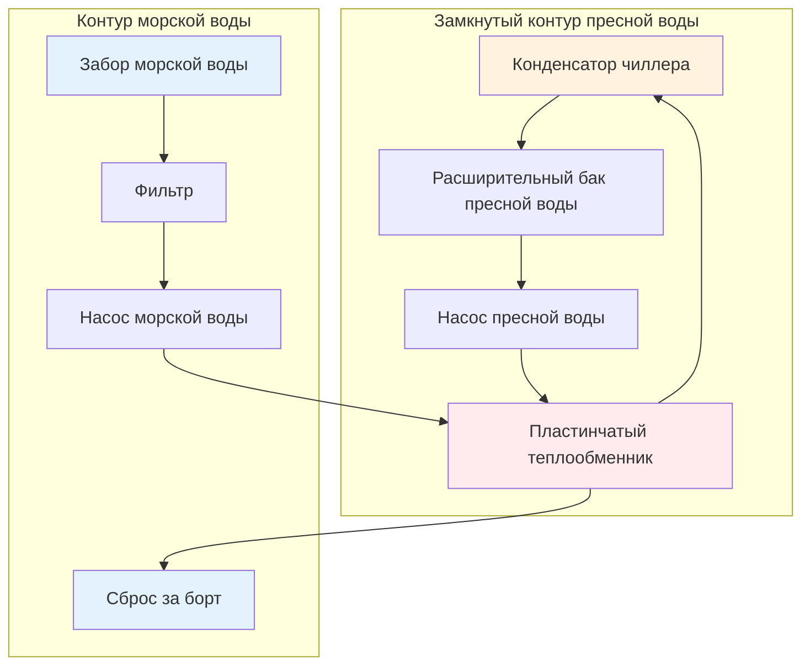

Системы охлаждения морской водой обеспечивают отвод тепла от морских установок HVAC, используя океан в качестве бесконечного источника тепла. Подход к проектированию принципиально отличается от наземных градирен или воздухоохлаждаемых конденсаторов из-за коррозионных свойств морской воды, переменной температуры и характеристик биологического обрастания. Выбор конфигурации системы между прямоточными и замкнутыми схемами зависит от типа судна, профиля работы и требований к защите оборудования.

## Термодинамические соображения

Температура морской воды напрямую влияет на производительность холодильной системы через соотношения давления конденсации.

**Соотношения температур конденсации**

Температура конденсации хладагента должна превышать температуру морской воды на величину, достаточную для обеспечения теплопередачи через конденсатор. Для типичного морского чиллера:

$$T_{\text{cond}} = T_{\text{sw,in}} + \Delta T_{\text{approach}} + \Delta T_{\text{rise}}$$

где:
- $T_{\text{cond}}$ = температура конденсации хладагента (°C)
- $T_{\text{sw,in}}$ = температура входа морской воды (°C)
- $\Delta T_{\text{approach}}$ = подходящая разность температур (3-5°C)
- $\Delta T_{\text{rise}}$ = прирост температуры морской воды через конденсатор (5-8°C)

При тропической морской воде температурой 30°C температура конденсации достигает примерно 40-43°C. Это повышенное давление конденсации увеличивает работу компрессора и снижает коэффициент производительности системы по сравнению с работой в более холодных водах.

**Расчет отвода тепла**

Полный отвод тепла от холодильной системы объединяет нагрузку испарителя и работу компрессора:

$$Q_{\text{reject}} = Q_{\text{evap}} + W_{\text{comp}} = Q_{\text{evap}} \left(1 + \frac{1}{\text{COP}}\right)$$

Для чиллера производительностью 500 кВ, работающего с COP = 4,5, конденсатор должен отвести:

$$Q_{\text{reject}} = 500 \times \left(1 + \frac{1}{4.5}\right) = 611 \text{ кВ}$$

Требуемый массовый расход морской воды следует из:

$$\dot{m}_{\text{sw}} = \frac{Q_{\text{reject}}}{c_p \Delta T_{\text{rise}}}$$

Используя $c_p = 3,99$ кДж/кг·К для морской воды и $\Delta T_{\text{rise}} = 7°C$:

$$\dot{m}_{\text{sw}} = \frac{611}{3.99 \times 7} = 21,9 \text{ кг/s} = 78,8 \text{ м³/ч}$$

## Системы прямоточного охлаждения

Прямоточные конфигурации прокачивают морскую воду непосредственно через трубки конденсатора и сбрасывают её за борт после одного прохода.

**Преимущества**

- Простейшая конфигурация с минимальным количеством компонентов
- Не требуется вторичный теплообменник
- Более низкая начальная стоимость для небольших установок
- Прямой отвод тепла в предельный источник тепла
- Пониженная энергия на прокачку из одной стадии теплопередачи

**Ограничения**

- Теплообменник со стороны хладагента подвергается воздействию коррозионной морской воды
- Требует дорогостоящих коррозионностойких материалов (медно-никелевый сплав, титан)
- Подвержен биологическому обрастанию на поверхностях, контактирующих с морской водой
- Риск загрязнения при разрушении трубки конденсатора
- Сложный доступ к техническому обслуживанию при интеграции в холодильное оборудование

**Параметры проектирования**

| Параметр | Типичный диапазон | Основание проектирования |
|-----------|---------------|--------------|
| Скорость морской воды | 2,0-2,5 м/с | Баланс теплопередачи и эрозии |
| Прирост температуры | 5-8°C | Минимизация теплового загрязнения |
| Подходящая температура | 3-5°C | Экономичное проектирование теплообменника |
| Материал трубок | 90/10 CuNi | Стандартная коррозионная стойкость |
| Толщина стенки трубки | 1,2-1,6 мм | Включает припуск на коррозию |
| Коэффициент обрастания | 0,000035 м²K/W | Морское биологическое обрастание |

Скорость морской воды через трубки представляет критический параметр проектирования. Чрезмерная скорость вызывает эрозионную коррозию, при которой защитные оксидные пленки не могут образоваться. Недостаточная скорость допускает осаждение осадков и усиленное биологическое обрастание. Число Рейнольдса в трубках конденсатора обычно превышает 40 000 для турбулентного течения:

$$Re = \frac{\rho v D}{\mu} = \frac{1025 \times 2,2 \times 0,019}{0,001} = 42 845$$

Этот турбулентный режим обеспечивает коэффициенты теплопередачи 3500-4500 Вт/м²K со стороны морской воды.

## Системы замкнутого охлаждения

Замкнутые конфигурации используют промежуточный контур пресной воды между холодильным оборудованием и морской водой, при этом теплопередача происходит в выделенном теплообменнике морской воды.

**Преимущества**

- Холодильное оборудование использует стандартные конденсаторы с пресной водой
- Централизованный теплообменник морской воды обслуживает несколько чиллеров
- Упрощённый доступ к техническому обслуживанию компонентов, контактирующих с морской водой
- Позволяет проводить химическую обработку контура пресной воды
- Обеспечивает тепловую буферизацию при колебаниях температуры морской воды
- Сниженный риск загрязнения при разрушении трубки конденсатора

**Недостатки**

- Дополнительный теплообменник добавляет стоимость и сложность
- Увеличенная энергия на прокачку из двух систем циркуляции
- Более высокая подходящая температура снижает эффективность системы
- Требует дополнительного места для установки теплообменника
- Добавленное обслуживание для обработки пресной воды и расширительного бака

**Анализ теплопередачи**

Система замкнутого контура вводит дополнительную разность температур между хладагентом и морской водой:

$$T_{\text{cond}} = T_{\text{sw,in}} + \Delta T_{\text{HX}} + \Delta T_{\text{FW}} + \Delta T_{\text{approach}}$$

где $\Delta T_{\text{HX}}$ представляет подходящую температуру в теплообменнике морской/пресной воды (2-4°C) и $\Delta T_{\text{FW}}$ представляет прирост температуры контура пресной воды (3-5°C).

Этот дополнительный тепловой экран повышает температуру конденсации на 5-9°C по сравнению с прямоточными системами, увеличивая потребление энергии компрессором на примерно 3-6% в зависимости от типа хладагента и условий работы.

## Выбор и проектирование теплообменников

Выбор материалов и конфигурация определяют долговечность и производительность теплообменника в морском исполнении.

**Материалы трубок**

| Материал | Состав | Коррозионная стойкость | Теплопередача | Относительная стоимость |
|----------|-------------|---------------------|---------------|---------------|
| 90/10 Медно-никелевый сплав | 90% Cu, 10% Ni | Хорошая | 50 Вт/м·K | 1,0× (базовая) |
| 70/30 Медно-никелевый сплав | 70% Cu, 30% Ni | Отличная | 29 Вт/м·K | 1,8× |
| Титан Марка 2 | Чистый Ti | Превосходная | 16 Вт/м·K | 8,0× |
| AL-6XN Нержавеющая сталь | Высокомолибденовая SS | Отличная | 14 Вт/м·K | 3,5× |

Теплопроводность материала трубки напрямую влияет на требуемую площадь теплопередачи. Для эквивалентной производительности теплообменник из титана требует примерно в 3 раза большей площади поверхности, чем 90/10 медно-никелевый сплав, из-за более низкой теплопроводности.

**Конфигурация кожухотрубного типа**

Традиционные морские конденсаторы применяют конструкцию кожухотрубного типа с морской водой в трубках для минимизации коррозии кожуха. Ключевые конструктивные особенности включают:

- Диаметр трубки: 19-25 мм (номинальный размер 3/4"-1")
- Шаг трубок: 1,25-1,5 наружного диаметра трубки (квадратный или треугольный)
- Расстояние между перегородками: 0,3-0,5 диаметра кожуха
- Проходы со стороны трубок: 2-4 прохода для требуемой скорости
- Концевые крышки: Съёмные для доступа при механической очистке

Общий коэффициент теплопередачи с учётом обрастания:

$$\frac{1}{U} = \frac{1}{h_i} + \frac{x_w}{k_w} + R_{f,i} + \frac{1}{h_o} + R_{f,o}$$

где $h_i$ и $h_o$ представляют коэффициенты пленки внутри и снаружи, $x_w/k_w$ представляет сопротивление стенки трубки, и $R_f$ представляют сопротивления обрастанию.

Для типичного медно-никелевого конденсатора с чистыми поверхностями, значения U в целом колеблются от 2500-3500 Вт/м²K. Морское биологическое обрастание снижает это значение до 1500-2500 Вт/м²K после нескольких месяцев работы без очистки.

**Пластинчатые теплообменники**

Современные системы замкнутого контура всё чаще применяют прокладочные пластинчатые теплообменники для интерфейса морской и пресной воды. Гофрированные пластины создают турбулентное течение при более низких числах Рейнольдса, обеспечивая:

- Компактные размеры (в 5-10 раз меньший объём, чем кожухотрубный)
- Более высокие общие U-значения (4000-6000 Вт/м²K)
- Простое изменение производительности добавлением/удалением пластин
- Полная разборка для механической очистки

Материалы пластин должны выдерживать коррозию морской воды, причём нержавеющая сталь 316L подходит для чистой морской воды, а титан требуется для загрязненной или высокотемпературной воды.

## Контроль биологического обрастания

Морские организмы колонизируют поверхности теплопередачи, снижая производительность и увеличивая перепад давления.

**Механизмы обрастания**

Биологическое обрастание происходит в несколько стадий:

1. **Органическое кондиционирование** (часы): Образование пленки белков и полисахаридов
2. **Колонизация бактериями** (дни): Развитие биопленки
3. **Поселение макроорганизмов** (недели): Прикрепление раков-утконосов, мидий, водорослей
4. **Зрелое сообщество обрастания** (месяцы): Установившаяся экосистема

Скорость обрастания экспоненциально зависит от температуры морской воды:

$$\frac{dR_f}{dt} = k_f e^{-E_a/RT}$$

где $k_f$ - постоянная скорости обрастания, а $E_a$ представляет энергию активации для биологических процессов.

**Стратегии смягчения**

| Метод | Механизм | Эффективность | Ограничения |
|--------|-----------|---------------|-------------|
| Высокая скорость | Напряжение сдвига предотвращает оседание | Хороша для макрообрастания | Риск эрозии, высокая энергия прокачки |
| Хлорирование | Химический биоцид | Отличное краткосрочное | Экологические ограничения |
| Ультразвук | Повреждение от кавитации организмам | Умеренное | Высокое потребление энергии |
| УФ-облучение | Повреждение ДНК предотвращает размножение | Хорошее | Ограничено для прозрачной воды |
| Трубки медно-никелевого сплава | Олигодинамический эффект | Хорошее долгосрочное | Премиум стоимость материала |

Трубки из медно-никелевого сплава обеспечивают врождённые противообрастающие свойства посредством непрерывного выделения ионов меди. Этот электрохимический процесс создает враждебную среду поверхности, сохраняя структурную целостность.

## Интеграция и управление системой

Надлежащая интеграция с судовыми системами обеспечивает надёжную работу в различных условиях.

**Компенсация температуры морской воды**

При изменении температуры морской воды в зависимости от географического местоположения и сезона системы управления должны регулировать работу чиллера:

- **Управление давлением нагнетания**: Сохраняет минимальное давление конденсации при работе с холодной водой для обеспечения надлежащего потока хладагента и возврата масла
- **Ступенчатое управление производительностью**: Вводит в работу дополнительные чиллеры при повышении температуры морской воды и снижении COP
- **Модуляция потока**: Снижает поток морской воды при холодных условиях для сохранения прироста температуры и предотвращения переохлаждения

**Проектирование забора морской воды**

Забор морской воды должен предотвращать кавитацию на входе насоса при исключении посторонних предметов:

$$NPSH_{\text{available}} = P_{\text{atm}} + \rho g h - P_{\text{vapor}} - \Delta P_{\text{losses}}$$

где $h$ представляет глубину погружения ниже ватерлинии, а $\Delta P_{\text{losses}}$ включает потери давления на сетке и трубопроводах.

Несколько заборов морской воды на портовой и бортовой стороне обеспечивают резервирование входа и поддерживают поток при маневрировании судна или штормовых условиях.

Системы охлаждения морской водой представляют наиболее распространённый метод отвода тепла для морских HVAC благодаря огромной тепловой ёмкости океана. Выбор конфигурации между прямоточными и замкнутыми подходами требует баланса между начальной стоимостью, рабочей эффективностью, требованиями к техническому обслуживанию и защитой оборудования. Надлежащий выбор материалов и контроль обрастания обеспечивают надёжную работу в течение всего срока службы судна во всех условиях эксплуатации.
