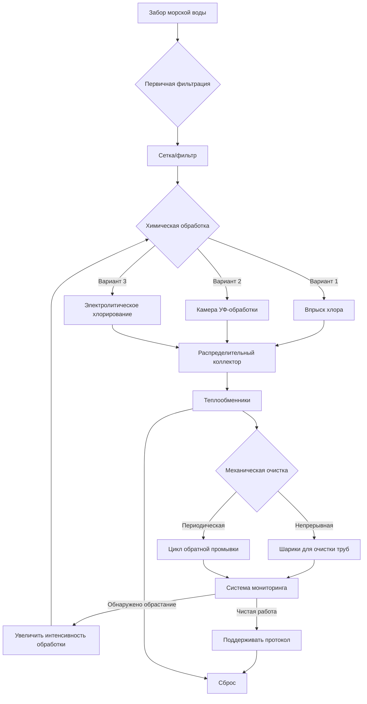

Биообрастание в системах охлаждения морской водой представляет критическую эксплуатационную проблему, которая снижает эффективность теплопередачи, увеличивает перепад давления, ускоряет коррозию и снижает надежность системы. Биологические организмы, включая бактерии, водоросли, балянусы, мидии и другую морскую жизнь, колонизируют поверхности теплообменников, трубопроводы и сетки, образуя изолирующие слои, которые серьезно нарушают тепловые характеристики.

## Физика влияния биообрастания на теплопередачу

Наличие биообрастания создает дополнительное тепловое сопротивление в пути теплопередачи. Общий коэффициент теплопередачи с обрастанием составляет:

$$\frac{1}{U_f} = \frac{1}{U_c} + R_f$$

где $U_f$ — коэффициент теплопередачи при обрастании (Вт/м²·К), $U_c$ — коэффициент чистой поверхности, а $R_f$ — сопротивление обрастанию (м²·К/Вт). Для морского биообрастания $R_f$ варьируется от 0,0002 до 0,0009 м²·К/Вт в зависимости от типа организма и толщины слоя.

Процент снижения теплопередачи составляет:

$$\eta_{reduction} = \left(1 - \frac{U_f}{U_c}\right) \times 100\%$$

Слой биопленки толщиной всего 0,5 мм может снизить эффективность теплопередачи на 20–40%, а макрообрастание (балянусы, мидии) свыше 3 мм может снизить производительность на 60–80%.

## Химические методы контроля биообрастания

### Системы хлорирования

Хлорирование остается наиболее широко используемым методом контроля биообрастания для систем морского охлаждения. Окислительное действие гипохлорита натрия нарушает клеточные процессы в микроорганизмах.

**Непрерывное хлорирование:**
- Остаточная концентрация: 0,2–0,5 мг/л свободного хлора
- Эффективно против микробных пленок и водорослей
- Более высокое потребление химикатов
- Проблемы с экологическим сбросом

**Ударное хлорирование (прерывистое хлорирование):**
- Концентрация дозировки: 1,0–2,0 мг/л свободного хлора
- Продолжительность: 15–30 минут на обработку
- Частота: 2–6 раз в день в зависимости от температуры воды
- Снижает потребление химикатов на 70–85% по сравнению с непрерывной дозировкой

Требуемый расход хлора для непрерывной дозировки составляет:

$$\dot{m}_{Cl_2} = C_{target} \times \dot{V}_{sw} \times \rho_{sw} \times 10^{-6}$$

где $C_{target}$ — целевая концентрация (мг/л), $\dot{V}_{sw}$ — расход морской воды (м³/ч), а $\rho_{sw}$ — плотность морской воды (1025 кг/м³).

Для системы с расходом морской воды 500 м³/ч и целевой концентрацией 0,3 мг/л:

$$\dot{m}_{Cl_2} = 0,3 \times 500 \times 1025 \times 10^{-6} = 0,154 \text{ кг/ч}$$

**Системы электролитического хлорирования:**

Эти системы вырабатывают гипохлорит натрия (NaOCl) на борту путем электролиза морской воды:

$$2NaCl + 2H_2O \rightarrow Cl_2 + H_2 + 2NaOH$$

$$Cl_2 + 2NaOH \rightarrow NaOCl + NaCl + H_2O$$

Преимущества включают исключение необходимости в химическом хранилище, автоматическое производство и точное управление дозировкой. Типичная эффективность электролитической ячейки составляет 90–95% с расходом энергии 3–4 кВт·ч/кг Cl₂.

### Обработка ультрафиолетовым излучением

Ультрафиолетовое излучение с длиной волны 254 нм повреждает ДНК и РНК микроорганизмов, предотвращая размножение. УФ-системы устанавливаются встроенно перед теплообменниками.

Требуемая УФ-доза для контроля биообрастания составляет:

$$D_{UV} = I \times t$$

где $D_{UV}$ — доза (мДж/см²), $I$ — УФ-интенсивность (мВт/см²), а $t$ — время экспозиции (секунды).

Эффективный контроль биообрастания требует доз 40–100 мДж/см² в зависимости от типа организма. Для цилиндрической УФ-камеры:

$$t = \frac{L}{v} = \frac{L \times A}{\dot{V}}$$

где $L$ — длина камеры (м), $A$ — площадь поперечного сечения потока (м²), а $\dot{V}$ — объемный расход (м³/с).

**Преимущества УФ-систем:**
- Без добавления химикатов или сброса
- Без ускорения коррозии
- Эффективна против устойчивых к хлору организмов
- Низкие требования к обслуживанию (замена лампы ежегодно)

**Ограничения УФ-систем:**
- Высокая мутность снижает эффективность (>10 ЕМФ проблематично)
- Требуется предварительная фильтрация
- Выше капитальные затраты, чем хлорирование
- УФ-пропускание снижается из-за обрастания кварцевых рукавов

## Физические и механические методы контроля

### Антиобрастающие покрытия

Поверхностные покрытия предотвращают прикрепление организмов через химические или физические механизмы.

| Тип покрытия | Механизм | Эффективность | Применение |
|--------------|----------|---------------|-----------|
| На основе меди | Выделение биоцидных ионов | 18–36 месяцев | Внутренняя часть труб, морские сундуки |
| На основе олова | Выделение биоцидных ионов | 24–48 месяцев | Трубы теплообменников |
| Силиконовое антиобрастающее | Низкая поверхностная энергия | 36–60 месяцев | Большие площади поверхности |
| Фторополимер | Ультранизкая адгезия | 48–72 месяца | Высокостоимостные компоненты |

Эффективность биоцидных покрытий зависит от скорости выделения активных ингредиентов. Для медьсодержащих покрытий требуемая скорость выделения составляет:

$$R_{Cu} = 10–20 \text{ мкг/см}^2\text{·день}$$

Это обеспечивает локальные концентрации меди, достаточные для подавления оседания (>50 мкг/л вблизи поверхности), при этом соответствуя лимитам сброса в основном потоке.

### Механические системы очистки

**Автоматизированная очистка труб (системы щеток):**

Поролоновые или нейлоновые щетки циркулируют через трубы конденсатора, механически удаляя биопленку и отложения. Частота очистки определяется скоростью обрастания:

$$f_{clean} = \frac{R_{f,max} - R_{f,initial}}{\dot{R}_f}$$

где $f_{clean}$ — время между очистками (дни), $R_{f,max}$ — максимальное допустимое сопротивление обрастанию, а $\dot{R}_f$ — скорость обрастания (м²·К/Вт в день).

Типичная частота очистки варьируется от непрерывной (шары циркулируют) до еженедельной в зависимости от тяжести обрастания.

**Системы обратной промывки:**

Периодическое изменение направления потока вытесняет слабо прикрепленные организмы и отложения. Эффективные параметры обратной промывки:
- Скорость: 1,5–2,5 м/с (на 50–100% выше нормального потока)
- Продолжительность: 30–90 секунд
- Частота: Каждые 4–8 часов работы

## Процесс контроля биообрастания

## Интегрированная стратегия контроля биообрастания

Эффективный контроль биообрастания требует нескольких взаимодополняющих методов:

| Компонент системы | Основной метод | Дополнительный метод | Параметр мониторинга |
|-------------------|----------------|----------------------|----------------------|
| Морской сундук/забор | Антиобрастающее покрытие | Периодический осмотр | Визуальный осмотр ежеквартально |
| Фильтры | Обратная промывка | Ручная очистка | Перепад давления |
| Трубопроводы | Хлорирование/УФ | Поддержание скорости | Проверка расхода |
| Трубы теплообменника | Автоматические щетки | Ударное хлорирование | Коэффициент теплопередачи |
| Распределительные коллекторы | Хлорирование | Покрытие | Температурный перепад |

## График обслуживания и мониторинг

**Ежедневные операции:**
- Мониторинг остаточного хлора (если применимо): 0,2–0,5 мг/л непрерывно, 1,0–2,0 мг/л удар
- Проверка работы УФ-системы и интенсивности
- Регистрация температурного перепада теплообменника
- Проверка расходов и давлений

**Еженедельные задачи:**
- Осмотр перепада давления фильтра
- Очистка кварцевых рукавов УФ, если пропускание <85%
- Проверка работы автоматической системы очистки
- Проверка выхода системы хлорирования

**Ежемесячное обслуживание:**
- Осмотр морского сундука и решетки забора
- Проверка производительности теплообменника относительно базовых значений
- Калибровка анализаторов остаточного хлора
- Обзор данных тренда обрастания

**Ежегодный капитальный ремонт:**
- Осмотр морского сундука на сухом доке
- Контроль труб теплообменника (видеоскоп)
- Замена УФ-ламп (эффективность снижается на 20–30% ежегодно)
- Повторное нанесение антиобрастающих покрытий по мере необходимости
- Вихретоковое тестирование труб конденсатора

## Мониторинг производительности

Обрастание теплообменника количественно оценивается коэффициентом чистоты:

$$CF = \frac{U_{actual}}{U_{design}}$$

Приемлемая работа обычно требует $CF > 0,85$. Когда $CF < 0,80$, необходима интенсивная очистка или корректировка обработки.

Сопротивление обрастанию можно рассчитать из эксплуатационных данных:

$$R_f = \frac{1}{U_{actual}} - \frac{1}{U_{clean}} = \frac{1}{\frac{\dot{Q}}{A \times LMTD}} - \frac{1}{U_{design}}$$

где $\dot{Q}$ — измеренный расход теплопередачи (Вт), $A$ — площадь теплопередачи (м²), а $LMTD$ — логарифмическая средняя разность температур (К).

## Экологические и нормативные соображения

Сброс хлора регулируется рекомендациями IMO и региональными нормативами. Максимально допустимые концентрации сброса обычно варьируются от 0,1–0,2 мг/л общего остаточного окислителя (ОРО). Дехлорирование с помощью бисульфита натрия может потребоваться:

$$NaHSO_3 + HOCl \rightarrow NaHSO_4 + HCl$$

Стехиометрическое соотношение составляет примерно 1,5:1 (бисульфит натрия:хлор по весу), хотя 2:1 обычно используется для обеспечения полной нейтрализации.

Альтернативные методы обработки (УФ, неокисляющие биоциды, физические методы) все чаще предпочитаются в экологически чувствительных районах, где ограничения на сброс хлора являются строгими.

## Компоненты

- Механизмы роста морских организмов
- Физика снижения теплопередачи при обрастании
- Химические антиобрастающие системы
- Системы хлорирования (непрерывное и ударное)
- Генерация электролитического хлорирования
- Системы обработки ультрафиолетовым излучением
- Технологии антиобрастающих покрытий
- Механические системы очистки
- Автоматизированные щетки для очистки труб
- Системы и протоколы обратной промывки
- Интегрированные стратегии управления
- Методы мониторинга производительности
