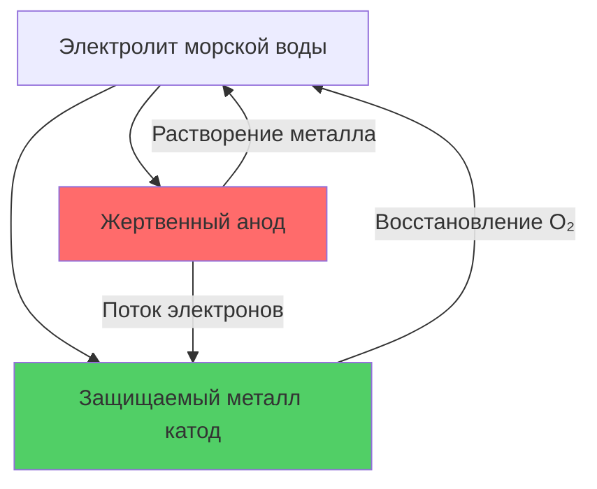
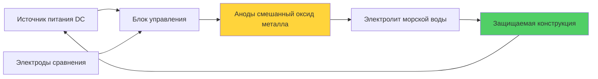

Коррозия в системах охлаждения морской водой представляет один из наиболее значительных инженерных вызовов в приложениях корабельного HVAC. Агрессивный электрохимический характер морской воды, в сочетании с растворённым кислородом, хлоридами и биологической активностью, создаёт коррозионную среду, которая может быстро повредить неправильно защищённые системы. Эффективный контроль коррозии требует комплексных стратегий, объединяющих выбор материалов, электрохимическую защиту и оптимизацию конструкции.

## Механизмы коррозии в морской воде

Основные процессы коррозии, влияющие на морские системы охлаждения, управляются электрохимическими реакциями на границе раздела металл–морская вода.

### Анодное растворение

Окисление металла происходит в анодных зонах, где атомы металла теряют электроны:

$$M \rightarrow M^{n+} + ne^-$$

Для типичных морских материалов характерны следующие реакции полуячейки:

$$Fe \rightarrow Fe^{2+} + 2e^- \quad E^0 = -0.44 \text{ В}$$

$$Cu \rightarrow Cu^{2+} + 2e^- \quad E^0 = +0.34 \text{ В}$$

### Катодные реакции

Электроны, высвобождаемые в анодных зонах, потребляются в катодных зонах. В аэрированной морской воде основная катодная реакция — восстановление кислорода:

$$O_2 + 2H_2O + 4e^- \rightarrow 4OH^-$$

Скорость коррозии контролируется предельной плотностью тока, обычно определяемой скоростью диффузии кислорода к поверхности металла:

$$i_{lim} = \frac{nFD_O C_O}{\delta}$$

Где:
- $i_{lim}$ = предельная плотность тока (А/м²)
- $n$ = количество электронов (4 для восстановления O₂)
- $F$ = постоянная Фарадея (96 485 Кл/моль)
- $D_O$ = коэффициент диффузии кислорода (≈2×10⁻⁹ м²/с)
- $C_O$ = концентрация кислорода (≈8 мг/л в морской воде)
- $\delta$ = толщина диффузионного пограничного слоя (м)

## Стратегия выбора материалов

### Медно-никелевые сплавы

Медно-никелевые сплавы (90/10 и 70/30 Cu-Ni) являются традиционным стандартом для морских теплообменников благодаря их отличной коррозионной стойкости и устойчивости к биообрастанию.

**90/10 Медно-никелевый сплав (UNS C70600):**
- Состав: 90% Cu, 10% Ni, 1,5% Fe
- Скорость коррозии: 0,025–0,05 мм/год
- Максимальная скорость потока: 2,5 м/с
- Стоимость: Средняя
- Применение: Трубы конденсатора, трубопроводы

**70/30 Медно-никелевый сплав (UNS C71500):**
- Состав: 70% Cu, 30% Ni, 0,5% Fe
- Скорость коррозии: 0,01–0,025 мм/год
- Максимальная скорость потока: 3,5 м/с
- Стоимость: Выше, чем 90/10
- Применение: Приложения с высокой скоростью потока, морские платформы

Содержание железа критично для образования защитных плёнок гидроксида железа:

$$Fe^{2+} + 2OH^- \rightarrow Fe(OH)_2 \rightarrow Fe(OH)_3$$

### Титан

Титан обладает превосходной коррозионной стойкостью благодаря стабильной пассивной оксидной плёнке (TiO₂):

| Свойство | Титан Grade 2 | 90/10 Медно-никелевый |
|----------|------------------|-------------------|
| Скорость коррозии | <0,001 мм/год | 0,025–0,05 мм/год |
| Максимальная скорость потока | >6 м/с | 2,5 м/с |
| Предел температуры морской воды | Нет практического предела | 60°C |
| Относительная стоимость | 3–5× | 1× (базовая) |
| Плотность | 4,51 г/см³ | 8,90 г/см³ |
| Теплопроводность | 17 Вт/(м·К) | 50 Вт/(м·К) |

Пассивная плёнка титана немедленно восстанавливается при повреждении, обеспечивая исключительную стойкость к эрозионной коррозии и кавитации.

### Нержавеющие стали

Супердуплексные и 6-молибденовые аустенитные нержавеющие стали обеспечивают промежуточные характеристики:

**Супердуплекс 2507 (UNS S32750):**
- PREN = %Cr + 3,3(%Mo) + 16(%N) = 42+
- Максимальная температура морской воды: 30–40°C
- Подвержена щелевой коррозии выше критической температуры

## Системы катодной защиты

Катодная защита смещает электрохимический потенциал защищаемых металлов, чтобы исключить или снизить коррозию.

### Системы жертвенных анодов

Жертвенные аноды более электроотрицательны, чем защищаемая конструкция, обеспечивая гальваническую защиту:

**Выбор материала анода:**

| Материал | Потенциал разомкнутой цепи vs Ag/AgCl | Ёмкость Ач/кг | Применение |
|----------|-----------------------------------|----------------|--------------|
| Цинк | -1,05 В | 780 | Общая морская вода, <60°C |
| Алюминиевый сплав | -1,10 В | 2600 | Высокая эффективность, все температуры |
| Магний | -1,60 В | 1100 | Пресная вода, высокое движущее напряжение |

**Расчёт массы анода:**

Требуемая масса анода:

$$M = \frac{I_p \cdot t \cdot 8760}{U \cdot \eta}$$

Где:
- $M$ = масса анода (кг)
- $I_p$ = ток защиты (А)
- $t$ = время проектирования (лет)
- $U$ = ёмкость анода (Ач/кг)
- $\eta$ = коэффициент использования (0,85 типовое значение)

Плотность тока защиты для стали в морской воде: 0,08–0,15 А/м²

### Наведённая катодная защита (ICCP)

Системы ICCP используют внешний источник постоянного тока для создания защитного тока:

$$E_{protection} = E_{corrosion} - \eta_{polarization}$$

Целевой потенциал защиты: -0,80 до -1,05 В vs Ag/AgCl

**Компоненты системы:**

**Материалы анодов:**
- Смешанный оксид металла (MMO): Металлы платиновой группы на основе титана
- Чугун с высоким содержанием кремния: Традиционный, требует периодической замены
- Графит: Низкая стоимость, высокий расход

## Предотвращение гальванической коррозии

### Гальванический ряд в морской воде

При контакте разнородных металлов в морской воде более активный металл корродирует предпочтительно:

| Металл/Сплав | Потенциал (В vs Ag/AgCl) |
|-------------|--------------------------|
| Магний | -1,60 |
| Цинк | -1,05 |
| Алюминиевые сплавы | -1,10 до -0,75 |
| Мягкая сталь | -0,60 до -0,70 |
| Чугун | -0,60 |
| 90/10 Медно-никелевый | -0,25 до -0,20 |
| Титан | -0,05 (пассивный) |
| Графит | +0,25 |

### Стратегии предотвращения

**1. Совместимость материалов:**
Выбирайте металлы близко расположенные в гальваническом ряду (разница потенциалов <0,25 В).

**2. Изоляция:**
Используйте диэлектрические изоляторы в местах соединения разнородных металлов:
- Неметаллические прокладки
- Пластиковые шайбы и втулки
- Изолирующие фланцы

**3. Контроль отношения площадей:**

Плотность гальванического тока в анодной зоне:

$$i_a = \frac{\Delta E}{R_{total}} \cdot \frac{1}{A_a}$$

Где $A_a$ — площадь анода. Минимизируйте площадь анода относительно площади катода (противоположно благоприятному условию).

**4. Покрытия:**
Покройте более благородный (катодный) металл, чтобы снизить эффективную площадь катода.

## Проектные соображения

### Оптимизация скорости потока

Скорость коррозии первоначально уменьшается с увеличением скорости (улучшенный транспорт кислорода улучшает образование пассивной плёнки), затем увеличивается из-за эрозионной коррозии:

$$CR = CR_0 + k \cdot (v - v_{crit})^n$$

Где:
- $CR$ = скорость коррозии
- $v$ = скорость потока
- $v_{crit}$ = критическая скорость для материала
- $n$ = показатель степени (обычно 2–3)

**Максимальные проектные скорости потока:**
- 90/10 Медно-никелевый: 2,5 м/с
- 70/30 Медно-никелевый: 3,5 м/с
- Титан: >6 м/с (невосприимчив к эрозионной коррозии)

### Влияние температуры

Скорости коррозии обычно удваиваются при увеличении температуры на 10°C (до ≈60°C), следуя поведению Аррениуса:

$$k_T = k_{T_0} \exp\left[\frac{-E_a}{R}\left(\frac{1}{T} - \frac{1}{T_0}\right)\right]$$

Где:
- $E_a$ = энергия активации (40–80 кДж/моль для коррозии в морской воде)
- $R$ = газовая постоянная (8,314 Дж/(моль·К))

### Предотвращение щелевой коррозии

Щелевая коррозия ускоряется в областях с дефицитом кислорода:

**Рекомендации по проектированию:**
- Исключите или герметизируйте щели <0,5 мм
- Обеспечьте полный дренаж при остановке
- Используйте сплошные прокладки вместо спирально навитых
- Поддерживайте турбулентный поток, чтобы предотвратить отложения
- Спроектируйте соединения трубка–трубная доска для нулевой щели

## Мониторинг и техническое обслуживание

**Интервалы инспекции:**
- Визуальная инспекция: 6 месяцев
- Ультразвуковое тестирование толщины: Ежегодно
- Измерение потребления анода: 6–12 месяцев
- Проверка системы ICCP: Ежеквартально

**Оценка скорости коррозии:**

Метод определения потери массы:

$$CR = \frac{K \cdot W}{A \cdot t \cdot \rho}$$

Где:
- $CR$ = скорость коррозии (мм/год)
- $K$ = константа (8,76×10⁴)
- $W$ = потеря массы (г)
- $A$ = открытая площадь (см²)
- $t$ = время воздействия (часы)
- $\rho$ = плотность (г/см³)

Эффективная защита от коррозии в системах морской воды требует комплексной интеграции надлежащих материалов, электрохимических методов защиты и звукового инженерного проектирования, учитывающего уникальную рабочую среду корабельных приложений HVAC.
