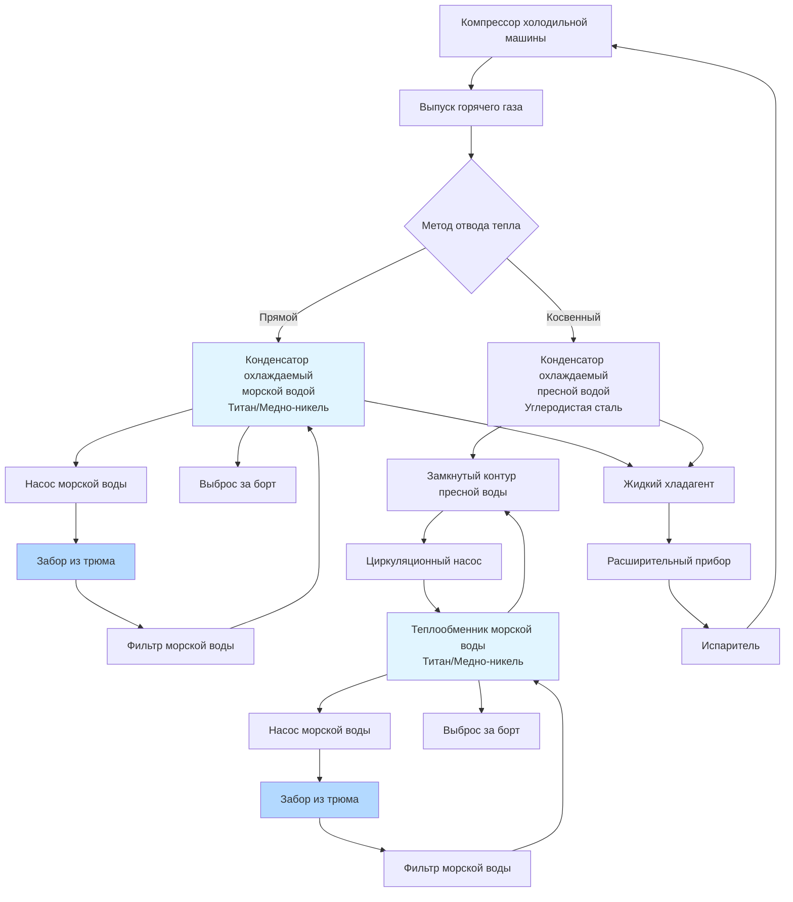

## Физические принципы отвода тепла в морскую воду

Морская вода служит конечным тепловым стоком для морских систем HVAC, поглощая тепло от конденсаторов холодильных машин, чиллеров и охлаждаемых помещений. Процесс теплопередачи зависит от теплоёмкости океанской воды и разности температур между хладагентом и морской водой. В отличие от наземных систем, отводящих тепло в окружающий воздух, морские системы используют значительную тепловую массу и доступность морской воды, обеспечивая превосходный отвод тепла с минимальным потреблением энергии на теплопередачу.

Основной процесс теплопередачи происходит путём теплопроводности через поверхности теплообменника, где скрытая теплота конденсации хладагента передаётся через металлические стенки в поток морской воды. Эффективность зависит от площади поверхности теплообменника, теплопроводности материала, скоростей потока и температурного градиента между горячим хладагентом и холодной морской водой.

## Расчёты мощности морского теплообменника

Мощность отвода тепла конденсатором, охлаждаемым морской водой, рассчитывается с использованием уравнения чувствительного тепла, применённого к потоку морской воды:

$$Q = \dot{m}_{sw} \cdot c_{p,sw} \cdot \Delta T_{sw}$$

Где:
- $Q$ = Мощность отвода тепла (кВ)
- $\dot{m}_{sw}$ = Массовый расход морской воды (кг/с)
- $c_{p,sw}$ = Удельная теплоёмкость морской воды ≈ 3,93 кДж/(кг·К) при солёности 35 ppt
- $\Delta T_{sw}$ = Повышение температуры морской воды (К)

Общая теплопередача регулируется следующим образом:

$$Q = U \cdot A \cdot LMTD$$

Где:
- $U$ = Общий коэффициент теплопередачи (Вт/м²·К)
- $A$ = Площадь поверхности теплообменника (м²)
- $LMTD$ = Логарифмическая средняя разность температур (К)

Логарифмическая средняя разность температур для противоточных теплообменников:

$$LMTD = \frac{(T_{r,in} - T_{sw,out}) - (T_{r,out} - T_{sw,in})}{\ln\left(\frac{T_{r,in} - T_{sw,out}}{T_{r,out} - T_{sw,in}}\right)}$$

Где:
- $T_{r,in}$ = Температура входа хладагента (К)
- $T_{r,out}$ = Температура выхода хладагента (К)
- $T_{sw,in}$ = Температура входа морской воды (К)
- $T_{sw,out}$ = Температура выхода морской воды (К)

Требуемый расход морской воды для заданной тепловой нагрузки:

$$\dot{V}_{sw} = \frac{Q}{c_{p,sw} \cdot \rho_{sw} \cdot \Delta T_{sw}}$$

Где:
- $\dot{V}_{sw}$ = Объёмный расход морской воды (м³/с)
- $\rho_{sw}$ = Плотность морской воды ≈ 1025 кг/м³ при 15°C и солёности 35 ppt

## Методы прямого и косвенного отвода тепла

Морские системы HVAC используют две основные конфигурации отвода тепла, каждая из которых имеет различные термодинамические и операционные характеристики.

| Параметр | Прямое охлаждение морской водой | Косвенное охлаждение морской водой |
|-----------|-------------------------|---------------------------|
| Конфигурация | Морская вода циркулирует непосредственно через конденсатор | Замкнутый контур пресной воды с теплообменником морской воды |
| Этапы теплопередачи | Один этап (хладагент → морская вода) | Два этапа (хладагент → пресная вода → морская вода) |
| Термическая эффективность | Выше (меньше тепловых сопротивлений) | Ниже (дополнительная разность температур) |
| Риск загрязнения | Высокий (морские наросты на стороне хладагента) | Низкий (морские наросты изолированы на стороне морской воды) |
| Риск коррозии | Серьёзный (морская вода контактирует с контуром хладагента) | Минимальный (морская вода изолирована от контура хладагента) |
| Требования к материалам | Титан или медно-никель обязательны | Углеродистая сталь приемлема для конденсатора |
| Частота обслуживания | Высокая (химическая чистка, замена труб) | Умеренная (только чистка теплообменника морской воды) |
| Начальная стоимость | Ниже (один теплообменник) | Выше (два теплообменника, циркуляционный насос) |
| Эксплуатационная стоимость | Ниже (без циркуляционного насоса) | Выше (энергия насоса для замкнутого контура) |
| Температурный подход | 2-3°C типично | 5-8°C типично (суммарно от обоих этапов) |
| Сложность системы | Простая | Сложная (требует расширительного бака, управления) |
| Типовое применение | Малые суда, вспомогательные системы | Крупные суда, критические системы HVAC |

## Схема системы отвода тепла в морскую воду

## Рассмотрения проектирования температурного режима морской воды

Температура морской воды значительно варьируется в зависимости от географического местоположения, глубины океана и сезона, требуя внимательного проектирования системы для обеспечения надлежащего отвода тепла во всех режимах эксплуатации.

**Тропические воды:** Поверхностные температуры достигают 28-32°C в экваториальных регионах, снижая разность температур конденсации и эффективность системы. Температуры конденсации при проектировании должны учитывать пиковые температуры морской воды плюс температуру подхода, обычно требуя 38-42°C конденсации для систем с R-134a. Сниженная плотность и удельная теплоёмкость при повышенных температурах дополнительно снижают эффективность теплопередачи.

**Умеренные воды:** Океаны в средних широтах показывают поверхностные температуры 8-22°C с сезонными колебаниями. Расчёты проектирования используют максимально ожидаемую температуру (обычно 22-24°C) для обеспечения надлежащей мощности во время летней эксплуатации. Более широкий диапазон температур позволяет более низкие давления конденсации зимой, улучшая эффективность системы и снижая потребление электроэнергии компрессором.

**Полярные воды:** Операции в Арктике и Антарктиде встречают температуры морской воды -2-8°C. Хотя превосходный отвод тепла достижим, эти условия создают две проблемы: возможность замерзания в трубопроводе выброса за борт при неподвижности судна и сниженная мощность системы при частичной нагрузке, поскольку давление конденсации падает ниже оптимального диапазона работы. Некоторые системы включают байпас горячего газа или компрессоры переменной скорости для поддержания минимального давления конденсации.

**Глубина всасывания:** Температура морской воды снижается с глубиной из-за термической стратификации. Суда с глубокими всасывающими тридельными сундуками (5-8 м ниже ватерлинии) получают доступ к более холодной воде, чем поверхностные всасывания, улучшая отвод тепла на 2-4°C в спокойном море. Однако суда с малой осадкой и скоростные катера должны проектироваться для условий поверхностной температуры.

**Влияние загрязнения и биообрастания:** Морские организмы, отложения карбоната кальция и накопление осадков снижают коэффициенты теплопередачи на 20-40% со временем. Расчёты проектирования применяют коэффициенты загрязнения 0,0001-0,0002 м²·К/Вт для поверхностей, контактирующих с морской водой, увеличивая требуемую площадь поверхности на 15-25% по сравнению с чистыми условиями. Регулярная механическая или химическая чистка восстанавливает производительность.

**Выбор материалов:** Прямой контакт с морской водой требует коррозионностойких материалов. Титан обеспечивает превосходную коррозионную стойкость, но стоит в 4-6 раз дороже, чем медно-никель (сплавы 90-10 или 70-30). Медно-никель обеспечивает адекватный срок службы при сниженной стоимости для большинства приложений с минимальной скоростью воды 1,5-2,0 м/с для предотвращения морского обрастания, избегая эрозии выше 3,0 м/с. Адмиралтейская латунь служит бюджетными приложениями только в пресной воде или низкосолёных эстуарных средах.

## Интеграция проектирования системы

Эффективный отвод тепла в морскую воду требует интеграции с машинными системами судна. Выбор размера насоса морской воды должен учитывать потери трения трубопроводов, перепад давления фильтра (обычно 20-35 кПа в чистом состоянии) и перепад давления теплообменника (15-30 кПа), сохраняя при этом достаточную скорость потока для предотвращения загрязнения. Выбор насоса учитывает требования к чистой положительной напорной высоте (NPSH), особенно для установок выше ватерлинии, где подъём всасывания снижает доступную NPSH.

Конструкция морского сундука включает множественные всасывания для обеспечения доступности морской воды во всех углах крена и дифферента судна, со скоростью всасывания ниже 1,5 м/с для минимизации увлечения морских организмов и предотвращения образования воронки. Расположение выброса за борт предотвращает рециркуляцию нагретой воды обратно в системы всасывания, поддерживая расчётные температурные дифференциалы.
