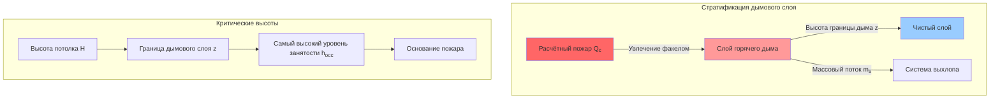
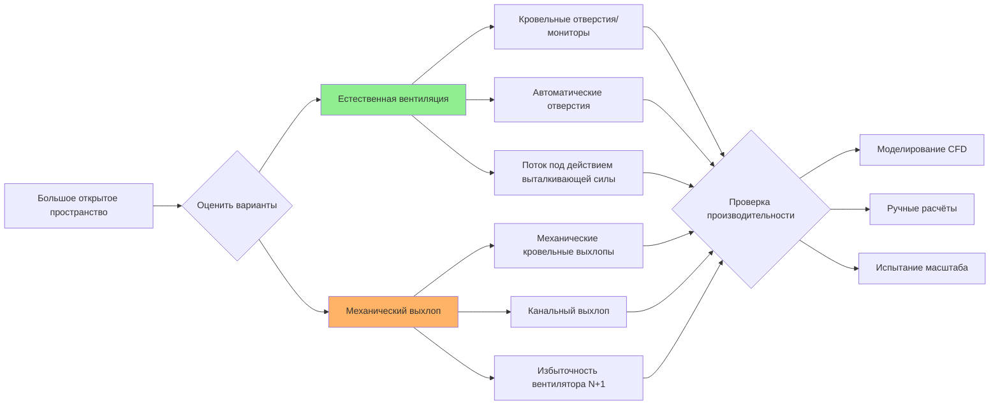

## Обзор

Управление дымом в больших открытых пространствах представляет уникальные инженерные проблемы, отличающиеся от обычных разделённых зданий. Атриумы, склады, ангары для самолётов, выставочные центры и спортивные арены требуют специализированных подходов к управлению дымом, учитывающих естественную стратификацию дыма, объёмные эффекты и продолжительное время эвакуации. Эти системы должны поддерживать приемлемые условия на уровне занятости, управляя при этом накоплением дыма в верхней части пространства.

Управление дымом в больших открытых пространствах основывается на физическом принципе, что горячий дым поднимается и стратифицируется под потолком, создавая границу дымового слоя. Инженерная задача состоит в поддержании этой границы выше самого высокого уровня занятости в течение всего требуемого времени эвакуации, обычно рассчитываемого как 1,5–2 раза ожидаемый период эвакуации.

## Требования нормативных документов и стандартов

### NFPA 92: Системы управления дымом

NFPA 92 (Стандарт для систем управления дымом) предоставляет основную инженерную методологию для больших открытых пространств:

**Пороги применимости:**
- Высота атриума > 15 м
- Площадь пола > 2000 м² на уровень
- Высота потолка > 6 м в сборочных/торговых помещениях
- Специальные высокоопасные приложения независимо от размера

**Требования к расчётному пожару:**
- Анализ установившейся скорости тепловыделения (HRR)
- Оценка нагрузки топлива и кривая роста пожара (профили t-квадрат)
- Минимальные расчётные пожары: 5 МВт для типичных приложений, 10–20 МВт для высокоопасных

### Положения IBC и IFC

Раздел 909 Международного строительного кодекса требует спроектированного управления дымом для атриумов и некоторых крытых торговых центров. Эти требования требуют анализа, основанного на производительности, с использованием методологий NFPA 92 и проверки вычислительной гидродинамикой (CFD) для сложной геометрии.

## Подходы к проектированию систем управления дымом

### Метод массового выхлопа

Подход массового выхлопа рассчитывает требуемую объёмную скорость выхлопа для поддержания границы дымового слоя на указанной высоте выше пола. Этот метод предполагает установившийся пожар с непрерывным производством дыма, уравновешиваемым механическим выхлопом.

Фундаментальное требование к скорости выхлопа:

$$V_e = \frac{m_s}{\rho_s}$$

где $V_e$ — объёмная скорость выхлопа (м³/с), $m_s$ — массовая скорость производства дыма (кг/с), и $\rho_s$ — плотность дыма (кг/м³).

Массовая скорость производства дыма из факела:

$$m_s = 0.071 Q_c^{1/3} (z - z_0)^{5/3} + 0.0018 Q_c$$

где $Q_c$ — конвективная скорость тепловыделения (кВт), $z$ — высота над основанием пожара (м), и $z_0$ — высота виртуального источника (м).

Для осесимметричных факелов виртуальный источник:

$$z_0 = -1.02 D + 0.083 Q_c^{2/5}$$

где $D$ — диаметр пожара (м).

### Анализ заполнения дымом

Естественное заполнение дымом предсказывает скорость спуска границы дымового слоя при отсутствии механического выхлопа, полезно для определения доступного безопасного времени эвакуации (ASET):

$$\frac{dz}{dt} = -\frac{m_s}{\rho_s A}$$

где $A$ — площадь пола (м²). Интегрирование по времени даёт спуск границы:

$$z(t) = z_i - \int_0^t \frac{m_s}{\rho_s A} \, dt$$

где $z_i$ — начальная чистая высота (обычно высота потолка).

## Параметры проектирования системы

### Высота границы дымового слоя

Минимально приемлемая высота границы:

$$z_{min} = h_{occ} + 2.0 \text{ м}$$

Это обеспечивает надлежащую видимость и тепловую защиту для эвакуирующихся людей. Для пространств с антресолями или поднятыми дорожками $h_{occ}$ представляет самую высокую высоту пути эвакуации.

### Определение размера системы выхлопа

| Тип пространства | Расчётный пожар (МВт) | Типичная скорость выхлопа | Воздухообмен в час |
|-----------------|----------------------|--------------------------|-------------------|
| Атриум торгового центра | 5–10 | 10–20 м³/с на МВт | 4–8 ч⁻¹ |
| Склад (стандартный) | 5–15 | 15–30 м³/с на МВт | 2–4 ч⁻¹ |
| Склад (высокоопасный) | 15–30 | 30–50 м³/с на МВт | 4–6 ч⁻¹ |
| Выставочный центр | 5–10 | 12–25 м³/с на МВт | 3–6 ч⁻¹ |
| Ангар для самолётов | 20–50 | 40–80 м³/с на МВт | 2–5 ч⁻¹ |

### Требования к воздуху подпитки

Подаваемый воздух должен заменять выхлопываемый дым для предотвращения разгерметизации здания и поддержания эффективности выхлопа:

$$V_{ma} \geq 0.85 V_e$$

Воздух подпитки должен вводиться с низкой скоростью (< 1,5 м/с) ниже границы дымового слоя для предотвращения нарушения слоя и смешивания дыма.

## Естественные и механические системы

### Преимущества естественной вентиляции

- Не требует электроэнергии (приводится в действие силой тяжести/выталкивающей силой)
- Более низкие расходы на установку и техническое обслуживание
- Врожденная надежность (отсутствие режимов отказа механизма)
- Эффективна для складов и промышленных приложений

Расчёт площади естественного отверстия:

$$A_v = \frac{V_e}{C_d \sqrt{2 g \Delta T / T_\infty}}$$

где $C_d$ — коэффициент расхода (обычно 0,6–0,7), $g$ — ускорение свободного падения (9,81 м/с²), $\Delta T$ — повышение температуры (К), и $T_\infty$ — температура окружающей среды (К).

### Преимущества механического выхлопа

- Точное управление потоком и проверка
- Эффективна в пространствах с низким потолком или сложной геометрией
- Интеграция с системами автоматизации зданий
- Быстрое удаление дыма

## Соображения при проектировании

**Взаимодействие факелов:** Несколько пожаров или препятствий могут вызвать отклонение факела и несимметричное поведение, требующее анализа CFD для точных предсказаний.

**Эффекты балок и балочных систем:** Глубокие конструктивные элементы создают карманы, которые задерживают дым, снижая эффективность выхлопа. Расстояние между каналами не должно превышать соотношение глубины к расстоянию 3:1.

**Размещение детекторов:** Детекторы дыма должны находиться в пределах дымового слоя, обычно на высоте 90–95% от потолка, с учётом эффектов стратификации.

**Введение в эксплуатацию:** Полные функциональные испытания с трассирующим театральным дымом проверяют высоту границы, скорость выхлопа и интеграцию сигнализации перед занятостью.

## Сводка приложения

| Аспект проектирования | Требование NFPA 92 | Инженерный подход |
|--------------------|--------------------|-------------------|
| Расчётный пожар | На основе топлива или предписывающий | Анализ HRR, рост t² |
| Производство дыма | Уравнения факела | Расчёты массового потока |
| Высота границы | Выше самого высокого пути эвакуации + 2 м | Объёмный анализ |
| Скорость выхлопа | Расчёт на основе физики | Метод массового выхлопа |
| Воздух подпитки | ≥85% выхлопа | Введение на низком уровне |
| Проверка | CFD или испытания требуются | На основе производительности |

Управление дымом в больших открытых пространствах требует строгого инженерного анализа, интегрирующего динамику пожара, механику жидкостей и координацию систем зданий для достижения соответствия нормативным документам и целей безопасности жизни.
