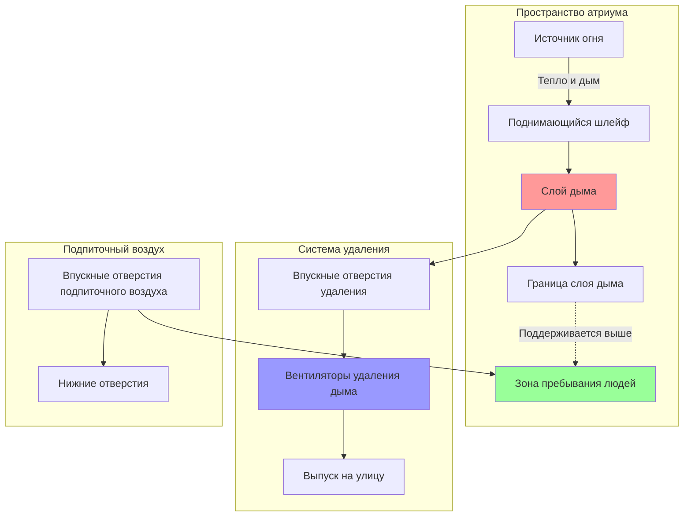
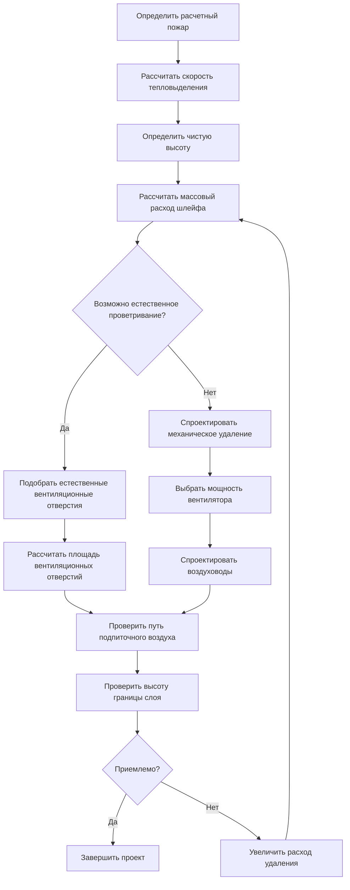

Системы дымоудаления атриумов защищают людей в помещениях большого объема, управляя движением дыма и поддерживая пригодные для дыхания условия во время пожара. Эти системы решают уникальные задачи, возникающие в многоэтажных открытых пространствах, где невозможно применить традиционные стратегии противопожарного зонирования.

## Философия проектирования

Дымоудаление в атриумах основано на поддержании слоя дыма над зоной пребывания людей, обеспечивая при этом достаточное время для эвакуации. Основная цель — поддерживать границу слоя дыма не менее чем на 1,8 м (6 футов) выше самой высокой поверхности для ходьбы или уровня, пригодного для пребывания людей, внутри атриума.

### Подходы к проектированию

Три фундаментальные стратегии определяют проектирование систем дымоудаления в атриумах:

| Подход | Метод | Применение | Преимущества |
|------|--------|------|------|
| Заполнение дымом | Допускание накопления дыма с расчетом времени заполнения | Низкие атриумы с быстрой эвакуацией | Минимальные механические системы |
| Стабильный слой дыма | Удаление дыма с расходом, равным скорости образования шлейфа | Средние атриумы | Поддержание постоянной высоты слоя |
| Естественное проветривание | Использование потока, вызванного плавучестью, через openings в крыше | Высокие атриумы с достаточной высотой | Не требуется механическая энергия |

## Характеристики пожарного шлейфа

Скорость образования дыма от пожара определяет требования к удалению. Модель осесимметричного шлейфа служит основой для расчетов.

### Расход массы шлейфа

Для пожаров, не затрагивающих стены, массовый расход шлейфа на высоте $z$ над источником огня:

$$\dot{m}_p = 0.071 Q_c^{1/3} (z - z_0)^{5/3}$$

Где:
- $\dot{m}_p$ = массовый расход шлейфа (кг/с)
- $Q_c$ = скорость конвективного тепловыделения (кВт)
- $z$ = высота над источником огня (м)
- $z_0$ = высота виртуального начала (м)

### Коррекция виртуального начала

Для пожаров с характерным диаметром $D$ виртуальное начало определяется как:

$$z_0 = -1.02D + 0.083Q_c^{2/5}$$

Эта коррекция учитывает физический размер источника топлива и предотвращает завышение оценки захвата воздуха шлейфом вблизи основания пожара.

## Расход воздуха на удаление

Требуемый объемный расход удаления зависит от массового расхода шлейфа и температуры слоя дыма:

$$V = \frac{\dot{m}_p}{\rho_s}$$

Где $\rho_s$ — плотность дыма при температуре слоя. Для инженерных расчетов:

$$V = \dot{m}_p \left(\frac{T_s}{353}\right)$$

При $V$ в м³/с, $\dot{m}_p$ в кг/с и $T_s$ в Кельвинах.

## Конфигурация системы

## Поток процесса проектирования

## Требования нормативов NFPA 92

### Спецификации расчетного пожара

NFPA 92 предоставляет рекомендации по выбору расчетного пожара в зависимости от назначения помещений и характеристик топлива:

- **Торговые помещения**: стационарный пожар мощностью 5 МВт
- **Офисные атриумы**: стационарный пожар мощностью 3 МВт
- **Помещения для собраний**: оценка на основе конкретных топливных нагрузок

Расчетные пожары должны учитывать как скорость роста пожара, так и стационарную скорость тепловыделения для анализа во времени.

### Требования к чистой высоте

Минимальная чистая высота под слоем дыма:

- 6 футов над самым высоким занятым уровнем
- Дополнительная высота для учета теплового излучения, когда температура слоя превышает 100°C

### Требования к приточному воздуху

Объем приточного воздуха должен соответствовать объему вытяжного воздуха и подаваться ниже слоя дыма, чтобы не нарушать стратифицированный слой дыма. Максимальная скорость приточного воздуха: 1 м/с (200 фут/мин) в занятых помещениях.

## Механические системы против естественных систем

### Системы механической вытяжки

**Преимущества:**
- Точный контроль расхода вытяжного воздуха
- Независимость от погодных условий
- Применимы для любой высоты атриума
- Возможность интеграции с системами ОВКВ

**Конструктивные особенности:**
- Минимальная температурная категория вентилятора: 120°C
- Резервирование мощности вентилятора или резервное питание
- Расположение воздухозаборника не менее 3 метров от оси факела
- Уклон воздуховодов для отвода конденсата

### Системы естественного проветривания

Требуемая площадь проема для естественного проветривания:

$$A_v = \frac{\dot{m}_p}{\rho_\infty C_v \sqrt{2g\Delta\rho h / \rho_\infty}}$$

Где:
- $A_v$ = площадь проема (м²)
- $C_v$ = коэффициент проема (обычно 0,6–0,7)
- $g$ = ускорение свободного падения (9,81 м/с²)
- $\Delta\rho$ = разность плотностей по обе стороны проема
- $h$ = высота нейтральной зоны над проемом

**Критические факторы:**
- Достаточная высота атриума (обычно >18 м)
- Надежные механизмы срабатывания проемов
- Влияние ветра на выброс
- Влияние на зимнюю тепловую нагрузку

## Интеграция систем

Системы дымоудаления в атриумах должны быть согласованы с системой ОВКВ здания:

1. **Нормальный режим работы**: Стандартная система ОВКВ поддерживает комфортные условия
2. **Режим дымоудаления**: Системы ОВКВ отключаются или перенастраиваются для предотвращения циркуляции дыма
3. **Подпор воздуха**: Прилегающие помещения могут требовать подпора воздуха для предотвращения миграции дыма

Последовательности управления должны быть запрограммированы в системе пожарной сигнализации с жесткой проводной связью с элементами управления ОВКВ для обеспечения надежности.

## Проверка работоспособности

Моделирование вычислительной гидродинамики (CFD) подтверждает проектные допущения для сложных геометрических форм или нестандартных сценариев пожара. Физические испытания после монтажа подтверждают:

- Расходы вытяжного воздуха в пределах 10% от проектных
- Поддержание уровня раздела слоя дыма на проектной высоте
- Паттерны приточного воздуха не нарушают стратификацию
- Срабатывание и последовательность работы системы управления

Периодические испытания в соответствии с требованиями NFPA 92 обеспечивают постоянную работоспособность системы и соответствие первоначальному замыслу проектирования.
