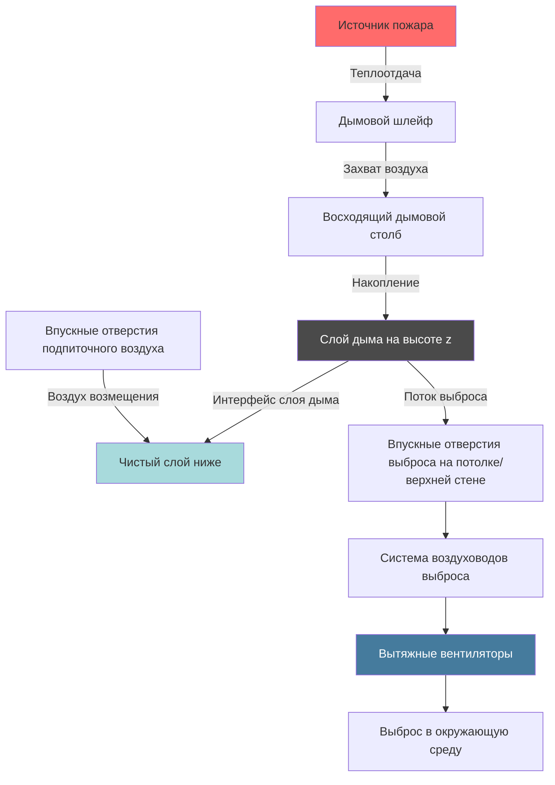

## Фундаментальные принципы

Расчеты скорости выброса воздуха из атриума определяют объемный расход воздуха, необходимый для поддержания интерфейса слоя дыма на заданной высоте над источником пожара. Проектная база следует методологиям NFPA 92, которые связывают скорость теплоотдачи пожара с массовым расходом шлейфа и требуемой емкостью выброса воздуха.

Цель состоит в поддержании приемлемых условий ниже слоя дыма для эвакуации занимающих здание лиц, предотвращая спуск дыма на занимаемые уровни.

## Размер пожара и скорость теплоотдачи

### Проектная основа пожара

Проектный пожар представляет предполагаемую установившуюся скорость теплоотдачи (HRR), используемую для расчетов выброса воздуха. NFPA 92 предоставляет руководство по выбору проектных пожаров на основе назначения помещения и горючей нагрузки.

**Общие категории проектных пожаров:**

| Тип помещения | Проектная HRR | Основание |
|----------------|------------|-------|
| Розничная торговля/торговля | 2 500 кВт | Множественные горящие предметы |
| Офис | 1 250–2 500 кВт | Пожар на рабочем месте |
| Сборочное | 1 250 кВт | Сиденья/мебель |
| Хранилище с высокой опасностью | 5 000+ кВт | Хранение товаров |

### Предположения по скорости теплоотдачи

Скорость теплоотдачи определяет характеристики шлейфа и массовый расход. Критерии выбора включают:

- Ожидаемое количество топлива и конфигурация
- Скорость развития пожара (развитие пожара по закону t-квадрат)
- Эффекты активации оросителей (если применимо)
- Установленные кодексом минимальные значения

Для неоснащенных оросителями пространств используйте установившиеся значения HRR. Для пространств с оросителями HRR может быть снижен с учетом пожаротушения, хотя NFPA 92 рекомендует консервативный подход.

## Расчеты массового расхода воздуха шлейфа

### Уравнение осесимметричного шлейфа

Для пожаров, расположенных далеко от стен с неограниченным захватом воздуха, применяется уравнение осесимметричного шлейфа:

$$\dot{m}_p = 0.071 \, Q_c^{1/3} \, z^{5/3} + 0.0018 \, Q_c$$

Где:
- $\dot{m}_p$ = массовый расход шлейфа (кг/с)
- $Q_c$ = скорость конвективной теплоотдачи (кВт)
- $z$ = высота над источником пожара до интерфейса слоя дыма (м)

Скорость конвективной теплоотдачи составляет:

$$Q_c = \chi_c \, Q$$

Где:
- $Q$ = полная скорость теплоотдачи (кВт)
- $\chi_c$ = доля конвекции (обычно 0,60–0,70)

### Уравнение шлейфа балкона

Для пожаров под балконами или рядом со стенами используйте уравнение шлейфа балкона:

$$\dot{m}_p = 0.36 \, (z - z_b)^{1/3} \, W \, Q_c^{1/3}$$

Где:
- $z_b$ = высота балкона над пожаром (м)
- $W$ = эффективная ширина проема балкона (м)

### Уравнение настенного шлейфа

Для пожаров у стен с ограниченным захватом воздуха:

$$\dot{m}_p = 0.058 \, Q_c^{1/3} \, z^{5/3} + 0.0018 \, Q_c$$

Коэффициент снижается с 0,071 до 0,058 из-за ограниченного захвата воздуха с одной стороны.

## Расчет объемного расхода выброса воздуха

### Базовая формула скорости выброса

Преобразуйте массовый расход шлейфа в объемную скорость выброса:

$$V_e = \frac{\dot{m}_p}{\rho_s}$$

Где:
- $V_e$ = объемная скорость выброса (м³/с)
- $\rho_s$ = плотность слоя дыма (кг/м³)

Для типичных условий плотность слоя дыма:

$$\rho_s = \rho_{\infty} \, \frac{T_{\infty}}{T_s}$$

Где:
- $\rho_{\infty}$ = плотность окружающего воздуха (1,20 кг/м³ при 20°C)
- $T_{\infty}$ = температура окружающей среды (К)
- $T_s$ = температура слоя дыма (К)

### Оценка температуры слоя дыма

Среднее повышение температуры слоя дыма выше окружающей:

$$\Delta T = \frac{Q_c}{\dot{m}_p \, c_p}$$

Где:
- $c_p$ = удельная теплоемкость воздуха (1,01 кДж/кг·К)

## Емкость выброса и расчеты объемного расхода

### Преобразование в объемный расход

Для практики в США преобразуйте м³/с в объемный расход:

$$V_e \, (\text{м}^3/\text{ч}) = V_e \, (\text{м}^3/\text{с}) \times 3600$$

### Проектный запас

Добавьте проектный запас к рассчитанной скорости выброса:

$$V_{design} = V_e \times (1 + \text{запас})$$

Типичные запасы находятся в диапазоне 10–20% для учета:
- Неопределенностей расчетов
- Утечек в системе
- Эффектов образования воронки
- Неоднородного слоя дыма

## Таблицы скоростей выброса

### Требования к выбросу воздуха для осесимметричного шлейфа

**Размер пожара: 2 500 кВт (χc = 0,65)**

| Свободная высота (м) | Свободная высота (фут) | Массовый расход (кг/с) | Скорость выброса (м³/с) | Скорость выброса (м³/ч) |
|------------------|-------------------|------------------|---------------------|---------------------|
| 6 | 20 | 29,2 | 25,7 | 92 520 |
| 9 | 30 | 51,8 | 45,6 | 163 920 |
| 12 | 40 | 79,7 | 70,2 | 252 720 |
| 15 | 50 | 112,3 | 98,8 | 355 680 |
| 18 | 60 | 149,4 | 131,5 | 473 400 |

**Размер пожара: 5 000 кВт (χc = 0,65)**

| Свободная высота (м) | Свободная высота (фут) | Массовый расход (кг/с) | Скорость выброса (м³/с) | Скорость выброса (м³/ч) |
|------------------|-------------------|------------------|---------------------|---------------------|
| 6 | 20 | 43,2 | 38,0 | 136 800 |
| 9 | 30 | 76,6 | 67,4 | 242 640 |
| 12 | 40 | 117,9 | 103,8 | 373 680 |
| 15 | 50 | 166,2 | 146,3 | 526 680 |
| 18 | 60 | 221,1 | 194,6 | 700 560 |

Предположения: температура окружающей среды 20°C, средняя температура дыма 150°C, плотность 0,83 кг/м³

## Расчет размера вытяжного вентилятора

### Критерии выбора вентилятора

Рассчитайте размер вытяжных вентиляторов для обеспечения рассчитанного объемного расхода при рабочем давлении системы:

1. **Объемная емкость** — должна соответствовать или превышать рассчитанную скорость выброса
2. **Возможность давления** — преодолеть потери давления в системе (воздуховоды, заслонки, жалюзи)
3. **Температурный класс** — оценивается для повышенных температур дыма (минимум 121°C)
4. **Надежность** — двойные вентиляторы или резервирование для критических применений

### Оценка потерь давления в системе

Полная потеря давления в системе:

$$\Delta P_{total} = \Delta P_{duct} + \Delta P_{fittings} + \Delta P_{damper} + \Delta P_{discharge}$$

Типичные значения:
- Воздуховоды: 0,40–0,74 кПа на 30 м
- Пожарные/дымовые заслонки: 0,49–1,22 кПа
- Жалюзи/решетки: 0,49–1,47 кПа

Полное давление в системе: 2,44–7,34 кПа для типичных установок в атриумах

## Конфигурация системы выброса воздуха

## Процедура расчета

**Пошаговое определение скорости выброса воздуха:**

1. **Установить размер проектного пожара** — выберите HRR на основе назначения помещения и горючей нагрузки
2. **Определить свободную высоту** — измерьте вертикальное расстояние от источника пожара до желаемого интерфейса слоя дыма
3. **Выбрать уравнение шлейфа** — выберите осесимметричный, настенный или балконный шлейф на основе геометрии
4. **Рассчитать конвективную HRR** — применить долю конвекции (Qc = χc × Q)
5. **Вычислить массовый расход шлейфа** — используйте подходящее уравнение шлейфа с z и Qc
6. **Оценить температуру дыма** — рассчитайте ΔT и температуру слоя дыма
7. **Определить плотность дыма** — применить коррекцию идеального газа на температуру
8. **Рассчитать объемный расход выброса** — разделить массовый расход на плотность дыма
9. **Преобразовать в проектные единицы** — преобразуйте м³/с в м³/ч при необходимости
10. **Применить проектный запас** — добавить коэффициент безопасности 10–20%
11. **Рассчитать размер вытяжных вентиляторов** — выберите вентиляторы на основе расхода и требований давления

## Критические проектные соображения

### Устойчивость слоя дыма

Сохраняйте баланс скорости выброса для предотвращения:
- **Образования воронки** — чрезмерный выброс, вызывающий захват чистого воздуха
- **Спуска дыма** — недостаточный выброс, позволяющий слою дыма спуститься

### Требования подпиточного воздуха

Обеспечьте подпиточный воздух, равный скорости выброса:
- Предотвратить чрезмерное разрежение здания
- Поддерживать предполагаемые схемы потока дыма
- Избежать непреднамеренных давлений на двери

Подпиточный воздух должен поступать ниже слоя дыма с низкой скоростью (менее 2,54 м/с) для избежания нарушения стратификации.

### Соображения по многокамерным атриумам

Для взаимосвязанных атриумов проанализируйте каждое пространство отдельно и обеспечьте возможность изоляции через автоматические заслонки или выделенные системы выброса воздуха.

## Соответствие NFPA 92

Проектируйте системы выброса воздуха из атриумов в соответствии со стандартом NFPA 92 для систем управления дымом, рассматривая:
- Методологию выбора проектного пожара
- Применимость и ограничения уравнений шлейфа
- Требования к высоте интерфейса слоя дыма
- Критерии приемки системы при испытаниях
- Требования к техническому обслуживанию и проверке

Органы юрисдикции определяют приемлемые проектные параметры и протоколы испытаний.

---

**Связанные темы:**
- Объемный расход выброса воздуха
- Расчет скорости выброса NFPA 92
- Массовый расход шлейфа
- Проектная основа размера пожара
- Предположение по скорости теплоотдачи
- Расчет емкости выброса воздуха
- Расчет размера вытяжного вентилятора
