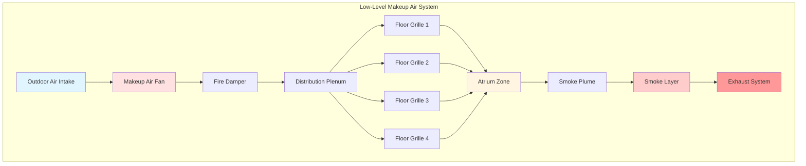

## Основы систем компенсационного воздуха

Системы компенсационного воздуха восполняют массу воздуха, удаляемого системой дымоудаления в атриумах, поддерживая баланс давления и предотвращая неконтролируемую инфильтрацию. Конструкция должна предотвратить нарушение дымового шлейфа при обеспечении достаточного расхода воздуха, соответствующего скорости удаления. NFPA 92 устанавливает предельные скорости и требования к распределению для обеспечения того, чтобы компенсационный воздух не нарушал стратификацию дымового слоя.

Объемный расход компенсационного воздуха должен равняться или немного превышать скорость удаления:

$$Q_{\text{makeup}} = Q_{\text{exhaust}} + Q_{\text{leakage}}$$

где $Q_{\text{leakage}}$ учитывает инфильтрацию оболочки здания и обычно составляет 5-10% от скорости удаления.

## Предельные скорости и расположение входа

Скорость компенсационного воздуха на входе управляет эффектами увлечения шлейфа. Чрезмерная скорость создает турбулентное смешивание, которое втягивает дым в занятую зону, нарушая цель контроля дыма. NFPA 92 определяет максимальные скорости на основе высоты входа над полом и расстояния от дымового шлейфа.

### Максимальные скорости компенсационного воздуха

| Расположение входа | Максимальная скорость | Примечания применения |
|----------------|------------------|-------------------|
| Уровень пола (0-0,9 м) | 0,5 м/с | Прямой выброс на пол |
| Низкая стена (0,9-3 м) | 1,0 м/с | Решетки стены, жалюзи |
| Средняя высота (3-6 м) | 1,3 м/с | Требуется анализ потока |
| Верхний уровень (>6 м) | 2,0 м/с | Выше границы дымового слоя |

Критический параметр проектирования — это соотношение импульса компенсационного воздуха к плавучести шлейфа. Высокомоментные струи могут втягивать дым вниз, рассчитываемые как:

$$\frac{\rho V^2}{g \Delta \rho h} < 0,5$$

где $\rho$ — плотность воздуха, $V$ — скорость входа, $g$ — ускорение свободного падения, $\Delta \rho$ — разница плотности между дымом и окружающим воздухом, и $h$ — высота шлейфа.

## Системы подачи воздуха низкого уровня

Подача компенсационного воздуха на низком уровне, расположенная в пределах 3 м от пола, обеспечивает оптимальную работу за счет минимизации взаимодействия с шлейфом. Эта конфигурация подает холодный, плотный воздух, который естественным образом стратифицируется ниже дымового слоя.



### Требования к распределению

Распределение компенсационного воздуха должно обеспечить равномерную скорость по полу атриума для предотвращения предпочтительных путей потока. Количество входов определяется по формуле:

$$N_{\text{inlets}} = \frac{Q_{\text{makeup}}}{V_{\text{max}} \cdot A_{\text{inlet}}}$$

где $V_{\text{max}}$ — максимально допустимая скорость и $A_{\text{inlet}}$ — свободная площадь на один вход.

Расстояние между входами не должно превышать:

$$S_{\text{max}} = 2 \sqrt{\frac{Q_{\text{inlet}}}{V_{\text{avg}}}}$$

Это обеспечивает перекрывающиеся профили скорости без мертвых зон.

## Эффекты увлечения дымового шлейфа

Увлечение компенсационного воздуха в дымовой шлейф увеличивает массовый расход при поднятии шлейфа. Скорость увлечения следует:

$$\dot{m}_{\text{plume}} = \dot{m}_{\text{fire}} + C \cdot P \cdot z$$

где $\dot{m}_{\text{fire}}$ — скорость массообразования у источника пожара, $C$ — коэффициент увлечения (обычно 0,21 кг/(м·с) для осесимметричных шлейфов), $P$ — периметр шлейфа, и $z$ — высота над пожаром.

Подача компенсационного воздуха у основания шлейфа увеличивает увлечение, требуя большей дымоудаления. Рекомендуемое минимальное расстояние от входа компенсационного воздуха до места пожара составляет:

$$d_{\text{min}} = 5 \sqrt{\frac{Q}{\pi V}}$$

где $Q$ — расход входного потока и $V$ — скорость выброса.

```mermaid
graph TD
    subgraph "Plume Entrainment Zones"
        MA[Makeup Air Inlet<br/>V = 0.5 m/s] --> CZ[Clear Zone<br/>d > 5√(Q/πV)]
        CZ --> EZ1[Entrainment Zone 1<br/>0-3 m height]
        EZ1 --> EZ2[Entrainment Zone 2<br/>3-6 m height]
        EZ2 --> EZ3[Entrainment Zone 3<br/>6-9 m height]
        EZ3 --> SLI[Smoke Layer Interface<br/>z_interface]

        F[Fire Source<br/>Q_fire] --> EZ1

        EZ1 --> |ṁ₁| EZ2
        EZ2 --> |ṁ₂| EZ3
        EZ3 --> |ṁ₃| SLI

        SLI --> EX[Exhaust Point<br/>Q_exhaust = ṁ₃]
    end

    style MA fill:#e1f5ff
    style F fill:#ff6666
    style CZ fill:#ccffcc
    style SLI fill:#ffcccc
    style EX fill:#ff9999
```

## Рассмотрение температуры

Температура компенсационного воздуха влияет на плавучесть дымового слоя и динамику шлейфа. Холодный наружный воздух увеличивает разницу плотности, улучшая стратификацию, но потенциально создавая дискомфорт. Дифференциал температуры должен удовлетворять:

$$\Delta T = T_{\text{smoke}} - T_{\text{makeup}} > 22°C$$

Для зимних условий может потребоваться нагрев для предотвращения чрезмерного охлаждения. Однако NFPA 92 запрещает нагрев компенсационного воздуха выше 16°C для поддержания адекватного дифференциала плавучести.

Температура подачи компенсационного воздуха изменяет расположение нейтральной плоскости давления:

$$z_{\text{NPP}} = \frac{T_{\text{avg}}}{T_{\text{outside}} - T_{\text{inside}}} \cdot H$$

где $H$ — высота атриума. Позиционирование нейтральной плоскости давления на средней высоте минимизирует эффекты инфильтрации и экфильтрации.

## Производительность системы и выбор вентилятора

Производительность вентилятора компенсационного воздуха должна учитывать потери давления в системе при поддержании стабильности потока. Общее требование статического давления:

$$\Delta P_{\text{total}} = \Delta P_{\text{duct}} + \Delta P_{\text{damper}} + \Delta P_{\text{grille}} + \Delta P_{\text{hood}}$$

Типичные потери давления в системе варьируются от 25 до 100 Па. Выбор вентилятора должен обеспечить плоские характеристики давления-расхода для предотвращения колебаний потока при активации контроля дыма.

Требование мощности вентилятора составляет:

$$P_{\text{fan}} = \frac{Q \cdot \Delta P}{6356 \cdot \eta}$$

где $P$ в киловаттах, $Q$ в м³/ч, $\Delta P$ в Па, и $\eta$ — эффективность вентилятора.

## Интеграция проекта

Системы компенсационного воздуха интегрируются с системами дымоудаления, разделения на отсеки и обнаружения. Последовательности управления должны обеспечить активацию компенсационного воздуха одновременно с дымоудалением или сразу после него для предотвращения отрицательного давления. Рекомендуемая последовательность активации:

1. Обнаружение дыма запускает активацию системы
2. Заслонки компенсационного воздуха открываются (0-5 секунд)
3. Вентиляторы компенсационного воздуха запускаются (5-10 секунд)
4. Заслонки дымоудаления открываются (10-15 секунд)
5. Вентиляторы дымоудаления запускаются (15-20 секунд)

Эта поэтапная последовательность предотвращает переходные скачки давления, которые могли бы нарушить дымовые барьеры или двери.
