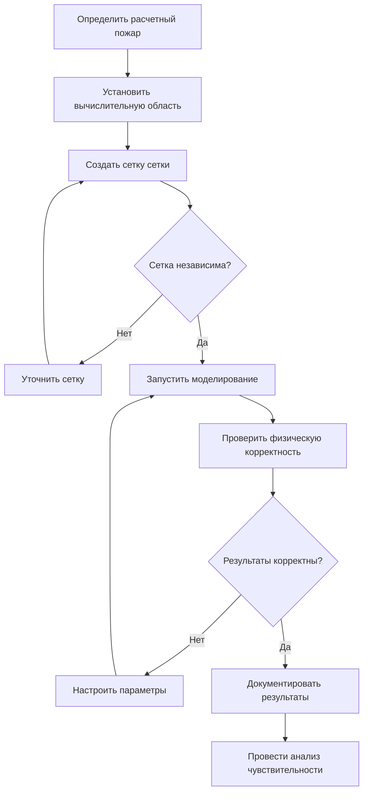
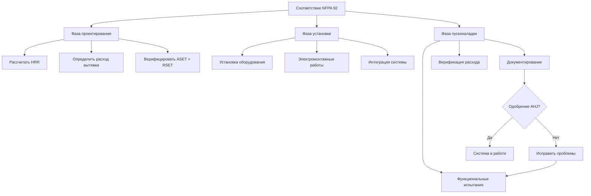

## Обзор стандарта NFPA 92

NFPA 92, Стандарт систем дымоудаления, предоставляет комплексные требования к проектированию и верификации управления дымом в больших объемных пространствах, включая атриумы. Стандарт устанавливает методы алгебраических расчетов, критерии моделирования с использованием вычислительной гидродинамики (CFD) и протоколы приемочных испытаний для обеспечения того, чтобы системы дымоудаления поддерживали приемлемые условия во время пожарных событий.

## Расчетная мощность теплового выделения пожара

Расчетная мощность теплового выделения (HRR) формирует основу всех расчетов дымоудаления. NFPA 92 требует рассмотрения нагрузки топлива, скорости развития и максимального установившегося HRR.

Для пожаров с параболической кривой развития мощность теплового выделения следует:

$$Q(t) = \alpha t^2$$

Где:
- $Q(t)$ = мощность теплового выделения в момент времени t (кВт)
- $\alpha$ = коэффициент развития пожара (кВт/с²)
- $t$ = время с момента воспламенения (с)

| Скорость развития пожара | α (кВт/с²) | Описание |
|-------------------------|-----------|---------|
| Медленная | 0,00293 | Плотные материалы, медленное воспламенение |
| Средняя | 0,01172 | Изделия из дерева, мебель с обивкой |
| Быстрая | 0,0469 | Легкое оборудование, розничные витрины |
| Очень быстрая | 0,1876 | Легковоспламеняющиеся жидкости, поролон |

## Высота границы слоя дыма

Поддержание границы слоя дыма выше минимальной высоты обеспечивает эвакуацию людей. NFPA 92 требует, чтобы граница находилась выше самой высокой ходячей поверхности плюс минимум 1,83 м.

Высота границы слоя дыма в нестационарных условиях:

$$z_i(t) = H - \left[\frac{3A_s}{\alpha_z}\int_0^t \dot{m}(t')dt'\right]^{1/3}$$

Где:
- $z_i(t)$ = высота границы слоя дыма в момент времени t (м)
- $H$ = высота потолка (м)
- $A_s$ = площадь пола атриума (м²)
- $\alpha_z$ = коэффициент увлечения (типично 0,10-0,12)
- $\dot{m}(t)$ = массовый расход в слой дыма (кг/с)

## Требуемый объемный расход вытяжки

Требуемый объемный расход вытяжки должен превышать массовый расход дымовой колонны для поддержания расчетного положения границы слоя дыма.

Для осесимметричных дымовых колонн с $z_f < z_i$ (высота пламени ниже границы):

$$\dot{V} = 0,071Q_c^{1/3}(z_i)^{5/3} + 0,0018Q_c$$

Для осесимметричных дымовых колонн с $z_f \geq z_i$ (пламя ударяет по границе):

$$\dot{V} = 0,032Q_c^{3/5}(z_i)^{1/5}$$

Где:
- $\dot{V}$ = объемный расход вытяжного воздуха (м³/с)
- $Q_c$ = конвективная мощность теплового выделения (кВт)
- $z_i$ = высота границы слоя дыма (м)

Конвективная мощность теплового выделения:

$$Q_c = \chi_c Q$$

Где $\chi_c$ = доля конвективного тепла (типично 0,60-0,70 для большинства топлив).

## Анализ ASET в сравнении с RSET

NFPA 92 требует демонстрации того, что Доступное безопасное время эвакуации (ASET) превышает Требуемое безопасное время эвакуации (RSET) с соответствующим коэффициентом безопасности.

$$ASET > RSET + \text{Коэффициент безопасности}$$

ASET представляет время от воспламенения до развития неприемлемых условий на уровне эвакуации. RSET включает:

$$RSET = t_{det} + t_{alarm} + t_{pre} + t_{travel}$$

Где:
- $t_{det}$ = время обнаружения
- $t_{alarm}$ = время оповещения
- $t_{pre}$ = время перед движением (распознавание людьми и принятие решения)
- $t_{travel}$ = время движения к выходу

## Критерии приемлемости условий

NFPA 92 устанавливает специфические пороги приемлемости условий, которые должны сохраняться ниже границы слоя дыма:

| Параметр | Порог | Место измерения |
|----------|-------|-----------------|
| Температура | 60°C | На высоте 1,83 м над ходячей поверхностью |
| Видимость | 10 м | Через слой дыма |
| Концентрация CO | 1 400 ppm | Усредненное по времени воздействие |
| Концентрация CO₂ | 5% | Объемная доля |
| Концентрация O₂ | >12% | Объемная доля |

## Моделирование с использованием вычислительной гидродинамики

Когда алгебраические методы недостаточны для сложных геометрий, NFPA 92 допускает CFD моделирование при соблюдении специфических требований.

### Требования к CFD моделям

### Требования к разрешению сетки

NFPA 92 раздел 5.4 требует характеристического размера элемента сетки:

$$\delta x \leq \frac{D^*}{R^*}$$

Где:
- $\delta x$ = характеристический размер элемента сетки (м)
- $D^* = \left(\frac{Q}{\rho_\infty c_p T_\infty \sqrt{g}}\right)^{2/5}$ = характеристический диаметр пожара (м)
- $R^* = 4$ к 16 (коэффициент разрешения)

Для:
- $\rho_\infty$ = плотность окружающего воздуха (кг/м³)
- $c_p$ = удельная теплоемкость воздуха (кДж/кг·K)
- $T_\infty$ = температура окружающей среды (K)
- $g$ = ускорение свободного падения (м/с²)

## Требования приемочных испытаний

NFPA 92 требует комплексные приемочные испытания для верификации производительности установленной системы.

### Протокол функциональных испытаний

### Требуемые измерения

| Параметр испытания | Критерий приемлемости | Метод испытания |
|-------------------|----------------------|-----------------|
| Расход вытяжки | ±10% от расчетного | Траверс трубки Пито, расходомер |
| Расход приточного воздуха | ±10% от расчетного | Станция расхода, анемометр |
| Дифференциальное давление | Как указано в проекте | Массив манометров |
| Время отклика системы | <60 секунд до полной активации | Хронометрированная последовательность |
| Граница слоя дыма | Выше расчетной высоты | Дымовые свечи, визуализация |

### Верификация объемного расхода

Верификация объемного расхода вытяжки в каждой точке вытяжки:

$$\dot{V}_{measured} = v_i A_i$$

Где:
- $v_i$ = средняя скорость в плоскости измерения (м/с)
- $A_i$ = площадь поперечного сечения (м²)

Верификация системы в целом:

$$\sum\dot{V}_{measured} \geq 1,0 \times \dot{V}_{design}$$

## Требования к документации проекта

NFPA 92 раздел 4.1.3 требует комплексную документацию, включая:

- Полные алгебраические расчеты с четко указанными допущениями
- Методология CFD моделирования, граничные условия и валидация против аналитических решений
- Спецификации оборудования и его расположение
- Последовательности управления и анализ отказоустойчивости
- Процедуры приемочных испытаний и критерии приемлемости
- Руководство по эксплуатации и техническому обслуживанию

## Периодические испытания и техническое обслуживание

После приемки NFPA 92 требует ежегодные функциональные испытания и ежеквартальный осмотр критических компонентов:

- Вытяжные вентиляторы и заслонки (ежеквартальный визуальный осмотр, ежегодное испытание в работе)
- Дымовые датчики (ежегодное испытание чувствительности согласно NFPA 72)
- Последовательности управления панели (ежегодное функциональное испытание)
- Системы приточного воздуха (ежегодная верификация расхода)
- Системы аварийного питания (ежемесячное испытание на запуск, ежегодное испытание под нагрузкой)

## Верификация соответствия кодексу

## Заключение

NFPA 92 устанавливает строгие требования к проектированию систем дымоудаления в атриумах посредством алгебраических методов и CFD моделирования. Акцент стандарта на анализ ASET/RSET, точные расчеты расхода вытяжки и комплексные приемочные испытания обеспечивают надежную работу систем дымоудаления во время пожарных событий. Проектировщики должны документировать все допущения, независимо проверять расчеты и тесно координировать работу с уполномоченным органом на всех этапах проектирования и пусконаладки.
