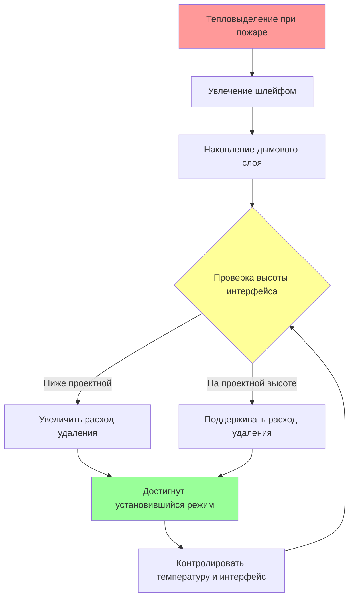
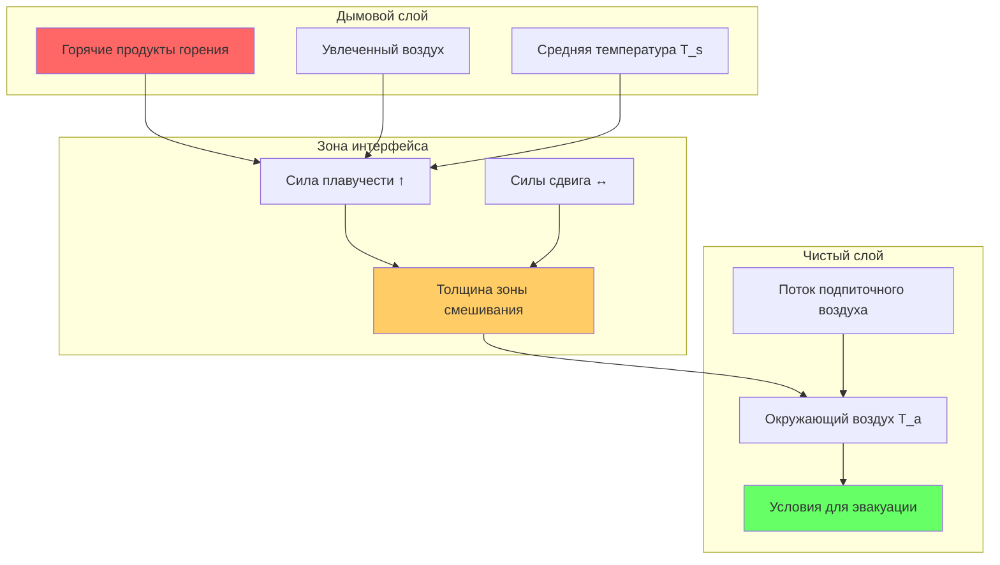

Управление дымовым слоем является основной стратегией управления для систем дымоудаления в атриумах. Основная цель — установление и поддержание стабильного интерфейса между верхним дымовым слоем и нижним чистым слоем, сохраняя условия для безопасной эвакуации и деятельности пожарных служб.

## Физика интерфейса дымового слоя

Интерфейс дымового слоя представляет собой тепловой разрыв, где плавучие продукты горения встречаются с более холодным окружающим воздухом. Стабильность интерфейса зависит от баланса между силами плавучести, поднимающими дым вверх, и силами сдвига, создаваемыми потоком удаляемого воздуха. NFPA 92 определяет проектный интерфейс дымового слоя как высоту, ниже которой оптическая плотность дыма остается менее 0,5 на метр.

Высота интерфейса должна учитывать:

- Минимальную высоту для безопасной эвакуации выше самого высокого занятого уровня
- Высоту ходовой поверхности плюс минимум 1,8 м высоты чистого слоя
- Влияние выступов балконов на нисходящую миграцию дыма
- Снижение интерфейса, вызванное температурой при развитии пожара

## Расчет глубины дымового слоя

Проектная глубина дымового слоя определяет требования к объемному расходу удаляемого воздуха и характеристики отклика системы. Рассчитайте глубину дымового слоя как:

$$z_s = H - z_i$$

где:
- $z_s$ = глубина дымового слоя (м)
- $H$ = высота потолка над полом (м)
- $z_i$ = высота интерфейса над полом (м)

Массовый расход дыма в слой определяет требуемый расход удаления для поддержания установившегося режима:

$$\dot{m}_{exhaust} = \dot{m}_{plume} + \dot{m}_{makeup}$$

Для осесимметричных шлейфов в дальней зоне массовый расход шлейфа, поступающего в дымовый слой:

$$\dot{m}_{plume} = 0.071 Q_c^{1/3} (z_i - z_f)^{5/3} + 0.0018 Q_c$$

где:
- $\dot{m}_{plume}$ = массовый расход шлейфа (кг/с)
- $Q_c$ = конвективная мощность тепловыделения (кДж/с)
- $z_f$ = эффективная высота очага (м)

## Баланс удаления в установившемся режиме

Достижение установившегося режима требует точного баланса между производством дыма и его удалением. Система должна извлекать дым со скоростью, равной или немного превышающей увлечение шлейфом, чтобы предотвратить снижение интерфейса.

Объемный расход удаления рассчитывается из массового потока, используя среднюю температуру дымового слоя:

$$V_{exhaust} = \frac{\dot{m}_{exhaust}}{\rho_{smoke}}$$

$$\rho_{smoke} = \frac{P}{R T_{avg}}$$

где:
- $V_{exhaust}$ = объемный расход удаления (м³/ч)
- $\rho_{smoke}$ = плотность дыма (кг/м³)
- $P$ = атмосферное давление (кПа)
- $R$ = газовая постоянная для воздуха (0,287 кДж/кг·К)
- $T_{avg}$ = средняя температура дымового слоя (К)

## Параметры проектирования глубины дымового слоя

| Высота интерфейса (м) | Высота потолка (м) | Глубина слоя (м) | Относительный объем | Соображения проектирования |
|----------------------|---------------------|------------------|-----------------|---------------------|
| 6,1 | 12,2 | 6,1 | 50% | Минимально приемлемая для 2-этажного атриума |
| 7,6 | 15,2 | 7,6 | 50% | Стандартная конфигурация 3-этажа |
| 9,1 | 18,3 | 9,1 | 50% | 4-этажное здание с балконами |
| 10,7 | 21,3 | 10,7 | 50% | 5-этажное глубокое дымовое хранилище |
| 12,2 | 24,4 | 12,2 | 50% | Большой многоэтажный атриум |

## Обеспечение условий для эвакуации

Поддержание условий для эвакуации ниже интерфейса дымового слоя требует непрерывного контроля трех критических параметров:

**Температура**: Температура чистого слоя должна оставаться ниже 60°C, чтобы предотвратить тепловые травмы и сохранить целостность конструкции остекления без огнестойкого покрытия.

**Видимость**: Оптическая плотность ниже интерфейса должна обеспечивать видимость не менее 9 м для навигации и упорядоченной эвакуации.

**Токсичность**: Концентрация монооксида углерода ниже интерфейса должна оставаться ниже 1400 ppm в течение требуемого времени эвакуации.

## Анализ стабильности дымового слоя

Число Ричардсона количественно характеризует стабильность интерфейса:

$$Ri = \frac{g \Delta T z_s}{T_a u^2}$$

где:
- $Ri$ = число Ричардсона (безразмерная величина)
- $g$ = ускорение свободного падения (9,81 м/с²)
- $\Delta T$ = разница температур на интерфейсе (К)
- $u$ = характеристическая скорость на интерфейсе (м/с)
- $T_a$ = температура окружающего воздуха (К)

Стабильность интерфейса требует $Ri > 1,0$, чтобы предотвратить катастрофическое смешивание и снижение интерфейса.

## Анализ времени заполнения дымом

Время, необходимое дыму для снижения от потолка к проектной высоте интерфейса, определяет доступное время для эвакуации:

$$t_{fill} = \frac{A \int_{z_i}^{H} \rho(z) dz}{\dot{m}_{plume}}$$

Для предварительного анализа с приближением однородной плотности:

$$t_{fill} \approx \frac{A z_s \rho_a}{\dot{m}_{plume}}$$

где:
- $t_{fill}$ = время заполнения (с)
- $A$ = площадь пола атриума (м²)
- $\rho_a$ = плотность окружающего воздуха (кг/м³)

## Рекомендации по проектной глубине дымового слоя

| Мощность пожара (МВт) | Проектная высота интерфейса (м) | Минимальная глубина слоя (м) | Расход удаления (м³/ч) |
|----------------|----------------------------|--------------------------|-------------------|
| 2,5 | 6,1 | 4,6 | 34 000 - 51 000 |
| 5,0 | 7,6 | 6,1 | 68 000 - 102 000 |
| 7,5 | 9,1 | 7,6 | 119 000 - 153 000 |
| 10,0 | 10,7 | 9,1 | 170 000 - 221 000 |
| 12,5 | 12,2 | 10,7 | 238 000 - 289 000 |

Эти значения представляют типичные диапазоны для проектных пожаров в розничных атриумах согласно рекомендациям NFPA 92. Фактические расходы удаления зависят от характеристик шлейфа, геометрии потолка и конфигурации подпиточного воздуха.

## Интеграция подпиточного воздуха

Надлежащим образом спроектированный подпиточный воздух предотвращает нарушение интерфейса при сохранении производительности системы удаления. Подавайте подпиточный воздух при низкой скорости (менее 2,5 м/с) в удаленном месте от факела пожара, чтобы избежать нарушения естественной стратификации. Объемный расход подпиточного воздуха должен равняться расходу удаления в установившемся режиме с учетом различий плотности.

Перепад давления на интерфейсе дымового слоя должен оставаться минимальным (менее 12 Па), чтобы предотвратить принудительное смешивание. Чрезмерное удаление без достаточного подпиточного воздуха создает отрицательное давление, которое втягивает дым вниз через проемы и нарушает стабильность слоя.
