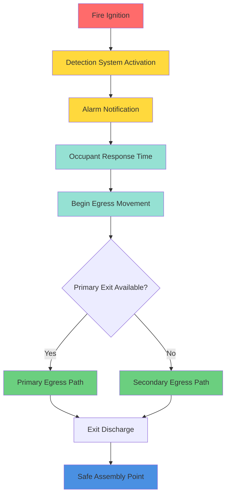
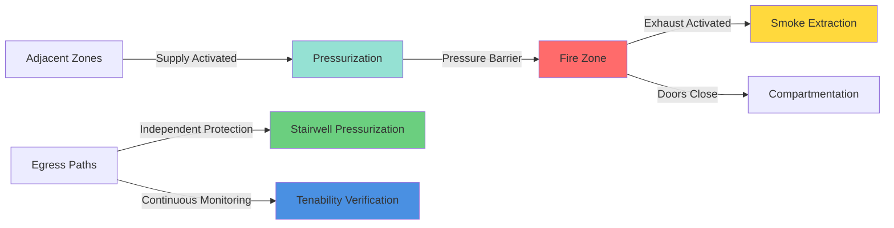

## Обзор

Защита выхода представляет собой основную цель обеспечения безопасности жизни в системах дымоудаления больших объёмных пространств. Основной принцип заключается в поддержании безопасных условий в занятых зонах и путях эвакуации в течение времени, достаточного для полной эвакуации здания. Это требует скоординированного управления снижением дымового слоя, ограничениями температуры, требованиями видимости и концентрациями токсичных газов.

NFPA 92 устанавливает защиту выхода как критический критерий проектирования, требуя, чтобы системы дымоудаления поддерживали ясный слой на требуемой высоте над наивысшей поверхностью ходьбы на протяжении требуемого безопасного времени эвакуации (RSET). Проект должен учитывать характеристики занятых лиц, расстояния передвижения, задержки в очередях и время принятия решений.

## Цели проектирования

### Критерии безопасности

Безопасные условия в путях эвакуации должны одновременно удовлетворять нескольким требованиям:

**Ограничения температуры:**
- Максимальная температура воздуха: 60°C на уровне головы
- Поток радиационного тепла: <2,5 кВт/м²
- Разница температур от окружающей среды: <40°C

**Требования видимости:**
- Минимальное расстояние видимости: 10-13 м для незнакомых занятых лиц
- Минимальное расстояние видимости: 5 м для знакомых занятых лиц
- Требуется светоотражающая сигнализация при снижении видимости

**Пределы концентрации газов:**
- Концентрация CO: <1400 ppm (экспозиция 30 минут)
- Концентрация CO₂: <5% по объёму
- Концентрация O₂: >15% по объёму
- Раздражающие газы: поддерживать уровни ниже уровня потери дееспособности

### Высота ясного слоя

Интерфейс дымового слоя должен оставаться выше наивысшего занятого уровня плюс допуск безопасности:

$$h_{clear} = h_{occ} + h_{safety}$$

Где:
- $h_{clear}$ = требуемая высота ясного слоя (м)
- $h_{occ}$ = высота отметки наивысшей поверхности ходьбы (м)
- $h_{safety}$ = допуск безопасности, обычно 1,8-2,4 м

## Анализ времени эвакуации

### Требуемое безопасное время эвакуации (RSET)

Общее время эвакуации должно быть рассчитано комплексно:

$$t_{RSET} = t_{detect} + t_{alarm} + t_{pre-movement} + t_{travel}$$

Где:
- $t_{detect}$ = время срабатывания системы обнаружения (с)
- $t_{alarm}$ = время оповещения (с)
- $t_{pre-movement}$ = время ответной реакции и принятия решения занятыми лицами (с)
- $t_{travel}$ = время физического движения в безопасное место (с)

### Расчёт времени передвижения

Время передвижения эвакуации зависит от расстояния и эффективной скорости ходьбы:

$$t_{travel} = \frac{L_{exit}}{v_{eff}} + t_{queue}$$

Где:
- $L_{exit}$ = расстояние передвижения до ближайшего выхода (м)
- $v_{eff}$ = эффективная скорость ходьбы, 0,5-1,2 м/с
- $t_{queue}$ = задержка в очереди у выходов и лестниц (с)

### Коэффициент безопасности проектирования

Время активации дымоудаления должно обеспечивать адекватный запас безопасности:

$$t_{available} = t_{RSET} \times SF$$

Где:
- $t_{available}$ = время, в течение которого дымоудаление должно поддерживать безопасные условия (с)
- $SF$ = коэффициент безопасности, обычно 1,5-2,0

## Методы защиты

### Системы повышения давления

Повышение давления в лестничных клетках и коридорах предотвращает проникновение дыма в пути эвакуации:

| Метод защиты | Перепад давления | Применение |
|-------------------|----------------------|-------------|
| Повышение давления в лестничной клетке | 12,5-25 Па | Высокие здания |
| Повышение давления в шахте лифта | 25-50 Па | Доступ пожарных |
| Повышение давления в коридоре | 5-12,5 Па | Горизонтальные выходы |
| Повышение давления в вестибюле | 12,5-37,5 Па | Защита воздушного шлюза |

### Управление дымовым слоем

Поддержание высоты ясного слоя выше путей эвакуации:

**Защита на основе вытяжки:**
- Рассчитайте скорость образования дыма от проектного пожара
- Размер вытяжки для поддержания высоты слоя
- Учитывайте увлечение и смешивание плюма
- Предусмотрите подачу воздуха для предотвращения чрезмерного давления

**Улучшение стратификации:**
- Минимизируйте скорости воздуха близ интерфейса дымового слоя (<1 м/с)
- Контролируйте температуру и расположение приточного воздуха
- Избегайте потолочных диффузоров в дымовой зоне
- Используйте низкоуровневое введение подпиточного воздуха

### Стратегия зонированной защиты

Скоординированное управление дымом в разных зонах здания:

## Требования кодекса NFPA 92

### Спецификация проектного пожара

Раздел 5.3 NFPA 92 требует определения скорости выделения тепла проектного пожара на основе:
- Характеристик и распределения топливной нагрузки
- Ожидаемой скорости роста пожара (медленная, средняя, быстрая, сверхбыстрая)
- Геометрии отсека и вентиляции
- Активации спринклерной системы и эффектов подавления

### Активация и управление системой

**Требования автоматической активации:**
- Обнаружение дыма в зоне пожара запускает вытяжку
- Инициирование в течение 30-60 секунд после обнаружения
- Непрерывная работа до ручного отключения пожарной службой
- Возможность ручного переопределения для пожарной службы

**Мониторинг и надзор:**
- Непрерывный мониторинг скорости воздуха на впусках вытяжки
- Датчики перепада давления на преградах
- Мониторинг состояния детектора дыма
- Оповещение об отказах системы

### Положения об обеспечении подпиточного воздуха

Подпиточный воздух должен обеспечиваться для:
- Ограничения разрежения в здании для предотвращения обратного потока
- Поддержания проектируемых перепадов давления на преградах
- Предотвращения чрезмерного усилия при открывании дверей (<130 Н)
- Обеспечения достаточного кислорода для полноты сгорания (снижает продукты неполного сгорания)

## Итоговые критерии проектирования

| Критерий | Требование | Основание |
|-----------|-------------|-------|
| Высота ясного слоя | Минимум 1,8 м выше поверхности ходьбы | Видимость NFPA 92 |
| Температура дымового слоя | <200°C на интерфейсе | Целостность материала |
| Температура пути эвакуации | <60°C на высоте 2 м | Предел безопасности |
| Минимальная видимость | 10 м при подходе к дымовому слою | Расстояние распознавания |
| Перепад давления | 12,5-50 Па в зависимости от применения | Таблицы NFPA 92 |
| Время активации | <60 секунд от обнаружения | Запас безопасности жизни |
| Надёжность системы | Постоянный надзор и мониторинг | Отказоустойчивая работа |

## Заключение

Эффективная защита выхода через управление дымом требует тщательного анализа характеристик эвакуации занятых лиц, комплексного применения критериев безопасности и надлежащего размера механических систем. Проект должен учитывать реальную динамику пожара, геометрию здания и схемы поведения занятых лиц. Интеграция стратегий повышения давления, вытяжки и компартментации обеспечивает избыточные слои защиты, гарантирующие безопасность занятых лиц на протяжении всего процесса эвакуации.
