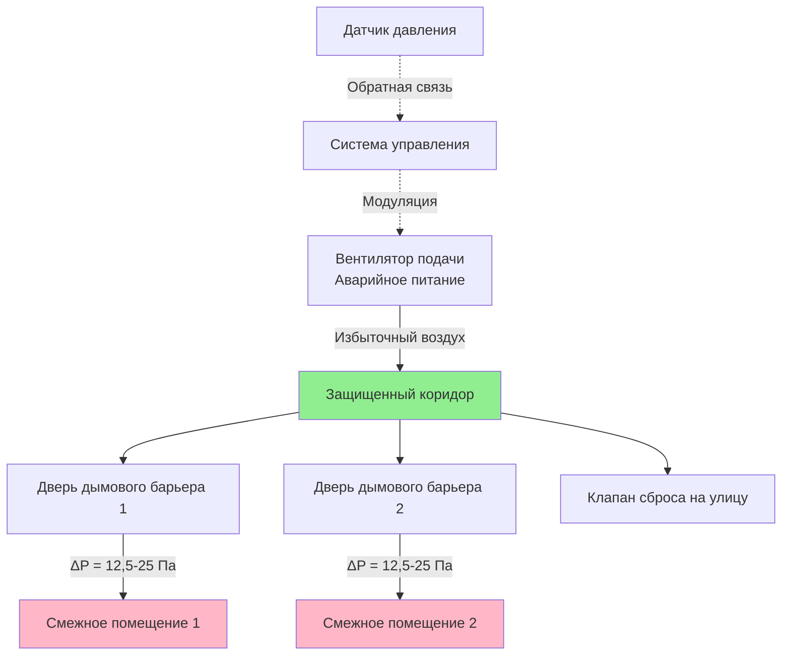
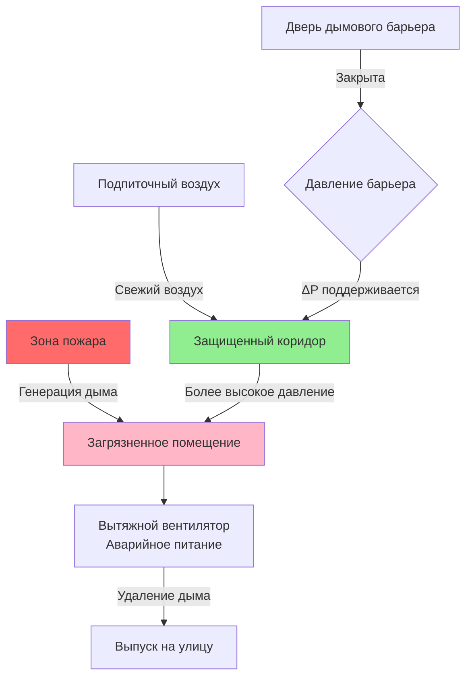

Коридоры выхода служат защищенными путями для эвакуации людей из здания при пожаре. Системы дымоудаления поддерживают пригодные для дыхания условия в этих критических путях эвакуации за счет создания избыточного давления, вытяжки или комбинированных стратегий, предотвращающих проникновение дыма из смежных помещений.

## Основы создания избыточного давления

Создание избыточного давления в коридоре формирует положительную разность давлений, предотвращающую миграцию дыма из зон пожара в пути эвакуации. Движение дыма регулируется уравнением истечения через отверстие.

Объемный расход воздуха, необходимый для поддержания разности давлений через дымовые барьеры:

$$Q = C \cdot A \cdot \sqrt{\frac{2\Delta P}{\rho}}$$

Где:
- $Q$ = объемный расход воздуха (м³/ч)
- $C$ = коэффициент расхода (0,65 для дверей)
- $A$ = площадь утечек (м²)
- $\Delta P$ = разность давлений (Па)
- $\rho$ = плотность воздуха (кг/м³)

Для учета эффектов плотности, зависящих от температуры, при пожаре:

$$\rho = \frac{P_b}{R \cdot T}$$

Где $P_b$ — барометрическое давление (Па), $R$ — газовая постоянная (287 Дж/(кг·К)), а $T$ — абсолютная температура (К).

## Подходы к проектированию

### Системы создания избыточного давления

Вентиляторы подачи воздуха нагнетают кондиционированный воздух в коридор для создания избыточного давления. Этот метод требует:

- Специализированного оборудования обработки воздуха с аварийным питанием
- Пути для сброса воздуха в смежные помещения или на улицу
- Систем мониторинга и регулирования давления
- Минимальной разности давлений 12,5 Па (NFPA 92)
- Максимальной разности давлений 87 Па для предотвращения проблем с открыванием дверей (IBC)

### Системы вытяжки

Механическая вытяжка удаляет загрязненный дымом воздух из смежных помещений, создавая относительно избыточное давление в коридоре. Этот подход:

- Удаляет дым непосредственно в источнике
- Требует координации с системой создания избыточного давления в здании
- Необходим в путях подпиточного воздуха для поддержания режимов вытяжки
- Обычно обеспечивает 1–2 воздухообмена в час в защищенном коридоре

## Требования к давлению

NFPA 92 и IBC устанавливают минимальные разности давлений через дымовые барьеры:

| Условие | Мин. ΔP | Макс. ΔP | Усилие открывания двери |
|------|---|---|---|
| Все двери закрыты | 12,5 Па | 25 Па | < 133 Н |
| Одна дверь открыта | 12,5 Па | Н/Д | Н/Д |
| Расчетная ветровая нагрузка | 12,5 Па | 25 Па | < 133 Н |
| Эффект тяги (зима) | 12,5 Па | 25 Па | < 133 Н |

Максимальное усилие открывания двери согласно разделу IBC 1010.1.3:

$$F_{door} = F_c + K \cdot \left(W \cdot A \cdot \Delta P\right)$$

Где:
- $F_{door}$ = общее усилие открывания (Н)
- $F_c$ = усилие для преодоления доводчика (обычно 22 Н)
- $K$ = геометрический коэффициент (1,0 для центроповоротных дверей)
- $W$ = ширина двери (м)
- $A$ = высота двери (м)
- $\Delta P$ = разность давлений (Па)

Для стандартной двери размером 0,91 м × 2,13 м при разности давлений 25 Па (0,10 in. w.c.):

$$F_{door} = 22 + 1,0 \times (0,91 \times 2,13 \times 25) = 22 + 48,5 = 70,5 \text{ Н}$$

Это превышает предел в 133 Н, что требует установки клапанов сброса давления или снижения расчетных давлений.

## Компоненты дымовых барьеров

Защита коридора требует скоординированной работы архитектурных и механических систем:

- **Двери с самозакрыванием** с положительным запиранием во всех местах прохода через дымовые барьеры
- **Огневые/дымовые клапаны** в воздуховодах HVAC, проходящих через барьеры
- **Герметичная конструкция** для ограничения неконтролируемых путей утечки
- **Клапаны сброса давления** для предотвращения чрезмерного накопления давления
- **Датчики дифференциального давления** для непрерывного мониторинга

Площадь утечки дверей обычно составляет от 0,023 до 0,046 м² на дверь при номинальных перепадах давления. Общая утечка коридора включает:

$$A_{total} = A_{doors} + A_{construction} + A_{dampers}$$

## Расчеты воздухообмена

Требуемый приточный расход воздуха для подпора с $n$ дверями:

$$Q_{supply} = n \cdot C \cdot A_{door} \cdot \sqrt{\frac{2\Delta P}{\rho}} + Q_{construction}$$

Для коридора с 4 дверями дымовых барьеров, каждая с площадью утечки 0,032 м², целевым перепадом 0,08 дюйма вод. ст. (19,8 Па) и утечкой конструкции 94 л/с:

$$Q_{supply} = 4 \times 0,65 \times 0,032 \times \sqrt{\frac{2 \times 19,8}{1,2}} + 94$$

$$Q_{supply} = 0,0832 \times \sqrt{33} + 94 = 0,0832 \times 5,74 + 94 \approx 94,5 \text{ л/с}$$

## Требования к испытаниям

NFPA 92 требует проведения испытаний производительности для проверки:

- Дифференциального давления через все дымовые барьеры при закрытых дверях
- Поддержания дифференциального давления при открытой одной двери
- Усилий открытия дверей при максимальном расчетном давлении
- Последовательности и времени срабатывания системы
- Измерений расхода воздуха в точках притока и сброса
- Функциональности системы сигнализации и мониторинга

Частота испытаний согласно NFPA 92:
- Первичное приемочное испытание при монтаже
- Ежегодное функциональное испытание всех компонентов
- Пятилетняя проверка производительности с измерением давления

## Интеграция системы

Система противодымной защиты выходного коридора взаимодействует с:

- Системой пожарной сигнализации для получения сигналов активации
- Системой подпора лестничных клеток для предотвращения конкурирующих давлений
- Системами HVAC для режима отключения или координации
- Системами автоматизации зданий для мониторинга статуса
- Распределением аварийного питания для непрерывной работы

Правильная координация предотвращает конфликты давления, которые могут снизить эффективность защиты. Конструкция каскада давления обеспечивает более высокое давление в коридорах по сравнению с прилегающими помещениями и самое высокое давление в лестничных клетках.
