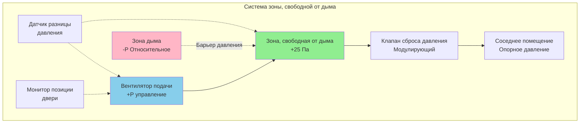
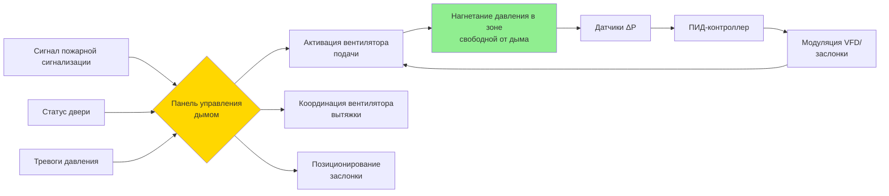

## Обзор

Зоны, свободные от дыма, обеспечивают защищенные пространства в зданиях, где находящиеся там люди могут безопасно оставаться во время пожара или завершить эвакуацию без воздействия дыма. Эти зоны зависят от положительного нагнетания давления для предотвращения инфильтрации дыма, строгой герметизации и постоянного мониторинга для поддержания приемлемых условий во время аварийных операций.

## Основные принципы нагнетания давления

Создание зон, свободных от дыма, зависит от поддержания достаточного перепада давления через границы для предотвращения миграции дыма из соседних помещений. Отношение давлений следует основным принципам механики жидкости, где воздушный поток через отверстия определяется:

$$Q = C \cdot A \cdot \sqrt{2 \cdot \Delta P / \rho}$$

Где:
- $Q$ = расход воздуха (м³/с)
- $C$ = коэффициент расхода (обычно 0,6–0,7 для дверей)
- $A$ = площадь утечки (м²)
- $\Delta P$ = перепад давления (Па)
- $\rho$ = плотность воздуха (кг/м³)

Минимальный необходимый перепад давления для предотвращения инфильтрации дыма:

$$\Delta P_{min} = P_{stack} + P_{wind} + P_{HVAC} + P_{safety}$$

Где отдельные компоненты учитывают эффект дымовой трубы, силы ветра, воздействие механической системы и коэффициенты безопасности.

## Требования к давлению NFPA 92

NFPA 92 устанавливает минимальные перепады давления для зон, свободных от дыма, на основе классификации занятости и конструкции границ:

| Тип зоны | Минимальное давление | Максимальное давление | Применение |
|-----------|-----------------|------------------|-------------|
| Лестничные клетки | 25 Па | 87 Па | Усилие открытия двери |
| Шахты лифтов | 37 Па | 125 Па | Вертикальная миграция дыма |
| Убежищные зоны | 12,5 Па | 62 Па | Доступная эвакуация |
| Зоны спасения | 20 Па | 75 Па | Пролонгированное пребывание |

Максимальные пределы давления предотвращают чрезмерное усилие открытия двери, которое препятствует эвакуации. Максимально допустимое усилие открытия двери составляет 133 Н по NFPA 101.

## Конфигурация зоны и пути воздушного потока

Диаграмма иллюстрирует отношение давления между защищенными и незащищенными пространствами. Подаваемый воздух поддерживает положительное давление, а клапаны сброса предотвращают избыточное нагнетание при закрытии двери.

## Требования к расходу воздуха и расчеты

Расход подаваемого воздуха, необходимый для поддержания нагнетания давления, зависит от утечки конструкции и сценариев открытия двери:

### Метод расчета утечки

Для герметизированной конструкции с закрытыми дверями:

$$Q_{leak} = \sum (A_{leak,i} \cdot C_i \cdot \sqrt{2 \cdot \Delta P / \rho})$$

Типичные площади утечек по NFPA 92:
- Плотная конструкция: 0,0003 м²/м² площади поверхности
- Средняя конструкция: 0,0006 м²/м² площади поверхности
- Рыхлая конструкция: 0,0012 м²/м² площади поверхности

### Компенсация при открытии двери

При открытии дверей в зоны дыма дополнительный расход воздуха предотвращает инфильтрацию дыма:

$$Q_{door} = A_{door} \cdot V_{min}$$

Где $V_{min}$ — минимальная скорость воздуха через дверной проем (обычно 0,5–0,76 м/с по NFPA 92).

Для стандартной двери 0,91 м × 2,13 м:

$$Q_{door} = 1,94 \text{ м}^2 \times 0,60 \text{ м/с} = 1,164 \text{ м}^3\text{/с (1,164 м}^3\text{/с)}$$

## Требования к герметизации оборочки здания

Целостность зон, свободных от дыма, зависит от полной герметизации:

### Элементы конструкции

- **Огнестойкие сборки**: минимум рейтинг 1 час для дымовых барьеров, 2 часа для убежищных зон
- **Герметизация проходов**: все проходные отверстия герметизированы огнестойкими материалами
- **Дверные блоки**: самозакрывающиеся устройства, уплотнители и максимальный зазор снизу 7,6 мм
- **Предусмотрения воздуховодов**: огневые/дымовые заслонки на всех проходах через барьеры

### Испытание на утечку

Предварительное функциональное испытание проверяет герметичность оборочки, используя:

1. **Испытание дверью нагнетателя**: измеряет общую утечку отсека при 25 Па
2. **Испытание с трассирующим газом**: определяет конкретные пути утечки
3. **Визуальное дымовое испытание**: подтверждает эффективность уплотнителей и герметиков

Целевые скорости утечки не должны превышать 7,5 л/с·м² площади оборочки при испытательном давлении.

## Компоненты системы нагнетания давления

### Последовательности управления

Система нагнетания давления работает в следующей последовательности:

1. **Активация**: система пожарной сигнализации инициирует режим контроля дыма
2. **Позиционирование**: заслонки переходят в позиции контроля дыма за 60 секунд
3. **Запуск вентилятора**: вентиляторы подачи включаются и ускоряются до расчетной скорости
4. **Установление давления**: система достигает целевого давления в течение 30 секунд после включения вентилятора
5. **Модуляция**: ПИД-управление поддерживает давление в пределах ±5 Па от уставки

## Требования к испытаниям и наладке

NFPA 92 требует полной проверки производительности зон, свободных от дыма:

### Протокол функционального испытания

| Фаза испытания | Параметр | Критерии приемки |
|------------|-----------|---------------------|
| Статическое давление | Перепад давления | В пределах ±5 Па от уставки |
| Усилие открытия двери | Максимальное усилие | ≤133 Н |
| Восстановление давления | Время восстановления | ≤10 секунд после закрытия двери |
| Отклик системы | Время активации | ≤60 секунд от сигнала тревоги |
| Стабильность давления | Дрейф за 1 час | ≤±2,5 Па |
| Резервное питание | Время переключения | ≤10 секунд, полная работа |

### Сценарии с открытием нескольких дверей

Испытание должно проверить поддержание давления при одновременном открытии дверей, представляющем максимальный ожидаемый расход эвакуации. Для лестничных клеток это обычно требует испытания с одновременно открытыми дверями каждого третьего этажа.

## Проектирование зон спасения

Зоны спасения служат людям, которые не могут использовать лестницы во время эвакуации. Требования к проектированию включают:

- **Расположение**: прямой доступ к лестнице выхода
- **Размер**: минимум 760 мм × 1220 мм свободной площади на одного человека
- **Связь**: двусторонняя система связи с центром управления пожаром
- **Идентификация**: светящиеся знаки в соответствии с требованиями NFPA 170
- **Нагнетание давления**: поддерживается на уровне минимум 20 Па
- **Доступность**: соответствие стандартам ICC A117.1

## Интеграция резервного питания

Системы нагнетания давления в зонах, свободных от дыма, требуют резервного питания со следующими характеристиками:

- **Время переключения**: максимум 10 секунд до полной работы системы
- **Емкость**: минимум 2 часа работы при расчетных условиях
- **Приоритетная нагрузка**: системы контроля дыма имеют приоритет в сценариях отключения нагрузки
- **Ежемесячное испытание**: автоматическое переключение и проверка нагрузки

Производительность системы при резервном питании должна соответствовать идентичным критериям поддержания давления, что и при нормальной работе.

## Мониторинг и положения сигнализации

Постоянный мониторинг системы передает статус в центр управления пожаром:

- **Перепад давления**: отображение в реальном времени с сигналами тревоги высокого/низкого давления
- **Статус вентилятора**: индикация работы и сигналы отказа
- **Позиция двери**: статус дверей в дымовых барьерах
- **Позиция заслонки**: подтверждение позиций управления дымом
- **Статус питания**: индикация нормального/резервного питания

Все условия тревоги должны аннунцироваться как локально, так и в центре управления пожаром с отдельными визуальными и звуковыми сигналами.
