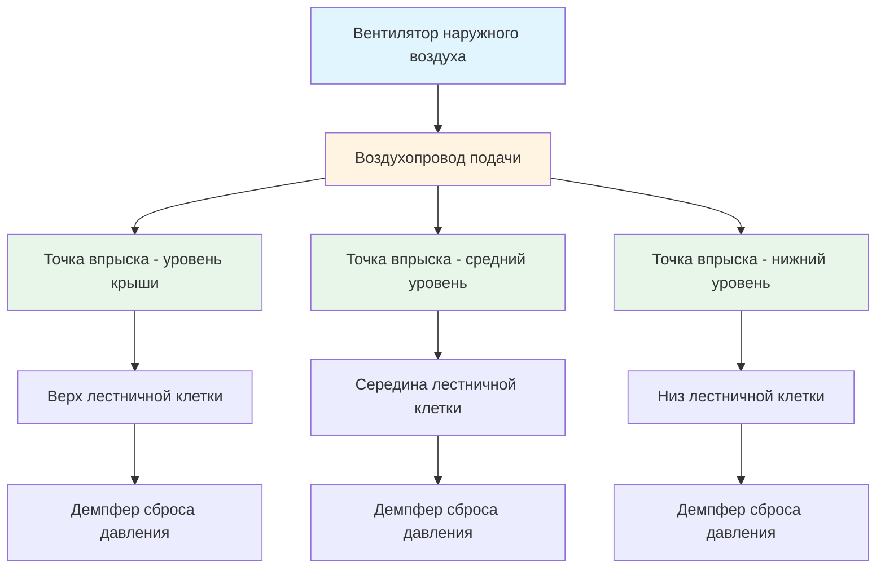
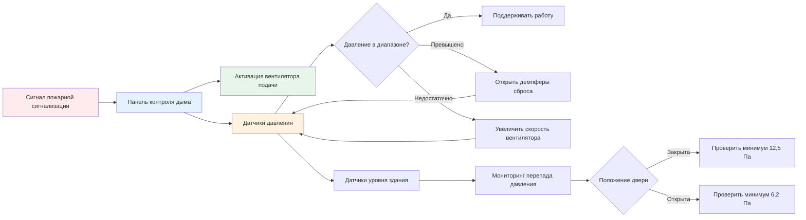

## Общее описание системы

Создание избыточного давления в лестничной клетке формирует положительный перепад давления между защищённой лестничной клеткой и смежными помещениями здания, предотвращая проникновение дыма во время пожара. Этот механический метод контроля дыма поддерживает приемлемые условия эвакуации путём подачи наружного воздуха в шахту лестничной клетки, создавая барьер выходящего потока воздуха у дверных проёмов.

Система должна сбалансировать конкурирующие требования: достаточное давление для предотвращения миграции дыма при одновременном поддержании сил открывания дверей в пределах норм. Сложность конструкции возрастает с высотой здания, несколькими одновременными открытиями дверей и учётом эффекта дымовой трубы.

## Требования к перепадам давления

NFPA 92 и IBC устанавливают минимальные и максимальные перепады давления, обеспечивающие эффективный контроль дыма без компрометации эвакуации:

| Состояние | Минимальное давление | Максимальное давление | Примечания |
|-----------|----------------------|----------------------|-----------|
| Все двери закрыты | 12,5 Па (25 Па) | 21,8 Па (87 Па) | Расчётный перепад давления |
| Одна дверь открыта | 6,2 Па (12,5 Па) | Н/П | Минимум на уровне здания, наиболее удалённом от открытой двери |
| Сила открывания двери | Н/П | 59 Н (133 Н) | Максимальная сила инициирования открывания согласно IBC |

Перепад давления на закрытой двери лестничной клетки рассчитывается по уравнению расхода:

$$Q = C \cdot A \cdot \sqrt{2 \cdot \Delta P / \rho}$$

Где:
- $Q$ = расход воздуха через щели двери (CFM (м³/ч))
- $C$ = коэффициент расхода (типично 0,65 для дверных блоков)
- $A$ = площадь утечки (м²)
- $\Delta P$ = перепад давления (Па)
- $\rho$ = плотность воздуха (кг/м³)

## Анализ сил открывания двери

Сила, необходимая для открывания двери лестничной клетки при наличии избыточного давления, критична для эвакуации людей. Связь между перепадом давления и силой открывания двери имеет вид:

$$F = \Delta P \cdot A_{door} \cdot d_c / W$$

Где:
- $F$ = сила открывания двери (Н)
- $\Delta P$ = перепад давления (Па)
- $A_{door}$ = площадь двери (м²)
- $d_c$ = расстояние от петли двери до центра давления (м)
- $W$ = ширина двери (м)

Для стандартной двери размером 0,9 м × 2,1 м с центром давления на расстоянии 0,45 м от петли:

$$F = \Delta P \cdot 1,89 \text{ м}^2 \cdot 0,45 \text{ м} / 0,9 \text{ м} = 0,95 \cdot \Delta P$$

При максимальном расчётном давлении 21,8 Па (0,35 дюйм вод. ст.) сила открывания достигает приблизительно 169 Н, превышая предельное значение кода 133 Н. Это требует механизмов сброса давления или барометрических демпферов.

## Требования к подаваемому воздуху

Вентилятор подачи должен доставлять достаточный расход воздуха для поддержания перепада давления при любых сценариях открывания дверей. Требуемый расход воздуха состоит из утечек через закрытые двери плюс объёмный расход через открытые двери.

Для утечек через закрытые двери:

$$Q_{leak} = \sum_{i=1}^{n} C_i \cdot A_i \cdot \sqrt{2 \cdot \Delta P_i / \rho}$$

Где $n$ = количество этажей с закрытыми дверями.

Для потока через открытую дверь на нейтральной плоскости давления:

$$Q_{open} = A_{door} \cdot v_{avg}$$

Где $v_{avg}$ = средняя скорость через дверной проём, типично 1,0–2,0 м/с для поддержания барьера дыма.

Общий расход подаваемого воздуха:

$$Q_{total} = Q_{leak} + Q_{open} + Q_{stack}$$

Член эффекта дымовой трубы $Q_{stack}$ учитывает обусловленные температурой перепады давления в высотных зданиях.

## Стратегия множественного впрыска

В высотных зданиях одноточечный впрыск в верхней части лестничной клетки создаёт избыточные давления на нижних уровнях из-за кумулятивного веса столба воздуха. Точки множественного впрыска распределяют подаваемый воздух по вертикали, поддерживая равномерные перепады давления.

Расстояние между точками впрыска обычно составляет от 10 до 20 этажей, с мониторингом давления на каждом уровне для модуляции демпферов или частотного преобразователя вентилятора. Распределение расхода воздуха рассчитывается по формуле:

$$Q_i = A_{leak,i} \cdot K \cdot \sqrt{\Delta P_{target}}$$

Где $Q_i$ = расход впрыска на уровне $i$ и $K$ = эмпирический коэффициент утечки.

## Архитектура управления системой

Последовательность управления активируется при обнаружении пожарной сигнализацией, запускает вентилятор подачи и контролирует перепады давления на репрезентативных уровнях здания. Демпферы сброса давления или частотные преобразователи модулируют работу для поддержания расчётных давлений при открытии и закрытии дверей во время эвакуации.

## Конструктивные соображения

**Расчёт площади утечки**: Утечки через дверной блок значительно варьируются в зависимости от качества конструкции. Консервативный расчёт предполагает 0,001–0,002 м² на дверь на основе периметра щели и размеров зазора.

**Влияние эффекта дымовой трубы**: Температурная разница между лестничной клеткой и зданием создаёт дополнительные силы давления. Зимой холодные лестничные клетки испытывают давление эффекта дымовой трубы до 2,5 Па на 30 м высоты, требующее компенсации при выборе размера вентилятора.

**Конфигурация тамбура**: Двойные дверные тамбуры при входах в лестничную клетку снижают потери воздуха при открывании дверей, улучшая поддержание давления с меньшим количеством механизмов сброса.

**Испытания и наладка**: Полевая проверка должна подтвердить перепады давления при всех комбинациях открывания дверей, указанных NFPA 92, типично одна открытая дверь и две открытые одновременно в наихудших местоположениях.

## Методы сброса давления

При превышении давлением в лестничной клетке максимальных пределов механизмы сброса предотвращают чрезмерные силы открывания дверей:

- **Барометрические демпферы**: Пассивные устройства, открывающиеся при предустановленном давлении, сбрасывая избыток воздуха в здание или наружу
- **Моторизованные демпферы сброса**: Активно управляемые на основе обратной связи датчиков давления
- **Частотные преобразователи**: Модулируют скорость вентилятора подачи для соответствия спросу на расход воздуха
- **Независимый от давления контроль**: Комбинация частотного преобразователя и демпферов сброса для оптимального отклика

Выбор зависит от высоты здания, сценариев открывания дверей и сложности системы управления. Системы на основе частотного преобразователя обеспечивают превосходную производительность, но требуют сложного программирования и наладки.

## Валидация производительности

Приёмочное испытание согласно NFPA 92 Приложение E проверяет:

1. Минимальный перепад давления при закрытых дверях на каждом этаже
2. Максимальную силу открывания двери в месте с наибольшим давлением
3. Минимальный перепад давления при открытой одной двери на наихудшем этаже
4. Перепад давления при открытии нескольких дверей согласно расчётному сценарию
5. Время отклика системы от пожарного сигнала до достижения расчётного давления

Испытания обычно выявляют отклонение в 10–20 % от расчётных значений, требующее регулировки скорости вентилятора или калибровки демпферов сброса для достижения соответствия нормам.
