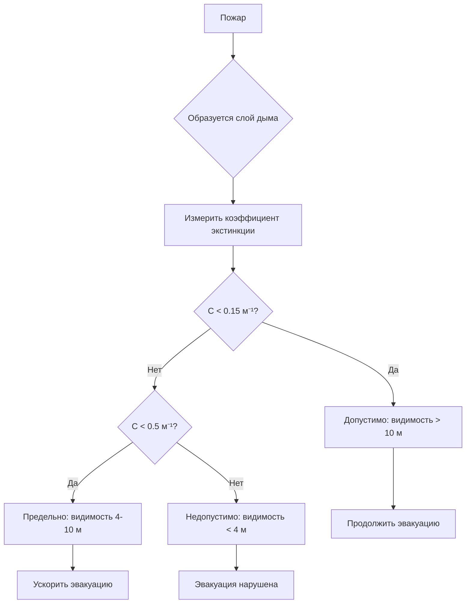
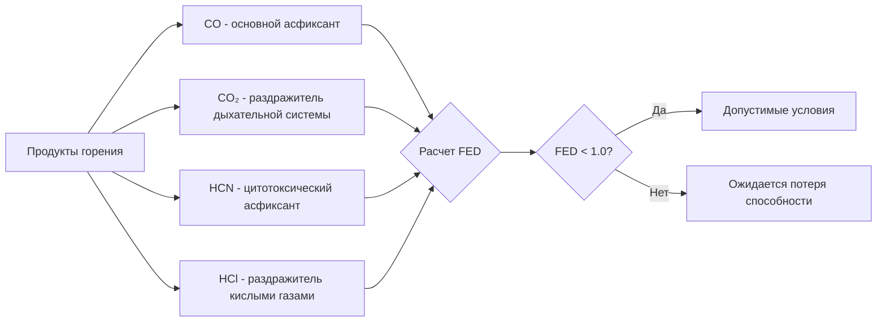

## Обзор

Допустимые условия представляют параметры окружающей среды, при которых находящиеся в здании люди могут безопасно эвакуироваться во время пожара. Системы дымоудаления должны поддерживать эти условия на протяжении всего доступного времени безопасной эвакуации (ASET), чтобы обеспечить выживание людей. NFPA 92 устанавливает инженерную базу для количественной оценки пределов допустимости на основе видимости, температуры и концентраций токсических газов.

## Требования к видимости

Видимость через дым — наиболее критический фактор успешной эвакуации. Люди нуждаются в достаточной видимости для идентификации путей выхода, преодоления препятствий и сохранения ориентации во время эвакуации.

### Оптическая плотность и коэффициент экстинкции

Связь между концентрацией дыма и видимостью определяется коэффициентом экстинкции:

$$S = \frac{C \cdot L}{log_{10}(10)} = 2.303 \cdot C \cdot L$$

Где:
- $S$ = Расстояние видимости (м)
- $C$ = Коэффициент экстинкции (м⁻¹)
- $L$ = Длина пути через дым (м)

### Критерии видимости NFPA 92

| Расстояние видимости | Коэффициент экстинкции | Статус допустимости | Применение |
|---------------------|------------------------|-------------------|-------------|
| > 13 м | < 0.1 м⁻¹ | Высоко допустимо | Большие помещения, незнакомые люди |
| 10 м | 0.15 м⁻¹ | Допустимо | Основное требование эвакуации |
| 5 м | 0.3 м⁻¹ | Предельно | Знакомые люди, простые маршруты |
| < 4 м | > 0.5 м⁻¹ | Недопустимо | Порог отказа эвакуации |

## Пределы температуры

Тепловое воздействие влияет на допустимость через прямое повреждение тканей, ожоги дыхательной системы и гипертермию. Пределы температуры варьируются в зависимости от длительности воздействия и относительной влажности.

### Лучистый тепловой поток

$$q_{rad} = \varepsilon \cdot \sigma \cdot (T_g^4 - T_s^4)$$

Где:
- $q_{rad}$ = Лучистый тепловой поток (кВт/м²)
- $\varepsilon$ = Излучательность слоя газа
- $\sigma$ = Константа Стефана-Больцмана (5.67 × 10⁻¹¹ кВт/м²·К⁴)
- $T_g$ = Температура газа (К)
- $T_s$ = Температура поверхности (К)

### Конвективное тепловое воздействие

Доля эффективной дозы (FED) для теплового воздействия:

$$FED_{heat} = \sum_{t=0}^{t_{final}} \frac{\Delta t}{t_{limit}(T)}$$

| Температура | Время воздействия до потери способности | Критерии допустимости |
|-------------|--------------------------------|---------------------|
| 60°C | > 30 минут | Допустимо для длительной эвакуации |
| 80°C | 6–8 минут | Предельно, требуется быстрая эвакуация |
| 100°C | 2–3 минуты | Вблизи порога недопустимости |
| 120°C | < 1 минуты | Недопустимо, повреждение дыхательной системы |

## Пределы концентрации токсических газов

Продукты горения создают способные к потере трудоспособности и летальные газы. Угарный газ (CO) и углекислый газ (CO₂) являются основными асфиксантами, тогда как синильная кислота (HCN) и хлороводород (HCl) быстро токсичны при более низких концентрациях.

### Доля эффективной дозы токсичности

$$FED_{gas} = \sum_{t=0}^{t_{final}} \frac{C_{gas} \cdot \Delta t}{C_{gas,limit} \cdot t_{limit}}$$

### Допустимость по угарному газу

Угарный газ нарушает доставку кислорода путем образования карбоксигемоглобина (COHb):

$$COHb(\%) = 3.317 \times 10^{-5} \cdot [CO]^{1.036} \cdot t^{0.8}$$

Где:
- $COHb$ = Процент карбоксигемоглобина
- $[CO]$ = Концентрация CO (млн⁻¹)
- $t$ = Время воздействия (минуты)

| Концентрация CO | Длительность воздействия | Физиологический эффект | Допустимость |
|------------------|-------------------|----------------------|------------|
| < 100 млн⁻¹ | 60 минут | Минимальный эффект | Допустимо |
| 400 млн⁻¹ | 30 минут | Головная боль, снижение когнитивной функции | Предельно |
| 1,000 млн⁻¹ | 10 минут | Спутанность, нарушение двигательных функций | Вблизи недопустимости |
| 1,400 млн⁻¹ | 5 минут | Коллапс, потеря способности | Недопустимо |
| > 3,000 млн⁻¹ | < 3 минут | Быстрая потеря способности | Летальный порог |

### Дополнительные токсические газы

| Газ | Концентрация, способная к потере способности | Время воздействия | Предел NFPA 92 |
|-----|------------------------------|---------------|---------------|
| CO₂ | 5% (50,000 млн⁻¹) | 5–10 минут | Контролировать, синергетическое с CO |
| HCN | 150 млн⁻¹ | 10 минут | Использовать комбинированный подход FED |
| HCl | 1,000 млн⁻¹ | 5 минут | Раздражитель, не первичная проблема |
| Истощение O₂ | < 15% O₂ | 5 минут | Риск гипоксии в закрытых пространствах |

## Доступное время безопасной эвакуации (ASET)

ASET представляет временной интервал между началом пожара и наступлением недопустимых условий в критических местах эвакуации.

$$ASET = min(t_{visibility}, t_{temperature}, t_{toxicity})$$

### Требуемое время безопасной эвакуации (RSET)

Для безопасной эвакуации ASET должно превышать RSET с надлежащим коэффициентом безопасности:

$$ASET \geq SF \cdot RSET$$

Где:
- $SF$ = Коэффициент безопасности (обычно 1.5–2.0)
- $RSET$ = Время обнаружения + Время до начала движения + Время в пути

```mermaid
gantt
    title Анализ временной шкалы эвакуации
    dateFormat X
    axisFormat %s

    section Развитие пожара
    Начало пожара           :0, 1
    Обнаружение          :1, 60
    Активация сигнала тревоги   :60, 90

    section Ответ людей
    Время до начала движения       :90, 210
    Движение к выходу     :210, 450

    section Допустимость
    Временное окно ASET        :0, 600
    Предел видимости   :milestone, 520
    Предел температуры   :milestone, 580
    Предел CO           :milestone, 600
    Завершение RSET      :milestone, 450
```

## Проектные соображения

Системы дымоудаления должны поддерживать допустимые условия над занятой зоной:

1. **Высота раздела слоя дыма**: Поддерживать чистую высоту 1.8 м минимум над наивысшим путем эвакуации
2. **Контроль массового расхода**: Ограничить скорость спускания слоя дыма до < 0.1 м/с
3. **Температура подпиточного воздуха**: Предотвратить разрушение тепловой стратификации путем ограничения скорости подачи воздуха
4. **Возможность продувки**: Проектировать для послеэвакуационных пожарных операций (не ориентировано на допустимость)

## Инженерный подход

Расчет допустимости в критических местах проектирования с использованием вычислительной гидродинамики (CFD) или зонального моделирования:

$$\frac{dT}{dt} = \frac{\dot{Q} - \dot{m}_{out} \cdot c_p \cdot (T - T_\infty)}{m \cdot c_p}$$

Проверить, что все критерии допустимости остаются удовлетворяющими на протяжении всего периода ASET в наиболее уязвимых местах эвакуации, обычно на максимальном расстоянии в пути от выходов и на высоте дыхания людей (1.5 м).
