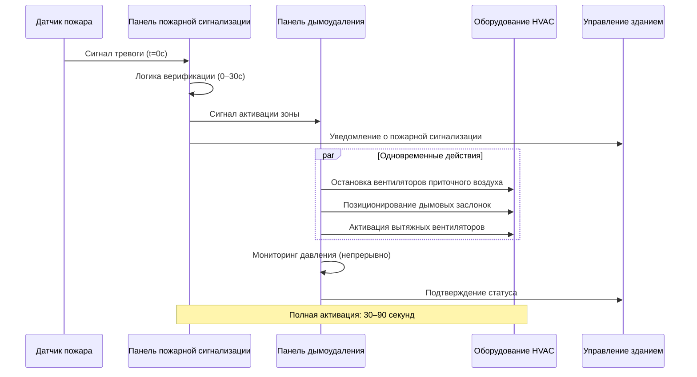
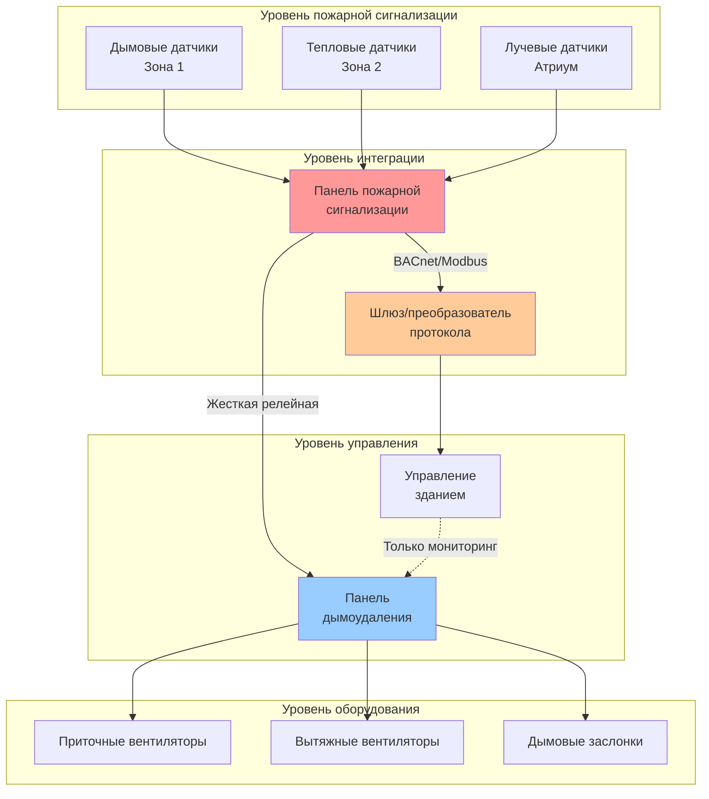

# Интеграция пожарной сигнализации

Системы пожарной сигнализации обеспечивают критический механизм активации систем дымоудаления. Правильная интеграция между системой пожарной сигнализации и системой управления HVAC обеспечивает быстрый и надежный ответ на пожарные события при одновременном минимизировании ложных срабатываний, нарушающих нормальную работу здания.

## Архитектура системы обнаружения

Система пожарной сигнализации взаимодействует с дымоудалением через специализированные панели управления пожарной сигнализацией (FACP), которые обмениваются информацией с системой управления зданием (BAS) или отдельными панелями управления дымоудалением. NFPA 72 требует контролируемых цепей с концевыми резисторами для постоянного мониторинга целостности датчиков и непрерывности цепи.

### Обработка и верификация сигналов

Современные системы обнаружения используют алгоритмическую обработку для различения реальных признаков пожара от ложных источников. Уровень уверенности обнаружения возрастает с увеличением мощности сигнала в соответствии с:

$$C_d = \frac{S_{measured}}{S_{threshold}} \times K_{environmental}$$

Где:
- $C_d$ = коэффициент уверенности обнаружения (безразмерный)
- $S_{measured}$ = измеренная мощность сигнала (мВ или оптическая плотность)
- $S_{threshold}$ = запрограммированный порог тревоги
- $K_{environmental}$ = коэффициент компенсации окружающей среды (0,8–1,2)

Алгоритмы верификации обычно требуют устойчивого сигнала, превышающего пороговое значение в течение 10–30 секунд, прежде чем инициировать последовательность дымоудаления.

## Сравнение типов датчиков

Различные технологии датчиков подходят для конкретных окружающих сред и сценариев пожара:

| Тип датчика | Принцип работы | Время отклика | Зона покрытия | Лучшее применение |
|---------------|-----------|---------------|---------------|------------------|
| Ионизационный дымовой | Нарушение ионного тока | Быстрое (30–60 сек) | 84 м² | Воздух с высокой скоростью, открытые пожары |
| Фотоэлектрический дымовой | Рассеяние света | Среднее (60–90 сек) | 84 м² | Тлеющие пожары, низкая скорость воздуха |
| Лучевой датчик | Затемнение света | Среднее (45–75 сек) | До 28 м луча | Высокие потолки, большие открытые пространства |
| Тепловой датчик | Рост температуры | Медленное (90–180 сек) | 46 м² | Среды с высокой запыленностью/влажностью |
| Пробоотборный (VESDA) | Непрерывный отбор воздуха | Очень быстрое (10–30 сек) | 186–930 м² | Критически важные помещения |
| Многосенсорный | Комбинированный дым/тепло | Быстрое (20–50 сек) | 84 м² | Переменные окружающие среды |

### Расчеты зоны покрытия

Для стандартных высот потолков (3–9 м) расстояние между точечными датчиками следует:

$$S_{max} = \sqrt{\frac{A_{coverage}}{\pi}} \times K_{mounting}$$

Где:
- $S_{max}$ = максимальное расстояние от стен (м)
- $A_{coverage}$ = указанная зона покрытия (м²)
- $K_{mounting}$ = коэффициент крепления (0,7 для гладких потолков, 0,5 для балочных)

Для лучевых датчиков, охватывающих атриумные пространства, чувствительность затемнения должна учитывать длину луча:

$$\%Obs = 100 \times \left(1 - e^{-K \times L}\right)$$

Где:
- $\%Obs$ = процент затемнения при тревоге
- $K$ = коэффициент экстинкции (типичный: 0,05–0,15 на м)
- $L$ = длина луча датчика (м)

## Последовательность и сроки активации

Обнаружение пожара запускает каскадную последовательность, координирующую системы пожарной сигнализации и HVAC:

### Критические требования к срокам

NFPA 92 устанавливает максимальное время отклика от обнаружения до полной работы системы дымоудаления:

1. **Обнаружение до тревоги**: максимум 30 секунд (NFPA 72)
2. **Верификация тревоги**: 0–30 секунд (при наличии)
3. **Передача сигнала**: максимум 5 секунд
4. **Переустановка заслонок**: максимум 60 секунд
5. **Пуск вентилятора**: типично 30–60 секунд
6. **Стабилизация давления**: 60–120 секунд

Общее время отклика системы от обнаружения до достижения расчетного перепада давления: 90–180 секунд в оптимальных условиях.

## Методы интеграции

### Жесткая проводная релейная система

Традиционный метод использует специальные выходы реле панели пожарной сигнализации на входы панели дымоудаления. Каждая зона обнаружения требует отдельных контактов реле, обеспечивающих контролируемое управление с отказоустойчивостью. Номинальная нагрузка контактов должна обрабатывать индуктивные нагрузки катушек контакторов (типично 24 В постоянного тока, минимум 100 мА).

### Цифровая коммуникация

Современные системы используют протоколы BACnet, Modbus или собственные протоколы для передачи статуса датчиков и команд управления. Цифровая интеграция обеспечивает:

- Подробную диагностику датчиков и оповещения о техническом обслуживании
- Адресное идентифицирование устройств для точного определения местоположения зоны
- Снижение требований к кабельной инфраструктуре
- Улучшенные возможности тестирования и проверки системы

## Размещение датчиков для дымоудаления

Приложения с высокими потолками требуют специализированных стратегий размещения:

**Высота потолка 4,5–9 м**: Используйте проецируемый луч или пробоотборные датчики. Стратификация дыма может задержать активацию; дополнительные датчики на промежуточных высотах улучшают время отклика.

**Высота потолка более 9 м**: Лучевые датчики обязательны. Разместите в сетевой схеме с максимальным расстоянием 18 м. Рассмотрите системы отбора воздуха с несколькими входными портами на различных высотах.

**Смягчение стратификации**: Разместите датчики с учетом скорости подъема шлейфа:

$$v_p = 0,96 \left(\frac{Q}{z}\right)^{1/3}$$

Где:
- $v_p$ = скорость шлейфа на высоте z (м/с)
- $Q$ = скорость выделения тепла пожара (кВт)
- $z$ = высота над пожаром (м)

Для расчетных пожаров мощностью 5–10 МВт скорости шлейфа на высоте 9 м составляют примерно 2,4–3,7 м/с, что достаточно для достижения датчиками на потолке за 3–5 секунд.

## Тестирование и верификация

NFPA 72 требует ежегодного тестирования чувствительности дымовых датчиков и функционального тестирования интерфейсов управления дымоудалением. Протоколы тестирования должны проверить:

- Отклик датчика в пределах номинального диапазона чувствительности
- Передачу сигнала на панель управления дымоудалением
- Правильное определение зоны и реакцию оборудования
- Отказоустойчивую работу при условии сбоя цепи
- Функциональность переопределения и сброса

Документация должна записывать показания чувствительности датчиков, времена отклика и подтверждения оборудования для каждой протестированной зоны.

---

**Файл**: `/Users/evgenygantman/Documents/github/gantmane/hvac/content/specialty-applications-testing/specialty-hvac-applications/smoke-control-large-volumes/fire-detection-integration/_index.md`

Этот контент обеспечивает всестороннее техническое освещение интеграции пожарной сигнализации с системами дымоудаления, включая технологии датчиков, последовательность активации, архитектуры интеграции и требования соответствия NFPA.
