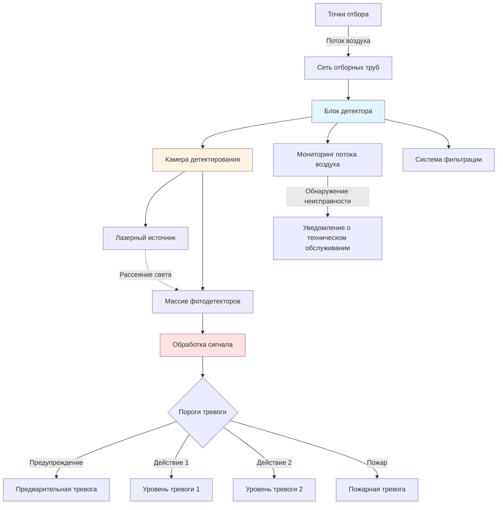
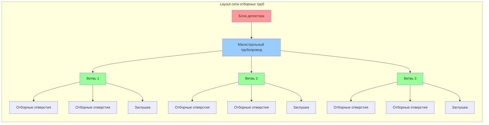

## Технология аспирационного дымового извещения

Системы аспирационного дымового извещения (ASD) активно отбирают пробы воздуха через сеть отборных труб в центральную камеру детектирования. Эти системы обеспечивают максимально раннее предупреждение о пожаре, обнаруживая частицы дыма при концентрациях, значительно ниже порогов, используемых в традиционных точечных извещателях. VESDA (Very Early Smoke Detection Apparatus) представляет собой наиболее признанную технологию в этой категории.

### Принцип обнаружения

Системы отбора воздуха работают на основе принципов нефелометрии или светорассеяния. Воздух, подаваемый через сеть отбора, проходит через лазерную камеру детектирования, где частицы дыма рассеивают свет на фотодетекторах. Измеренное затемнение коррелирует с концентрацией частиц.

Зависимость между затемнением и концентрацией дыма описывается формулой:

$$I = I_0 e^{-\alpha L}$$

Где:
- $I$ = интенсивность прошедшего света
- $I_0$ = интенсивность падающего света
- $\alpha$ = коэффициент экстинкции (функция размера и концентрации частиц)
- $L$ = длина оптического пути

Чувствительность детектирования количественно выражается в процентах затемнения на метр или на фут:

$$\text{Чувствительность (%/м)} = \frac{\Delta I}{I_0 L} \times 100$$

## Архитектура системы

## Классификация чувствительности

NFPA 72 не классифицирует чувствительность ASD, однако производители определяют уровни на основе порогов затемнения:

| Уровень чувствительности | Диапазон затемнения | Применение |
|------|------|-------|
| Очень высокая | 0.0005-0.005 %/м | Чистые помещения, полупроводниковые производства |
| Высокая | 0.005-0.02 %/м | Центры обработки данных, телекоммуникации |
| Повышенная | 0.02-0.05 %/м | Музеи, архивы, объекты культурного наследия |
| Нормальная | 0.05-0.2 %/м | Коммерческие помещения общего назначения, склады |

Традиционные точечные дымовые извещатели обычно срабатывают при затемнении 0.5-4.0 %/м, что демонстрирует превосходную чувствительность аспирационных систем.

## Проектирование сети отбора

### Расчет длины труб

Максимальная длина трубы зависит от производительности по потоку воздуха детектора и требуемого времени транспортировки. Объемный поток через сеть отбора:

$$Q = n \cdot q$$

Где:
- $Q$ = общий поток воздуха детектора (CFM или л/с)
- $n$ = количество отборных отверстий
- $q$ = расход на одно отверстие

Время транспортировки от самого удаленного отборного отверстия должно удовлетворять условию:

$$t_{transport} = \frac{V_{pipe}}{Q} \leq t_{max}$$

Где:
- $V_{pipe}$ = объем сети труб
- $t_{max}$ = максимально допустимое время транспортировки (обычно 60-120 секунд)

### Расстояние между отборными отверстиями

Расстояние между отверстиями определяется по принципу:

$$S = \sqrt{A_{coverage}}$$

Для высоты потолка $H$:
- $H < 3$ м: $S \leq 7.6$ м
- $3 \leq H < 4.6$ м: $S \leq 6.1$ м
- $4.6 \leq H < 9.1$ м: $S \leq 4.6$ м
- $H \geq 9.1$ м: Требуется инженерный анализ

## Интеграция с системами HVAC

### Взаимодействие воздушных потоков

Паттерны воздушных потоков HVAC существенно влияют на транспортировку частиц дыма к точкам отбора. Высокие скорости воздуха могут разбавлять концентрацию дыма или переносить частицы мимо точек отбора до их захвата.

Коэффициент разбавления:

$$DF = 1 + \frac{Q_{HVAC}}{Q_{plume}}$$

Где:
- $Q_{HVAC}$ = расход воздуха системы HVAC
- $Q_{plume}$ = расход дымового шлейфа

Для эффективного обнаружения в условиях высокого расхода воздуха увеличьте плотность точек отбора проб или расположите отверстия в путях возврата воздуха, где дым естественным образом накапливается.

### Отбор проб из воздуховодов

При отборе проб внутри воздуховодов HVAC поддерживайте минимальную скорость транспортировки:

$$v_{min} = \sqrt{\frac{2 \Delta P}{\rho}}$$

Типичные скорости в воздуховодах 7,6–12,7 м/с (1500–2500 фут/мин) обеспечивают достаточное перемешивание и репрезентативность пробы.

## Стратегия многоступенчатой сигнализации

Аспирационные системы обеспечивают градированный отклик через несколько уровней порогов:

| Уровень сигнализации | Типичный порог | Действие при срабатывании |
|:---|:---|:---|
| Предупреждение (Alert) | 0,0005–0,005 %/м | Проверка, уведомление технического обслуживания |
| Действие 1 (Action 1) | 0,005–0,02 %/м | Подготовка к отключению HVAC, тревога безопасности |
| Действие 2 (Action 2) | 0,02–0,10 %/м | Отключение HVAC, предварительный сброс для подавления |
| Пожар (Fire) | 0,10–0,20 %/м | Передача сигнала пожарной тревоги, полная эвакуация |

Этот поэтапный подход предотвращает ложные срабатывания и позволяет обеспечить раннее вмешательство до развития пожара.

## Требования к техническому обслуживанию

Интервалы замены фильтров напрямую влияют на чувствительность. Накопленная пыль увеличивает фоновое затемнение, снижая эффективный диапазон чувствительности.

$$S_{effective} = S_{rated} - O_{baseline}$$

Где $O_{baseline}$ представляет собой затемнение, вызванное фильтром.

NFPA 72 требует ежегодного функционального тестирования, включая проверку расхода воздуха в каждой точке отбора проб, тестирование порогов сигнализации и моделирование аварийных состояний. Тестирование времени транспортировки подтверждает, что проектные параметры остаются действительными при изменении конфигурации здания.

## Особенности применения

Аспирационные системы особенно эффективны в средах, где:
- Сверхраннее предупреждение предотвращает катастрофические потери (центры обработки данных, музеи)
- Традиционные детекторы сталкиваются с трудностями при установке (высокие потолки, требования к эстетике)
- Суровые условия снижают эффективность традиционных детекторов (пыль, экстремальные температуры)
- Разбавление воздуховодами HVAC снижает эффективность точечных детекторов

Высокая начальная стоимость и требования к специализированному обслуживанию necessitate тщательный анализ затрат и выгод по сравнению с традиционными методами обнаружения.

---

**Ссылки на NFPA 72**: Глава 17 (Инициирующие устройства), Приложение B (Инженерное руководство по размещению автоматических пожарных извещателей)
