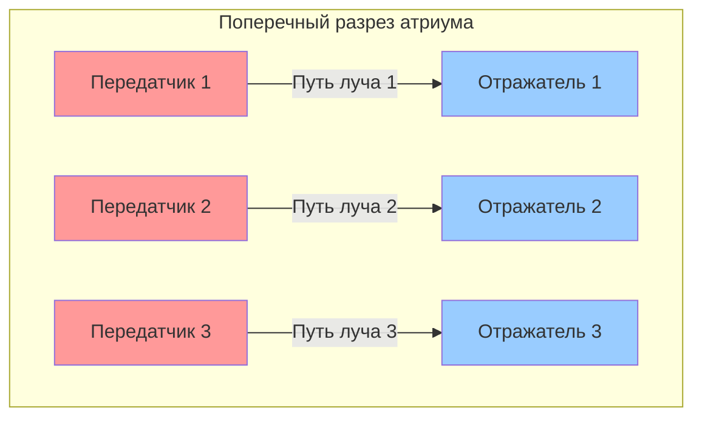
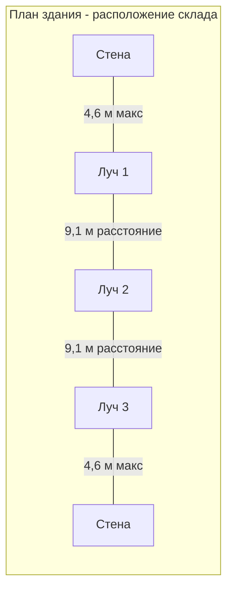
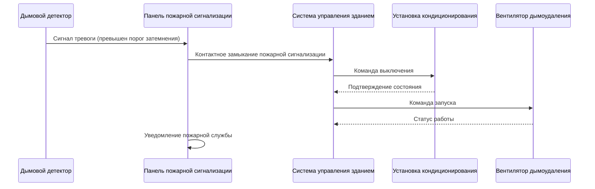

## Технология проектируемых дымовых детекторов

Проектируемые дымовые детекторы измеряют затемнение дыма вдоль определённого оптического пути, что делает их идеальными для больших открытых объёмов, где обычные точечные детекторы неэффективны. Передатчик проецирует инфракрасный или видимый световой луч на приёмник или отражатель, и частицы дыма прерывают луч, вызывая ослабление сигнала, измеряемое в процентах затемнения на метр.

Эти детекторы превосходно работают в помещениях с высотой потолков, превышающей 9 м, включая атриумы, склады, производственные объекты, ангары для летательных аппаратов и выставочные центры, где расслоение дыма и доступность детекторов представляют значительные проблемы.

## Принцип обнаружения и затемнение

Фундаментальный механизм обнаружения основан на законе Бэра-Ламберта, описывающем передачу света через среду, содержащую поглощающие частицы:

$$I = I_0 e^{-\alpha L}$$

Где:
- $I$ = принятая интенсивность света
- $I_0$ = переданная интенсивность света
- $\alpha$ = коэффициент экстинкции (затемнение на единицу длины)
- $L$ = длина оптического пути луча

Процент затемнения на метр рассчитывается как:

$$\text{Затемнение} = \left(1 - \frac{I}{I_0}\right) \times \frac{100}{L}$$

NFPA 72 требует активации тревоги между 0,5% и 4,0% затемнения на метр, с типичными настройками 1,5% до 2,5% затемнения на метр для большинства приложений.

## Расчёт площади покрытия

Расстояние между дымовыми детекторами луча следует требованиям NFPA 72 на основе высоты потолка и расположения луча. Номинальная площадь покрытия одного луча составляет:

$$A_{coverage} = L_{beam} \times S_{spacing}$$

Где:
- $L_{beam}$ = длина луча (обычно 5-91 м)
- $S_{spacing}$ = перпендикулярное расстояние между параллельными лучами

### Требования по расстояниям NFPA 72

| Высота потолка | Максимальное расстояние между лучами | Максимальное расстояние от стены |
|-----------------|--------------------------------------|----------------------------------|
| 3-4,6 м | 9,1 м | 4,6 м |
| 4,6-6,1 м | 9,1 м | 4,6 м |
| 6,1-7,6 м | 9,1 м | 4,6 м |
| 7,6-9,1 м | 9,1 м | 4,6 м |
| 9,1-10,7 м | 9,1 м | 6,4 м |
| 10,7-12,2 м | 13,7 м | 6,9 м |

Для гладких потолков применяется указанное расстояние. Для потолков с балками и сплошными балками требуется снижение расстояния на 50% перпендикулярно балкам.

## Схема расположения дымовых детекторов луча

## Требования по выравниванию

Точное оптическое выравнивание критически важно для надёжной работы. Приёмник должен поддерживать переданный луч в пределах своей оптической апертуры несмотря на движение конструкции, тепловое расширение и вибрацию.

### Допуск по выравниванию

Допуск углового рассогласования:

$$\theta_{max} = \arctan\left(\frac{D_{aperture}}{2L_{beam}}\right)$$

Для типичного диаметра апертуры приёмника 10 см и луча длиной 61 м:

$$\theta_{max} = \arctan\left(\frac{5 \text{ см}}{61 \text{ м}}\right) = 0,047° = 0,82 \text{ мрад}$$

Этот узкий допуск требует жёсткого крепления к конструктивным элементам, а не к потолочным системам или гибким опорам.

## Соображения по интеграции системы HVAC

### Предотвращение расслоения дыма

В большых объёмах наблюдается тепловое расслоение, где горячий дым быстро поднимается и образует стабильный слой под потолком. Системы HVAC не должны:

- Создавать сильные горизонтальные воздушные потоки, превышающие 1,5 м/с на уровне луча
- Устанавливать стабильные тепловые слои, препятствующие обнаружению дыма
- Разбавлять дым ниже пороговых значений обнаружения до активации тревоги

### Проектирование приточного воздуха

Позиционируйте приточные диффузоры, чтобы избежать прямого воздействия на оптические пути лучей. Скорость воздуха через луч должна оставаться ниже 1,0 м/с при нормальной работе, чтобы предотвратить ложные тревоги от пыли или взвешенных в воздухе частиц.

### Активация управления дымом

При срабатывании тревоги дымового детектора последовательность управления HVAC должна:

1. Выключить установки кондиционирования воздуха, обслуживающие зону пожара
2. Активировать вентиляторы дымоудаления, если они предусмотрены
3. Создать избыточное давление в смежных зонах или лестничных клетках
4. Закрыть противопожарные/дымовые заслонки согласно требованиям кодексов

## Лучшие практики установки

### Места крепления

Выбирайте поверхности крепления, которые:
- Крепятся непосредственно к конструктивной стали или бетону
- Избегают зон с чрезмерной вибрацией или движением конструкции
- Обеспечивают чёткую видимость без препятствий
- Позволяют получить доступ для технического обслуживания и проверки

### Факторы окружающей среды

Учитывайте:
- **Температура**: нормальный диапазон работы от -20°C до 55°C
- **Влажность**: рассмотрите конденсацию на оптических поверхностях
- **Пыль**: используйте более высокие пороги затемнения в пыльных помещениях
- **Освещение**: солнечный свет может помешать оптическому обнаружению

### Процедуры пусконаладки

1. Убедитесь, что оптический путь беспрепятствален по всей длине
2. Выровняйте передатчик и приёмник для достижения максимальной напряжённости сигнала
3. Задокументируйте базовую напряжённость сигнала и уровень затемнения
4. Протестируйте отклик тревоги, используя калиброванные фильтры затемнения
5. Проверьте последовательность отключения HVAC, синхронизацию и подтверждение
6. Запишите углы выравнивания и детали крепления для будущего обслуживания

## Техническое обслуживание и проверка

NFPA 72 требует ежегодного функционального тестирования с задокументированным измерением затемнения. Ежемесячная визуальная проверка должна подтвердить:

- Индикаторы светодиода показывают нормальную работу
- Отсутствие физических повреждений или рассогласования
- Оптические поверхности остаются чистыми
- Оборудование крепления остаётся безопасным

Тест чувствительности использует фильтры нейтральной плотности, обеспечивающие 0,5%, 1,5% и 4,0% затемнения на метр для проверки пороговых значений тревоги и неисправности.

## Преимущества в больших объёмах

Дымовые детекторы луча обеспечивают превосходную производительность в высокопотолочных приложениях по сравнению с точечными детекторами, потому что:

- Один прибор покрывает до 835 м²
- Обнаруживает дым на уровне потолка до расслоения
- Снижает требования к установке и техническому доступу
- Обеспечивает надёжную работу в сложных условиях
- Напрямую интегрируется с системами HVAC и управления дымом

Для помещений со сложной геометрией или экстремальной высотой свыше 18 м системы дымоудаления с забором воздуха (ASSD) могут дополнять или заменять дымовые детекторы лучей, чтобы гарантировать, что дым достигает устройств обнаружения до чрезмерного разбавления.
