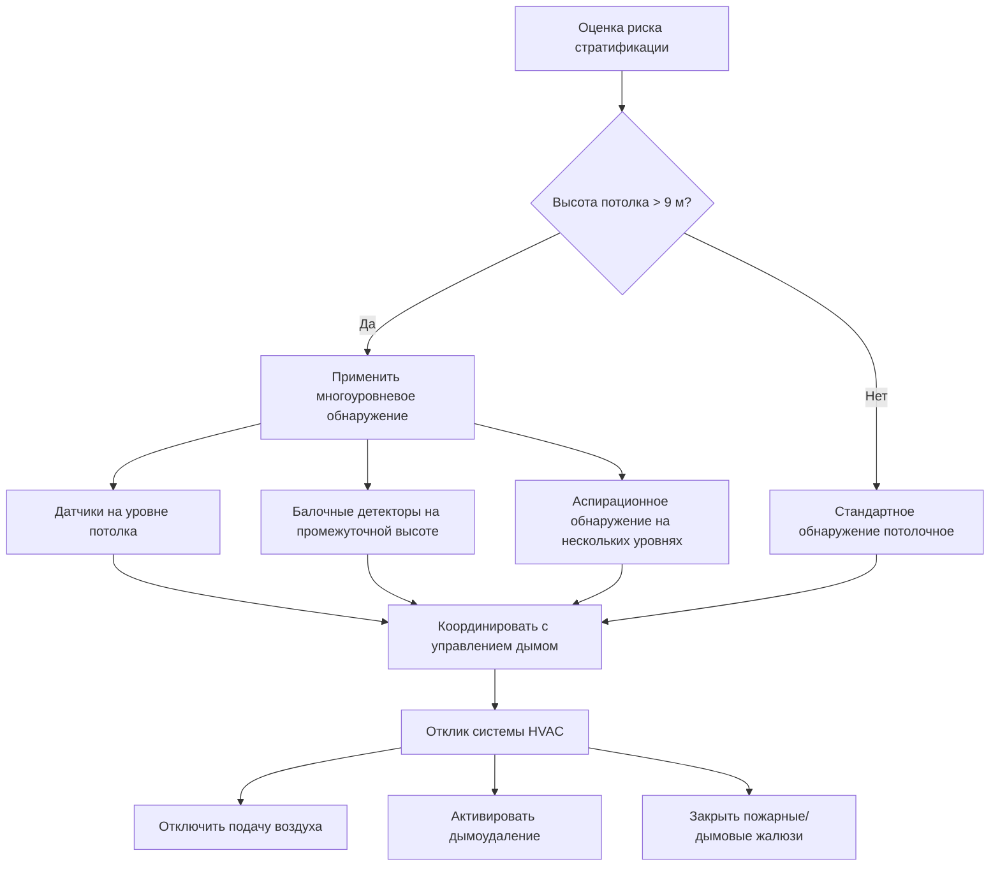
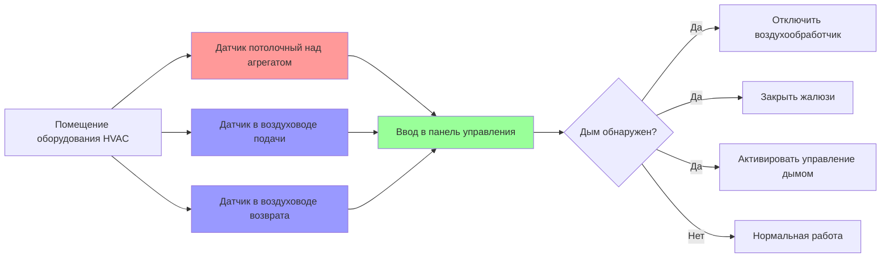

## Основы обнаружения дыма в системах HVAC

Датчики дыма служат основными сенсорами, инициирующими срабатывание систем безопасности HVAC, включая активацию системы управления дымом, отключение воздухообработчика и работу жалюзи. Правильный выбор датчика, его размещение и интеграция определяют надежность системы и время отклика. NFPA 72 устанавливает требования к применению датчиков, расстоянию между ними и чувствительности с учетом взаимодействия с системами HVAC, влияющих на перемещение дыма и его обнаружение.

Интеграция датчиков дыма с системами HVAC требует понимания как физики обнаружения пожара, так и динамики потока воздуха. Датчики должны обнаруживать дым быстро, избегая ложных тревог от нормальной работы HVAC, пыли, влажности и колебаний температуры.

## Типы датчиков и принципы работы

### Ионизационная и фотоэлектрическая технология

| Тип датчика | Метод обнаружения | Оптимальное применение | Характеристика отклика | Особенности HVAC |
|---------------|------------------|------------------------|------------------------|--------------------|
| Ионизационный | Радиоактивный источник измеряет нарушение ионного тока | Быстро развивающиеся пожары с мелкими частицами | Более быстрое обнаружение невидимых продуктов сгорания | Более восприимчив к ложным тревогам от пыли HVAC |
| Фотоэлектрический | Рассеяние света частицами дыма | Тлеющие пожары с крупными частицами | Лучше для обнаружения видимого дыма | Менее подвержен влиянию изменений скорости воздуха |
| Двойной датчик | Ионизационный и фотоэлектрический | Универсальное применение, высокая надежность | Сбалансированный профиль отклика | Рекомендуется для критических приложений HVAC |
| Аспирационный | Всасывающее обнаружение с трубопроводами отбора | Высокостоимостные помещения, предварительное предупреждение | Чрезвычайно раннее обнаружение | Требует отдельной сети трубопроводов |

### Детекторы в воздуховодах

Детекторы дыма в воздуховодах контролируют воздушные потоки в воздуховодах HVAC для обнаружения дыма до его распространения по зданию. NFPA 72 и механические коды требуют детекторы в воздуховодах в конкретных приложениях:

**Требуемые приложения:**
- Системы подачи воздуха, превышающие 944 л/с (2000 CFM)
- Системы возврата воздуха, превышающие 7,080 л/с (15000 CFM) при обслуживании нескольких этажей
- Системы возврата воздуха, когда требуется предотвращение рециркуляции дыма

**Требования к установке:**
- Установлены в соответствии со спецификациями диапазона скорости производителя (обычно 1,5–20 м/с)
- Расположены для обеспечения репрезентативного отбора проб воздушного потока
- Минимум 6 диаметров воздуховода после кривых или препятствий
- Доступны для обслуживания и тестирования

Эффективность отбора проб детектора в воздуховоде зависит от соотношения скорости воздуха в воздуховоде и конструкции датчика:

$$\eta = \frac{Q_{detector}}{Q_{duct}} \times 100\%$$

Где:
- $\eta$ = эффективность отбора проб (%)
- $Q_{detector}$ = поток воздуха через камеру датчика (л/с)
- $Q_{duct}$ = общий поток воздуха в воздуховоде (л/с)

## Расстояние между датчиками и размещение

### Расчеты покрытия площади

NFPA 72 указывает максимальное расстояние для приложений с гладким потолком на основе сертификации датчика и высоты потолка. Базовое соотношение расстояния учитывает распространение дымового факела:

$$S_{max} = \sqrt{\frac{A_{coverage}}{\pi}} \times 2$$

Где:
- $S_{max}$ = максимальное линейное расстояние между датчиками (м)
- $A_{coverage}$ = номинальная площадь покрытия датчика (м²)
- Стандартное расстояние: 9 м для большинства датчиков (84 м² покрытия)

### Влияние высоты потолка

По мере увеличения высоты потолка дымовые факелы распространяются больше перед достижением детекторов, что требует корректировки расстояния:

| Высота потолка | Снижение расстояния | Эффективное покрытие |
|---|---|---|
| 3–4,5 м | Базовое | 84 м² (9 м расстояние) |
| 4,5–6 м | Без снижения (если сертифицировано) | 84 м² |
| 6–9 м | Оценка характеристик факела | Возможно 50% снижение |
| >9 м | Требуется инженерный анализ | По проекту |

Для скатных потолков с уклоном более 1:8 датчики должны быть расположены в пределах 0,9 м от вершины, измеренного горизонтально.

### Корректировка расстояния для влияния HVAC

Тепло- и кондиционирование воздуха влияют на транспортировку дыма и требуют корректировки расстояния:

$$S_{adjusted} = S_{max} \times \sqrt{\frac{1}{1 + \frac{V_{air}}{V_{critical}}}}$$

Где:
- $S_{adjusted}$ = скорректированное расстояние между датчиками (м)
- $S_{max}$ = максимальное расстояние согласно NFPA 72 (м)
- $V_{air}$ = скорость воздуха у расположения датчика (м/с)
- $V_{critical}$ = критическая скорость для нарушения дымового потока (обычно 1,5 м/с)

Подача воздуха с высокой скоростью может помешать дыму достичь потолочных датчиков или сдуть дым от датчика. Скорость воздуха, превышающая 1,5 м/с у датчика, может потребовать дополнительного обнаружения или балочных детекторов.

## Рассмотрение стратификации дыма

Стратификация дыма происходит, когда дым, управляемый плавучестью, достигает равновесия с температурой окружающего воздуха перед достижением потолка, создавая слой дыма ниже уровня датчика. Это явление критически важно в больших объемах с высокими потолками.

### Факторы риска стратификации

**Условия высокого риска:**
- Высоты потолков, превышающие 9 м
- Высокие температуры окружающего воздуха у потолка (>37,8°C)
- Слабые источники огня с ограниченным выделением тепла
- Большие открытые объемы с минимальным перемешиванием воздуха

**Физический механизм:**

Высота стратификации зависит от разницы температур между дымом и окружающим воздухом:

$$\Delta z = \frac{T_{smoke} - T_{ambient}}{T_{ambient}} \times H_{ceiling} \times 0,5$$

Где:
- $\Delta z$ = расстояние ниже потолка, где происходит стратификация (м)
- $T_{smoke}$ = температура слоя дыма (К)
- $T_{ambient}$ = температура окружающего воздуха (К)
- $H_{ceiling}$ = высота потолка (м)

### Стратегии смягчения

**Рекомендуемые подходы:**
- Установка балочных детекторов дыма на промежуточных высотах (50–70% высоты потолка)
- Использование аспирационных систем с точками отбора на нескольких уровнях
- Координация размещения датчиков с схемами подачи воздуха HVAC
- Рассмотрение проецируемых балочных детекторов для очень высоких потолков (>12 м)

## Оптимизация размещения датчиков

### Рекомендуемая стратегия размещения

### Интеграция с системами управления HVAC

Выходные сигналы датчика дыма должны надежно взаимодействовать с системами управления HVAC:

**Действия управления:**
- Отключение блока обработки воздуха при срабатывании датчика дыма в воздуховоде
- Закрытие дымовых жалюзи, согласованное с зонами детектора
- Активация вентилятора подпора для защиты лестничных клеток
- Активация вытяжного вентилятора в назначенных зонах дыма

**Требования по времени отклика:**

Общее время отклика системы от обнаружения дыма до действия HVAC:

$$t_{total} = t_{detection} + t_{transmission} + t_{processing} + t_{actuation}$$

Где:
- $t_{detection}$ = от попадания дыма в датчик до сигнала тревоги (5–30 секунд)
- $t_{transmission}$ = передача сигнала на панель управления (<1 секунда)
- $t_{processing}$ = выполнение логики управления (1–3 секунды)
- $t_{actuation}$ = закрытие жалюзи или отключение вентилятора (5–60 секунд)

Целевое общее время отклика: <90 секунд для критических функций управления дымом.

## Чувствительность датчика и предотвращение ложных тревог

### Параметры чувствительности

Современные адресные датчики позволяют регулировать чувствительность для баланса раннего предупреждения и снижения ложных тревог:

| Уровень чувствительности | Диапазон непрозрачности | Применение |
|---|---|---|
| Высокий | 0,5–1,5% на фут | Чистые помещения, раннее предупреждение |
| Средний | 1,5–2,5% на фут | Стандартные коммерческие помещения |
| Низкий | 2,5–4,0% на фут | Пыльные помещения, промышленность |
| Переменный | Автоматическая регулировка | Помещения с изменяющимися условиями |

### Источники ложных тревог, связанные с HVAC

**Распространенные причины:**
- Накопление пыли в воздуховодах, выпускаемое при запуске вентилятора
- Высокая влажность от систем увлажнения
- Переходные изменения температуры, вызывающие конденсацию
- Строительная пыль во время ремонтных работ
- Аэрозоли от готовки в системах возврата воздуха

**Стратегии профилактики:**
- Регулярное техническое обслуживание фильтров HVAC и очистка воздуховодов
- Правильный выбор датчика для среды
- Защита датчиков в зонах с высокой скоростью воздуха
- Проверка тестирования после изменений системы HVAC
- Временные задержки для некритических приложений

## Требования к техническому обслуживанию и тестированию

NFPA 72 обязывает проводить регулярное тестирование и проверку чувствительности:

**Частота контроля:**
- Визуальный контроль: два раза в год
- Функциональное тестирование: ежегодно
- Проверка чувствительности: по инструкции производителя (обычно 2–5 лет)
- Очистка детектора в воздуховоде: ежегодно или согласно требованиям местного органа юрисдикции

**Комплексное тестирование:**
- Проверка отклика системы HVAC при активации датчика
- Подтверждение правильной работы жалюзи
- Тестирование активации режима управления дымом
- Документирование времени отклика и работы оборудования

Датчики в системах HVAC испытывают ускоренное загрязнение и требуют более частого обслуживания, чем площадные датчики в занятых помещениях.

---

*Данный контент рассматривает основы обнаружения дыма в связи с системами пожарной безопасности HVAC. Правильный выбор и интеграция датчиков обеспечивают надежное обнаружение пожара при сохранении координации с работой оборудования HVAC и стратегиями управления дымом.*
