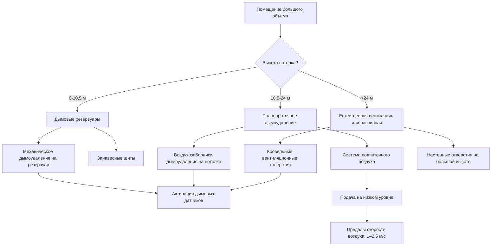

## Общие сведения

Помещения большого объема представляют уникальные проблемы при проектировании систем дымоудаления из-за их вертикальной высоты, открытых площадей пола и требований эвакуации людей. NFPA 92 определяет помещение большого объема как имеющее высоту потолка более 6 м с значительной открытой площадью пола. Эти окружающие среды—включая атриумы, склады, торговые центры, арены и терминалы аэропортов—требуют специализированных инженерных подходов, учитывающих поведение дымового факела, потоки, вызванные плавучестью, и температурную стратификацию.

Основной целью является поддержание слоя без дыма над занятой зоной в периоды эвакуации. Это требует расчета скоростей образования дыма, прогнозирования снижения дымового слоя и проектирования систем дымоудаления, которые удаляют дым с достаточной скоростью для поддержания высоты интерфейса выше критических отметок.

## Физика дымового факела

Поведение дыма в больших объемах управляется конвекцией, вызванной плавучестью. Пожар создает вертикальный факел, который вовлекает окружающий воздух при подъеме, увеличивая расход массы с высотой. Расход массы факела на высоте $z$ выше источника пожара составляет:

$$\dot{m}_p = 0.071 Q_c^{1/3} z^{5/3} + 0.0018 Q_c$$

где $\dot{m}_p$ — расход массы факела (кг/с), $Q_c$ — скорость выделения конвективного тепла (кВт), $z$ — высота над пожаром (м).

Когда факел достигает потолка, он распространяется радиально, образуя потолочную струю, которая в конечном итоге создает нисходящий дымовой слой. Высота интерфейса дымового слоя уменьшается по мере накопления дыма под потолком.

## Время заполнения дымом

Время, необходимое для снижения дыма до критической высоты, рассчитывается с использованием уравнения заполнения дымом из NFPA 92:

$$t = \frac{A_f (H - z_s)}{V_s}$$

Для осесимметричных факелов в пространствах с однородным поперечным сечением:

$$t = \frac{2.38 A_f (H - z_s)^{5/3}}{Q_c^{1/3} H^{5/3}}$$

где:
- $t$ = время заполнения (с)
- $A_f$ = площадь пола (м²)
- $H$ = высота потолка (м)
- $z_s$ = высота интерфейса дымового слоя (м)
- $V_s$ = объемная скорость производства дыма (м³/с)
- $Q_c$ = скорость выделения конвективного тепла (кВт)

Эта зависимость позволяет инженерам определить, позволяет ли естественное накопление дыма достаточное время для эвакуации или требуется механическое дымоудаление.

## Подходы к проектированию

### Стационарное дымоудаление

Системы механического дымоудаления предназначены для удаления дыма с скоростями, равными или превышающими производство факела, поддерживая постоянную высоту интерфейса. Требуемая скорость дымоудаления равна расходу массы факела на желаемой высоте интерфейса:

$$\dot{V}_{exhaust} = \frac{\dot{m}_p}{\rho_s}$$

где $\rho_s$ — плотность дыма при температуре слоя (кг/м³).

Воздухозаборники дымоудаления расположены в дымовом слое, обычно на высоте 80–90% от потолка. Несколько воздухозаборников обеспечивают равномерное удаление дыма по всей площади потолка.

### Естественная вентиляция

Естественная вентиляция использует силы плавучести для проталкивания дыма через кровельные вентиляционные отверстия или настенные отверстия. Объемный поток через вентиляционное отверстие составляет:

$$\dot{V}_{vent} = C_d A_v \sqrt{2g \Delta h \frac{\Delta T}{T_a}}$$

где:
- $C_d$ = коэффициент расхода (обычно 0,6–0,7)
- $A_v$ = площадь вентиляционного отверстия (м²)
- $g$ = ускорение свободного падения (9,81 м/с²)
- $\Delta h$ = высота от нейтральной плоскости до вентиляционного отверстия (м)
- $\Delta T$ = разность температур (K)
- $T_a$ = температура окружающей среды (K)

### Метод дымового резервуара

Большие площади потолков разделяются на дымовые резервуары с использованием занавесных щитов или конструкционных балок, выступающих ниже потолка. Каждый резервуар содержит дым от одного факела, ограничивая боковое распространение. Проектирование резервуара в соответствии с NFPA 92 требует:

- Минимальная глубина: 20% высоты потолка или 2,4 м, в зависимости от того, что меньше
- Максимальная площадь пола на резервуар: на основе размера расчетного пожара и пропускной способности дымоудаления
- Воздухозаборники дымоудаления в каждом резервуаре

## Рассмотрение по типам помещений

| Тип помещения | Высота потолка | Основная проблема | Типичный подход |
|------------|----------------|-----------------|------------------|
| Атриум | 12–45 м | Поддержание интерфейса во время эвакуации | Механическое дымоудаление с подпиточным воздухом |
| Склад | 7,5–15 м | Задымление в проходах стеллажей | Естественная вентиляция или автоматические спринклеры |
| Арена/Стадион | 15–36 м | Большое количество людей, ограниченные выходы | Естественная вентиляция с дополнительным механическим дымоудалением |
| Торговый центр | 6–10,5 м | Множество разных арендаторов, взаимосвязанные пространства | Дымовые резервуары с дымоудалением |
| Аэропортовый терминал | 9–24 м | Круглосуточная работа, проблемы безопасности | Выделенные механические системы с интеграцией управления |
| Конференц-центр | 7,5–18 м | Переменные конфигурации, высокие топливные нагрузки | Гибкое дымоудаление с регулируемыми резервуарами |

## Конфигурация системы

## Требования подпиточного воздуха

Системы механического дымоудаления требуют подпиточного воздуха для замены удаленного дыма и предотвращения чрезмерного понижения давления в здании. Скорости подачи подпиточного воздуха обычно составляют 100–110% от скоростей дымоудаления для поддержания слегка избыточного давления. Места подачи не должны нарушать стратификацию дыма:

- Расположение на уровне пола или на нижних стенах
- Максимальная скорость: 2,5 м/с на выходах подачи
- Температурный контроль предотвращает дестратификацию

## Выбор расчетного пожара

Расчетные пожары NFPA 92 варьируются от 5 МВт для малых топливных нагрузок до 20+ МВт для высокотребовательных сценариев. Факторы выбора включают:

- Тип помещения и характеристики топлива
- Горючие материалы и расположение
- Взаимодействие со спринклерной системой
- Требуемые целевые показатели производительности

Распространенные расчетные пожары:
- Атриумы розничной торговли/офисов: 5–10 МВт
- Склад (без спринклеров): 10–20 МВт
- Терминалы общественного транспорта: 3–8 МВт
- Спортивные арены: 5–12 МВт

## Расчетное моделирование

Анализ CFD подтверждает предположения проектирования для сложных геометрий, когда ручные расчеты неадекватны. Fire Dynamics Simulator (FDS) и аналогичные инструменты моделируют:

- Трехмерное развитие факела
- Схемы распространения потолочной струи
- Скорости снижения дымового слоя
- Эффективность системы дымоудаления
- Эффекты взаимодействия подпиточного воздуха

Моделирование требует проверки по сравнению с экспериментальными данными и анализ чувствительности входных параметров.

## Проверка системы

Приемочное испытание в соответствии с NFPA 92 демонстрирует производительность системы:

- Измерения расхода воздуха на всех точках дымоудаления и подачи
- Функциональность системы дымовой сигнализации
- Проверка последовательности управления
- Измерения температуры и скорости
- Документирование предположений проектирования и критериев приемки

Дымоудаление в помещениях большого объема требует тщательного инженерного анализа, сочетающего фундаментальную механику жидкостей, динамику пожара и интеграцию систем зданий для обеспечения безопасности людей при пожарных событиях.
