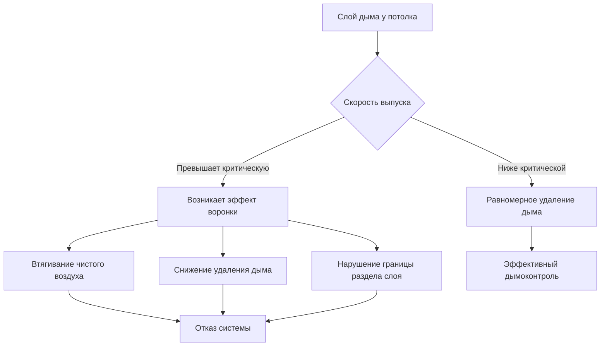
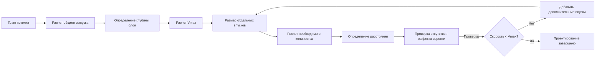

## Явление эффекта воронки

Эффект воронки возникает, когда чрезмерная скорость воздуха в выпускном отверстии дымоудаления создает локализованный вихрь, который втягивает чистый воздух из-под слоя дыма непосредственно в систему дымоудаления, минуя дымонасыщенный воздух выше. Это явление резко снижает эффективность удаления дыма и подрывает работу системы дымоудаления.

Физический механизм включает эффекты Бернулли и увлечение воздуха. Когда скорость выпуска превышает критические пороги, создаваемый перепад давления формирует проникающий поток через границу раздела слоя дыма, втягивая холодный, богатый кислородом воздух в выпускной поток, оставляя горячие дымовые газы в застойном состоянии.

## Критические пределы скорости

NFPA 92 устанавливает максимальные скорости выпуска для предотвращения эффекта воронки на основе глубины слоя дыма. Критическое соотношение выглядит следующим образом:

$$V_{max} = K \sqrt{g \cdot d}$$

Где:
- $V_{max}$ = Максимальная допустимая скорость выпуска (м/с)
- $K$ = Безразмерный коэффициент (обычно 1.0 для консервативного проектирования)
- $g$ = Ускорение свободного падения (9.81 м/с²)
- $d$ = Глубина слоя дыма ниже потолка (м)

Для инженерных приложений с коэффициентами безопасности:

$$V_{max} = 1.0 \sqrt{9.81 \cdot d} = 3.13\sqrt{d}$$

Это уравнение демонстрирует, что более глубокие слои дыма допускают более высокие скорости выпуска перед началом эффекта воронки.

## Минимальная глубина слоя дыма

Слой дыма должен поддерживать достаточную глубину для обеспечения адекватного объема пребывания и предотвращения нарушения границы раздела. NFPA 92 требует минимальную глубину слоя на основе конфигурации выпуска:

$$d_{min} = \frac{V^2}{g \cdot K^2}$$

Для желаемой скорости выпуска $V$, переформулировав уравнение критической скорости, получаем минимально необходимую глубину слоя дыма.

| Скорость выпуска (м/с) | Минимальная глубина слоя (м) | Минимальная глубина слоя (м) |
|------------------------|------------------------------|------------------------------|
| 2.5 | 0.64 | 0.64 |
| 3.0 | 0.92 | 0.92 |
| 3.5 | 1.25 | 1.25 |
| 4.0 | 1.63 | 1.63 |
| 4.5 | 2.06 | 2.06 |
| 5.0 | 2.55 | 2.55 |

## Максимальный расход дымоудаления на один впуск

Объемный расход выпуска на один впуск должен соответствовать как пределам скорости, так и геометрии впуска:

$$Q_{max} = A_{inlet} \cdot V_{max} = A_{inlet} \cdot 3.13\sqrt{d}$$

Где:
- $Q_{max}$ = Максимальный расход выпуска (м³/с)
- $A_{inlet}$ = Эффективная площадь выпускного впуска (м²)

Для круглых выпускных впусков:

$$Q_{max} = \frac{\pi D^2}{4} \cdot 3.13\sqrt{d}$$

Где $D$ = диаметр впуска (м)

### Практическая таблица расходов дымоудаления

| Диаметр впуска (м) | Глубина слоя 1.0 м (м³/с) | Глубина слоя 1.5 м (м³/с) | Глубина слоя 2.0 м (м³/с) |
|-------------------|---------------------------|---------------------------|---------------------------|
| 0.50 | 0.61 | 0.75 | 0.87 |
| 0.75 | 1.38 | 1.69 | 1.95 |
| 1.00 | 2.46 | 3.01 | 3.48 |
| 1.25 | 3.84 | 4.70 | 5.43 |
| 1.50 | 5.53 | 6.77 | 7.82 |

## Требования к конструкции выпускного впуска

### Геометрические аспекты

Конструкция впуска напрямую влияет на восприимчивость к эффекту воронки:

1. **Площадь впуска**: Более крупные впуски распределяют поток, снижая локальную скорость
2. **Глубина ниже потолка**: Впуски должны оставаться в пределах слоя дыма при всех условиях
3. **Расстояние между впусками**: Несколько впусков предотвращают локализованные зоны высокой скорости
4. **Конфигурация краев**: Острые края увеличивают турбулентность и снижают эффективную площадь

### Расчет расстояния между впусками

Для сохранения равномерного выпуска без локализованных пиков скорости:

$$S_{inlet} = \sqrt{\frac{4Q_{total}}{\pi n V_{max}}}$$

Где:
- $S_{inlet}$ = Расстояние между впусками (м)
- $Q_{total}$ = Требуемый общий расход выпуска (м³/с)
- $n$ = Количество выпускных впусков
- $V_{max}$ = Максимально допустимая скорость (м/с)

## Методология размерирования вентилятора

Выпускные вентиляторы должны обеспечивать адекватный расход с учетом потерь давления в системе и ограничений скорости эффекта воронки.

### Общая производительность вентилятора

$$Q_{fan} = \frac{Q_{total}}{SF \cdot \eta_{sys}}$$

Где:
- $Q_{fan}$ = Требуемая производительность вентилятора (м³/с)
- $SF$ = Коэффициент безопасности (обычно 1.1-1.2)
- $\eta_{sys}$ = Эффективность системы (0.85-0.95)

### Требования к статическому давлению

Общее давление в системе включает:

$$\Delta P_{total} = \Delta P_{inlet} + \Delta P_{duct} + \Delta P_{hood} + \Delta P_{discharge}$$

Потеря давления на входе при ограничении скорости:

$$\Delta P_{inlet} = \frac{\rho V_{max}^2}{2C_d^2}$$

Где $C_d$ = коэффициент расхода (обычно 0.6-0.8 для выпускных впусков дымоудаления)

## Проверка посредством CFD анализа

Вычислительная гидродинамика обеспечивает валидацию проектирования предотвращения эффекта воронки:

1. **Моделирование стратификации слоя дыма** с подходящими моделями плавучести
2. **Применение действительных скоростей выпуска** на границах впусков
3. **Проверка стабильности границы раздела** через переходный анализ
4. **Проверка векторов скорости** на предмет проникновения вниз через слой дыма
5. **Валидация эффективности удаления дыма** путем отслеживания времени пребывания частиц

Критерии приемки CFD:
- Граница раздела слоя дыма остается выше расчетной глубины
- Ни один вектор скорости не проникает более чем на 10% через границу раздела слоя
- Состав выпуска содержит >90% дымонасыщенного воздуха по объему
- Стратификация температуры поддерживает дифференциал >50°C через границу раздела

## Контрольный перечень реализации проектирования

**Предотвращение эффекта воронки требует:**

- Расчета минимальной глубины слоя дыма для геометрии помещения
- Определения максимальной скорости выпуска с использованием $V_{max} = 3.13\sqrt{d}$
- Размерирования выпускных впусков для поддержания скорости ниже максимума
- Равномерного распределения нескольких впусков по площади потолка
- Выбора вентиляторов с адекватной производительностью и возможностью давления
- Верификации проектирования через CFD анализ при глубине слоя <1.5 м
- Установки мониторинга глубины слоя дыма для верификации системы
- Пуска системы с тестированием дымовым генератором

**Критические ошибки проектирования, которых следует избежать:**

- Увеличения размера одного выпускного впуска вместо распределения потока
- Размещения впусков ниже минимальной глубины слоя дыма
- Игнорирования эффектов температуры на плавучесть слоя дыма
- Недоучета потерь давления в каналах при выборе вентилятора
- Неучета наихудших сценариев роста пожара

Надлежащее предотвращение эффекта воронки гарантирует, что системы дымоудаления функционируют как предусмотрено, поддерживая безопасные условия во время пожарных происшествий в помещениях больших объемов.
