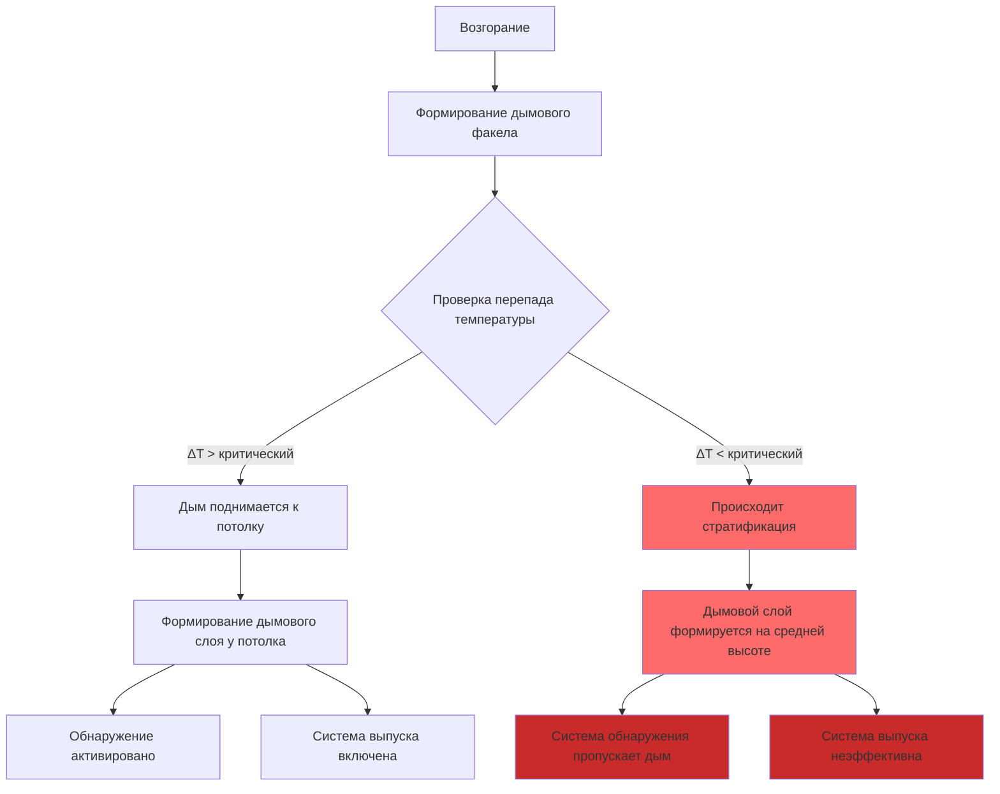
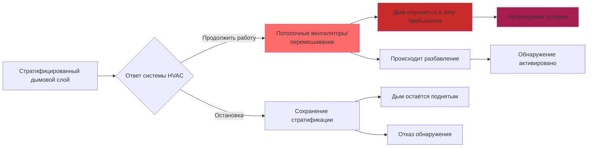

## Физические основы стратификации дыма

Стратификация дыма происходит, когда продукты сгорания теряют достаточную плавучесть для дальнейшего подъёма, образуя устойчивый слой ниже потолка. Это явление создаёт критические проблемы в больших объёмах, где высоты потолков превышают 6,1 м. Устойчивость стратифицированных дымовых слоёв зависит от перепада температуры между дымовым слоем и окружающим воздухом.

Сила плавучести, обеспечивающая подъём дыма, выражается следующим образом:

$$F_b = \rho_a V g \left(1 - \frac{T_a}{T_s}\right)$$

где:
- $F_b$ = сила плавучести (Н)
- $\rho_a$ = плотность окружающего воздуха (кг/м³)
- $V$ = объём дыма (м³)
- $g$ = ускорение свободного падения (9,81 м/с²)
- $T_a$ = температура окружающего воздуха (К)
- $T_s$ = температура дыма (К)

По мере подъёма дыма и втягивания более холодного окружающего воздуха его температура снижается. Критическая высота стратификации наступает, когда сила плавучести уравнивается с силами сопротивления и сопротивлением перемешиванию.

## Анализ градиента температуры

Вертикальный градиент температуры в больших объёмах определяет поведение стратификации. NFPA 92 признаёт, что перепады температуры ниже 5,6°C могут привести к недостаточной плавучести дыма для достижения точек выпуска.

**Требования по перепаду температуры:**

| Высота потолка (м) | Минимальный ΔT для подъёма (°C) | Риск стратификации | Проблема обнаружения |
|---------------------|-----------------------------------|---------------------|---------------------|
| 6,1–9,1 | 4,4–6,7 | Умеренный | Низкая |
| 9,1–15,2 | 6,7–10,0 | Высокий | Умеренная |
| 15,2–22,9 | 10,0–13,9 | Очень высокий | Высокая |
| >22,9 | >13,9 | Критический | Серьезная |

Спад температуры с высотой следует формуле:

$$T(z) = T_0 \exp\left(-\frac{z}{\lambda}\right) + T_\infty$$

где:
- $T(z)$ = температура на высоте $z$ (К)
- $T_0$ = начальный избыток температуры (К)
- $\lambda$ = характеристическая длина спада (м)
- $T_\infty$ = температура окружающего воздуха (К)

## Поведение дыма в стратифицированных условиях

## Предсказание высоты стратификации

Высота равновесной стратификации может быть оценена с использованием:

$$z_{strat} = \frac{Q^{2/3}}{C \cdot (g \cdot \Delta T / T_a)^{1/3}}$$

где:
- $z_{strat}$ = высота стратификации (м)
- $Q$ = тепловыделение (кВт)
- $C$ = эмпирическая константа (0,9–1,2)
- $\Delta T$ = разница температур (К)

Это соотношение демонстрирует, что пожары с низким тепловыделением в высоких помещениях сталкиваются с наибольшим риском стратификации.

## Проблемы системы обнаружения

Стратификация дыма создаёт три критические проблемы обнаружения:

1. **Потолочные датчики остаются неактивными**, когда дымовые слои формируются на 3–12 м ниже потолка
2. **Лучевые датчики могут работать ниже стратифицированного слоя**, полностью пропуская дым
3. **Аспирационные системы с неправильной высотой точек отбора** не обнаруживают события стратификации

Концентрация дыма у потолка при стратификации на высоте $h$ ниже:

$$C_{ceiling} = C_{strat} \cdot \exp\left(-\frac{h}{\delta}\right)$$

где $\delta$ — характеристическая длина диффузии, обычно 2–5 м в неподвижном воздухе.

## Рассмотрения дестратификации

NFPA 92 подчёркивает, что нормальная работа HVAC на ранних стадиях пожара может дестратифицировать дым, приводя его в зону пребывания. Однако полная остановка HVAC может помешать дыму достичь точек выпуска, расположенных у потолка.

**Механизмы дестратификации:**

- Импульс подаваемого воздуха, прорывающийся через интерфейс дымового слоя
- Втягивание вытяжного воздуха, опускающее дым вниз
- Работа потолочных вентиляторов, нарушающая тепловую стратификацию
- Системы воздушных завес, создающие вертикальное перемешивание

Критическое число Ричардсона определяет, будет ли поток воздуха дестратифицировать дымовой слой:

$$Ri = \frac{g \cdot \Delta \rho \cdot H}{\rho \cdot U^2}$$

где:
- $Ri$ = число Ричардсона (безразмерное)
- $\Delta \rho$ = разница плотностей (кг/м³)
- $H$ = толщина слоя (м)
- $U$ = характеристическая скорость (м/с)

Когда $Ri < 0,25$, механическое перемешивание доминирует и происходит дестратификация. Когда $Ri > 1,0$, плавучесть поддерживает стратификацию несмотря на поток воздуха.

## Инженерные стратегии

**Стратегия остановки HVAC:**
- Немедленная остановка всех приточно-вытяжных установок при обнаружении
- Закрытие заслонок наружного воздуха для предотвращения перемешивания, вызванного ветром
- Деактивация вентиляторов дестратификации
- Работа исключительно вентилятора дымоудаления

**Поддержание градиента температуры:**
- Минимизация до пожара тепловой стратификации посредством правильного кондиционирования помещения
- Избегание избыточного охлаждения, создающего температурные инверсии
- Проектирование равномерного распределения температуры в высоких помещениях

**Проектирование системы обнаружения:**
- Многоуровневые массивы датчиков дыма на вертикальных интервалах 4,5–6,1 м
- Видеодетекция дыма для визуального подтверждения высоты слоя
- Алгоритмы обнаружения, компенсированные по температуре
- Аспирационные системы с точками отбора на нескольких высотах

Массовый расход через интерфейс стратифицированного дымового слоя определяет вероятность обнаружения:

$$\dot{m} = \rho \cdot A \cdot U_{ent}$$

где $U_{ent} = 0,1 \sqrt{g \cdot \Delta T / T \cdot H}$ — скорость втягивания через интерфейс.

## Требования соответствия NFPA 92

NFPA 92, раздел 4.6.4, явно рассматривает стратификацию, требуя:

- Анализ потенциала стратификации для всех помещений высотой более 9,1 м
- Расчёт ожидаемых температур дымового слоя при различных размерах пожаров
- Оценка размещения системы обнаружения относительно прогнозируемых высот стратификации
- Документирование режимов работы системы HVAC при пожарных событиях

Стандарт признаёт, что спроектированное управление дымом должно учитывать противоречащие друг другу цели сохранения стратификации для безопасности людей, обеспечения активирования системы обнаружения и эффективности системы удаления дыма.
