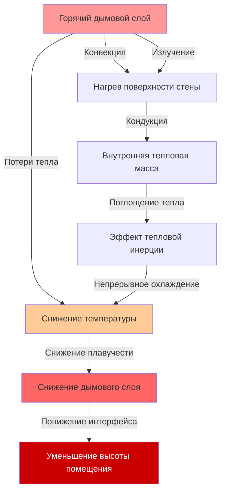
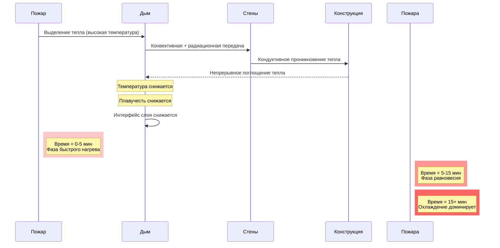

## Влияние тепловой инерции на системы дымоудаления

Тепловая инерция в больших объемах значительно влияет на управление дымом путем поглощения тепла из дымового слоя, снижения плавучести и вызывания снижения интерфейса дымового слоя со временем. Тепловая масса стен, потолков и конструктивных элементов действует как теплоприемник, фундаментально изменяя поведение дыма по сравнению с идеализированными моделями установившегося режима.

## Механизмы передачи тепла

Дымовой слой теряет тепло на поверхностях здания через три одновременно действующих механизма:

**Конвективная передача тепла** происходит на интерфейсе дымовой слой-стена:

$$q_{conv} = h_c A_s (T_s - T_w)$$

где:
- $q_{conv}$ = скорость конвективной передачи тепла (Вт)
- $h_c$ = коэффициент конвективной передачи тепла (5-25 Вт/м²·К для естественной конвекции)
- $A_s$ = площадь поверхности в контакте с дымом (м²)
- $T_s$ = температура дымового слоя (К)
- $T_w$ = температура поверхности стены (К)

**Радиационная передача тепла** доминирует при повышенных температурах дыма:

$$q_{rad} = \epsilon \sigma A_s (T_s^4 - T_w^4)$$

где:
- $\epsilon$ = эффективная степень черноты (0,7-0,9 для дыма и строительных материалов)
- $\sigma$ = постоянная Стефана-Больцмана (5,67 × 10⁻⁸ Вт/м²·К⁴)

**Кондуктивная передача тепла** через конструктивные элементы:

$$q_{cond} = \frac{kA(T_{w,hot} - T_{w,cold})}{\delta}$$

где:
- $k$ = теплопроводность (Вт/м·К)
- $\delta$ = толщина стены (м)

## Накопление тепла тепловой массой

Тепло, поглощаемое строительной конструкцией, управляется тепловой емкостью:

$$Q_{stored} = mc_p\Delta T = \rho V c_p (T_f - T_i)$$

где:
- $Q_{stored}$ = общее накопленное тепло (Дж)
- $m$ = масса конструктивного элемента (кг)
- $\rho$ = плотность материала (кг/м³)
- $V$ = объем материала (м³)
- $c_p$ = удельная теплоемкость (Дж/кг·К)
- $T_f$ = конечная температура (К)
- $T_i$ = начальная температура (К)

Тепловая диффузия определяет глубину проникновения тепла:

$$\alpha = \frac{k}{\rho c_p}$$

Глубина проникновения за время $t$ приблизительно равна:

$$\delta_{penetration} \approx \sqrt{\alpha t}$$

## Теплофизические свойства материалов

| Материал | Плотность (кг/м³) | Удельная теплоемкость (Дж/кг·К) | Теплопроводность (Вт/м·К) | Тепловая диффузия (м²/с × 10⁻⁶) |
|----------|----------------|----------------------|---------------------|----------------------------------|
| Бетон | 2400 | 880 | 1,4 | 0,66 |
| Кирпич | 1920 | 840 | 0,72 | 0,45 |
| Сталь | 7850 | 450 | 45 | 12,7 |
| Гипсовая плита | 800 | 1090 | 0,17 | 0,19 |
| Стекло | 2500 | 750 | 1,0 | 0,53 |

## Снижение температуры дымового слоя

Температура дымового слоя уменьшается в соответствии с энергетическим балансом:

$$\frac{dT_s}{dt} = \frac{\dot{Q}_{fire} - \dot{Q}_{loss} - \dot{m}_{exhaust}c_p(T_s - T_{amb})}{m_{smoke}c_p}$$

где:
- $\dot{Q}_{fire}$ = скорость выделения тепла пожаром (Вт)
- $\dot{Q}_{loss}$ = потери тепла на поверхности (Вт)
- $\dot{m}_{exhaust}$ = расход воздуха на выходе (кг/с)
- $m_{smoke}$ = масса дымового слоя (кг)

Для охлаждающегося дымового слоя без активного горения NFPA 92 признает, что поток, управляемый плавучестью, уменьшается следующим образом:

$$\Delta T(t) = \Delta T_0 \exp\left(-\frac{hA_s}{m_{smoke}c_p}t\right)$$

где $\Delta T_0$ — начальная разность температур выше окружающей среды.

## Скорость снижения дымового слоя

По мере охлаждения дыма сниженная плавучесть позволяет интерфейсу снижаться. Скорость снижения зависит от:

$$\frac{dz}{dt} = -\frac{\dot{Q}_{loss}}{A_{floor}\rho_{amb}c_p\Delta T g z}$$

где:
- $z$ = высота дымового слоя над полом (м)
- $A_{floor}$ = площадь пола (м²)
- $g$ = ускорение свободного падения (9,81 м/с²)

## Поведение, зависящее от времени

## Проектные рекомендации согласно NFPA 92

**Доступное безопасное время эвакуации (ASET)** должно учитывать эффекты тепловой инерции:

1. **Начальная фаза (0-5 минут)**: Образование дымового слоя, стены начинают поглощать тепло
2. **Квазиустановившаяся фаза (5-15 минут)**: Температура относительно стабильна при постоянном пожаре
3. **Фаза охлаждения (>15 минут)**: Значительное охлаждение и снижение без продолжающегося выделения тепла

**Критические конструктивные факторы:**

- **Размер расхода дымоудаления**: Должен компенсировать потерю плавучести со временем
- **Температура приточного воздуха**: Холодный приточный воздух ускоряет охлаждение дыма
- **Соотношение площади поверхности к объему**: Более высокие соотношения увеличивают скорость охлаждения
- **Выбор материала**: Материалы с высокой тепловой массой увеличивают поглощение тепла

**Рекомендуемый подход:**

NFPA 92, раздел 4.6.8 требует учета потерь тепла на границах. Для расчетов проектирования:

$$\dot{m}_{exhaust} = \frac{\dot{m}_{plume}}{1 - \frac{\dot{Q}_{loss}}{\dot{Q}_{convective}}}$$

где доля потерь обычно составляет от 0,2 до 0,5 для больших пространств со значительной тепловой массой.

## Поддержание стабильности дымового слоя

Критический параметр — поддержание достаточной разности температур:

$$\Delta T_{critical} \geq 15-20°C$$

Ниже этого порога дымовой слой становится нестабильным и может смешиваться с нижним воздухом. Время достижения критических условий:

$$t_{critical} = \frac{m_{smoke}c_p \Delta T_0}{\dot{Q}_{loss}}$$

Для атриумов, заключенных в бетон, ожидаются скорости потерь тепла 50-150 кВт на 1000 м² открытой поверхности при типичных температурах дымового слоя (100-200°C выше окружающей среды).

## Практические соображения

**Помещения с высокой тепловой массой** (бетон, кладка):
- Дым охлаждается быстро
- Снижение интерфейса ускоряется через 10-15 минут
- Требуют более высоких скоростей дымоудаления или управляемой вентиляции по потребности

**Помещения с низкой тепловой массой** (стальные настилы, ограниченное ограждение):
- Поддерживают более высокие температуры дыма дольше
- Более предсказуемое поведение в установившемся режиме
- Более низкие требования к скорости дымоудаления

**Проверка**: Моделирование вычислительной гидродинамики (CFD), зависящее от времени, должно имитировать эффекты тепловой инерции для критических применений, где время эвакуации превышает 10 минут или где уникальная геометрия создает большие площади поверхности в контакте с дымовым слоем.
