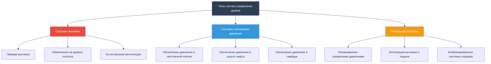
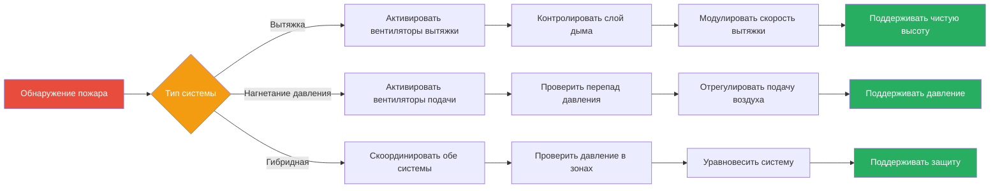

# Обзор систем управления дымом

Системы управления дымом представляют критическую инфраструктуру безопасности жизни, предназначенную для управления распространением дыма во время пожара. Эти спроектированные системы создают приемлемые условия для эвакуации людей и проведения пожаротушения путем стратегического манипулирования перепадами давления, структурой воздушных потоков и извлечением дыма. Основной целью является поддержание свободных от дыма путей эвакуации и ограничение распространения дыма в определенные зоны.

## Классификация систем

Системы управления дымом подразделяются на три основные конфигурации на основе их рабочей стратегии:

### 1. Системы вытяжки дыма

Системы вытяжки удаляют дым непосредственно из очага пожара путем механического извлечения. Объемная скорость вытяжки должна превышать скорость образования дыма, чтобы предотвратить опускание слоя дыма ниже критического уровня.

**Принцип проектирования:**

$$Q_{exhaust} = \frac{\dot{m}_{smoke}}{\rho_{smoke}}$$

Где:
- $Q_{exhaust}$ = объемная скорость вытяжки (м³/с)
- $\dot{m}_{smoke}$ = массовая скорость образования дыма (кг/с)
- $\rho_{smoke}$ = плотность дыма (кг/м³)

Для больших объемов помещений требуемая мощность вытяжки зависит от тепловыделения пожара:

$$\dot{m}_{smoke} = 0.071 Q_c^{1/3} z^{5/3}$$

Где:
- $Q_c$ = скорость конвективного тепловыделения (кВт)
- $z$ = высота над источником пожара до границы раздела слоя дыма (м)

### 2. Системы нагнетания давления

Системы нагнетания давления создают положительные перепады давления на барьерах для предотвращения проникновения дыма в защищаемые помещения. Лестничные клетки, шахты лифтов и убежищи поддерживаются под более высоким давлением, чем соседние зоны пожара.

**Требование к перепаду давления:**

$$\Delta P = \frac{1}{2} \rho V^2 + \rho g h \Delta T / T$$

Для минимального перепада давления на барьере:

$$\Delta P_{min} = 12.5 \text{ Па}$$

NFPA 92 указывает минимальные перепады давления в 12,5 Па для лестничных клеток и 25 Па для шахт лифтов, чтобы преодолеть эффект дымовой трубы и силы открытия дверей.

### 3. Гибридные системы

Гибридные системы объединяют вытяжку и нагнетание давления для создания скоординированных зон управления дымом. Зоны пожара работают под отрицательным давлением (вытяжка), в то время как маршруты эвакуации поддерживают положительное давление (подача).

## Сравнение систем

| Параметр | Системы вытяжки | Системы нагнетания давления | Гибридные системы |
|-----------|----------------|----------------------|----------------|
| **Основной механизм** | Извлечение дыма | Барьер давления | Комбинированный подход |
| **Применение** | Большие объемы, атриумы | Пути эвакуации, шахты | Многозональные здания |
| **Направление воздушного потока** | Из очага пожара | В защищаемое помещение | Скоординированный поток |
| **Перепад давления** | Отрицательный в зоне пожара | Положительный в безопасной зоне | Оба положительный/отрицательный |
| **Требуемая производительность** | 4-12 воздухообменов/час | 12,5-50 Па | Переменная по зонам |
| **Сложность управления** | Умеренная | Низкая | Высокая |
| **Раздел NFPA 92** | Глава 4 | Глава 5 | Глава 6 |
| **Типичная стоимость** | $$$ | $$ | $$$$ |

## Соображения при проектировании

### Компенсация эффекта дымовой трубы

Высокие здания испытывают значительный эффект дымовой трубы, который влияет на производительность системы управления дымом. Нейтральная плоскость давления смещается в зависимости от перепадов температуры:

$$\Delta P_{stack} = 3460 \frac{h}{T_o} (T_o - T_i)$$

Где:
- $\Delta P_{stack}$ = перепад давления эффекта дымовой трубы (Па)
- $h$ = высота над нейтральной плоскостью (м)
- $T_o$ = абсолютная температура наружного воздуха (K)
- $T_i$ = абсолютная температура внутреннего воздуха (K)

### Оценка площади утечки

Эффективное нагнетание давления требует точной характеристики утечек. Поток через отверстия оболочки здания следует:

$$Q = C_d A \sqrt{\frac{2\Delta P}{\rho}}$$

Где:
- $Q$ = объемная скорость потока (м³/с)
- $C_d$ = коэффициент расхода (0,6-0,7 типично)
- $A$ = площадь утечки (м²)
- $\Delta P$ = перепад давления (Па)

## Критерии выбора системы

**Системы вытяжки являются оптимальными для:**
- Больших неразделенных помещений (атриумы, склады)
- Одноступенчатого управления дымом
- Применений с высокими потолками
- Совместимости с естественной вентиляцией

**Системы нагнетания давления являются оптимальными для:**
- Вертикальных шахт и лестничных клеток
- Определенных маршрутов эвакуации
- Разделенных на отсеки зданий
- Простых требований к управлению

**Гибридные системы являются оптимальными для:**
- Сложных многоэтажных зданий
- Множественных зон управления дымом
- Скоординированного управления пожаром и дымом
- Максимального обеспечения безопасности жизни

## Управление и интеграция

Системы управления дымом взаимодействуют с системами пожарной сигнализации здания посредством выделенных панелей управления дымом. NFPA 92 требует автоматической активации при обнаружении дыма в защищаемой зоне с возможностью ручного переопределения из центра управления пожарной безопасностью.

Критические точки интеграции включают:
- Отключение или переконфигурацию системы HVAC
- Позиционирование заслонок (дым, комбинированные дым-пожар)
- Отпускание устройств удержания дверей в открытом положении
- Вызов лифта и нагнетание давления
- Мониторинг статуса и сигнализация неисправностей

## Проверка производительности

Системы требуют комиссионного тестирования в соответствии с разделом 9 NFPA 92 для проверки производительности проекта. Ключевые параметры проверки включают измерения перепада давления на всех барьерах, измерения воздушного потока на всех точках подачи/вытяжки, тестирование силы открытия дверей и визуализацию дыма для подтверждения структуры воздушных потоков.

Проект должен поддерживать приемлемые условия, определяемые как высота границы раздела слоя дыма выше 1,8 м в путях эвакуации и температура ниже 200°C на уровне головы в течение всего требуемого времени эвакуации.
